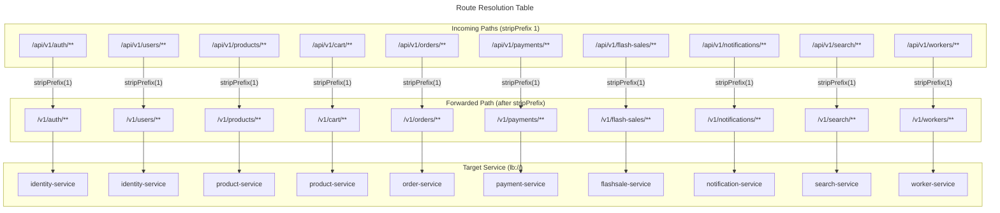
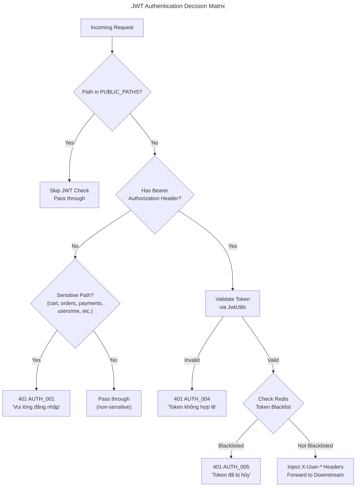

# C4 Code Level: API Gateway

## Overview

- **Name**: API Gateway
- **Description**: Spring Cloud Gateway (WebFlux/Reactive) serving as the single entry point for all client requests, handling JWT validation, token blacklist checking via Redis, and routing to downstream microservices.
- **Location**: `backend/api-gateway/`
- **Language**: Java 25 + Spring Boot 4.0.4 (Spring Cloud 2025.1.1)
- **Purpose**: API Gateway that authenticates requests, enforces JWT-based security, checks token revocation via Redis blacklist, and routes to appropriate backend microservices using service discovery (Eureka).

## Code Elements

### Application Entry Point

#### `ApiGatewayApplication`

- **Description**: Spring Boot application entry point. Scans `com.flashsale` base package for components and enables Eureka service discovery.
- **Location**: `D:\dev\stealing-from-paradise\backend\api-gateway\src\main\java\com\flashsale\apigateway\ApiGatewayApplication.java` (line 9)
- **Annotations**: `@SpringBootApplication(scanBasePackages = {"com.flashsale"})`, `@EnableDiscoveryClient`
- **Methods**:
  - `main(String[] args): void` -- Launches the Spring Boot application.
- **Dependencies**: Spring Boot, Spring Cloud Netflix Eureka Client

---

### Configuration Classes

#### `CorsConfig`

- **Description**: Configures CORS (Cross-Origin Resource Sharing) for the reactive WebFlux environment. Defines allowed origins (localhost:3000/3001/3002, production domain), HTTP methods, headers, and credential support.
- **Location**: `D:\dev\stealing-from-paradise\backend\api-gateway\src\main\java\com\flashsale\apigateway\config\CorsConfig.java` (line 11)
- **Annotations**: `@Configuration`
- **Methods**:
  - `corsWebFilter(): CorsWebFilter` -- Creates and returns a `CorsWebFilter` bean with:
    - Allowed origins: `http://localhost:3000`, `http://localhost:3001`, `http://localhost:3002`, `https://flashsale.example.com`
    - Allowed methods: `GET`, `POST`, `PUT`, `PATCH`, `DELETE`, `OPTIONS`
    - Allowed headers: `*`
    - Exposed headers: `Authorization`, `X-Total-Count`
    - `allowCredentials: true`, `maxAge: 3600s`
- **Dependencies**: Spring WebFlux (`CorsWebFilter`, `UrlBasedCorsConfigurationSource`)

#### `WebClientConfig`

- **Description**: Configures a load-balanced `WebClient.Builder` and a pre-configured `WebClient` targeting the `identity-service` via Eureka service discovery (`lb://` scheme).
- **Location**: `D:\dev\stealing-from-paradise\backend\api-gateway\src\main\java\com\flashsale\apigateway\config\WebClientConfig.java` (line 9)
- **Annotations**: `@Configuration`
- **Methods**:
  - `loadBalancedWebClientBuilder(): WebClient.Builder` -- Creates a load-balanced `WebClient.Builder` bean using Spring Cloud LoadBalancer.
  - `identityWebClient(WebClient.Builder builder): WebClient` -- Creates a `WebClient` bean with base URL `lb://identity-service` and default `Content-Type: application/json` header.
- **Dependencies**: Spring WebFlux (`WebClient`), Spring Cloud LoadBalancer (`@LoadBalanced`)

#### `SecurityConfig`

- **Description**: Configures WebFlux security for the API Gateway. Disables CSRF, configures security headers (frame options DENY, HSTS with subdomains for 365 days, strict referrer policy, permissions policy), permits all OPTIONS preflight requests, disables security context repository (stateless), and allows all exchanges through (authentication is handled by `JwtAuthWebFilter`).
- **Location**: `D:\dev\stealing-from-paradise\backend\api-gateway\src\main\java\com\flashsale\apigateway\config\SecurityConfig.java` (line 21)
- **Annotations**: `@Configuration`, `@EnableWebFluxSecurity`
- **Methods**:
  - `securityWebFilterChain(ServerHttpSecurity http): SecurityWebFilterChain` -- Builds the security filter chain with:
    - CSRF disabled
    - Frame options: DENY
    - X-Content-Type-Options enabled
    - XSS protection disabled
    - HSTS: includeSubdomains, maxAge 365 days
    - Referrer policy: STRICT_ORIGIN_WHEN_CROSS_ORIGIN
    - Permissions policy: geolocation=(), microphone=(), camera=(), payment=()
    - OPTIONS: permitAll; all other exchanges: permitAll
    - Security context repository: NoOp (stateless)
- **Dependencies**: Spring Security WebFlux (`@EnableWebFluxSecurity`, `ServerHttpSecurity`, `SecurityWebFilterChain`)

#### `RouteConfig`

- **Description**: Defines all API Gateway route mappings using Spring Cloud Gateway's Java DSL. Each route matches a path pattern, applies `stripPrefix(1)` (removes `/api` from the path), and forwards to the appropriate service via Eureka load-balanced URI (`lb://`). Route ordering is deliberate: specific routes precede general ones to avoid unintended matching.
- **Location**: `D:\dev\stealing-from-paradise\backend\api-gateway\src\main\java\com\flashsale\apigateway\config\RouteConfig.java` (line 29)
- **Annotations**: `@Configuration`, `@Slf4j`
- **Methods**:
  - `routes(RouteLocatorBuilder b): RouteLocator` -- Builds all route definitions:

    | Route ID | Path | Methods | Target Service |
    |---|---|---|---|
    | `identity-public` | `/api/v1/auth/**`, `/api/v1/users/register` | All | `lb://identity-service` |
    | `identity-protected` | `/api/v1/users/**` | GET, POST, PUT, DELETE | `lb://identity-service` |
    | `product-read` | `/api/v1/products/**`, `/api/v1/categories/**`, `/api/v1/seller/**`, `/api/v1/inventory/**` | GET | `lb://product-service` |
    | `product-write` | `/api/v1/products/**`, `/api/v1/categories/**`, `/api/v1/seller/**`, `/api/v1/inventory/**` | POST, PUT, DELETE | `lb://product-service` |
    | `cart` | `/api/v1/cart/**` | All | `lb://product-service` |
    | `seller-orders` | `/api/v1/sellers/**` | All | `lb://order-service` |
    | `order` | `/api/v1/orders/**` | All | `lb://order-service` |
    | `stripe-webhook` | `/api/v1/stripe/webhooks` | All | `lb://payment-service` |
    | `stripe-onboarding` | `/api/v1/stripe/onboarding/**` | All | `lb://payment-service` |
    | `seller-payments` | `/api/v1/seller/payments/**` | All | `lb://payment-service` |
    | `payment` | `/api/v1/payments/**`, `/api/v1/refunds/**` | All | `lb://payment-service` |
    | `fs-read` | `/api/v1/flash-sales/**` | GET | `lb://flashsale-service` |
    | `fs-buy` | `/api/v1/flash-sales/*/buy` | POST | `lb://flashsale-service` |
    | `fs-write` | `/api/v1/flash-sales/**` | POST, PUT, DELETE | `lb://flashsale-service` |
    | `worker` | `/api/v1/workers/**`, `/api/v1/jobs/**` | All | `lb://worker-service` |
    | `search` | `/api/v1/search/**` | All | `lb://search-service` |
    | `notification` | `/api/v1/notifications/**` | All | `lb://notification-service` |

- **Dependencies**: Spring Cloud Gateway (`RouteLocator`, `RouteLocatorBuilder`), Eureka Service Discovery

---

### Filters

#### `JwtAuthGatewayFilterFactory` (DEPRECATED)

- **Description**: **Deprecated** GatewayFilterFactory-based JWT authentication filter. Validates JWT tokens from the `Authorization` header, extracts user info (userId, email, role, jti), injects them as headers (`X-User-Id`, `X-User-Role`, `X-User-Email`, `X-Token-Jti`), and forwards the request. Marked for removal in favor of `JwtAuthWebFilter`. The `@Component` annotation is disabled.
- **Location**: `D:\dev\stealing-from-paradise\backend\api-gateway\src\main\java\com\flashsale\apigateway\filter\JwtAuthGatewayFilterFactory.java` (line 21)
- **Annotations**: `@Deprecated(since = "1.0.0", forRemoval = true)`, `@Slf4j`
- **Constructor**: `JwtAuthGatewayFilterFactory(JwtUtils jwtUtils)`
- **Methods**:
  - `apply(Config config): GatewayFilter` -- Creates a `GatewayFilter` that:
    1. Reads `Authorization` header.
    2. If missing and `requireAuth=true`: returns 401.
    3. If missing and `requireAuth=false`: passes through.
    4. Validates token via `jwtUtils.isTokenValid(token)`.
    5. Extracts userId, email, role, jti and injects them as request headers.
    6. On any exception: returns 401.
  - `onError(ServerWebExchange exchange, String code, String message, HttpStatus status): Mono<Void>` -- Writes a JSON error response with `success`, `errorCode`, `message`, `timestamp` fields.
- **Inner Class**:
  - `Config` -- Configuration class with `requireAuth` field (default: `true`). Getter/setter for `requireAuth`.
- **Dependencies**: `JwtUtils` (from common-lib), Spring Cloud Gateway (`AbstractGatewayFilterFactory`, `GatewayFilter`)

#### `JwtAuthWebFilter`

- **Description**: Primary reactive JWT authentication WebFilter used at the API Gateway level (replaces `JwtAuthGatewayFilterFactory`). Runs at highest precedence. Validates JWT tokens for protected endpoints, checks token blacklist status, and forwards decoded user information to downstream services as HTTP headers.
- **Location**: `D:\dev\stealing-from-paradise\backend\api-gateway\src\main\java\com\flashsale\apigateway\filter\JwtAuthWebFilter.java` (line 42)
- **Annotations**: `@Component`, `@Order(Ordered.HIGHEST_PRECEDENCE)`, `@RequiredArgsConstructor`, `@Slf4j`
- **Implements**: `WebFilter`
- **Constants**:
  - `PUBLIC_PATHS` -- `List.of("/api/v1/auth/login", "/api/v1/auth/register", "/api/v1/auth/refresh", "/api/v1/auth/forgot-password", "/api/v1/auth/reset-password", "/api/v1/stripe/webhooks", "/actuator/health", "/actuator/info")`
- **Constructor**: `JwtAuthWebFilter(JwtUtils jwtUtils, TokenBlacklistCheckService tokenBlacklistCheckService)` (via Lombok `@RequiredArgsConstructor`)
- **Methods**:
  - `isPublicPath(String path): boolean` -- Checks if the request path matches any public path prefix.
  - `filter(ServerWebExchange exchange, WebFilterChain chain): Mono<Void>` -- Main filter logic:
    1. Logs the request method, path, public status, and auth header presence.
    2. Skips JWT validation entirely for public paths (passes through).
    3. For protected paths with missing/invalid `Authorization` header: returns 401 for sensitive paths (users/me, cart, orders, support, notifications, payments, refunds); passes through for other paths.
    4. Validates the token via `jwtUtils.isTokenValid(token)`.
    5. Checks token blacklist via `tokenBlacklistCheckService.isTokenBlacklisted(token)`.
    6. Decodes the token and injects `X-User-Id`, `X-User-Email`, `X-User-Role`, `X-Token-Jti`, and `X-Access-Token` headers.
    7. On any exception: returns 401.
  - `onError(ServerWebExchange exchange, String code, String message, HttpStatus status): Mono<Void>` -- Writes a JSON error response.
- **Error Codes**:
  - `AUTH_001`: Missing Authorization header (protected endpoint, "Vui long dang nhap")
  - `AUTH_004`: Invalid or expired token ("Token khong hop le")
  - `AUTH_005`: Token is blacklisted ("Token da bi huy (logout)")
- **Dependencies**: `JwtUtils` (common-lib), `TokenBlacklistCheckService`, Spring WebFlux (`WebFilter`, `ServerWebExchange`)

---

### Services

#### `TokenBlacklistCheckService`

- **Description**: Reactive service that checks whether a JWT token has been blacklisted (revoked) by looking up the token's JTI (JWT ID) in Redis. The blacklist is maintained by the identity-service. Provides both blocking (for filter compatibility) and reactive versions.
- **Location**: `D:\dev\stealing-from-paradise\backend\api-gateway\src\main\java\com\flashsale\apigateway\service\TokenBlacklistCheckService.java` (line 19)
- **Annotations**: `@Service`, `@RequiredArgsConstructor`, `@Slf4j`
- **Constants**: `BLACKLIST_PREFIX = "token:blacklist:"`
- **Constructor**: `TokenBlacklistCheckService(ReactiveStringRedisTemplate redisTemplate, JwtUtils jwtUtils)` (via Lombok `@RequiredArgsConstructor`)
- **Methods**:
  - `isTokenBlacklisted(String token): boolean` -- **Blocking version**. Parses the token to extract the JTI, constructs the Redis key (`token:blacklist:{jti}`), and performs a blocking `hasKey` check. Returns `true` if the key exists. Used by the WebFilter which is already blocking in nature.
  - `isTokenBlacklistedReactive(String token): Mono<Boolean>` -- **Reactive version**. Same logic but returns `Mono<Boolean>` for fully reactive callers.
- **Error handling**: Both methods catch exceptions gracefully and return `false` (treating errors as "not blacklisted").
- **Dependencies**: `JwtUtils` (common-lib), `ReactiveStringRedisTemplate` (Spring Data Redis Reactive), `io.jsonwebtoken.Claims`

---

### Test

#### `ApiGatewayApplicationTests`

- **Description**: Basic Spring Boot context load test. Verifies that the application context starts successfully.
- **Location**: `D:\dev\stealing-from-paradise\backend\api-gateway\src\test\java\com\flashsale\apigateway\ApiGatewayApplicationTests.java` (line 7)
- **Annotations**: `@SpringBootTest`
- **Methods**:
  - `contextLoads(): void` -- JUnit 5 test that verifies the application context loads without errors.

---

## Dependencies

### Internal Dependencies

| Dependency | Type | Usage |
|---|---|---|
| `com.flashsale:common-lib:0.0.1-SNAPSHOT` | Maven (compile) | Provides `JwtUtils` for JWT token validation, parsing, and extraction. Located at `backend/common-lib/src/main/java/com/flashsale/commonlib/security/JwtUtils.java` |

### External Dependencies

| Library | Scope | Purpose |
|---|---|---|
| `spring-cloud-starter-gateway-server-webflux` | compile | Core routing engine -- Spring Cloud Gateway on WebFlux (Reactive) |
| `spring-cloud-starter-netflix-eureka-client` | compile | Service discovery -- resolves `lb://` URIs to actual service instances |
| `spring-boot-starter-data-redis-reactive` | compile | Reactive Redis client -- used by `TokenBlacklistCheckService` via `ReactiveStringRedisTemplate` |
| `spring-boot-starter-actuator` | compile | Health checks, metrics, Prometheus endpoint, gateway info |
| `spring-boot-starter-security` | compile | WebFlux security (CORS headers, HSTS, frame options, permissions policy) |
| `spring-cloud-starter-loadbalancer` | (transitive) | Client-side load balancing for `@LoadBalanced` WebClient |
| `io.jsonwebtoken:jjwt-api` (via common-lib) | compile | JWT parsing and validation API |
| `io.jsonwebtoken:jjwt-impl` (via common-lib) | runtime | JWT implementation |
| `io.jsonwebtoken:jjwt-jackson` (via common-lib) | runtime | JSON serialization/deserialization for JWT claims |
| `reactor-test` | test | Reactive streams testing utilities |
| `lombok` | provided | Boilerplate reduction (`@Slf4j`, `@RequiredArgsConstructor`) |

### External Services

| Service | Protocol | Purpose |
|---|---|---|
| **Eureka** (port 8761) | HTTP | Service registry for discovering downstream microservices |
| **Redis** (port 6379) | TCP (RESP) | Token blacklist storage (reactive access) |
| **Identity Service** | HTTP (via lb://) | User authentication, token lifecycle management |
| **Product Service** | HTTP (via lb://) | Product CRUD, categories, inventory, cart |
| **Order Service** | HTTP (via lb://) | Order management, seller orders |
| **Payment Service** | HTTP (via lb://) | Stripe webhooks, onboarding, payments, refunds |
| **FlashSale Service** | HTTP (via lb://) | Flash sale sessions and buy operations |
| **Worker Service** | HTTP (via lb://) | Background workers and job management |
| **Search Service** | HTTP (via lb://) | Product and content search |
| **Notification Service** | HTTP (via lb://) | User notifications |

---

## Configuration

### `application.yml` (Default Profile)

- **Server**: Port `${SERVER_PORT:8080}`, bind `${SERVER_BIND:0.0.0.0}`
- **Spring Cloud Gateway**: Global CORS with configurable origins, Elastic HTTP connection pool (max 500), 10s connect timeout, 30s response timeout
- **Redis**: Host `${REDIS_HOST:localhost}`, port 6379
- **JWT**: Secret from `${JWT_SECRET}`, expiration `${JWT_EXPIRATION:3600}s`, refresh `${JWT_REFRESH_EXPIRATION:604800}s`
- **Management**: Actuator endpoints: health, info, metrics, gateway, prometheus
- **Eureka**: Registry URL `${EUREKA_URI:http://localhost:8761/eureka/}`, 30s fetch interval, 40s initial replication interval

### `application-prod.yml` (Production Profile)

- **HTTP Pool**: Max 1000 connections, 5s connect timeout, 10s response timeout
- **Management**: Limited actuator exposure (health, info, metrics), health details shown when authorized
- **Logging**: Root INFO, `com.flashsale` INFO, `spring.cloud.gateway` WARN

---

## Relationships

The API Gateway is the single entry point for all client traffic. Below is the module structure showing code elements and their internal relationships.

```mermaid
---
title: Code Diagram for API Gateway Component
---
classDiagram
    namespace ApiGateway {
        class ApiGatewayApplication {
            <<SpringBootApplication>>
            +main(String[] args) void
        }

        class CorsConfig {
            <<@Configuration>>
            +corsWebFilter() CorsWebFilter
        }

        class WebClientConfig {
            <<@Configuration>>
            +loadBalancedWebClientBuilder() WebClient.Builder
            +identityWebClient(WebClient.Builder) WebClient
        }

        class SecurityConfig {
            <<@Configuration>>
            <<@EnableWebFluxSecurity>>
            +securityWebFilterChain(ServerHttpSecurity) SecurityWebFilterChain
        }

        class RouteConfig {
            <<@Configuration>>
            <<@Slf4j>>
            +routes(RouteLocatorBuilder) RouteLocator
        }

        class JwtAuthWebFilter {
            <<@Component>>
            <<@Order(HIGHEST_PRECEDENCE)>>
            +isPublicPath(String) boolean
            +filter(ServerWebExchange, WebFilterChain) Mono~Void~
            -onError(ServerWebExchange, String, String, HttpStatus) Mono~Void~
        }

        class JwtAuthGatewayFilterFactory {
            <<@Deprecated>>
            +apply(Config) GatewayFilter
            -onError(ServerWebExchange, String, String, HttpStatus) Mono~Void~
        }
        class JwtAuthGatewayFilterFactory_Config {
            +requireAuth: boolean
        }

        class TokenBlacklistCheckService {
            <<@Service>>
            +isTokenBlacklisted(String) boolean
            +isTokenBlacklistedReactive(String) Mono~Boolean~
        }
    }

    namespace CommonLib {
        class JwtUtils {
            +parseToken(String) Claims
            +isTokenValid(String) boolean
            +extractUserId(String) String
            +extractEmail(String) String
            +extractRole(String) String
            +extractJti(String) String
        }
    }

    JwtAuthWebFilter --> JwtUtils : validates & decodes
    JwtAuthWebFilter --> TokenBlacklistCheckService : checks blacklist
    JwtAuthGatewayFilterFactory --> JwtUtils : validates & decodes (deprecated)
    JwtAuthGatewayFilterFactory --> JwtAuthGatewayFilterFactory_Config : uses config
    TokenBlacklistCheckService --> JwtUtils : extracts JTI from token
    TokenBlacklistCheckService --> ReactiveStringRedisTemplate : checks hasKey
    RouteConfig --> Eureka : resolves lb:// URIs
    WebClientConfig --> Eureka : resolves lb://identity-service
```

### Request Flow Diagram

```mermaid
---
title: Request Processing Pipeline for API Gateway
---
flowchart LR
    subgraph Client
        A[Browser / Mobile App / nginx]
    end
    subgraph API_Gateway[API Gateway]
        direction TB
        B[CorsConfig<br/>CORS headers]
        C[SecurityConfig<br/>Security Headers]
        D[JwtAuthWebFilter<br/>JWT Auth]
        E[RouteConfig<br/>Route Matching]
        F[stripPrefix(1)<br/>Remove /api]
    end
    subgraph Downstream[Downstream Services]
        G[identity-service]
        H[product-service]
        I[order-service]
        J[payment-service]
        K[flashsale-service]
        L[worker-service]
        M[search-service]
        N[notification-service]
    end
    subgraph Infrastructure
        O[Eureka Registry]
        P[Redis<br/>Token Blacklist]
    end

    A -->|HTTP Request| B
    B --> C
    C --> D
    D -->|Token check| P
    D -->|Inject X-User-* headers| E
    E -->|lb://resolution| O
    E --> F
    F --> G
    F --> H
    F --> I
    F --> J
    F --> K
    F --> L
    F --> M
    F --> N
```

### Route Mapping Detail



### Public vs. Protected Endpoints



## Notes

- **Reactive Stack**: The entire API Gateway runs on Spring WebFlux (reactive), not Spring MVC. All code elements use reactive types (`Mono`, `WebFilter`, `WebClient`) compatible with Netty-based runtime.
- **Token Blacklist**: The `TokenBlacklistCheckService.isTokenBlacklisted()` method uses `.block()` on the reactive Redis template for compatibility with the blocking WebFilter chain. A fully reactive alternative (`isTokenBlacklistedReactive()`) is also provided.
- **Route Path Transformation**: All routes apply `stripPrefix(1)` which removes the first path segment (`/api`), so `/api/v1/products` becomes `/v1/products` matching downstream `@RequestMapping("/v1/...")` controllers.
- **Deprecated Filter**: `JwtAuthGatewayFilterFactory` is deprecated and has its `@Component` annotation disabled. All authentication is handled by `JwtAuthWebFilter`.
- **Eureka Integration**: The gateway registers with Eureka, discovers downstream services via `lb://` URIs, and uses Spring Cloud LoadBalancer for client-side load balancing.
- **CORS at Two Levels**: CORS is configured both programmatically via `CorsConfig` (Java bean) and declaratively in `application.yml` (`spring.cloud.gateway.globalcors`). The `SecurityConfig` also includes `cors(cors -> {})` to ensure Spring Security does not block CORS preflight.
