# C4 Code Level: Common Library

## Overview

- **Name**: Common Library
- **Description**: Shared library containing DTOs, Kafka topic definitions, JWT utilities, security configuration, custom Hibernate dialect, exception hierarchy, servlet filters, reactive web filters, interceptors, and base classes used across all FlashSale microservices.
- **Repository**: `backend/common-lib/`
- **Package**: `com.flashsale.commonlib`
- **Language**: Java 25
- **Build**: Maven, packaged as a JAR library (`spring-boot-maven-plugin` repackaging is skipped)
- **Purpose**: Provide a single source of truth for shared data transfer objects, event definitions, security utilities, exception handling, and base configurations to prevent duplication across all microservices (identity, product, order, payment, flash-sale, notification, cart, search).

## Code Elements

### Application Entry Point

- `CommonLibApplication`
  - Description: Spring Boot application entry point for the common-lib module. Used primarily for local testing; the library is consumed as a dependency by other services.
  - Location: `backend/common-lib/src/main/java/com/flashsale/commonlib/CommonLibApplication.java:7`
  - Annotations: `@SpringBootApplication`
  - Methods:
    - `main(String[] args): void`
  - Dependencies: Spring Boot autoconfiguration

### Config Package (`com.flashsale.commonlib.config`)

#### `ByteaPostgreSQLDialect`

- Description: Custom PostgreSQL dialect extending `PostgreSQLDialect` that forces Hibernate to map `BLOB` columns to `BYTEA` and `CLOB` columns to `TEXT` instead of the Hibernate 7 defaults. This is required for Axon Framework's `JpaTokenStore` which stores serialized tokens as binary data -- without this dialect, `byte[]` fields map to PostgreSQL `OID` (Large Objects), conflicting with `BYTEA` columns defined by Flyway migrations.
- Location: `backend/common-lib/src/main/java/com/flashsale/commonlib/config/ByteaPostgreSQLDialect.java:32`
- Extends: `org.hibernate.dialect.PostgreSQLDialect`
- Methods:
  - `contributeTypes(TypeContributions, ServiceRegistry): void` -- registers `VarbinaryJdbcType.INSTANCE` for `Types.BLOB`
  - `columnType(int sqlTypeCode): String` -- returns `"bytea"` for `SqlTypes.BLOB`, `"text"` for `SqlTypes.CLOB`
  - `castType(int sqlTypeCode): String` -- returns `"bytea"` for `SqlTypes.BLOB`, `"text"` for `SqlTypes.CLOB`
- Dependencies: Hibernate ORM (`hibernate-core`), PostgreSQL JDBC driver

#### `DevDataProperties`

- Description: Configuration properties for development data seeding. Binds to the `dev-data` prefix in `application-dev.yml`. Controls whether dev data seeding is enabled and whether the database should be reset.
- Location: `backend/common-lib/src/main/java/com/flashsale/commonlib/config/DevDataProperties.java:16`
- Annotations: `@ConfigurationProperties(prefix = "dev-data")`, `@Data`
- Fields:
  - `boolean enabled` (default: `false`)
  - `boolean reset` (default: `false`)
- Dependencies: Spring Boot configuration processor

#### `MvcSecurityConfig`

- Description: Common Spring Security configuration for servlet-based MVC services. Configures a stateless (session-less), JWT-based security profile with security headers (HSTS, X-Frame-Options, X-Content-Type-Options, Referrer-Policy, Permissions-Policy). CSRF is disabled (stateless JWT). All requests are permitted by default; method-level security is enabled via `@EnableMethodSecurity`.
- Location: `backend/common-lib/src/main/java/com/flashsale/commonlib/config/MvcSecurityConfig.java:33`
- Annotations: `@Configuration`, `@ConditionalOnWebApplication(type = SERVLET)`, `@ConditionalOnClass({DispatcherServlet.class, SecurityFilterChain.class})`, `@EnableWebSecurity`, `@EnableMethodSecurity`, `@Slf4j`
- Beans:
  - `filterChain(HttpSecurity http): SecurityFilterChain`
- Conditional: Only activates when `DispatcherServlet` and `SecurityFilterChain` classes are on the classpath (i.e., a servlet-based web application).
- Dependencies: `spring-boot-starter-security`, `spring-boot-starter-web`, `spring-webmvc`, `tomcat-embed-core`

#### `ReactiveSecurityContextConfig`

- Description: Marker configuration enabling SecurityContext for WebFlux services. The actual `SecurityWebFilterChain` bean is provided by `WebFluxSecurityConfig`. This class exists as a dedicated conditional configuration so that the reactive security context is only loaded when a reactive `DispatcherHandler` is present.
- Location: `backend/common-lib/src/main/java/com/flashsale/commonlib/config/ReactiveSecurityContextConfig.java:22`
- Annotations: `@Configuration`, `@ConditionalOnWebApplication(type = REACTIVE)`, `@ConditionalOnClass(DispatcherHandler.class)`, `@Slf4j`
- Dependencies: `spring-boot-starter-webflux`

#### `WebFluxSecurityConfig`

- Description: Common Spring Security configuration for WebFlux (reactive) services. Configures a stateless security profile with CSRF disabled (JWT-based), security headers (HSTS, X-Frame-Options, X-Content-Type-Options, Referrer-Policy, Permissions-Policy). All exchanges are permitted by default; method-level security is enabled via `@EnableMethodSecurity`.
- Location: `backend/common-lib/src/main/java/com/flashsale/commonlib/config/WebFluxSecurityConfig.java:31`
- Annotations: `@Configuration`, `@ConditionalOnWebApplication(type = REACTIVE)`, `@ConditionalOnClass(DispatcherHandler.class)`, `@EnableWebFluxSecurity`, `@EnableMethodSecurity`, `@Slf4j`
- Beans:
  - `springSecurityFilterChain(ServerHttpSecurity http): SecurityWebFilterChain`
- Conditional: Only activates when `DispatcherHandler` is on the classpath (i.e., a reactive web application). Uses `@ConditionalOnMissingBean(name = "springSecurityFilterChain")` to avoid duplicate beans.
- Dependencies: `spring-boot-starter-webflux`, `spring-boot-starter-security`

#### `WebMvcConfig`

- Description: Web MVC configuration that registers `InternalAuthInterceptor` for `/api/**` paths, excluding actuator endpoints, internal endpoints, and auth endpoints (`/api/v1/auth/**`).
- Location: `backend/common-lib/src/main/java/com/flashsale/commonlib/config/WebMvcConfig.java:9`
- Implements: `WebMvcConfigurer`
- Annotations: `@Configuration`
- Injected fields:
  - `InternalAuthInterceptor authInterceptor` -- `@Autowired(required = false)` (optional, only wired if the bean exists)
- Overrides:
  - `addInterceptors(InterceptorRegistry registry): void`
- Dependencies: `spring-webmvc`, `com.flashsale.commonlib.interceptor.InternalAuthInterceptor`

### DTO Package (`com.flashsale.commonlib.dto`)

#### `ApiResponse<T>`

- Description: Generic API response wrapper used by all REST endpoints across microservices. Provides static factory methods for success and error responses. Includes a `timestamp` field set to `System.currentTimeMillis()`.
- Location: `backend/common-lib/src/main/java/com/flashsale/commonlib/dto/ApiResponse.java:12`
- Annotations: `@Data`, `@Builder`, `@NoArgsConstructor`, `@AllArgsConstructor`
- Type Parameter: `<T>` -- the type of the `data` field
- Fields:
  - `boolean success`
  - `String message`
  - `T data`
  - `String errorCode`
  - `long timestamp`
- Static Methods:
  - `success(T data): ApiResponse<T>` -- creates a success response with data
  - `success(T data, String message): ApiResponse<T>` -- creates a success response with data and message
  - `error(String errorCode, String message): ApiResponse<T>` -- creates an error response

#### `AuthResponse`

- Description: Authentication response DTO returned after successful login or registration. Contains tokens, user profile information, and expiration timestamps.
- Location: `backend/common-lib/src/main/java/com/flashsale/commonlib/dto/AuthResponse.java:16`
- Annotations: `@Data`, `@Builder`, `@NoArgsConstructor`, `@AllArgsConstructor`
- Fields:
  - `String accessToken`
  - `String refreshToken`
  - `String tokenType`
  - `Long expiresIn`
  - `Long refreshExpiresIn`
  - `Long userId`
  - `String username`
  - `String email`
  - `String phone`
  - `String fullName`
  - `String status`
  - `LocalDateTime createdAt`

#### `LoginRequest`

- Description: Login request DTO accepting a flexible credential field (can be username, email, or phone) and password.
- Location: `backend/common-lib/src/main/java/com/flashsale/commonlib/dto/LoginRequest.java:15`
- Annotations: `@Data`, `@Builder`, `@NoArgsConstructor`, `@AllArgsConstructor`
- Fields:
  - `String credential` -- (username | email | phone)
  - `String password`

#### `PageResponse<T>`

- Description: Generic paginated response DTO wrapping a Spring Data `Page<T>`. Provides a static factory method `of(Page<T>)` to convert a Spring Data Page into this DTO.
- Location: `backend/common-lib/src/main/java/com/flashsale/commonlib/dto/PageResponse.java:14`
- Annotations: `@Data`, `@Builder`, `@NoArgsConstructor`, `@AllArgsConstructor`
- Type Parameter: `<T>` -- the type of the content elements
- Fields:
  - `List<T> content`
  - `int page`
  - `int size`
  - `long totalElements`
  - `int totalPages`
  - `boolean last`
- Static Methods:
  - `of(Page<T> page): PageResponse<T>` -- converts a Spring Data Page
- Dependencies: `spring-data-commons` (`org.springframework.data.domain.Page`)

#### `RegisterRequest`

- Description: Registration request DTO with user profile fields.
- Location: `backend/common-lib/src/main/java/com/flashsale/commonlib/dto/RegisterRequest.java:15`
- Annotations: `@Data`, `@Builder`, `@NoArgsConstructor`, `@AllArgsConstructor`
- Fields:
  - `String username`
  - `String email`
  - `String phone`
  - `String password`
  - `String fullName`

### Event Package (`com.flashsale.commonlib.event`)

#### `KafkaTopics`

- Description: Utility class (private constructor) defining all Kafka topic name constants used across the FlashSale platform. Organized into sections: Product, Order, Payment, Refund, Flash Sale, and Request-Reply (temporary MVP replacement for gRPC for inter-service communication patterns).
- Location: `backend/common-lib/src/main/java/com/flashsale/commonlib/event/KafkaTopics.java:3`
- Constants (organized by domain):

| Domain | Topic Constants | Count |
|--------|----------------|-------|
| Product | `PRODUCT_CREATED`, `PRODUCT_PENDING_REVIEW`, `PRODUCT_APPROVED`, `PRODUCT_REJECTED`, `PRODUCT_UPDATED`, `PRODUCT_DELETED`, `PRODUCT_AUTO_HIDDEN`, `INVENTORY_ADJUSTED` | 8 |
| Order | `ORDER_CREATED`, `ORDER_SHIPPED`, `ORDER_DELIVERED`, `ORDER_RETURNED_RTS`, `ORDER_CANCELLED`, `ORDER_AUTO_CANCELLED`, `ORDER_CHECKOUT_COMPLETED`, `SELLER_ORDER_CANCELLED` | 8 |
| Payment | `PAYMENT_REQUESTED`, `PAYMENT_SUCCESS`, `PAYMENT_FAILED`, `STRIPE_ACCOUNT_SUSPENDED`, `STRIPE_DISPUTE_CREATED`, `STRIPE_DISPUTE_CLOSED`, `STRIPE_TRANSFER_REVERSED`, `STRIPE_PAYOUT_FAILED`, `SELLER_STRIPE_REQUIREMENT` | 9 |
| Refund | `REFUND_REQUESTED`, `REFUND_FULL_REQUESTED`, `REFUND_CREATED`, `REFUND_ADMIN_APPROVED`, `REFUND_REJECTED`, `REFUND_RTS_COMPLETED`, `REFUND_STRIPE_AUTO` | 7 |
| Flash Sale | `FLASH_SALE_SESSION_STARTED`, `FLASH_SALE_SESSION_ENDED`, `FLASH_SALE_ITEM_APPROVED`, `FLASH_SALE_ITEM_REJECTED`, `FLASH_SALE_ITEM_SOLD`, `FLASH_SALE_REMINDER` | 6 |
| Request-Reply | `CART_PRODUCT_INFO_REQUEST`, `CART_PRODUCT_INFO_RESPONSE`, `ORDER_STOCK_CHECK_REQUEST`, `ORDER_STOCK_CHECK_RESPONSE`, `ORDER_PAYMENT_STATUS_REQUEST`, `ORDER_PAYMENT_STATUS_RESPONSE`, `ORDER_CART_ITEMS_REQUEST`, `ORDER_CART_ITEMS_RESPONSE`, `ORDER_ADDRESS_REQUEST`, `ORDER_ADDRESS_RESPONSE`, `ORDER_REFUNDS_REQUEST`, `ORDER_REFUNDS_RESPONSE`, `ORDER_REFUND_PRESIGNED_URL_REQUEST`, `ORDER_REFUND_PRESIGNED_URL_RESPONSE` | 14 |

- Dependencies: `spring-kafka` (by consumers/producers using these topics)

### Event Payload Package (`com.flashsale.commonlib.event.payload`)

#### `BaseKafkaEvent`

- Description: Abstract base class for all Kafka event payloads. Provides common fields for event identification, correlation tracing across services, and idempotency key (`eventId`).
- Location: `backend/common-lib/src/main/java/com/flashsale/commonlib/event/payload/BaseKafkaEvent.java:14`
- Annotations: `@Data`, `@NoArgsConstructor`, `@AllArgsConstructor`, `@SuperBuilder`
- Fields:
  - `String eventId` -- automatically set to `UUID.randomUUID().toString()` (idempotency key)
  - `String eventType` -- topic name
  - `long occurredAt` -- automatically set to `System.currentTimeMillis()`
  - `String correlationId` -- trace ID propagated across multiple services
  - `String sourceService` -- name of the service that created the event

#### `OrderDeliveredPayload`

- Description: Kafka event payload for order delivery events. Published when an order is delivered to the buyer, either manually or automatically by a scheduled job (JOB-22).
- Location: `backend/common-lib/src/main/java/com/flashsale/commonlib/event/payload/OrderDeliveredPayload.java:12`
- Extends: `BaseKafkaEvent`
- Annotations: `@Data`, `@SuperBuilder`, `@NoArgsConstructor`, `@AllArgsConstructor`
- Fields:
  - `Long orderId`
  - `String buyerId`
  - `String sellerId`
  - `Long totalAmount` -- in VND cents
  - `boolean autoDelivered` -- `true` if delivered automatically by JOB-22

#### `ProductApprovedPayload`

- Description: Kafka event payload for product approval events. Published when a product is approved by an admin reviewer.
- Location: `backend/common-lib/src/main/java/com/flashsale/commonlib/event/payload/ProductApprovedPayload.java:12`
- Extends: `BaseKafkaEvent`
- Annotations: `@Data`, `@SuperBuilder`, `@NoArgsConstructor`, `@AllArgsConstructor`
- Fields:
  - `String productId`
  - `String sellerId`
  - `String productName`
  - `String categoryId`

#### `SellerStripeRequirementPayload`

- Description: Kafka event payload for seller Stripe account requirement notifications. Published when Stripe sends an `account.updated` webhook with changed requirements. Consumed by `notification-service` to notify sellers about required actions.
- Location: `backend/common-lib/src/main/java/com/flashsale/commonlib/event/payload/SellerStripeRequirementPayload.java:19`
- Extends: `BaseKafkaEvent`
- Annotations: `@Data`, `@SuperBuilder`, `@NoArgsConstructor`, `@AllArgsConstructor`, `@EqualsAndHashCode(callSuper = true)`
- Fields:
  - `Long sellerId`
  - `String stripeAccountId`
  - `String requirementType` -- one of: `"verification_needed"`, `"payouts_blocked"`, `"updates_needed"`
  - `String requirementReason` -- specific reason from Stripe (`requirements.disabled_reason`)
  - `String accountLinkUrl` -- Stripe Account Link URL for the seller to complete requirements
  - `Long accountLinkExpiresAt` -- Unix timestamp of link expiration

### Exception Package (`com.flashsale.commonlib.exception`)

#### `AppException`

- Description: Base application exception wrapping an `ErrorCode`. Used by all services to throw domain-specific exceptions with structured error codes and messages. Extends `RuntimeException`.
- Location: `backend/common-lib/src/main/java/com/flashsale/commonlib/exception/AppException.java:6`
- Annotations: `@Getter`
- Fields:
  - `ErrorCode errorCode`
- Constructors:
  - `AppException(ErrorCode errorCode)` -- uses error code's default message
  - `AppException(ErrorCode errorCode, String message)` -- custom message

#### `ErrorCode`

- Description: Enumeration of all application error codes, organized by category (Auth, Resource, Business, Validation/System). Each code has a string code, a Vietnamese default message, and an HTTP status code.
- Location: `backend/common-lib/src/main/java/com/flashsale/commonlib/exception/ErrorCode.java:3`

| Enum Constant | Code | Default Message (Vietnamese) | HTTP Status |
|---------------|------|------------------------------|-------------|
| `UNAUTHORIZED` | AUTH_001 | Chua xac thuc | 401 |
| `FORBIDDEN` | AUTH_002 | Khong co quyen truy cap | 403 |
| `TOKEN_EXPIRED` | AUTH_003 | Token da het han | 401 |
| `TOKEN_INVALID` | AUTH_004 | Token khong hop le | 401 |
| `TOKEN_REVOKED` | AUTH_005 | Token da bi thu hoi | 401 |
| `NOT_FOUND` | RES_001 | Khong tim thay tai nguyen | 404 |
| `ALREADY_EXISTS` | RES_002 | Tai nguyen da ton tai | 409 |
| `OPTIMISTIC_LOCK` | RES_003 | Xung dot du lieu, thu lai | 409 |
| `INSUFFICIENT_STOCK` | BIZ_001 | Khong du hang | 400 |
| `ORDER_NOT_CANCELLABLE` | BIZ_002 | Don hang khong the huy | 400 |
| `PAYMENT_FAILED` | BIZ_003 | Thanh toan that bai | 402 |
| `FLASH_SALE_ENDED` | BIZ_004 | Flash Sale da ket thuc | 410 |
| `LIMIT_PER_USER_EXCEEDED` | BIZ_005 | Vuot gioi han mua moi nguoi | 400 |
| `VALIDATION_FAILED` | VAL_001 | Du lieu khong hop le | 400 |
| `RATE_LIMIT_EXCEEDED` | VAL_002 | Qua nhieu yeu cau | 429 |
| `INTERNAL_ERROR` | SYS_001 | Loi he thong | 500 |

- Methods:
  - `getCode(): String`
  - `getDefaultMessage(): String`
  - `getHttpStatus(): int`

#### `GlobalExceptionHandler`

- Description: Global exception handler using `@RestControllerAdvice` that catches and formats exceptions into standardized `ApiResponse` objects across all services.
- Location: `backend/common-lib/src/main/java/com/flashsale/commonlib/exception/GlobalExceptionHandler.java:13`
- Annotations: `@RestControllerAdvice`, `@Slf4j`
- Exception Handlers:
  - `handleApp(AppException ex): ResponseEntity<ApiResponse<Void>>` -- maps AppException to its ErrorCode's HTTP status and message
  - `handleValidation(MethodArgumentNotValidException ex): ResponseEntity<ApiResponse<Map<String, String>>>` -- collects field validation errors into a map, returns 400
  - `handleNullPointer(NullPointerException ex): ResponseEntity<ApiResponse<Void>>` -- special handling for auth-related NPEs (null user in protected endpoint), returns 401; otherwise returns 500
  - `handleGeneral(Exception ex): ResponseEntity<ApiResponse<Void>>` -- catches all unhandled exceptions, returns 500
- Dependencies: `com.flashsale.commonlib.dto.ApiResponse`, `com.flashsale.commonlib.exception.ErrorCode`, `spring-webmvc`

### Filter Package (`com.flashsale.commonlib.filter`)

#### `JwtTokenDecoderFilter`

- Description: Servlet `OncePerRequestFilter` that decodes `X-User-*` headers (set by API Gateway after JWT validation) into Spring Security's `SecurityContext`. Runs at `HIGHEST_PRECEDENCE + 10` to ensure it executes before Spring Security's `AuthorizationFilter` (order ~-100), enabling `@PreAuthorize` annotations to work correctly. Includes defense-in-depth: validates userId is a positive number and role is in the whitelist (`ADMIN`, `SELLER`, `BUYER`).
- Location: `backend/common-lib/src/main/java/com/flashsale/commonlib/filter/JwtTokenDecoderFilter.java:38`
- Extends: `OncePerRequestFilter`
- Annotations: `@Component`, `@Order(Ordered.HIGHEST_PRECEDENCE + 10)`, `@Slf4j`
- Methods:
  - `doFilterInternal(HttpServletRequest, HttpServletResponse, FilterChain): void` -- reads `X-User-Id`, `X-User-Email`, `X-User-Role` headers; validates and creates `UserDetailsImpl` + `UsernamePasswordAuthenticationToken`; sets into `SecurityContextHolder`
  - `parseAndValidateUserId(String userId): long` -- parses userId as positive long
  - `validateRole(String role): String` -- validates role against allowed set
- Internal Constants:
  - `ALLOWED_ROLES = Set.of("ADMIN", "SELLER", "BUYER")`
- Dependencies: `spring-webmvc`, `spring-security-web`, `com.flashsale.commonlib.security.UserDetailsImpl`, `jakarta.servlet`

#### `JwtTokenDecoderWebFilter`

- Description: Reactive `WebFilter` for WebFlux services that decodes `X-User-*` headers (set by API Gateway after JWT validation) into the reactive `SecurityContext`. Sets authentication into `ReactiveSecurityContextHolder` for use with `@PreAuthorize` and `ReactiveSecurityContextHolder`.
- Location: `backend/common-lib/src/main/java/com/flashsale/commonlib/filter/JwtTokenDecoderWebFilter.java:30`
- Implements: `WebFilter`
- Annotations: `@Component`, `@Slf4j`
- Methods:
  - `filter(ServerWebExchange exchange, WebFilterChain chain): Mono<Void>` -- reads `X-User-Id`, `X-User-Email`, `X-User-Role`, `X-Token-Jti`; creates `UserDetailsImpl` + authentication; sets into `ReactiveSecurityContextHolder`
- Dependencies: `spring-boot-starter-webflux`, `spring-security-web`, `reactor-core`, `com.flashsale.commonlib.security.UserDetailsImpl`

### Interceptor Package (`com.flashsale.commonlib.interceptor`)

#### `InternalAuthInterceptor`

- Description: Servlet `HandlerInterceptor` that validates the presence of the `X-User-Id` header on incoming requests to `/api/**` paths (excluding auth paths). Used as a defense-in-depth measure by servlet-based services to ensure all API requests carry user identification. Returns a 401 JSON response if the header is missing or blank.
- Location: `backend/common-lib/src/main/java/com/flashsale/commonlib/interceptor/InternalAuthInterceptor.java:9`
- Implements: `HandlerInterceptor`
- Annotations: `@Component`
- Methods:
  - `preHandle(HttpServletRequest, HttpServletResponse, Object): boolean` -- checks `X-User-Id` header, returns 401 on missing
- Dependencies: `spring-webmvc`, `jakarta.servlet`

### Security Package (`com.flashsale.commonlib.security`)

#### `JwtUtils`

- Description: JWT utility component for generating and validating access/refresh tokens using HMAC-SHA256. Configurable via `application.yml` for secret key, access token expiration (default 1 hour), and refresh token expiration (default 7 days). Supports extraction of claims: userId (subject), role, email, JTI, and token type.
- Location: `backend/common-lib/src/main/java/com/flashsale/commonlib/security/JwtUtils.java:15`
- Annotations: `@Component`, `@Slf4j`
- Injected Properties:
  - `String secretKey` -- from `jwt.secret` (default: a 32+ char placeholder)
  - `long accessTokenExpiration` -- from `jwt.expiration` (default: 3600s = 1 hour)
  - `long refreshTokenExpiration` -- from `jwt.refresh-expiration` (default: 604800s = 7 days)
- Methods:
  - `generateAccessToken(String userId, String email, String role): String`
  - `generateRefreshToken(String userId): String`
  - `buildToken(Map<String, Object> extraClaims, String subject, long expirationMillis): String`
  - `parseToken(String token): Claims` -- throws `JwtException` on failure
  - `extractUserId(String token): String`
  - `extractRole(String token): String`
  - `extractEmail(String token): String`
  - `extractJti(String token): String`
  - `extractTokenType(String token): String`
  - `isTokenValid(String token): boolean`
  - `isRefreshToken(String token): boolean`
  - `isAccessToken(String token): boolean`
  - `getSigningKey(): SecretKey` (private)
- Dependencies: `io.jsonwebtoken:jjwt-api:0.12.3`, `io.jsonwebtoken:jjwt-impl:0.12.3` (runtime), `io.jsonwebtoken:jjwt-jackson:0.12.3` (runtime)

#### `SecurityHeaderExtractor`

- Description: Utility class for extracting security headers from `ServerWebExchange` (WebFlux). Provides static methods to read `X-Access-Token`, `X-User-Id`, `X-User-Email`, `X-User-Role`, and `X-Token-Jti` from request headers.
- Location: `backend/common-lib/src/main/java/com/flashsale/commonlib/security/SecurityHeaderExtractor.java:17`
- Annotations: `@NoArgsConstructor(access = AccessLevel.PRIVATE)`
- Constants:
  - `String X_ACCESS_TOKEN`
  - `String X_USER_ID`
  - `String X_USER_EMAIL`
  - `String X_USER_ROLE`
  - `String X_TOKEN_JTI`
- Static Methods:
  - `extractAccessToken(ServerWebExchange): String`
  - `extractUserId(ServerWebExchange): String`
  - `extractEmail(ServerWebExchange): String`
  - `extractRole(ServerWebExchange): String`
  - `extractJti(ServerWebExchange): String`
  - `isAuthenticated(ServerWebExchange): boolean`
- Dependencies: `spring-boot-starter-webflux`

#### `ServletSecurityHeaderExtractor`

- Description: Utility class for extracting security headers from `HttpServletRequest` (Servlet/MVC). Provides static methods mirroring `SecurityHeaderExtractor` but for the servlet API. Used by servlet-based microservices.
- Location: `backend/common-lib/src/main/java/com/flashsale/commonlib/security/ServletSecurityHeaderExtractor.java:17`
- Annotations: `@NoArgsConstructor(access = AccessLevel.PRIVATE)`
- Constants:
  - `String X_ACCESS_TOKEN`
  - `String X_USER_ID`
  - `String X_USER_EMAIL`
  - `String X_USER_ROLE`
  - `String X_TOKEN_JTI`
- Static Methods:
  - `extractAccessToken(HttpServletRequest): String`
  - `extractUserId(HttpServletRequest): String`
  - `extractEmail(HttpServletRequest): String`
  - `extractRole(HttpServletRequest): String`
  - `extractJti(HttpServletRequest): String`
  - `isAuthenticated(HttpServletRequest): boolean`
- Dependencies: `jakarta.servlet`, `spring-webmvc`

#### `UserDetailsImpl`

- Description: Custom `UserDetails` implementation for JWT-based authentication. Stores user ID, username, email, password, role, and enabled status. The `getAuthorities()` method converts the role into a Spring Security `SimpleGrantedAuthority` with `ROLE_` prefix.
- Location: `backend/common-lib/src/main/java/com/flashsale/commonlib/security/UserDetailsImpl.java:16`
- Implements: `org.springframework.security.core.userdetails.UserDetails`
- Annotations: `@AllArgsConstructor`, `@Builder`
- Fields:
  - `Long id`
  - `String username`
  - `String email`
  - `String password`
  - `String role`
  - `boolean enabled`
- Methods:
  - `getAuthorities(): Collection<? extends GrantedAuthority>` -- returns `ROLE_<role>` as a singleton
  - `getPassword(): String`
  - `getUsername(): String`
  - `isAccountNonExpired(): boolean` -- always `true`
  - `isAccountNonLocked(): boolean` -- returns `enabled`
  - `isCredentialsNonExpired(): boolean` -- always `true`
  - `isEnabled(): boolean` -- returns `enabled`
  - `getId(): Long`
  - `getEmail(): String`
  - `getRole(): String`
- Dependencies: `spring-security-core`

## Dependencies

### Internal Dependencies (within common-lib)

| Source | Target | Type |
|--------|--------|------|
| `config.WebMvcConfig` | `interceptor.InternalAuthInterceptor` | Injection (optional) |
| `filter.JwtTokenDecoderFilter` | `security.UserDetailsImpl` | Usage |
| `filter.JwtTokenDecoderWebFilter` | `security.UserDetailsImpl` | Usage |
| `exception.GlobalExceptionHandler` | `dto.ApiResponse`, `exception.ErrorCode` | Usage |
| `dto.PageResponse` | (Spring Data `org.springframework.data.domain.Page`) | Usage |

### External Dependencies (Maven Coordinates)

| GroupId | ArtifactId | Scope | Purpose |
|---------|-----------|-------|---------|
| `org.springframework.boot` | `spring-boot-starter` | compile | Spring Boot core |
| `org.springframework.boot` | `spring-boot-configuration-processor` | optional | Configuration metadata |
| `org.springframework.boot` | `spring-boot-starter-security` | compile | Spring Security |
| `org.springframework.boot` | `spring-boot-starter-web` | optional | Servlet-based web (MVC services) |
| `org.springframework.boot` | `spring-boot-starter-webflux` | optional | Reactive web (WebFlux services) |
| `org.springframework.boot` | `spring-boot-starter-test` | test | Testing |
| `org.springframework` | `spring-webmvc` | compile | MVC framework support |
| `org.springframework` | `spring-jdbc` | compile | JDBC support (Axon token store) |
| `org.springframework.data` | `spring-data-commons` | compile | Spring Data commons (Page abstraction) |
| `org.springframework.kafka` | `spring-kafka` | compile | Kafka support |
| `org.hibernate.orm` | `hibernate-core` | provided | Hibernate ORM (PostgreSQL dialect) |
| `org.projectlombok` | `lombok` | provided | Boilerplate reduction |
| `io.jsonwebtoken` | `jjwt-api` | compile (0.12.3) | JWT API |
| `io.jsonwebtoken` | `jjwt-impl` | runtime (0.12.3) | JWT implementation |
| `io.jsonwebtoken` | `jjwt-jackson` | runtime (0.12.3) | JWT JSON serialization |
| `org.apache.tomcat.embed` | `tomcat-embed-core` | compile | Embedded Tomcat |

## Relationships

The common-lib module has no code-level relationships between its own subpackages other than the few noted above; it is a shared library consumed by other services. The following diagram shows the package structure and the dependency flow from consumer services.

```mermaid
---
title: Code Structure for Common Library
---
classDiagram
    namespace commonlib_config {
        class ByteaPostgreSQLDialect {
            <<class>>
            +contributeTypes(TypeContributions, ServiceRegistry) void
            +columnType(int) String
            +castType(int) String
        }
        class DevDataProperties {
            <<class>>
            +boolean enabled
            +boolean reset
        }
        class MvcSecurityConfig {
            <<class>>
            +filterChain(HttpHttpSecurity) SecurityFilterChain
        }
        class ReactiveSecurityContextConfig {
            <<class>>
            +marker class
        }
        class WebFluxSecurityConfig {
            <<class>>
            +springSecurityFilterChain(ServerHttpSecurity) SecurityWebFilterChain
        }
        class WebMvcConfig {
            <<class>>
            +addInterceptors(InterceptorRegistry) void
        }
    }

    namespace commonlib_dto {
        class ApiResponse~T~ {
            <<class>>
            +boolean success
            +String message
            +T data
            +String errorCode
            +long timestamp
            +success(T) ApiResponse
            +error(String, String) ApiResponse
        }
        class AuthResponse {
            <<class>>
            +String accessToken
            +String refreshToken
            +Long userId
            +String username
            +String email
        }
        class LoginRequest {
            <<class>>
            +String credential
            +String password
        }
        class PageResponse~T~ {
            <<class>>
            +List~T~ content
            +int page
            +int size
            +of(Page~T~) PageResponse
        }
        class RegisterRequest {
            <<class>>
            +String username
            +String email
            +String phone
            +String password
            +String fullName
        }
    }

    namespace commonlib_event {
        class KafkaTopics {
            <<utility>>
            +String PRODUCT_CREATED
            +String ORDER_DELIVERED
            +String PAYMENT_SUCCESS
            +String FLASH_SALE_SESSION_STARTED
            +... 52 topic constants
        }
    }

    namespace commonlib_event_payload {
        class BaseKafkaEvent {
            <<abstract>>
            +String eventId
            +String eventType
            +long occurredAt
            +String correlationId
            +String sourceService
        }
        class OrderDeliveredPayload {
            +Long orderId
            +String buyerId
            +String sellerId
            +Long totalAmount
            +boolean autoDelivered
        }
        class ProductApprovedPayload {
            +String productId
            +String sellerId
            +String productName
            +String categoryId
        }
        class SellerStripeRequirementPayload {
            +Long sellerId
            +String stripeAccountId
            +String requirementType
            +String requirementReason
            +String accountLinkUrl
            +Long accountLinkExpiresAt
        }
    }

    namespace commonlib_exception {
        class ErrorCode {
            <<enum>>
            UNAUTHORIZED
            FORBIDDEN
            NOT_FOUND
            ALREADY_EXISTS
            INSUFFICIENT_STOCK
            PAYMENT_FAILED
            FLASH_SALE_ENDED
            VALIDATION_FAILED
            RATE_LIMIT_EXCEEDED
            INTERNAL_ERROR
            +getCode() String
            +getDefaultMessage() String
            +getHttpStatus() int
        }
        class AppException {
            +ErrorCode errorCode
            +AppException(ErrorCode)
            +AppException(ErrorCode, String)
        }
        class GlobalExceptionHandler {
            +handleApp(AppException) ResponseEntity
            +handleValidation(MethodArgumentNotValidException) ResponseEntity
            +handleNullPointer(NullPointerException) ResponseEntity
            +handleGeneral(Exception) ResponseEntity
        }
    }

    namespace commonlib_filter {
        class JwtTokenDecoderFilter {
            <<servlet>>
            +doFilterInternal(HttpServletRequest, HttpServletResponse, FilterChain) void
        }
        class JwtTokenDecoderWebFilter {
            <<reactive>>
            +filter(ServerWebExchange, WebFilterChain) Mono~Void~
        }
    }

    namespace commonlib_interceptor {
        class InternalAuthInterceptor {
            <<servlet>>
            +preHandle(HttpServletRequest, HttpServletResponse, Object) boolean
        }
    }

    namespace commonlib_security {
        class JwtUtils {
            +generateAccessToken(String, String, String) String
            +generateRefreshToken(String) String
            +parseToken(String) Claims
            +isTokenValid(String) boolean
        }
        class SecurityHeaderExtractor {
            <<utility, reactive>>
            +extractUserId(ServerWebExchange) String
            +extractRole(ServerWebExchange) String
        }
        class ServletSecurityHeaderExtractor {
            <<utility, servlet>>
            +extractUserId(HttpServletRequest) String
            +extractRole(HttpServletRequest) String
        }
        class UserDetailsImpl {
            <<implements UserDetails>>
            +Long id
            +String username
            +String email
            +String role
        }
    }

    AppException ..> ErrorCode : uses
    GlobalExceptionHandler ..> ApiResponse : returns
    GlobalExceptionHandler ..> ErrorCode : references
    GlobalExceptionHandler ..> AppException : catches

    JwtTokenDecoderFilter ..> UserDetailsImpl : creates
    JwtTokenDecoderWebFilter ..> UserDetailsImpl : creates

    WebMvcConfig ..> InternalAuthInterceptor : injects (optional)

    OrderDeliveredPayload --|> BaseKafkaEvent : extends
    ProductApprovedPayload --|> BaseKafkaEvent : extends
    SellerStripeRequirementPayload --|> BaseKafkaEvent : extends
```

## Notes

- The common-lib module is **not a standalone service** -- it is a JAR library consumed by other microservices. The `spring-boot-maven-plugin` repackaging is explicitly skipped (`<skip>true</skip>`).
- The `spring-boot-starter-web` and `spring-boot-starter-webflux` dependencies are both marked as `<optional>true</optional>`. This means consuming services must explicitly add whichever web stack they use (MVC or WebFlux), and the conditional configurations (`@ConditionalOnWebApplication`, `@ConditionalOnClass`) ensure only the relevant beans are loaded.
- The `hibernate-core` dependency is `<scope>provided</scope>` since consuming services provide their own JPA/Hibernate setup. Only `ByteaPostgreSQLDialect` requires it, and consumers must explicitly set `spring.jpa.properties.hibernate.dialect` to enable it.
- The `SecurityHeaderExtractor` (WebFlux) and `ServletSecurityHeaderExtractor` (Servlet) are separated because they depend on different request abstractions (`ServerWebExchange` vs `HttpServletRequest`). Individual services only include the one matching their web stack.
- Kafka topic constants in `KafkaTopics` are organized into 6 groups with 52 total topic names, including a `Request-Reply` pattern using 14 request/response topic pairs as a temporary MVP substitute for gRPC inter-service communication.
- All Vietnamese documentation comments in the source code are preserved in this documentation (e.g., error messages in ErrorCode, class javadocs in SecurityHeaderExtractor and JwtTokenDecoderWebFilter).
