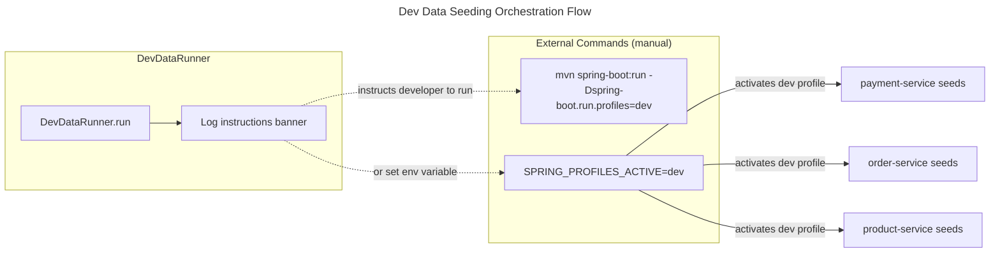

# C4 Code Level: Dev Data Runner

## Overview

- **Name**: Dev Data Runner
- **Description**: Standalone utility service that seeds development and demo data into the FlashSale system for local testing and demonstration purposes. It resets and reseeds databases (payment, order, product) from a single command.
- **Location**: `D:\dev\stealing-from-paradise\backend\dev-data-runner`
- **Language**: Java 25 + Spring Boot 4.0.4
- **Purpose**: Provides a centralized mechanism to wipe and repopulate development databases with consistent, realistic fake data across multiple microservices.

## Code Elements

### Classes

#### `DevDataRunner` (line 24)

- **Description**: The sole application class. Implements `CommandLineRunner` to execute data seeding logic automatically when the Spring context is fully loaded. Currently outputs usage instructions to the log; actual seeding logic delegates to per-service `application-dev.yml` profiles and the `dev-data.reset-*` feature flags. The class is annotated with `@Slf4j` (Lombok) for logging.
- **Location**: `D:\dev\stealing-from-paradise\backend\dev-data-runner\src\main\java\com\flashsale\devdata\DevDataRunner.java`
- **Type**: Concrete class implementing `CommandLineRunner`
- **Annotations**: `@SpringBootApplication`, `@Slf4j`

**Methods**:

| Signature | Description |
|---|---|
| `main(String[] args): void` | Entry point. Bootstraps the Spring application context via `SpringApplication.run(DevDataRunner.class, args)`. |
| `run(String... args): void` | Invoked by Spring after the application context is ready. Logs a banner with instructions for seeding payment, order, and product service databases. Provides guidance on using `SPRING_PROFILES_ACTIVE=dev` and `dev-data.reset=true` properties. |

**Dependencies**:

- `org.springframework.boot.CommandLineRunner` (interface implemented)
- `org.springframework.boot.SpringApplication` (static helper)
- `org.springframework.boot.autoconfigure.SpringBootApplication` (annotation)
- `org.springframework.boot.autoconfigure.condition.ConditionalOnProperty` (annotation, imported but not used on any method -- available for future use)
- `lombok.extern.slf4j.Slf4j` (log annotation)
- `org.slf4j.Logger` (generated by Lombok)

### Configuration (`application-dev.yml`)

**Location**: `D:\dev\stealing-from-paradise\backend\dev-data-runner\application-dev.yml`

| Property | Value | Description |
|---|---|---|
| `dev-data.enabled` | `true` | Master switch for dev data seeding |
| `dev-data.reset` | `false` | When `true`, drops all collections/tables before seeding (WARNING: destroys ALL dev data) |
| `dev-data.seller-count` | `3` | Number of seller records to seed |
| `dev-data.product-count` | `14` | Number of product records to seed |
| `dev-data.order-count` | `6` | Number of order records to seed |
| `dev-data.transaction-count` | `5` | Number of transaction records to seed |
| `dev-data.refund-count` | `4` | Number of refund records to seed |

This configuration file is shared across all services that participate in dev data seeding. Each downstream service (payment, order, product) reads these properties from its own `application-dev.yml`.

## Dependencies

### Internal Dependencies

None. The dev-data-runner has no compile-time or runtime dependencies on other FlashSale modules. It is a standalone utility that coordinates seeding at the orchestration level by instructing developers which service profiles to activate.

### External Dependencies (from `pom.xml`)

| Artifact | Group ID | Scope | Purpose |
|---|---|---|---|
| `spring-boot-starter` | `org.springframework.boot` | compile | Core Spring Boot auto-configuration, embedded container, and dependency injection. |
| `spring-boot-starter-logging` | `org.springframework.boot` | compile | Logback-based logging framework (SLF4J + Logback). |
| `lombok` | `org.projectlombok` | provided | Annotation processor for `@Slf4j` (generates `log` field), `@Data`, `@Builder`, etc. |

### Build Plugin

| Plugin | Configuration | Purpose |
|---|---|---|
| `spring-boot-maven-plugin` | Excludes `lombok` from the packaged JAR | Packages the application as a fat JAR; Lombok is compile-time only and must be excluded from the final artifact. |

## Relationships

```mermaid
---
title: Code Diagram for Dev Data Runner
---
classDiagram
    namespace DevDataRunner {
        class DevDataRunner {
            <<Spring Boot Application>>
            <<CommandLineRunner>>
            +main(String[] args) void
            +run(String... args) void
        }
        class application_dev_yml {
            <<Configuration>>
            +dev-data.enabled = true
            +dev-data.reset = false
            +dev-data.seller-count = 3
            +dev-data.product-count = 14
            +dev-data.order-count = 6
            +dev-data.transaction-count = 5
            +dev-data.refund-count = 4
        }
    }

    note for DevDataRunner "Outputs seeding instructions\nvia SLF4J logger.\nActual seeding happens in\neach service's dev profile."

    DevDataRunner --> application_dev_yml : reads on startup
    DevDataRunner ..|> CommandLineRunner : implements
```

## Data Flow



## Execution Instructions

From the project root or `backend/dev-data-runner/` directory:

```bash
# Run with dev profile to see instructions
cd backend/dev-data-runner
mvn spring-boot:run -Dspring-boot.run.profiles=dev

# Or set environment variable
SPRING_PROFILES_ACTIVE=dev

# For destructive reset of a specific service:
# Set dev-data.reset=true in the service's application-dev.yml
```

## Notes

- The dev-data-runner is a **utility JAR** (packaged as a standalone executable). It is not deployed to production environments.
- The actual data seeding logic lives in each microservice's own codebase, triggered by the `dev` Spring profile. This runner centralizes the entry point and configuration coordination.
- As of this documentation, `DevDataRunner.run()` prints instructions only -- it does not call any remote services or interact with databases directly. It serves as a developer convenience launcher.
- The `@ConditionalOnProperty` annotation is imported on the classpath but not used in this version. It is available to conditionally enable/disable the runner via `dev-data.enabled` in future iterations.
