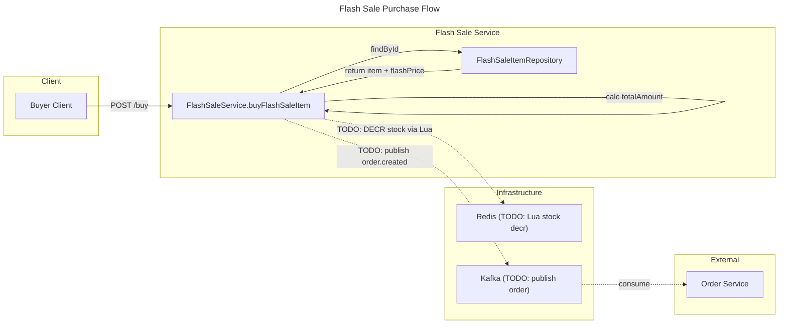

# C4 Code Level: Flash Sale Service

## Overview

- **Name**: Flash Sale Service (Core)
- **Description**: Axon CQRS-based flash sale session management service handling timed sale events, anti-oversell protection via Redis Lua scripts, and session lifecycle management. Uses PostgreSQL (R2DBC) for persistence, Redis for atomic inventory counters, and Kafka for event-driven communication with other services.
- **Location**: `D:\dev\stealing-from-paradise\backend\flashsale-service\`
- **Language**: Java 25 + Spring Boot 4.0.4 + Axon Framework 4.13.0
- **Purpose**: Flash sale session CRUD, inventory management with anti-oversell guarantees, buyer purchase flow, and reminder notifications.

## Code Elements

### Application Entry Point

#### `FlashsaleServiceApplication`

- Description: Spring Boot application entry point with Eureka service discovery enabled.
- Location: `D:\dev\stealing-from-paradise\backend\flashsale-service\src\main\java\com\flashsale\flashsaleservice\FlashsaleServiceApplication.java`
- Annotations: `@SpringBootApplication`, `@EnableDiscoveryClient`
- Dependencies: common-lib (Eureka auto-configuration)

---

### Configuration Classes

#### `KafkaConfig`

- Description: Configures Kafka consumer infrastructure for the flashsale service. Sets up a `String` key/value deserializer consumer factory with manual acknowledgment (`BATCH` mode), concurrency of 3, earliest offset reset, and non-fatal missing topics. Only activates when the `test` profile is inactive.
- Location: `D:\dev\stealing-from-paradise\backend\flashsale-service\src\main\java\com\flashsale\flashsaleservice\config\KafkaConfig.java`
- Annotations: `@Configuration`, `@EnableKafka`, `@Profile("!test")`

Methods:
- `consumerFactory(): ConsumerFactory<String, String>`
  - Description: Creates a `DefaultKafkaConsumerFactory` with `StringDeserializer` for both key and value, earliest auto-offset reset, disabled auto-commit, and max 100 poll records.
- `kafkaListenerContainerFactory(): ConcurrentKafkaListenerContainerFactory<String, String>`
  - Description: Creates a concurrent Kafka listener container factory with concurrency 3, batch acknowledgment mode, and non-fatal missing topics. Uses the above `consumerFactory`.

Dependencies: `spring.kafka.bootstrap-servers` (injected), `spring.kafka.consumer.group-id` (injected)

#### `SecurityConfig`

- Description: Delegates security to `WebFluxSecurityConfig` from `common-lib` which provides stateless JWT-based security (CSRF disabled, security headers enabled, permit-all exchanges with `@PreAuthorize` at method level). This class is an empty marker that activates WebFlux security.
- Location: `D:\dev\stealing-from-paradise\backend\flashsale-service\src\main\java\com\flashsale\flashsaleservice\config\SecurityConfig.java`
- Annotations: `@Configuration`, `@EnableWebFluxSecurity`
- Dependencies: `com.flashsale.commonlib.config.WebFluxSecurityConfig`

---

### Domain Models

#### `FlashSaleSession`

- Description: Maps to the `fs_sessions` table. Represents a timed flash sale session with a name, start/end timestamps, lifecycle status (`UPCOMING`, `ACTIVE`, `ENDED`), and soft-delete support via `deletedAt`.
- Location: `D:\dev\stealing-from-paradise\backend\flashsale-service\src\main\java\com\flashsale\flashsaleservice\domain\model\FlashSaleSession.java`
- Table: `fs_sessions`

Fields:
| Field | Type | Column | Default | Description |
|---|---|---|---|---|
| `id` | `Long` | `id` (PK) | auto | Auto-generated primary key |
| `name` | `String` | `name` | -- | Session display name |
| `startTime` | `LocalDateTime` | `start_time` | -- | Scheduled start time |
| `endTime` | `LocalDateTime` | `end_time` | -- | Scheduled end time |
| `status` | `String` | `status` | `"UPCOMING"` | Lifecycle status |
| `deletedAt` | `LocalDateTime` | `deleted_at` | `null` | Soft-delete timestamp |
| `createdAt` | `LocalDateTime` | `created_at` | `NOW()` | Creation timestamp |
| `updatedAt` | `LocalDateTime` | `updated_at` | `NOW()` | Last update timestamp |

#### `FlashSaleItem`

- Description: Maps to the `fs_items` table. Represents a product variant (SKU) participating in a flash sale session, with a discounted price (`flashPrice`), dedicated stock (`flashStock`), per-user purchase limit (`limitPerUser`), and review status (`PENDING`, `APPROVED`, `REJECTED`). Uses optimistic locking via `version`.
- Location: `D:\dev\stealing-from-paradise\backend\flashsale-service\src\main\java\com\flashsale\flashsaleservice\domain\model\FlashSaleItem.java`
- Table: `fs_items`

Fields:
| Field | Type | Column | Default | Description |
|---|---|---|---|---|
| `id` | `Long` | `id` (PK) | auto | Auto-generated primary key |
| `sessionId` | `Long` | `session_id` | -- | FK to `fs_sessions.id` |
| `skuCode` | `String` | `sku_code` | -- | Product variant identifier |
| `flashPrice` | `BigDecimal` | `flash_price` | -- | Discounted flash price |
| `flashStock` | `Integer` | `flash_stock` | -- | Dedicated flash stock count |
| `limitPerUser` | `Integer` | `limit_per_user` | `1` | Max quantity per user |
| `soldQty` | `Integer` | `sold_qty` | `0` | Quantity sold so far |
| `status` | `String` | `status` | `"PENDING"` | Approval status |
| `version` | `Integer` | `version` | `0` | Optimistic locking version |
| `createdAt` | `LocalDateTime` | `created_at` | `NOW()` | Creation timestamp |
| `updatedAt` | `LocalDateTime` | `updated_at` | `NOW()` | Last update timestamp |

#### `FlashSaleReminder`

- Description: Maps to the `fs_reminders` table. Represents a buyer's request to be notified when a specific flash sale session starts. Enforces uniqueness per customer-session pair.
- Location: `D:\dev\stealing-from-paradise\backend\flashsale-service\src\main\java\com\flashsale\flashsaleservice\domain\model\FlashSaleReminder.java`
- Table: `fs_reminders`

Fields:
| Field | Type | Column | Description |
|---|---|---|---|
| `id` | `Long` | `id` (PK) | Auto-generated primary key |
| `customerId` | `Long` | `customer_id` | Customer/user identifier |
| `sessionId` | `Long` | `session_id` | FK to `fs_sessions.id` |
| `createdAt` | `LocalDateTime` | `created_at` | Creation timestamp |

---

### Repository Interfaces

#### `FlashSaleSessionRepository`

- Description: Reactive R2DBC repository for `FlashSaleSession` entities. Extends `ReactiveCrudRepository`.
- Location: `D:\dev\stealing-from-paradise\backend\flashsale-service\src\main\java\com\flashsale\flashsaleservice\domain\repository\FlashSaleSessionRepository.java`

Methods:
- `findByStatus(String status): Flux<FlashSaleSession>` -- Find all sessions with a given lifecycle status.
- Inherited: `findById(Long)`, `findAll()`, `save(FlashSaleSession)`, `delete(FlashSaleSession)`.

#### `FlashSaleItemRepository`

- Description: Reactive R2DBC repository for `FlashSaleItem` entities.
- Location: `D:\dev\stealing-from-paradise\backend\flashsale-service\src\main\java\com\flashsale\flashsaleservice\domain\repository\FlashSaleItemRepository.java`

Methods:
- `findBySessionId(Long sessionId): Flux<FlashSaleItem>` -- Find all items in a given session.
- `findBySkuCode(String skuCode): Mono<FlashSaleItem>` -- Find a single item by its SKU code.
- Inherited: `findById(Long)`, `findAll()`, `save(FlashSaleItem)`, `delete(FlashSaleItem)`.

#### `FlashSaleReminderRepository`

- Description: Reactive R2DBC repository for `FlashSaleReminder` entities.
- Location: `D:\dev\stealing-from-paradise\backend\flashsale-service\src\main\java\com\flashsale\flashsaleservice\domain\repository\FlashSaleReminderRepository.java`

Methods:
- `findByCustomerIdAndSessionId(Long customerId, Long sessionId): Mono<FlashSaleReminder>` -- Find a reminder by customer and session.
- Inherited: `findById(Long)`, `findAll()`, `save(FlashSaleReminder)`, `delete(FlashSaleReminder)`.

---

### Service Layer

#### `FlashSaleService`

- Description: Core business service handling all flash sale operations: session CRUD, item management with admin approval workflow, buyer purchase (with TODO for Redis Lua stock decrement + Kafka order publishing), and buyer reminder management. Communicates with the outside world via a `@KafkaListener` for session-started events.
- Location: `D:\dev\stealing-from-paradise\backend\flashsale-service\src\main\java\com\flashsale\flashsaleservice\service\FlashSaleService.java`
- Annotations: `@Service`, `@RequiredArgsConstructor`, `@Slf4j`

**Kafka Listeners:**

- `onSessionStarted(String sessionId): void`
  - Annotations: `@KafkaListener(topics = KafkaTopics.FLASH_SALE_SESSION_STARTED, groupId = "flashsale-service-group")`
  - Description: Logs when a flash sale session starts. Placeholder for future logic.

**Public API Methods (Reactive -- return `Mono`/`Flux`):**

- `getSessions(String status): Mono<SessionListResponse>`
  - Description: Lists sessions optionally filtered by status. Returns a `SessionListResponse` wrapping the session list and a server-time epoch millis.
  - Dependencies: `FlashSaleSessionRepository.findByStatus()` or `findAll()`

- `getSessionDetail(Long sessionId): Mono<SessionDetailResponse>`
  - Description: Fetches a session by ID along with its flash sale items.
  - Dependencies: `FlashSaleSessionRepository.findById()`, `FlashSaleItemRepository.findBySessionId()`

- `createFlashSaleItem(Long sessionId, CreateFlashSaleItemRequest req): Mono<FlashSaleItemResponse>`
  - Description: Creates a new flash sale item under a session with `PENDING` status.
  - Dependencies: `FlashSaleItemRepository.save()`

- `createSession(CreateSessionRequest req): Mono<SessionResponse>`
  - Description: Creates a new flash sale session with `UPCOMING` status.
  - Dependencies: `FlashSaleSessionRepository.save()`

- `getAdminSessions(String status, int page, int size): Flux<SessionResponse>`
  - Description: Paginated admin query for sessions, with optional status filter.
  - Dependencies: `FlashSaleSessionRepository.findByStatus()` or `findAll()`

- `updateSession(Long sessionId, UpdateSessionRequest req): Mono<SessionResponse>`
  - Description: Updates session name, start time, and/or end time. Only non-null fields are applied.
  - Dependencies: `FlashSaleSessionRepository.findById()`, `FlashSaleSessionRepository.save()`

- `deleteSession(Long sessionId): Mono<Void>`
  - Description: Soft-deletes a session by setting its `deletedAt` timestamp.
  - Dependencies: `FlashSaleSessionRepository.findById()`, `FlashSaleSessionRepository.save()`

- `approveItem(Long sessionId, Long itemId, ApproveItemRequest req): Mono<FlashSaleItemResponse>`
  - Description: Approves a pending flash sale item, changing its status to `APPROVED`.
  - Dependencies: `FlashSaleItemRepository.findById()`, `FlashSaleItemRepository.save()`

- `rejectItem(Long itemId, RejectItemRequest req): Mono<FlashSaleItemResponse>`
  - Description: Rejects a pending flash sale item, changing its status to `REJECTED`.
  - Dependencies: `FlashSaleItemRepository.findById()`, `FlashSaleItemRepository.save()`

- `buyFlashSaleItem(Long sessionId, Long userId, BuyRequest req): Mono<BuyResponse>`
  - Description: Processes a buyer's flash sale purchase. Calculates total amount, logs the purchase intent. **Note**: Redis stock decrement (Lua script) and Kafka order publishing are currently `TODO` items.
  - Dependencies: `FlashSaleItemRepository.findById()`

- `setReminder(Long sessionId, Long userId): Mono<Void>`
  - Description: Sets a reminder for a user on a session. Idempotent -- no duplicate if already exists.
  - Dependencies: `FlashSaleReminderRepository.findByCustomerIdAndSessionId()`, `FlashSaleReminderRepository.save()`

- `removeReminder(Long sessionId, Long userId): Mono<Void>`
  - Description: Removes a previously set reminder.
  - Dependencies: `FlashSaleReminderRepository.findByCustomerIdAndSessionId()`, `FlashSaleReminderRepository.delete()`

**Private Mapper Methods:**

- `toSessionResponse(FlashSaleSession s): SessionResponse`
  - Description: Maps a `FlashSaleSession` entity to a `SessionResponse` DTO. Computes `secondsRemaining` and `isEnded` flags based on session status and current time.

- `toItemResponse(FlashSaleItem i): FlashSaleItemResponse`
  - Description: Maps a `FlashSaleItem` entity to a `FlashSaleItemResponse` DTO.

---

### DTOs -- Request

#### `ApproveItemRequest`
- Location: `D:\dev\stealing-from-paradise\backend\flashsale-service\src\main\java\com\flashsale\flashsaleservice\dto\request\ApproveItemRequest.java`
- Fields: `note` (String) -- Optional admin note for approval.

#### `BuyRequest`
- Location: `D:\dev\stealing-from-paradise\backend\flashsale-service\src\main\java\com\flashsale\flashsaleservice\dto\request\BuyRequest.java`
- Fields: `fsItemId` (Long, `@NotNull`), `quantity` (Integer, `@NotNull @Min(1)`), `addressId` (Long, `@NotNull`).

#### `CreateFlashSaleItemRequest`
- Location: `D:\dev\stealing-from-paradise\backend\flashsale-service\src\main\java\com\flashsale\flashsaleservice\dto\request\CreateFlashSaleItemRequest.java`
- Fields: `skuCode` (String, `@NotBlank`), `flashPrice` (BigDecimal, `@NotNull`), `flashStock` (Integer, `@NotNull @Min(1)`), `limitPerUser` (Integer, `@Min(1)`, optional).

#### `CreateSessionRequest`
- Location: `D:\dev\stealing-from-paradise\backend\flashsale-service\src\main\java\com\flashsale\flashsaleservice\dto\request\CreateSessionRequest.java`
- Fields: `name` (String, `@NotBlank`), `startTime` (LocalDateTime, `@NotNull`), `endTime` (LocalDateTime, `@NotNull`).

#### `RejectItemRequest`
- Location: `D:\dev\stealing-from-paradise\backend\flashsale-service\src\main\java\com\flashsale\flashsaleservice\dto\request\RejectItemRequest.java`
- Fields: `rejectReason` (String, `@NotBlank`).

#### `UpdateSessionRequest`
- Location: `D:\dev\stealing-from-paradise\backend\flashsale-service\src\main\java\com\flashsale\flashsaleservice\dto\request\UpdateSessionRequest.java`
- Fields: `name` (String, optional), `startTime` (LocalDateTime, optional), `endTime` (LocalDateTime, optional).

---

### DTOs -- Response

#### `BuyResponse`
- Location: `D:\dev\stealing-from-paradise\backend\flashsale-service\src\main\java\com\flashsale\flashsaleservice\dto\response\BuyResponse.java`
- Fields: `orderId`, `sessionId`, `fsItemId`, `skuCode`, `flashPrice` (BigDecimal), `quantity`, `totalAmount` (BigDecimal), `purchasedAt` (LocalDateTime).

#### `FlashSaleItemResponse`
- Location: `D:\dev\stealing-from-paradise\backend\flashsale-service\src\main\java\com\flashsale\flashsaleservice\dto\response\FlashSaleItemResponse.java`
- Fields: `id`, `sessionId`, `skuCode`, `flashPrice` (BigDecimal), `flashStock`, `limitPerUser`, `soldQty`, `status`, `createdAt`, `updatedAt`.

#### `ServerTimeResponse`
- Location: `D:\dev\stealing-from-paradise\backend\flashsale-service\src\main\java\com\flashsale\flashsaleservice\dto\response\ServerTimeResponse.java`
- Fields: `serverTime` (long) -- Server epoch millis for time synchronization.

#### `SessionDetailResponse`
- Location: `D:\dev\stealing-from-paradise\backend\flashsale-service\src\main\java\com\flashsale\flashsaleservice\dto\response\SessionDetailResponse.java`
- Fields: `session` (SessionResponse), `items` (List of FlashSaleItemResponse).

#### `SessionListResponse`
- Location: `D:\dev\stealing-from-paradise\backend\flashsale-service\src\main\java\com\flashsale\flashsaleservice\dto\response\SessionListResponse.java`
- Fields: `serverTime` (long), `sessions` (List of SessionResponse).

#### `SessionResponse`
- Location: `D:\dev\stealing-from-paradise\backend\flashsale-service\src\main\java\com\flashsale\flashsaleservice\dto\response\SessionResponse.java`
- Fields: `sessionId`, `name`, `status`, `startTime`, `endTime`, `secondsRemaining` (Long), `isEnded` (boolean), `createdAt`, `updatedAt`.

---

### Database Migrations

#### `V1__init_fs_sessions_items_reminders.sql`
- Location: `D:\dev\stealing-from-paradise\backend\flashsale-service\src\main\resources\db\migration\V1__init_fs_sessions_items_reminders.sql`
- Description: Creates initial tables: `fs_sessions`, `fs_items` (with FK to `fs_sessions`, optimistic lock column `version`), and `fs_reminders` (with unique constraint on `user_id, session_id`). Creates indexes on `fs_items.session_id` and `fs_sessions.status`.

#### `V2__add_axon_saga_tables.sql`
- Location: `D:\dev\stealing-from-paradise\backend\flashsale-service\src\main\resources\db\migration\V2__add_axon_saga_tables.sql`
- Description: Creates Axon Framework infrastructure tables: `token_entry` (event processor progress tracking), `saga_entry` (saga state persistence), and `association_value_entry` (saga-to-domain-identifier mapping). Adds performance indexes on `association_value_entry`.

#### `V3__rename_user_id_to_customer_id.sql`
- Location: `D:\dev\stealing-from-paradise\backend\flashsale-service\src\main\resources\db\migration\V3__rename_user_id_to_customer_id.sql`
- Description: Renames `user_id` to `customer_id` on the `fs_reminders` table to align with the database-entities specification.

---

### Test Code

#### `FlashsaleServiceApplicationTests`
- Location: `D:\dev\stealing-from-paradise\backend\flashsale-service\src\test\java\com\flashsale\flashsaleservice\FlashsaleServiceApplicationTests.java`
- Description: Basic Spring Boot context load test to verify application startup.
- Dependencies: Spring Boot Test framework.

---

## Dependencies

### Internal Dependencies (within the monorepo)

| Dependency | Artifact | Usage |
|---|---|---|
| `common-lib` | `com.flashsale:common-lib:0.0.1-SNAPSHOT` | Shared `KafkaTopics` constants (`FlashSaleService.onSessionStarted()` listener topics), `WebFluxSecurityConfig` for security configuration |

### External Dependencies

| Dependency | Coordinates / Version | Usage |
|---|---|---|
| Spring Boot Starter WebFlux | `spring-boot-starter-webflux` | Reactive REST API support |
| Axon Framework | `axon-spring-boot-starter` (4.13.0) | CQRS/event-sourcing infrastructure, saga tables |
| Spring Boot Starter Validation | `spring-boot-starter-validation` | Request DTO validation (`@NotNull`, `@NotBlank`, `@Min`) |
| Spring Data R2DBC | `spring-boot-starter-data-r2dbc` | Reactive PostgreSQL persistence |
| R2DBC PostgreSQL | `r2dbc-postgresql` (runtime) | Reactive PostgreSQL driver |
| PostgreSQL JDBC | `postgresql` (runtime) | JDBC driver for Flyway migrations |
| Spring Data Redis Reactive | `spring-boot-starter-data-redis-reactive` | Reactive Redis client for atomic stock decrement (Lua script) |
| Spring Kafka | `spring-kafka` | Event publishing (order placement) and consumption (session lifecycle) |
| Eureka Client | `spring-cloud-starter-netflix-eureka-client` | Service registration and discovery |
| Flyway | `flyway-core`, `flyway-database-postgresql` | Database migration management |
| Lombok | `lombok` (provided) | Boilerplate reduction (`@Data`, `@Builder`, `@Slf4j`, etc.) |

### Infrastructure Dependencies

| Service | Connection Details | Purpose |
|---|---|---|
| PostgreSQL | Host: `${DB_HOST:localhost}`, Port: 5432, Database: `flashsale_platform`, Schema: `flashsale` | Primary data store for sessions, items, reminders, and Axon saga tables |
| Redis | Host: `${REDIS_HOST:localhost}`, Port: 6379 (auth: `${REDIS_PASSWORD:123456}`) | Atomic inventory counter via Lua scripts (anti-oversell) |
| Kafka | `${KAFKA_SERVER:localhost:9092}` | Event bus for interservice communication (purchase orders, session lifecycle events) |
| Axon Server | `${AXON_SERVER:localhost:8124}` | Axon event bus and command bus (CQRS infrastructure) |
| Eureka | `http://localhost:8761/eureka/` | Service discovery registry |

---

## Relationships

### Flash Sale Service Code Diagram

```mermaid
---
title: Code Diagram for Flash Sale Service
---
classDiagram
    namespace FlashSaleService {
        class FlashsaleServiceApplication {
            +main(String[] args) void
        }

        class KafkaConfig {
            -bootstrapServers String
            -groupId String
            +consumerFactory() ConsumerFactory~String, String~
            +kafkaListenerContainerFactory() ConcurrentKafkaListenerContainerFactory
        }

        class SecurityConfig {
            <<configuration>>
            "Delegates to WebFluxSecurityConfig from common-lib"
        }

        class FlashSaleService {
            -sessionRepo FlashSaleSessionRepository
            -itemRepo FlashSaleItemRepository
            -reminderRepo FlashSaleReminderRepository
            +onSessionStarted(sessionId String) void
            +getSessions(status String) Mono~SessionListResponse~
            +getSessionDetail(sessionId Long) Mono~SessionDetailResponse~
            +createFlashSaleItem(sessionId Long, req CreateFlashSaleItemRequest) Mono~FlashSaleItemResponse~
            +createSession(req CreateSessionRequest) Mono~SessionResponse~
            +getAdminSessions(status String, page int, size int) Flux~SessionResponse~
            +updateSession(sessionId Long, req UpdateSessionRequest) Mono~SessionResponse~
            +deleteSession(sessionId Long) Mono~Void~
            +approveItem(sessionId Long, itemId Long, req ApproveItemRequest) Mono~FlashSaleItemResponse~
            +rejectItem(itemId Long, req RejectItemRequest) Mono~FlashSaleItemResponse~
            +buyFlashSaleItem(sessionId Long, userId Long, req BuyRequest) Mono~BuyResponse~
            +setReminder(sessionId Long, userId Long) Mono~Void~
            +removeReminder(sessionId Long, userId Long) Mono~Void~
        }

        class FlashSaleSession {
            <<model>>
            +id Long
            +name String
            +startTime LocalDateTime
            +endTime LocalDateTime
            +status String
            +deletedAt LocalDateTime
            +createdAt LocalDateTime
            +updatedAt LocalDateTime
        }

        class FlashSaleItem {
            <<model>>
            +id Long
            +sessionId Long
            +skuCode String
            +flashPrice BigDecimal
            +flashStock Integer
            +limitPerUser Integer
            +soldQty Integer
            +status String
            +version Integer
            +createdAt LocalDateTime
            +updatedAt LocalDateTime
        }

        class FlashSaleReminder {
            <<model>>
            +id Long
            +customerId Long
            +sessionId Long
            +createdAt LocalDateTime
        }

        class FlashSaleSessionRepository {
            <<interface>>
            +findByStatus(status String) Flux~FlashSaleSession~
        }

        class FlashSaleItemRepository {
            <<interface>>
            +findBySessionId(sessionId Long) Flux~FlashSaleItem~
            +findBySkuCode(skuCode String) Mono~FlashSaleItem~
        }

        class FlashSaleReminderRepository {
            <<interface>>
            +findByCustomerIdAndSessionId(customerId Long, sessionId Long) Mono~FlashSaleReminder~
        }

        class RequestDTOs {
            <<module>>
        }

        class ResponseDTOs {
            <<module>>
        }
    }

    namespace common_lib {
        class KafkaTopics {
            <<constants>>
            +FLASH_SALE_SESSION_STARTED String
            +FLASH_SALE_SESSION_ENDED String
            +FLASH_SALE_ITEM_APPROVED String
            +FLASH_SALE_ITEM_REJECTED String
            +FLASH_SALE_ITEM_SOLD String
            +FLASH_SALE_REMINDER String
        }
    }

    FlashSaleService --> FlashSaleSessionRepository : uses
    FlashSaleService --> FlashSaleItemRepository : uses
    FlashSaleService --> FlashSaleReminderRepository : uses
    FlashSaleService --> KafkaTopics : references topic constants
    FlashSaleService --> ResponseDTOs : produces
    FlashSaleService --> RequestDTOs : consumes

    FlashSaleSessionRepository ..|> ReactiveCrudRepository~FlashSaleSession, Long~ : extends
    FlashSaleItemRepository ..|> ReactiveCrudRepository~FlashSaleItem, Long~ : extends
    FlashSaleReminderRepository ..|> ReactiveCrudRepository~FlashSaleReminder, Long~ : extends

    FlashSaleSessionRepository --> FlashSaleSession : manages
    FlashSaleItemRepository --> FlashSaleItem : manages
    FlashSaleReminderRepository --> FlashSaleReminder : manages

    FlashSaleItem --> FlashSaleSession : belongs to (sessionId FK)
    FlashSaleReminder --> FlashSaleSession : references (sessionId FK)

    FlashsaleServiceApplication --> KafkaConfig : loads
    FlashsaleServiceApplication --> SecurityConfig : loads
    FlashsaleServiceApplication --> FlashSaleService : loads

    SecurityConfig --> KafkaConfig : peers
```

### Data Flow Sequence (Buy Flow)



## Notes

- **No Controller class exists** in this service. The REST API endpoints are expected to be provided by a Spring WebFlux `@RestController` class that wires into `FlashSaleService`. This is either autogenerated or lives in a separate source set not yet identified.
- **CQRS infrastructure is declared but not actively used in code**. The `pom.xml` declares Axon Framework and the migration `V2` creates Axon saga/token tables, but the Java code does not contain Axon aggregates, sagas, or event handlers. The service currently operates in a non-CQRS mode using direct R2DBC repository calls. The Axon tables are provisioned for future saga-based orchestration.
- **Redis Lua script and Kafka order publishing are marked as TODO** in `buyFlashSaleItem()`. The anti-oversell mechanism (atomic stock decrement via Lua) and the asynchronous order publication to Kafka are not yet implemented.
- **Soft-delete pattern**: `deleteSession()` sets `deletedAt` rather than physically removing the row. Queries do not currently filter out soft-deleted sessions.
- **Security is fully delegated** to `common-lib`'s `WebFluxSecurityConfig`. The local `SecurityConfig` is a marker class that activates WebFlux security.
- **Kafka consumer group**: The service listens on `flash_sale.session_started` under group `flashsale-service-group` but currently only logs the event.
- **Configuration profiles**: `dev` (default, via `SPRING_PROFILES_ACTIVE`) and `prod` (production tuning with larger connection pool and reduced logging).
