# C4 Code Level: Identity Service

## Overview

- **Name**: Identity Service
- **Description**: Authentication and user management service handling JWT token generation/validation, user registration/login, roles management (BUYER/SELLER/ADMIN), address management, and loyalty points tracking. Uses PostgreSQL for persistence and Redis for session/token blacklist management. Communicates with order-service via Kafka for address lookups.
- **Location**: `D:\dev\stealing-from-paradise\backend\identity-service\`
- **Language**: Java 25 + Spring Boot 4.0.4
- **Purpose**: Central authentication and user management service that handles user identity, role-based access control, profile management, address book, and provides internal APIs for other microservices to verify user existence and roles.

## Code Elements

### Application Entry Point

- `com.flashsale.identityservice.IdentityServiceApplication`
  - Description: Spring Boot application entry point. Scans `com.flashsale` base packages. Enables service discovery (Eureka client) and DevDataProperties configuration.
  - Location: `IdentityServiceApplication.java:1-18`
  - Dependencies: `DevDataProperties` (common-lib), Spring Cloud DiscoveryClient

### Controllers

#### `com.flashsale.identityservice.controller.AuthController`
- Description: Authentication controller handling login, logout, registration (buyer and seller), and token refresh operations. Extracts domain from HTTP request to determine the intended role automatically (seller/admin/customer subdomain routing).
- Location: `controller/AuthController.java:1-269`
- Dependencies: `AuthService`, `RoleRepository`, `JwtUtils` (common-lib)
- Methods:
  - `POST /v1/auth/login` - `login(LoginRequest, HttpServletRequest): ResponseEntity<ApiResponse<AuthResponse>>`
    - Description: Authenticates user by credential (username/email/phone) and password. Determines role from request domain name.
    - Dependencies: `AuthService.authenticateUser()`
  - `POST /v1/auth/register` - `register(RegisterRequest): ResponseEntity<ApiResponse<AuthResponse>>`
    - Description: Registers a new BUYER user. Validates username, email, password presence. Assigns BUYER role by default, generates JWT tokens on success.
    - Dependencies: `AuthService.registerUser()`, `RoleRepository`, `JwtUtils`
  - `POST /v1/auth/register/seller` - `registerSeller(RegisterRequest): ResponseEntity<ApiResponse<AuthResponse>>`
    - Description: Registers a new SELLER user. Validates input, delegates to `authService.registerUserWithRole()` with "SELLER" role, generates JWT tokens.
    - Dependencies: `AuthService.registerUserWithRole()`, `RoleRepository`, `JwtUtils`
  - `POST /v1/auth/refresh` - `refreshToken(String, String): ResponseEntity<ApiResponse<AuthResponse>>`
    - Description: Refreshes JWT access token using a refresh token from `Authorization` header or `X-Refresh-Token` header.
    - Dependencies: `AuthService.refreshAccessToken()`
  - `POST /v1/auth/logout` - `logout(UserDetailsImpl, String): ResponseEntity<ApiResponse<Void>>`
    - Description: Logs out user by blacklisting the `X-Access-Token` in Redis. Requires `@PreAuthorize("isAuthenticated()")`.
    - Dependencies: `AuthService.logout()`

#### `com.flashsale.identityservice.controller.UserController`
- Description: User profile management controller for authenticated users to view/update profile, manage addresses, change password, and register as a seller.
- Location: `controller/UserController.java:1-118`
- Dependencies: `UserService`
- Methods:
  - `GET /v1/users/me` - `getCurrentUser(UserDetailsImpl): ResponseEntity<ApiResponse<UserProfileResponse>>`
    - Description: Returns the authenticated user's profile.
    - Dependencies: `UserService.getUserProfile()`
  - `PUT /v1/users/me` - `updateCurrentUser(UserDetailsImpl, UserProfileUpdateRequest): ResponseEntity<ApiResponse<UserProfileResponse>>`
    - Description: Updates the authenticated user's profile (fullName, phone).
    - Dependencies: `UserService.updateUserProfile()`
  - `GET /v1/users/me/avatar/presigned-url` - `getAvatarPresignedUrl(UserDetailsImpl, String): ResponseEntity<ApiResponse<PresignedUrlResponse>>`
    - Description: Generates a presigned URL for avatar upload to MinIO/S3.
  - `GET /v1/users/me/addresses` - `getAddresses(UserDetailsImpl): ResponseEntity<ApiResponse<List<AddressResponse>>>`
    - Description: Returns all addresses for the authenticated user.
    - Dependencies: `UserService.getUserAddresses()`
  - `POST /v1/users/me/addresses` - `addAddress(UserDetailsImpl, AddressCreateRequest): ResponseEntity<ApiResponse<AddressResponse>>`
    - Description: Adds a new address for the authenticated user.
    - Dependencies: `UserService.addAddress()`
  - `PUT /v1/users/me/addresses/{addressId}` - `updateAddress(UserDetailsImpl, Long, AddressUpdateRequest): ResponseEntity<ApiResponse<AddressResponse>>`
    - Description: Updates an existing address.
    - Dependencies: `UserService.updateAddress()`
  - `DELETE /v1/users/me/addresses/{addressId}` - `deleteAddress(UserDetailsImpl, Long): ResponseEntity<ApiResponse<Void>>`
    - Description: Deletes an address. Auto-assigns a new default if the deleted address was the default.
    - Dependencies: `UserService.deleteAddress()`
  - `POST /v1/users/me/change-password` - `changePassword(UserDetailsImpl, ChangePasswordRequest): ResponseEntity<ApiResponse<Void>>`
    - Description: Changes the authenticated user's password after validating the current password.
    - Dependencies: `UserService.changePassword()`
  - `POST /v1/users/me/roles/seller` - `registerAsSeller(UserDetailsImpl): ResponseEntity<ApiResponse<Void>>`
    - Description: Registers the current user as a seller (upgrades BUYER role to SELLER).
    - Dependencies: `UserService.registerAsSeller()`

#### `com.flashsale.identityservice.controller.AdminController`
- Description: Admin-only controller for account locking/unlocking. All endpoints require `hasRole('ADMIN')`.
- Location: `controller/AdminController.java:1-63`
- Dependencies: `UserRepository`
- Methods:
  - `POST /v1/admin/users/{userId}/lock` - `lockUser(Long, LockRequest): ResponseEntity<ApiResponse<Void>>`
    - Description: Locks a user account (sets status = "LOCKED"). Rejects if already locked.
    - Dependencies: `UserRepository.findById()`, `UserRepository.save()`
  - `POST /v1/admin/users/{userId}/unlock` - `unlockUser(Long, UnlockRequest): ResponseEntity<ApiResponse<Void>>`
    - Description: Unlocks a user account (sets status = "ACTIVE").
    - Dependencies: `UserRepository.findById()`, `UserRepository.save()`

#### `com.flashsale.identityservice.controller.InternalUserController`
- Description: Internal REST controller for inter-service communication. Provides user info, role lookup, and existence checks to other microservices.
- Location: `controller/InternalUserController.java:1-89`
- Dependencies: `UserRepository`, `RoleRepository`
- Methods:
  - `GET /internal/users/{userId}/role` - `getUserRole(Long): ResponseEntity<ApiResponse<InternalUserRoleResponse>>`
    - Description: Returns the user's role name and active status. Returns BUYER as default if no role found.
    - Dependencies: `UserRepository.findById()`, `RoleRepository.findFirstByUserIdOrderByIdAsc()`
  - `GET /internal/users/{userId}` - `getUserInfo(Long): ResponseEntity<ApiResponse<InternalUserInfoResponse>>`
    - Description: Returns full user info (id, username, email, phone, role, status) for internal use.
    - Dependencies: `UserRepository.findById()`, `RoleRepository.findFirstByUserIdOrderByIdAsc()`
  - `GET /internal/users/exists` - `checkUserExists(String, String, String): ResponseEntity<ApiResponse<UserExistsResponse>>`
    - Description: Checks if a user exists by username, email, or phone query parameter.
    - Dependencies: `UserRepository.findByUsername()`, `UserRepository.findByEmail()`, `UserRepository.findByPhone()`

### Services

#### `com.flashsale.identityservice.service.AuthService`
- Description: Core authentication service handling user registration, authentication, token refresh, and logout with token blacklisting. Supports credential lookup by username, email, or phone. Implements domain-based role determination for multi-tenant routing.
- Location: `service/AuthService.java:1-240`
- Dependencies: `UserRepository`, `RoleRepository`, `PasswordEncoder`, `JwtUtils` (common-lib), `TokenBlacklistService`
- Methods:
  - `findByUsername(String): Optional<User>` - Looks up user by username.
  - `findByEmail(String): Optional<User>` - Looks up user by email.
  - `registerUser(String, String, String, String, String): User`
    - Description: Registers a new user with BUYER role. Checks for duplicate username, email, phone. Hashes password, creates User entity and Role entity.
  - `registerUserWithRole(String, String, String, String, String, String): User`
    - Description: Registers a new user with a specified role (e.g., SELLER). Same validation as registerUser.
  - `authenticateUser(String, String, String): AuthResponse`
    - Description: Authenticates by credential (username/email/phone), validates password, determines role from domain + DB role, generates access + refresh JWT tokens.
  - `validatePassword(String, String): boolean` - Validates raw password against hashed password using BCrypt.
  - `refreshAccessToken(String): AuthResponse`
    - Description: Validates refresh token, extracts userId, looks up user and role, generates new access and refresh tokens.
  - `logout(String): void` - Blacklists the JWT token via TokenBlacklistService.
  - `getUserById(Long): User` - Looks up user by ID.

#### `com.flashsale.identityservice.service.UserService`
- Description: User profile and address management service. Handles CRUD for addresses with default address logic, password changes, and seller role upgrades.
- Location: `service/UserService.java:1-191`
- Dependencies: `UserRepository`, `RoleRepository`, `AddressRepository`, `PasswordEncoder`
- Methods:
  - `getUserById(Long): User` - Looks up user by ID, throws RuntimeException if not found.
  - `getUserProfile(Long): UserProfileResponse`
    - Description: Returns user profile with role name, read-only transactional.
  - `updateUserProfile(Long, UserProfileUpdateRequest): UserProfileResponse`
    - Description: Updates fullName and phone. Validates phone uniqueness.
  - `getUserAddresses(Long): List<AddressResponse>`
    - Description: Returns addresses sorted by isDefault DESC, then createdAt DESC.
  - `addAddress(Long, AddressCreateRequest): AddressResponse`
    - Description: Adds address. Clears previous defaults if new address is default. Auto-sets default if user has no addresses.
  - `updateAddress(Long, Long, AddressUpdateRequest): AddressResponse`
    - Description: Updates address fields. If setting as default, clears other defaults.
  - `deleteAddress(Long, Long): void`
    - Description: Deletes address. If deleted address was default, promotes another address to default.
  - `registerAsSeller(Long): void`
    - Description: Upgrades user's role to SELLER. Throws if already SELLER.
  - `changePassword(Long, ChangePasswordRequest): void`
    - Description: Validates current password, then sets new hashed password.

#### `com.flashsale.identityservice.service.CustomUserDetailsService`
- Description: Spring Security `UserDetailsService` implementation that loads users by username or email from the database and constructs `UserDetailsImpl` objects including role information.
- Location: `service/CustomUserDetailsService.java:1-53`
- Dependencies: `UserRepository`, `RoleRepository`
- Methods:
  - `loadUserByUsername(String): UserDetails`
    - Description: Loads user by username or email. Throws `UsernameNotFoundException` if not found.
  - `buildUserDetails(User): UserDetailsImpl` (private)
    - Description: Constructs `UserDetailsImpl` with id, username, email, password, role, and active status.

#### `com.flashsale.identityservice.service.TokenBlacklistService`
- Description: Manages JWT token blacklist using Redis. When a user logs out, the token's JTI (JWT ID) is stored in Redis with a TTL equal to the remaining token lifetime. Provides check, add, and remove operations.
- Location: `service/TokenBlacklistService.java:1-81`
- Dependencies: `StringRedisTemplate`, `JwtUtils` (common-lib)
- Methods:
  - `blacklistToken(String): void`
    - Description: Parses JWT, extracts JTI, stores `token:blacklist:<jti>` key in Redis with remaining TTL.
  - `isTokenBlacklisted(String): boolean`
    - Description: Checks if a token's JTI exists in the Redis blacklist.
  - `removeFromBlacklist(String): void`
    - Description: Removes a token's JTI from the Redis blacklist (for testing/manual unblocking).

#### `com.flashsale.identityservice.service.AddressKafkaConsumer`
- Description: Kafka request-reply consumer for address lookups from order-service. Listens on `order.address.request` topic and replies on `order.address.response` topic. Handles correlation ID-based request-reply pattern.
- Location: `service/AddressKafkaConsumer.java:1-104`
- Dependencies: `AddressRepository`, `KafkaTemplate<String, String>`, `ObjectMapper`, `KafkaTopics` (common-lib)
- Methods:
  - `onAddressRequest(String): void` (KafkaListener)
    - Description: Processes address request messages containing `correlation_id`, `address_id`, `user_id`. Looks up address by id+userId and sends response. Sends error response for not-found or invalid requests.
  - `toJson(Object): String` (private) - Serializes response to JSON.

### Domain Models (JPA Entities)

#### `com.flashsale.identityservice.domain.model.User`
- Description: JPA entity mapping to `users` table. Implements Spring Security `UserDetails` for authentication. Has unique indexes on email and username. Uses optimistic locking via `@Version`. Tracks `status` field (ACTIVE/LOCKED) for account lifecycle.
- Location: `domain/model/User.java:1-98`
- Table: `users` (schema: identity)
- Fields:
  - `id: Long` (PK, auto-generated)
  - `username: String` (unique, not null)
  - `email: String` (unique, not null)
  - `phone: String`
  - `password: String`
  - `fullName: String` (maps to `full_name`)
  - `status: String` (ACTIVE | LOCKED)
  - `version: Integer` (optimistic lock, defaults to 0)
  - `createdAt: LocalDateTime`
  - `updatedAt: LocalDateTime`
- Implements: `UserDetails` - `getAuthorities()` returns `ROLE_BUYER`, `isAccountNonLocked()` checks `!LOCKED`, `isEnabled()` checks `ACTIVE`.

#### `com.flashsale.identityservice.domain.model.Role`
- Description: JPA entity mapping to `roles` table with unique constraint on `user_id`. Associates a user with a role name: BUYER, SELLER, or ADMIN.
- Location: `domain/model/Role.java:1-47`
- Table: `roles`
- Fields:
  - `id: Long` (PK, auto-generated)
  - `userId: Long` (not null, unique)
  - `roleName: String` (BUYER, SELLER, ADMIN)
  - `createdAt: LocalDateTime`
  - `updatedAt: LocalDateTime`

#### `com.flashsale.identityservice.domain.model.Address`
- Description: JPA entity mapping to `addresses` table. Stores user shipping addresses with province/district references and default flag.
- Location: `domain/model/Address.java:1-53`
- Table: `addresses`
- Fields:
  - `id: Long` (PK, auto-generated)
  - `userId: Long` (not null)
  - `provinceId: Integer` (not null)
  - `districtId: Integer` (not null)
  - `fullAddress: String` (TEXT, not null)
  - `isDefault: Boolean` (defaults to false)
  - `createdAt: LocalDateTime`
  - `updatedAt: LocalDateTime`

### Repositories

#### `com.flashsale.identityservice.domain.repository.UserRepository`
- Description: JPA repository for User entity. Extends JpaRepository and JpaSpecificationExecutor.
- Location: `domain/repository/UserRepository.java:1-16`
- Methods:
  - `findByUsername(String): Optional<User>`
  - `findByEmail(String): Optional<User>`
  - `findByPhone(String): Optional<User>`
  - `existsByPhone(String): boolean`

#### `com.flashsale.identityservice.domain.repository.RoleRepository`
- Description: JPA repository for Role entity.
- Location: `domain/repository/RoleRepository.java:1-13`
- Methods:
  - `findFirstByUserIdOrderByIdAsc(Long): Optional<Role>` - Returns the first role for a user by ID (since unique constraint on user_id, there is at most one).

#### `com.flashsale.identityservice.domain.repository.AddressRepository`
- Description: JPA repository for Address entity with custom update queries.
- Location: `domain/repository/AddressRepository.java:1-28`
- Methods:
  - `findByUserIdOrderByIsDefaultDescCreatedAtDesc(Long): List<Address>`
  - `findByIdAndUserId(Long, Long): Optional<Address>`
  - `countByUserId(Long): long` (custom JPQL)
  - `clearDefaultForUserExcept(Long, Long): void` (custom JPQL UPDATE, modifying)
  - `clearDefaultForUser(Long): void` (custom JPQL UPDATE, modifying)

### Configuration Classes

#### `com.flashsale.identityservice.config.SecurityConfig`
- Description: Main Spring Security configuration. Disables CSRF, stateless session management, disables HTTP Basic, form login, and anonymous authentication. Registers `JwtTokenDecoderFilter` inside the `SecurityFilterChain` (before `UsernamePasswordAuthenticationFilter`) and disables the top-level servlet filter registration to avoid SecurityContext wipe by `SecurityContextHolderFilter`. Configures `BCryptPasswordEncoder` and `AuthenticationManager` backed by `CustomUserDetailsService`.
- Location: `config/SecurityConfig.java:1-88`
- Dependencies: `CustomUserDetailsService`, `JwtTokenDecoderFilter` (common-lib)
- Beans:
  - `passwordEncoder(): PasswordEncoder` - Returns `BCryptPasswordEncoder`.
  - `authenticationManager(HttpSecurity): AuthenticationManager` - Builds AuthManager with CustomUserDetailsService + PasswordEncoder.
  - `jwtTokenDecoderFilterRegistration(JwtTokenDecoderFilter): FilterRegistrationBean<JwtTokenDecoderFilter>` - Disables top-level servlet filter registration.
  - `securityFilterChain(HttpSecurity): SecurityFilterChain` - Builds the filter chain with JwtTokenDecoderFilter.

#### `com.flashsale.identityservice.config.SecurityFilterConfig`
- Description: Imports `JwtTokenDecoderFilter` from common-lib into the identity-service Spring context using `@Import`. The filter reads X-User-Id, X-User-Role headers set by API Gateway and populates the SecurityContext.
- Location: `config/SecurityFilterConfig.java:1-24`
- Dependencies: `JwtTokenDecoderFilter` (common-lib)

#### `com.flashsale.identityservice.config.KafkaConsumerConfig`
- Description: Kafka producer and consumer configuration. Configures both `KafkaTemplate<String, String>` (producer) and `ConcurrentKafkaListenerContainerFactory` (consumer) with manual immediate acknowledgment. Uses idempotent producer with `acks=all`, `retries=3`. Consumer uses `earliest` auto-offset reset, manual commit mode.
- Location: `config/KafkaConsumerConfig.java:1-78`
- Dependencies: Spring Kafka
- Beans:
  - `producerFactory(): ProducerFactory<String, String>`
  - `kafkaTemplate(): KafkaTemplate<String, String>`
  - `consumerFactory(): ConsumerFactory<String, String>`
  - `kafkaListenerContainerFactory(): ConcurrentKafkaListenerContainerFactory<String, String>`

#### `com.flashsale.identityservice.config.IdentityDevDataLoader`
- Description: Development-only data seeder (`@Profile("dev")`). Seeds 13 users (5 sellers, 6 buyers, 1 admin + 2 extra buyers), role assignments, and addresses. Conditional on `dev-data.enabled=true` property. Supports reset via `dev-data.reset=true`. Uses `JdbcTemplate` for direct SQL inserts with `ON CONFLICT DO NOTHING` and sequence reset.
- Location: `config/IdentityDevDataLoader.java:1-211`
- Dependencies: `UserRepository`, `RoleRepository`, `AddressRepository`, `PasswordEncoder`, `DevDataProperties` (common-lib), `JdbcTemplate`
- Seed Data (all passwords = `dev123`):
  - IDs 1-5: Sellers (techworld, fashionhub, gadgetpro, homeliving, sportoutdoor)
  - IDs 6-9: Buyers (minhhoa, phuongthao, ductran, linhnguyen)
  - ID 10: Admin (admin)
  - IDs 11-13: Extra buyers (huyenvu, tuananh, thanhhuyen)

### DTOs - Request

#### `com.flashsale.identityservice.dto.request.AddressCreateRequest`
- Fields: `provinceId` (Integer), `districtId` (Integer), `fullAddress` (String), `isDefault` (Boolean)
- Location: `dto/request/AddressCreateRequest.java`

#### `com.flashsale.identityservice.dto.request.AddressUpdateRequest`
- Fields: `provinceId` (Integer), `districtId` (Integer), `fullAddress` (String), `isDefault` (Boolean)
- Location: `dto/request/AddressUpdateRequest.java`

#### `com.flashsale.identityservice.dto.request.ChangePasswordRequest`
- Fields: `currentPassword` (String, JSON: `old_password`), `newPassword` (String, JSON: `new_password`)
- Location: `dto/request/ChangePasswordRequest.java`

#### `com.flashsale.identityservice.dto.request.LockRequest`
- Fields: `reason` (String)
- Location: `dto/request/LockRequest.java`

#### `com.flashsale.identityservice.dto.request.UnlockRequest`
- Fields: `reason` (String)
- Location: `dto/request/UnlockRequest.java`

#### `com.flashsale.identityservice.dto.request.UnlockProductPostingRequest`
- Fields: `note` (String)
- Location: `dto/request/UnlockProductPostingRequest.java`

#### `com.flashsale.identityservice.dto.request.UserProfileUpdateRequest`
- Fields: `fullName` (String, JSON: `full_name`), `phone` (String)
- Location: `dto/request/UserProfileUpdateRequest.java`

### DTOs - Response

#### `com.flashsale.identityservice.dto.response.AddressResponse`
- Fields: `addressId` (Long), `provinceId` (Integer), `districtId` (Integer), `fullAddress` (String), `isDefault` (Boolean)
- Location: `dto/response/AddressResponse.java`

#### `com.flashsale.identityservice.dto.response.AdminUserResponse`
- Fields: `userId` (Long), `username`, `email`, `phone`, `fullName`, `role`, `status`, `createdAt` (LocalDateTime)
- Location: `dto/response/AdminUserResponse.java`

#### `com.flashsale.identityservice.dto.response.InternalUserInfoResponse`
- Type: Java Record
- Fields: `userId` (Long), `username`, `email`, `phone`, `role`, `status`
- Location: `dto/response/InternalUserInfoResponse.java`

#### `com.flashsale.identityservice.dto.response.InternalUserRoleResponse`
- Type: Java Record
- Fields: `userId` (String), `role` (String), `active` (boolean)
- Location: `dto/response/InternalUserRoleResponse.java`

#### `com.flashsale.identityservice.dto.response.PresignedUrlResponse`
- Fields: `uploadUrl` (String), `objectKey` (String), `cdnUrl` (String), `expiresIn` (Integer)
- Location: `dto/response/PresignedUrlResponse.java`

#### `com.flashsale.identityservice.dto.response.UserExistsResponse`
- Type: Java Record
- Fields: `exists` (boolean), `field` (String)
- Location: `dto/response/UserExistsResponse.java`

#### `com.flashsale.identityservice.dto.response.UserProfileResponse`
- Fields: `userId` (Long), `username`, `email`, `phone`, `fullName`, `status`, `createdAt`, `updatedAt` (LocalDateTime)
- Location: `dto/response/UserProfileResponse.java`

## Dependencies

### Internal Dependencies (within common-lib)

| Dependency | Package | Used By |
|---|---|---|
| `com.flashsale.commonlib.dto.ApiResponse` | `common-lib.dto` | AuthController, UserController, AdminController, InternalUserController |
| `com.flashsale.commonlib.dto.AuthResponse` | `common-lib.dto` | AuthController, AuthService |
| `com.flashsale.commonlib.dto.LoginRequest` | `common-lib.dto` | AuthController |
| `com.flashsale.commonlib.dto.RegisterRequest` | `common-lib.dto` | AuthController |
| `com.flashsale.commonlib.security.JwtUtils` | `common-lib.security` | AuthController, AuthService, TokenBlacklistService |
| `com.flashsale.commonlib.security.UserDetailsImpl` | `common-lib.security` | AuthController, UserController, AdminController, CustomUserDetailsService |
| `com.flashsale.commonlib.filter.JwtTokenDecoderFilter` | `common-lib.filter` | SecurityConfig, SecurityFilterConfig |
| `com.flashsale.commonlib.config.DevDataProperties` | `common-lib.config` | IdentityServiceApplication, IdentityDevDataLoader |
| `com.flashsale.commonlib.event.KafkaTopics` | `common-lib.event` | AddressKafkaConsumer |

### External Dependencies

| Dependency | Purpose |
|---|---|
| Spring Boot Starter Web (`spring-boot-starter-web`) | REST controller framework |
| Spring Boot Starter Security (`spring-boot-starter-security`) | Authentication, authorization, security filter chain |
| Spring Boot Starter Data JPA (`spring-boot-starter-data-jpa`) | JPA/Hibernate ORM for PostgreSQL |
| Spring Boot Starter Data Redis (`spring-boot-starter-data-redis`) | Redis template for token blacklist |
| Spring Boot Actuator | Health checks and metrics |
| Spring Cloud Starter Netflix Eureka Client | Service discovery registration |
| Spring Kafka (`spring-kafka`) | Kafka consumer/producer for address request-reply |
| PostgreSQL Driver (`postgresql`) | Database connectivity |
| Flyway (`flyway-core`, `flyway-database-postgresql`) | Database migration management |
| Lombok | Boilerplate reduction (`@Data`, `@Builder`, `@RequiredArgsConstructor`, `@Slf4j`) |
| JSON Web Token (`jjwt-api`, `jjwt-impl`, `jjwt-jackson`) | JWT token generation and validation |
| Jackson (`jackson-databind`) | JSON serialization/deserialization |
| BCrypt (`spring-security-crypto`) | Password hashing |

### Infrastructure Dependencies

| Service | Purpose |
|---|---|
| PostgreSQL (schema: `identity`) | Persistent storage for users, roles, addresses |
| Redis | Token blacklist storage with TTL-based expiry |
| Kafka | Asynchronous address lookup request-reply with order-service |
| Eureka / Service Discovery | Service registration and discovery |
| API Gateway | JWT decoding, setting X-User-Id/X-User-Role headers |
| MinIO/S3 | User avatar storage (presigned URL generation) |

## Relationships

### Module Structure Diagram

```mermaid
---
title: Code Diagram for Identity Service
---
classDiagram
    namespace IdentityService {
        class IdentityServiceApplication {
            <<entry>>
            +main(String[]) void
        }

        class AuthController {
            <<controller>>
            -AuthService authService
            -RoleRepository roleRepository
            -JwtUtils jwtUtils
            +login(LoginRequest, HttpServletRequest) ResponseEntity
            +register(RegisterRequest) ResponseEntity
            +registerSeller(RegisterRequest) ResponseEntity
            +refreshToken(String, String) ResponseEntity
            +logout(UserDetailsImpl, String) ResponseEntity
        }

        class UserController {
            <<controller>>
            -UserService userService
            +getCurrentUser(UserDetailsImpl) ResponseEntity
            +updateCurrentUser(UserDetailsImpl, UserProfileUpdateRequest) ResponseEntity
            +getAvatarPresignedUrl(UserDetailsImpl, String) ResponseEntity
            +getAddresses(UserDetailsImpl) ResponseEntity
            +addAddress(UserDetailsImpl, AddressCreateRequest) ResponseEntity
            +updateAddress(UserDetailsImpl, Long, AddressUpdateRequest) ResponseEntity
            +deleteAddress(UserDetailsImpl, Long) ResponseEntity
            +changePassword(UserDetailsImpl, ChangePasswordRequest) ResponseEntity
            +registerAsSeller(UserDetailsImpl) ResponseEntity
        }

        class AdminController {
            <<controller>>
            -UserRepository userRepository
            +lockUser(Long, LockRequest) ResponseEntity
            +unlockUser(Long, UnlockRequest) ResponseEntity
        }

        class InternalUserController {
            <<controller>>
            -UserRepository userRepository
            -RoleRepository roleRepository
            +getUserRole(Long) ResponseEntity
            +getUserInfo(Long) ResponseEntity
            +checkUserExists(String, String, String) ResponseEntity
        }

        class AuthService {
            <<service>>
            -UserRepository userRepository
            -RoleRepository roleRepository
            -PasswordEncoder passwordEncoder
            -JwtUtils jwtUtils
            -TokenBlacklistService tokenBlacklistService
            +findByUsername(String) Optional~User~
            +findByEmail(String) Optional~User~
            +registerUser(String, String, String, String, String) User
            +registerUserWithRole(String, String, String, String, String, String) User
            +authenticateUser(String, String, String) AuthResponse
            +validatePassword(String, String) boolean
            +refreshAccessToken(String) AuthResponse
            +logout(String) void
            +getUserById(Long) User
        }

        class UserService {
            <<service>>
            -UserRepository userRepository
            -RoleRepository roleRepository
            -AddressRepository addressRepository
            -PasswordEncoder passwordEncoder
            +getUserById(Long) User
            +getUserProfile(Long) UserProfileResponse
            +updateUserProfile(Long, UserProfileUpdateRequest) UserProfileResponse
            +getUserAddresses(Long) List~AddressResponse~
            +addAddress(Long, AddressCreateRequest) AddressResponse
            +updateAddress(Long, Long, AddressUpdateRequest) AddressResponse
            +deleteAddress(Long, Long) void
            +registerAsSeller(Long) void
            +changePassword(Long, ChangePasswordRequest) void
        }

        class CustomUserDetailsService {
            <<service>>
            -UserRepository userRepository
            -RoleRepository roleRepository
            +loadUserByUsername(String) UserDetails
        }

        class TokenBlacklistService {
            <<service>>
            -StringRedisTemplate redisTemplate
            -JwtUtils jwtUtils
            +blacklistToken(String) void
            +isTokenBlacklisted(String) boolean
            +removeFromBlacklist(String) void
        }

        class AddressKafkaConsumer {
            <<service>>
            -AddressRepository addressRepository
            -KafkaTemplate~String, String~ kafkaTemplate
            -ObjectMapper objectMapper
            +onAddressRequest(String) void
        }

        class User {
            <<entity>>
            -Long id
            -String username
            -String email
            -String phone
            -String password
            -String fullName
            -String status
            -Integer version
            -LocalDateTime createdAt
            -LocalDateTime updatedAt
        }

        class Role {
            <<entity>>
            -Long id
            -Long userId
            -String roleName
            -LocalDateTime createdAt
            -LocalDateTime updatedAt
        }

        class Address {
            <<entity>>
            -Long id
            -Long userId
            -Integer provinceId
            -Integer districtId
            -String fullAddress
            -Boolean isDefault
            -LocalDateTime createdAt
            -LocalDateTime updatedAt
        }

        class SecurityConfig {
            <<config>>
            +passwordEncoder() PasswordEncoder
            +authenticationManager(HttpSecurity) AuthenticationManager
            +jwtTokenDecoderFilterRegistration(JwtTokenDecoderFilter) FilterRegistrationBean
            +securityFilterChain(HttpSecurity) SecurityFilterChain
        }

        class SecurityFilterConfig {
            <<config>>
        }

        class KafkaConsumerConfig {
            <<config>>
            +producerFactory() ProducerFactory
            +kafkaTemplate() KafkaTemplate
            +consumerFactory() ConsumerFactory
            +kafkaListenerContainerFactory() ConcurrentKafkaListenerContainerFactory
        }

        class IdentityDevDataLoader {
            <<config>>
            +run(String[]) void
        }

        class UserRepository {
            <<repository>>
            +findByUsername(String) Optional~User~
            +findByEmail(String) Optional~User~
            +findByPhone(String) Optional~User~
            +existsByPhone(String) boolean
        }

        class RoleRepository {
            <<repository>>
            +findFirstByUserIdOrderByIdAsc(Long) Optional~Role~
        }

        class AddressRepository {
            <<repository>>
            +findByUserIdOrderByIsDefaultDescCreatedAtDesc(Long) List~Address~
            +findByIdAndUserId(Long, Long) Optional~Address~
            +countByUserId(Long) long
            +clearDefaultForUserExcept(Long, Long) void
            +clearDefaultForUser(Long) void
        }
    }

    namespace common-lib {
        class JwtUtils {
            <<external>>
        }
        class JwtTokenDecoderFilter {
            <<external>>
        }
        class UserDetailsImpl {
            <<external>>
        }
        class ApiResponse {
            <<external>>
        }
        class AuthResponse {
            <<external>>
        }
        class DevDataProperties {
            <<external>>
        }
        class KafkaTopics {
            <<external>>
        }
    }

    AuthController --> AuthService : calls
    AuthController --> RoleRepository : reads
    AuthController --> JwtUtils : uses
    AuthController --> UserDetailsImpl : injects

    UserController --> UserService : calls
    UserController --> UserDetailsImpl : injects

    AdminController --> UserRepository : uses
    AdminController --> UserDetailsImpl : injects

    InternalUserController --> UserRepository : uses
    InternalUserController --> RoleRepository : uses

    AuthService --> UserRepository : reads/writes
    AuthService --> RoleRepository : reads/writes
    AuthService --> PasswordEncoder : uses
    AuthService --> JwtUtils : uses
    AuthService --> TokenBlacklistService : delegates

    UserService --> UserRepository : reads/writes
    UserService --> RoleRepository : reads/writes
    UserService --> AddressRepository : reads/writes
    UserService --> PasswordEncoder : uses

    CustomUserDetailsService --> UserRepository : reads
    CustomUserDetailsService --> RoleRepository : reads
    CustomUserDetailsService --> UserDetailsImpl : builds

    TokenBlacklistService --> JwtUtils : parses
    TokenBlacklistService --> StringRedisTemplate : writes

    AddressKafkaConsumer --> AddressRepository : reads
    AddressKafkaConsumer --> KafkaTopics : uses

    SecurityConfig --> CustomUserDetailsService : wires
    SecurityConfig --> JwtTokenDecoderFilter : wires

    SecurityFilterConfig --> JwtTokenDecoderFilter : imports

    IdentityDevDataLoader --> UserRepository : writes
    IdentityDevDataLoader --> RoleRepository : writes
    IdentityDevDataLoader --> AddressRepository : writes
    IdentityDevDataLoader --> PasswordEncoder : encodes
    IdentityDevDataLoader --> DevDataProperties : config
    IdentityDevDataLoader --> JdbcTemplate : raw SQL

    UserRepository --> User : manages
    RoleRepository --> Role : manages
    AddressRepository --> Address : manages
```



### Data Flow Diagram

```mermaid
---
title: Authentication and Address Data Flows
---
flowchart TB
    subgraph External
        Client[Browser/Mobile Client]
        GW[API Gateway]
    end

    subgraph "Identity Service"
        AC[AuthController]
        UC[UserController]
        AdminC[AdminController]
        IUC[InternalUserController]
        AS[AuthService]
        US[UserService]
        CDS[CustomUserDetailsService]
        TBS[TokenBlacklistService]
        AKC[AddressKafkaConsumer]

        subgraph Persistence
            UR[(UserRepository)]
            RR[(RoleRepository)]
            AR[(AddressRepository)]
        end

        subgraph Redis
            REDIS[(Redis\nToken Blacklist)]
        end
    end

    subgraph "External Systems"
        PSQL[(PostgreSQL\nidentity schema)]
        KAFKA[(Kafka)]
        OS[Order Service]
    end

    Client -->|/v1/auth/login| GW
    Client -->|/v1/auth/register| GW
    Client -->|/v1/auth/refresh| GW
    Client -->|/v1/auth/logout| GW
    Client -->|/v1/users/me| GW
    Client -->|/v1/admin/users/{id}/lock| GW

    GW -->|routes| AC
    GW -->|routes| UC
    GW -->|routes| AdminC

    IUC -->|/internal/users/*| OS

    AC -->|authenticate/register| AS
    AS --> UR
    AS --> RR
    AS -->|blacklist token| TBS
    TBS --> REDIS

    UC -->|profile/address/password| US
    US --> UR
    US --> RR
    US --> AR

    CDS --> UR
    CDS --> RR

    AKC -->|listen order.address.request| KAFKA
    AKC -->|send order.address.response| KAFKA
    AKC --> AR

    KAFKA --> OS

    UR --> PSQL
    RR --> PSQL
    AR --> PSQL
```

## Notes

- The `User` entity implements `UserDetails` directly, returning `ROLE_BUYER` as the sole authority from `getAuthorities()`. The actual role-based authorization (ADMIN/SELLER) is handled separately via the `roles` table and domain-based routing in `AuthService.determineRoleFromDomain()`.
- The `JwtTokenDecoderFilter` from common-lib is imported into this service's context via `SecurityFilterConfig` and wired into the `SecurityFilterChain` in `SecurityConfig`. The top-level servlet filter registration is disabled to prevent `SecurityContextHolderFilter` from wiping the authentication context in stateless session mode.
- Kafka request-reply pattern: `AddressKafkaConsumer` listens on `order.address.request` and produces responses to `order.address.response` using correlation IDs, enabling asynchronous address lookups by order-service.
- Token blacklisting uses Redis with TTL matching the remaining token lifetime, ensuring automatic cleanup of expired blacklist entries.
- The identity schema in PostgreSQL is explicitly referenced as `identity.users`, `identity.roles`, `identity.addresses` in the dev data loader, with sequence `identity.users_id_seq`.
- The `UnlockProductPostingRequest` DTO exists but has no corresponding controller endpoint in the current codebase -- it may be used by a future or external component.
- All 35 Java source files were analyzed for this documentation (1 application entry, 4 controllers, 5 services, 3 entities, 3 repositories, 4 configs, 7 request DTOs, 8 response DTOs).
