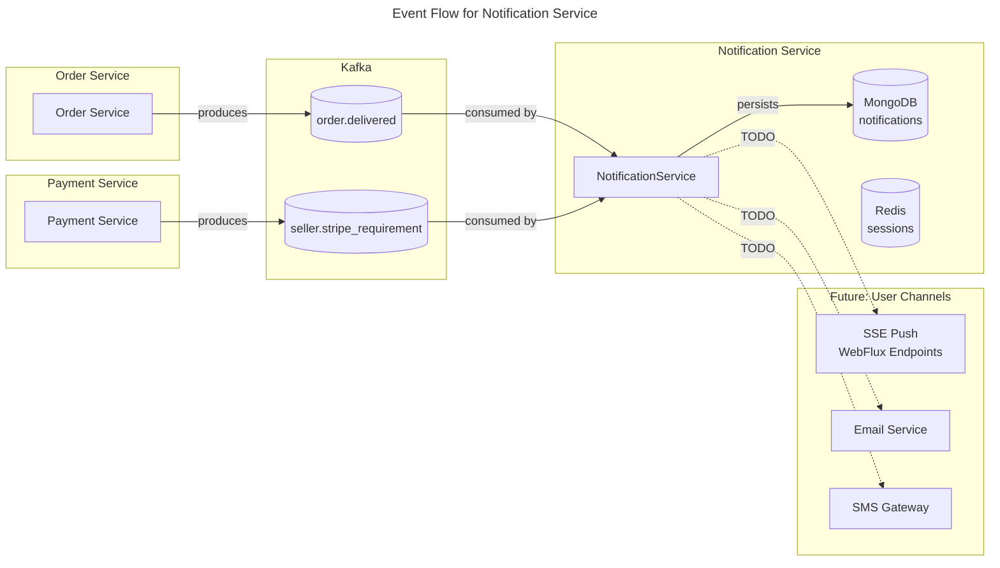

# C4 Code Level: Notification Service

## Overview

- **Name**: Notification Service
- **Description**: Real-time notification service using Spring WebFlux (reactive stack) for Server-Sent Events (SSE) push, plus email/SMS notification dispatching. Listens to Kafka events from other services and persists notification records in MongoDB. Uses Redis for reactive session management.
- **Location**: `D:\dev\stealing-from-paradise\backend\notification-service\`
- **Language**: Java 25 + Spring Boot 4.0.4 (WebFlux reactive stack)
- **Purpose**: Deliver real-time notifications to buyers and sellers via SSE; send email/SMS notifications; persist notification history in MongoDB; consume domain events from Kafka (order lifecycle, payment/refund status, Stripe compliance, flash sale sessions).

## Code Elements

### Application Entry Point

#### `NotificationServiceApplication`

- **Description**: Spring Boot application entry point. Enables Eureka service discovery for registration with the service registry.
- **Location**: `D:\dev\stealing-from-paradise\backend\notification-service\src\main\java\com\flashsale\notificationservice\NotificationServiceApplication.java`
- **Annotations**:
  - `@SpringBootApplication`
  - `@EnableDiscoveryClient`
- **Method**:
  - `main(String[] args): void` -- Bootstraps the Spring application context.

---

### Configuration Layer

#### `SecurityConfig`

- **Description**: Reactive security configuration for the notification service. Delegates the actual `SecurityWebFilterChain` bean to `WebFluxSecurityConfig` from the `common-lib` module, which provides a stateless JWT-based security setup with CSRF disabled, security headers enabled (X-Frame-Options DENY, X-Content-Type-Options, HSTS 365 days with subdomains, Referrer-Policy strict-origin-when-cross-origin, Permissions-Policy blocking geolocation/microphone/camera/payment), and all exchanges permitted (authorization handled via `@PreAuthorize` method-level annotations).
- **Location**: `D:\dev\stealing-from-paradise\backend\notification-service\src\main\java\com\flashsale\notificationservice\config\SecurityConfig.java`
- **Annotations**: `@Configuration`, `@EnableWebFluxSecurity`
- **Dependencies**: `com.flashsale.commonlib.config.WebFluxSecurityConfig`

---

### Domain Layer

#### `Notification` (Entity / Document)

- **Description**: MongoDB document model for notifications. Stored in the `notifications` collection with a compound index on `(user_id, is_read)` for efficient unread-notification lookups and a TTL index on `createdAt` that auto-expires documents after 90 days.
- **Location**: `D:\dev\stealing-from-paradise\backend\notification-service\src\main\java\com\flashsale\notificationservice\domain\model\Notification.java`
- **Annotations**: `@Document(collection = "notifications")`, `@CompoundIndex(name = "idx_user_read", def = "{'user_id': 1, 'is_read': 1}")`, `@Data`, `@Builder`, `@NoArgsConstructor`, `@AllArgsConstructor`
- **Fields**:

| Field | Type | Description |
|---|---|---|
| `id` | `String` | MongoDB document ID (primary key, `@Id`) |
| `userId` | `Long` | Target user ID (`@Indexed`) |
| `type` | `String` | Notification type: `ORDER_CREATED`, `PAYMENT_SUCCESS`, `REFUND_APPROVED`, etc. |
| `title` | `String` | Notification title |
| `body` | `String` | Notification body content |
| `metadata` | `String` | JSON string with additional contextual data |
| `isRead` | `Boolean` | Read/unread flag (default: `false`) |
| `createdAt` | `LocalDateTime` | Creation timestamp; TTL index expires documents after 90 days |

- **Dependencies**: Spring Data MongoDB (`@Id`, `@Document`, `@Indexed`, `@CompoundIndex`), Lombok (`@Data`, `@Builder`, `@NoArgsConstructor`, `@AllArgsConstructor`)

---

#### `NotificationRepository`

- **Description**: Spring Data MongoDB repository interface for `Notification` documents. Provides derived query methods for fetching notifications by user, sorted by recency, and filtering unread notifications.
- **Location**: `D:\dev\stealing-from-paradise\backend\notification-service\src\main\java\com\flashsale\notificationservice\domain\repository\NotificationRepository.java`
- **Annotations**: `@Repository`
- **Extends**: `MongoRepository<Notification, String>`
- **Methods**:

```java
List<Notification> findByUserIdOrderByCreatedAtDesc(Long userId)
```
- Returns all notifications for a user, most recent first.

```java
List<Notification> findByUserIdAndIsReadFalse(Long userId)
```
- Returns only unread notifications for a user.

- **Dependencies**: Spring Data MongoDB (`MongoRepository`), `Notification` entity

---

### Service Layer

#### `NotificationService`

- **Description**: Core service class that consumes Kafka domain events and dispatches notifications. Currently handles two event types: order delivery notifications (SSE push to buyer) and seller Stripe compliance requirements (SSE/email/push to seller). Uses Jackson `ObjectMapper` for JSON deserialization of Kafka message payloads. Implements a placeholder `sendNotification` method for future SSE integration.
- **Location**: `D:\dev\stealing-from-paradise\backend\notification-service\src\main\java\com\flashsale\notificationservice\service\NotificationService.java`
- **Annotations**: `@Service`, `@RequiredArgsConstructor`, `@Slf4j`
- **Fields**:
  - `objectMapper: ObjectMapper` -- Jackson `ObjectMapper` for deserializing Kafka message payloads.

- **Methods**:

```java
@KafkaListener(topics = KafkaTopics.ORDER_DELIVERED, groupId = "notification-service-group")
void onOrderDelivered(String message)
```
- Consumes `order.delivered` events from Kafka.
- Deserializes the message into `OrderDeliveredPayload`.
- Logs the event with `orderId`.
- **TODO**: Send SSE notification to the buyer.

```java
@KafkaListener(topics = KafkaTopics.SELLER_STRIPE_REQUIREMENT, groupId = "notification-service-group")
void onSellerStripeRequirement(String message)
```
- Consumes `seller.stripe_requirement` events from Kafka.
- Deserializes the message into `SellerStripeRequirementPayload`.
- Logs the event with `sellerId`, `requirementType`, and `requirementReason`.
- **TODO**: Send SSE/email/push notification to the seller.

```java
void sendNotification(String userId, String message)
```
- Placeholder method for pushing a notification to a specific user.
- **TODO**: Implement SSE push via WebFlux `Sinks.Many` or similar reactive mechanism.

---

### Application Configuration

#### `application.yml`

- **Location**: `D:\dev\stealing-from-paradise\backend\notification-service\src\main\resources\application.yml`
- **Server Port**: `8087`
- **Spring Application Name**: `notification-service`
- **Virtual Threads**: Enabled (`spring.threads.virtual.enabled: true`)
- **Jackson**: Fails silently on unknown properties; excludes null values from serialization.
- **MongoDB**: Host `localhost:27017`, database `fs_notification`, authentication database `admin`, credentials via environment variables.
- **Redis**: Host `localhost:6379`.
- **Kafka**: Bootstrap `localhost:9092`, consumer group `notification-service-group`, auto-offset-reset `earliest`, manual commit (`enable-auto-commit: false`), trusted packages `com.flashsale.*`.
- **Eureka**: Registry URL `http://localhost:8761/eureka/`, 30s fetch interval, 40s initial replication interval, registration enabled.

#### `application-prod.yml`

- **Location**: `D:\dev\stealing-from-paradise\backend\notification-service\src\main\resources\application-prod.yml`
- **Logging**: INFO level for application; WARN for MongoDB and Kafka; dev-data disabled.

---

## Dependencies

### Internal Dependencies (common-lib)

| Artifact | Package | Usage |
|---|---|---|
| `common-lib` (0.0.1-SNAPSHOT) | `com.flashsale.commonlib` | Shared library providing: |

| Fully Qualified Class | Location | Used By |
|---|---|---|
| `com.flashsale.commonlib.event.KafkaTopics` | `backend/common-lib/src/main/java/com/flashsale/commonlib/event/KafkaTopics.java` | `NotificationService` -- topic constants `ORDER_DELIVERED` and `SELLER_STRIPE_REQUIREMENT` |
| `com.flashsale.commonlib.event.payload.OrderDeliveredPayload` | `backend/common-lib/src/main/java/com/flashsale/commonlib/event/payload/OrderDeliveredPayload.java` | `NotificationService.onOrderDelivered()` -- event payload fields: `orderId`, `buyerId`, `sellerId`, `totalAmount`, `autoDelivered` |
| `com.flashsale.commonlib.event.payload.SellerStripeRequirementPayload` | `backend/common-lib/src/main/java/com/flashsale/commonlib/event/payload/SellerStripeRequirementPayload.java` | `NotificationService.onSellerStripeRequirement()` -- event payload fields: `sellerId`, `stripeAccountId`, `requirementType`, `requirementReason`, `accountLinkUrl`, `accountLinkExpiresAt` |
| `com.flashsale.commonlib.config.WebFluxSecurityConfig` | `backend/common-lib/src/main/java/com/flashsale/commonlib/config/WebFluxSecurityConfig.java` | `SecurityConfig` -- provides the `SecurityWebFilterChain` bean for reactive security |
| `com.flashsale.commonlib.config.ReactiveSecurityContextConfig` | `backend/common-lib/src/main/java/com/flashsale/commonlib/config/ReactiveSecurityContextConfig.java` | Reactive security context helper (available for use) |

### External Dependencies

| Dependency | Version/Scope | Purpose |
|---|---|---|
| `spring-boot-starter-webflux` | Spring Boot 4.0.4 | Reactive web framework (Netty) for SSE push endpoints |
| `spring-boot-starter-data-mongodb-reactive` | Spring Boot 4.0.4 | Reactive MongoDB driver for notification persistence |
| `spring-boot-starter-data-redis-reactive` | Spring Boot 4.0.4 | Reactive Redis client for session management |
| `spring-kafka` | Spring Kafka | Kafka consumer for receiving domain events |
| `spring-cloud-starter-netflix-eureka-client` | Spring Cloud | Service discovery registration |
| `spring-boot-starter-actuator` | Spring Boot 4.0.4 | Health checks, metrics, and management endpoints |
| `lombok` | Provided | Boilerplate reduction (`@Data`, `@Builder`, `@RequiredArgsConstructor`, `@Slf4j`) |
| `reactor-test` | Test | Reactive streams testing utilities |

### Infrastructure Dependencies

| Service | Purpose |
|---|---|
| **MongoDB** (port 27017) | Persistent storage for notification documents; TTL index auto-expires old records after 90 days |
| **Redis** (port 6379) | Reactive session caching (Spring Session with Redis) |
| **Kafka** (port 9092) | Event source: consumes `order.delivered`, `seller.stripe_requirement`, and future domain events |
| **Eureka** (port 8761) | Service registration and discovery |

---

## Kafka Consumer Topics

The notification service currently subscribes to these topics (both use consumer group `notification-service-group`):

| Kafka Topic | KafkaTopics Constant | Payload Class | Consumer Method | Source Service |
|---|---|---|---|---|
| `order.delivered` | `KafkaTopics.ORDER_DELIVERED` | `OrderDeliveredPayload` | `onOrderDelivered()` | Order Service |
| `seller.stripe_requirement` | `KafkaTopics.SELLER_STRIPE_REQUIREMENT` | `SellerStripeRequirementPayload` | `onSellerStripeRequirement()` | Payment Service |

---

## Relationships

### Module Structure Diagram

```mermaid
---
title: Module Structure for Notification Service
---
classDiagram
    namespace NotificationService {
        class NotificationServiceApplication {
            <<entry>>
            +main(String[] args) void
        }
        class SecurityConfig {
            <<configuration>>
            +WebFluxSecurityConfig from common-lib
        }
        class NotificationService {
            <<service>>
            -ObjectMapper objectMapper
            +onOrderDelivered(String message) void
            +onSellerStripeRequirement(String message) void
            +sendNotification(String userId, String message) void
        }
        class Notification {
            <<document>>
            +String id
            +Long userId
            +String type
            +String title
            +String body
            +String metadata
            +Boolean isRead
            +LocalDateTime createdAt
        }
        class NotificationRepository {
            <<repository>>
            +findByUserIdOrderByCreatedAtDesc(Long userId) List~Notification~
            +findByUserIdAndIsReadFalse(Long userId) List~Notification~
        }
    }

    namespace common_lib {
        class WebFluxSecurityConfig {
            <<configuration>>
            +springSecurityFilterChain(http) SecurityWebFilterChain
        }
        class KafkaTopics {
            <<utility>>
            +ORDER_DELIVERED String
            +SELLER_STRIPE_REQUIREMENT String
        }
        class OrderDeliveredPayload {
            <<event>>
            +Long orderId
            +String buyerId
            +String sellerId
            +Long totalAmount
            +boolean autoDelivered
        }
        class SellerStripeRequirementPayload {
            <<event>>
            +Long sellerId
            +String stripeAccountId
            +String requirementType
            +String requirementReason
            +String accountLinkUrl
            +Long accountLinkExpiresAt
        }
    }

    SecurityConfig --> WebFluxSecurityConfig : delegates
    NotificationService --> KafkaTopics : reads topic constants
    NotificationService --> OrderDeliveredPayload : deserializes
    NotificationService --> SellerStripeRequirementPayload : deserializes
    NotificationRepository --> Notification : persists
    NotificationService --> NotificationRepository : writes notifications
```

### Kafka Event Flow Diagram



### Class Dependency Diagram

```mermaid
---
title: Class Dependency Graph for Notification Service
---
flowchart TB
    subgraph "Notification Service Application"
        APP[NotificationServiceApplication]

        subgraph "Config Layer"
            SC[SecurityConfig]
        end

        subgraph "Service Layer"
            NS[NotificationService]
        end

        subgraph "Domain Layer"
            N[Notification]
            NR[NotificationRepository]
        end
    end

    subgraph "common-lib"
        WFS[WebFluxSecurityConfig]
        KT[KafkaTopics]
        ODP[OrderDeliveredPayload]
        SSR_PAYLOAD[SellerStripeRequirementPayload]
    end

    subgraph "Infrastructure"
        KAFKA[Kafka Broker]
        MONGO[MongoDB]
        EUREKA[Eureka Server]
    end

    APP -->|@EnableDiscoveryClient| EUREKA
    SC -->|delegates to| WFS
    NS -->|reads| KT
    NS -->|deserializes| ODP
    NS -->|deserializes| SSR_PAYLOAD
    NS -->|persists to| NR
    NR --> N
    NR -->|MongoRepository| MONGO
    NS -->|@KafkaListener| KAFKA
```

---

## Future / TODO Items

Based on the codebase analysis, these areas are stubbed out:

1. **SSE Push Endpoints**: The `NotificationService.sendNotification()` method is a placeholder. A WebFlux controller with `Sinks.Many` or `Flux<ServerSentEvent>` should be added to push real-time notifications to connected clients.
2. **Email Integration**: No email service integration is present yet.
3. **SMS Integration**: No SMS gateway integration is present yet.
4. **Additional Kafka Topics**: The `KafkaTopics` class defines many domain events (payment failures, refund lifecycle, flash sale sessions) that this service could consume but does not yet.
5. **Reactive Repository Usage**: `NotificationRepository` extends `MongoRepository` (blocking) rather than `ReactiveMongoRepository`. For full reactive benefits, it should be migrated.

## Notes

- The service uses the **reactive stack** (Spring WebFlux) but the repository currently uses blocking MongoDB driver (`MongoRepository`). The `pom.xml` includes the reactive MongoDB dependency (`spring-boot-starter-data-mongodb-reactive`), suggesting the migration to `ReactiveMongoRepository` is planned.
- The consumer group ID is `notification-service-group`, configured both in `@KafkaListener` annotations and in the `application.yml` `spring.kafka.consumer.group-id` property (which resolves to `notification-service-group` via `${spring.application.name}-group`).
- Kafka consumers use `enable-auto-commit: false` (manual offset management) with `auto-offset-reset: earliest`.
- The service runs on port **8087**.
- TTL-based document expiration in MongoDB automatically purges notifications after **90 days**.
- Virtual threads are enabled (`spring.threads.virtual.enabled: true`) but are mostly relevant for blocking I/O operations, not the reactive WebFlux path.
