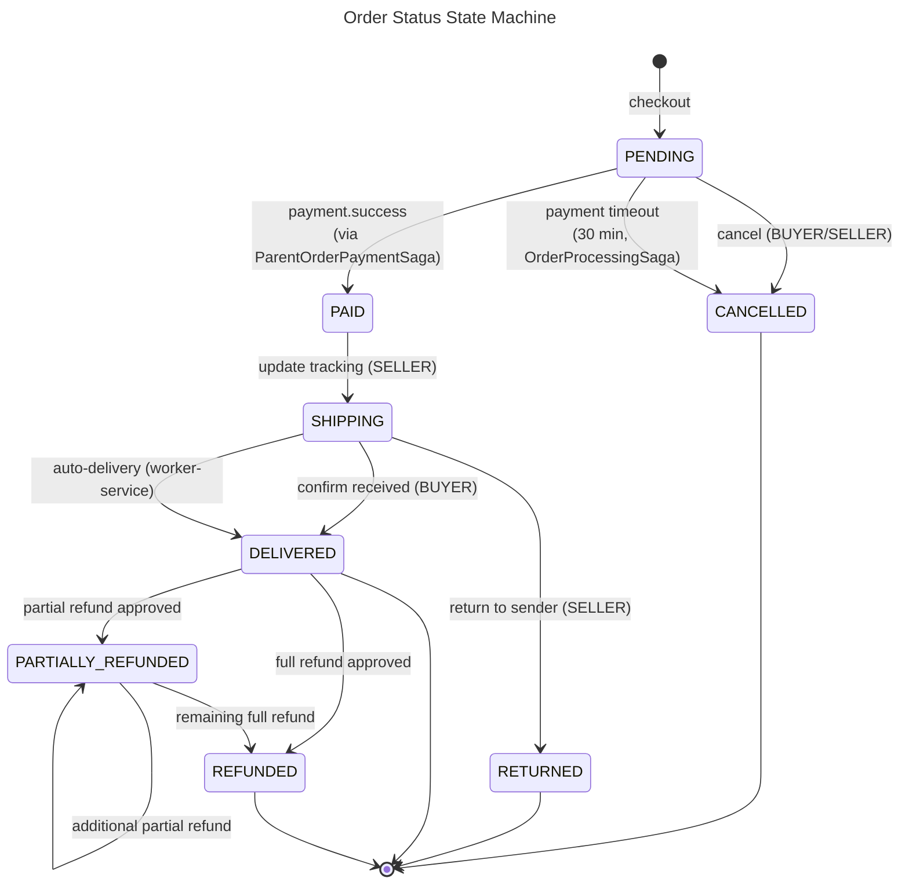
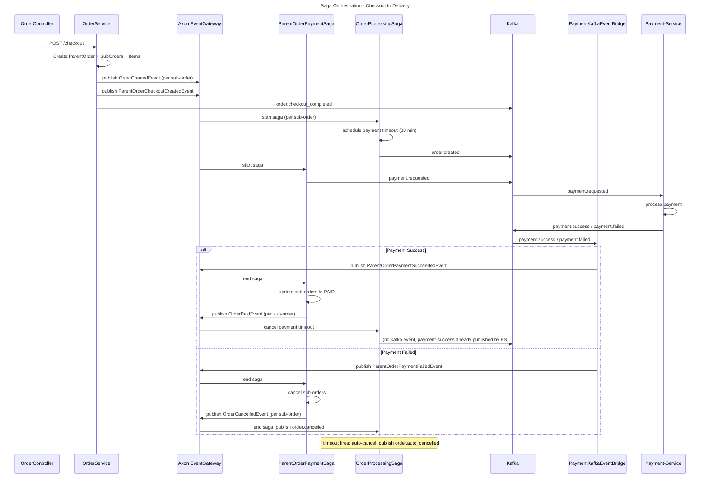

# C4 Code Level: Order Service

## Overview

- **Name**: Order Service
- **Description**: Axon CQRS-based order management service handling order creation, checkout, RTS (Return To Sender), and OrderProcessingSaga orchestration. Uses PostgreSQL for persistence and Kafka for events.
- **Location**: `D:\dev\stealing-from-paradise\backend\order-service\`
- **Language**: Java 25 + Spring Boot 4.0.4 + Axon Framework 4.13.0
- **Purpose**: Order lifecycle management with CQRS event sourcing. Manages parent orders (multi-vendor checkout groupings), sub-orders (per-seller), order items, refund workflows, and shipping lifecycle. Implements Kafka request-reply for inter-service communication.

---

## Code Elements

### Application Entry Point

- **`OrderServiceApplication`**
  - Description: Spring Boot application entry point. Scans `com.flashsale` base packages for component discovery. Enables service discovery via Eureka and loads `DevDataProperties` configuration.
  - Location: `backend/order-service/src/main/java/com/flashsale/orderservice/OrderServiceApplication.java`
  - Annotations: `@SpringBootApplication(scanBasePackages = {"com.flashsale"})`, `@EnableDiscoveryClient`, `@EnableConfigurationProperties(DevDataProperties.class)`
  - Dependencies: `DevDataProperties` (common-lib), Spring Cloud Discovery Client

---

### Configuration Classes

- **`AxonConfig`**
  - Description: Configures Axon Framework's `TokenStore` and `SagaStore` with Flyway-managed table schemas. Uses `JpaTokenStore` with XStream serializer for tracking tokens (BYTEA columns). Uses `JpaSagaStore` for saga persistence. Bridges Axon's `EntityManagerProvider` to Spring's `EntityManager`.
  - Location: `backend/order-service/src/main/java/com/flashsale/orderservice/config/AxonConfig.java`
  - Beans: `tokenStore()`, `sagaStore()`
  - Inner class: `SpringEntityManagerProvider` implements `org.axonframework.common.jpa.EntityManagerProvider`
  - Dependencies: `EntityManager`, `@Qualifier("xStreamSerializer") Serializer`, `PlatformTransactionManager`
  - Depends-on: `ByteaPostgreSQLDialect` (common-lib)

- **`KafkaConfig`**
  - Description: Configures Kafka producer and consumer for the order service. Producer uses idempotence with `acks=all`. Consumer uses manual batch acknowledgement with `EARLIEST` auto-offset reset. Active only outside test profile.
  - Location: `backend/order-service/src/main/java/com/flashsale/orderservice/config/KafkaConfig.java`
  - Profile: `!test`
  - Beans: `producerFactory()`, `kafkaTemplate()`, `consumerFactory()`, `kafkaListenerContainerFactory()`
  - Dependencies: `spring.kafka.bootstrap-servers`, `spring.kafka.consumer.group-id`

- **`KafkaTopicConfig`**
  - Description: Declares all Kafka topics as Spring beans so they are auto-created via `KafkaAdmin` at startup, even when `KAFKA_AUTO_CREATE_TOPICS_ENABLE=false`. Each topic has 3 partitions, 1 replica.
  - Location: `backend/order-service/src/main/java/com/flashsale/orderservice/config/KafkaTopicConfig.java`
  - Beans: `kafkaAdmin()`, `paymentSuccess()`, `paymentFailed()`, `refundAdminApproved()`, `refundRejected()`, `refundRtsCompleted()`, `refundCreated()`, `orderCartItemsResponse()`, `orderAddressResponse()`, `orderRefundsResponse()`, `orderPaymentStatusResponse()`, `orderCreated()`, `paymentRequested()`, `orderCheckoutCompleted()`, `orderCancelled()`, `orderAutoCancelled()`, `sellerOrderCancelled()`, `orderShipped()`, `orderDelivered()`, `orderReturnedRts()`, `refundRequested()`, `refundFullRequested()`, `orderCartItemsRequest()`, `orderAddressRequest()`, `orderRefundsRequest()`, `orderPaymentStatusRequest()`, `orderStockCheckRequest()`, `orderStockCheckResponse()`
  - Dependencies: `KafkaTopics` (common-lib), `KafkaAdmin`

- **`SecurityConfig`**
  - Description: Spring Security configuration. Disables CSRF, session management (STATELESS), HTTP basic, form login, and anonymous access. Registers `JwtTokenDecoderFilter` before `UsernamePasswordAuthenticationFilter` to decode X-User-* headers from API Gateway into `SecurityContext`.
  - Location: `backend/order-service/src/main/java/com/flashsale/orderservice/config/SecurityConfig.java`
  - Beans: `jwtTokenDecoderFilterRegistration()`, `securityFilterChain(HttpSecurity)`
  - Dependencies: `JwtTokenDecoderFilter` (common-lib)

- **`SecurityFilterConfig`**
  - Description: Imports `JwtTokenDecoderFilter` from common-lib so it gets registered as a Servlet Filter in order-service's filter chain.
  - Location: `backend/order-service/src/main/java/com/flashsale/orderservice/config/SecurityFilterConfig.java`
  - Annotation: `@Import(JwtTokenDecoderFilter.class)`

- **`OrderDevDataLoader`**
  - Description: Seeds 10 parent orders with sub-orders and order items for development profile. Supports RESET mode to wipe data before re-seeding. Creates orders in states: COMPLETED, SHIPPED, CONFIRMED, DELIVERED, PENDING, CANCELLED, SHIPPING.
  - Location: `backend/order-service/src/main/java/com/flashsale/orderservice/config/OrderDevDataLoader.java`
  - Profile: `dev`, conditional on `dev-data.enabled=true`
  - Implements: `CommandLineRunner`
  - Dependencies: `ParentOrderRepository`, `OrderRepository`, `OrderItemRepository`, `DevDataProperties`, `EntityManager`

---

### Domain Models (JPA Entities)

- **`ParentOrder`**
  - Description: Root aggregate for a multi-vendor purchase transaction. Groups multiple sub-orders (one per seller) under a single checkout. Uses optimistic locking via `@Version`.
  - Location: `backend/order-service/src/main/java/com/flashsale/orderservice/domain/model/ParentOrder.java`
  - Table: `parent_orders`
  - Fields: `id` (Long, auto), `customerId` (Long), `totalAmt` (BigDecimal), `finalAmt` (BigDecimal), `createdAt` (LocalDateTime), `updatedAt` (LocalDateTime), `orders` (List<Order>, `@OneToMany` joined on `parent_order_id`), `version` (Integer, `@Version`)
  - Lifecycle hooks: `@PrePersist`, `@PreUpdate`

- **`Order`**
  - Description: Sub-order entity representing one seller's portion of a checkout. Tracks lifecycle status from PENDING through PAID, SHIPPING, DELIVERED, CANCELLED, RETURNED, PARTIALLY_REFUNDED, REFUNDED. Contains shipping address as JSONB. Uses optimistic locking.
  - Location: `backend/order-service/src/main/java/com/flashsale/orderservice/domain/model/Order.java`
  - Table: `orders`
  - Indexes: `customer_id`, `seller_id`, `parent_order_id`, `status`
  - Fields: `id` (Long, auto), `parentOrderId` (Long), `sellerId` (Long), `orderCode` (String, unique), `customerId` (Long), `totalAmt` (BigDecimal), `finalAmt` (BigDecimal), `status` (String, default "PENDING"), `cancelledBy` (String, nullable), `cancelReason` (String, TEXT), `isFlashSale` (Boolean, default false), `shippingAddress` (String, JSONB via `@JdbcTypeCode(SqlTypes.JSON)`), `trackingNumber` (String), `shippingDeadline` (LocalDateTime), `version` (Integer, `@Version`), `createdAt` (LocalDateTime), `updatedAt` (LocalDateTime), `items` (List<OrderItem>, `@OneToMany`)
  - Lifecycle hooks: `@PrePersist`, `@PreUpdate`

- **`OrderItem`**
  - Description: Line item within a sub-order. Records a snapshot of product info at purchase time (name, price, image). Tracks refunded quantity for partial refunds.
  - Location: `backend/order-service/src/main/java/com/flashsale/orderservice/domain/model/OrderItem.java`
  - Table: `order_items`
  - Indexes: `order_id`
  - Fields: `id` (Long, auto), `order` (Order, `@ManyToOne` LAZY), `skuCode` (String), `variantId` (String), `nameSnapshot` (String), `imageSnapshot` (String), `priceSnapshot` (BigDecimal), `quantity` (Integer), `refundedQuantity` (Integer, default 0), `fsItemId` (Long, nullable, flash sale reference), `createdAt` (LocalDateTime)
  - Lifecycle hooks: `@PrePersist`

---

### Domain Repositories

- **`ParentOrderRepository`**
  - Description: JPA repository for `ParentOrder` entity with pessimistic locking for payment saga.
  - Location: `backend/order-service/src/main/java/com/flashsale/orderservice/domain/repository/ParentOrderRepository.java`
  - Methods:
    - `findByIdAndCustomerId(Long id, Long customerId): Optional<ParentOrder>`
    - `findByOrderCode(String orderCode): Optional<ParentOrder>`
    - `findByIdWithPessimisticLock(Long id): Optional<ParentOrder>` -- uses `@Lock(PESSIMISTIC_WRITE)` to prevent `ObjectOptimisticLockingFailureException` during concurrent payment saga transactions
    - `findByIdAndCustomerIdWithOrders(Long id, Long customerId): Optional<ParentOrder>` -- uses `LEFT JOIN FETCH po.orders`

- **`OrderRepository`**
  - Description: JPA repository for `Order` entity with filtered queries and pessimistic locking.
  - Location: `backend/order-service/src/main/java/com/flashsale/orderservice/domain/repository/OrderRepository.java`
  - Methods:
    - `findByOrderCode(String orderCode): Optional<Order>`
    - `findByIdAndCustomerId(Long id, Long customerId): Optional<Order>`
    - `findByIdAndSellerId(Long id, Long sellerId): Optional<Order>`
    - `findByCustomerIdWithFilters(Long customerId, String status, LocalDateTime fromDate, LocalDateTime toDate, Pageable pageable): Page<Order>`
    - `findAllByParentOrderIdAndStatus(Long parentOrderId, String status): List<Order>`
    - `findAllByParentOrderIdAndStatusWithLock(Long parentOrderId, String status): List<Order>` -- uses `@Lock(PESSIMISTIC_WRITE)`
    - `findAllByParentOrderId(Long parentOrderId): List<Order>`
    - `findBySellerIdWithFilters(Long sellerId, String status, LocalDateTime fromDate, LocalDateTime toDate, Pageable pageable): Page<Order>`
    - `countBySellerIdAndCreatedAtAfter(Long sellerId, LocalDateTime after): long`
    - `countBySellerIdAndStatus(Long sellerId, String status): long`
    - `sumRevenueForSellerSince(Long sellerId, LocalDateTime since): BigDecimal`

- **`OrderItemRepository`**
  - Description: JPA repository for `OrderItem` entity.
  - Location: `backend/order-service/src/main/java/com/flashsale/orderservice/domain/repository/OrderItemRepository.java`
  - Methods:
    - `findAllByOrderId(Long orderId): List<OrderItem>`

---

### Axon Commands

- **`CreateOrderCommand`**
  - Description: Axon command to create a new order aggregate. Annotated with `@TargetAggregateIdentifier` on `orderId`.
  - Location: `backend/order-service/src/main/java/com/flashsale/orderservice/axon/command/CreateOrderCommand.java`
  - Fields: `orderId` (String), `buyerId` (String), `sellerId` (String), `items` (List<OrderItemDto>), `totalAmount` (Long), `isFlashSale` (boolean), `correlationId` (String)
  - Inner DTO: `OrderItemDto` with fields `skuCode`, `name`, `price`, `quantity`

- **`CancelOrderCommand`**
  - Description: Axon command to cancel an existing order. Annotated with `@TargetAggregateIdentifier` on `orderId`.
  - Location: `backend/order-service/src/main/java/com/flashsale/orderservice/axon/command/CancelOrderCommand.java`
  - Fields: `orderId` (String), `reason` (String), `cancelledBy` (String -- "BUYER" | "SELLER" | "SYSTEM")

---

### Axon Events

- **`OrderCreatedEvent`**
  - Description: Published when a sub-order is created during checkout. Triggers `OrderProcessingSaga` start.
  - Location: `backend/order-service/src/main/java/com/flashsale/orderservice/axon/event/OrderCreatedEvent.java`
  - Fields: `orderId` (Long), `parentOrderId` (Long), `userId` (Long), `sellerId` (Long), `orderCode` (String), `totalAmount` (BigDecimal), `isFlashSale` (boolean)

- **`OrderCancelledEvent`**
  - Description: Published when a sub-order is cancelled. Ends the `OrderProcessingSaga`.
  - Location: `backend/order-service/src/main/java/com/flashsale/orderservice/axon/event/OrderCancelledEvent.java`
  - Fields: `orderId` (Long), `parentOrderId` (Long), `userId` (Long), `sellerId` (Long), `cancelledBy` (String -- "BUYER" | "SELLER" | "SYSTEM" | "PAYMENT_FAILED"), `cancelReason` (String), `totalAmount` (BigDecimal)

- **`OrderPaidEvent`**
  - Description: Published when payment succeeds for a sub-order. Transitions saga from PENDING to PAID state (cancels payment timeout).
  - Location: `backend/order-service/src/main/java/com/flashsale/orderservice/axon/event/OrderPaidEvent.java`
  - Fields: `orderId` (Long), `parentOrderId` (Long), `userId` (Long), `sellerId` (Long), `amount` (BigDecimal)

- **`OrderShippedEvent`**
  - Description: Published when a seller updates tracking number. Transitions to SHIPPING state and schedules shipping deadline.
  - Location: `backend/order-service/src/main/java/com/flashsale/orderservice/axon/event/OrderShippedEvent.java`
  - Fields: `orderId` (Long), `userId` (Long), `sellerId` (Long), `trackingNumber` (String), `carrier` (String), `shippingDeadline` (LocalDateTime)

- **`OrderDeliveredEvent`**
  - Description: Published when buyer confirms receipt or auto-delivery fires. Ends the `OrderProcessingSaga`.
  - Location: `backend/order-service/src/main/java/com/flashsale/orderservice/axon/event/OrderDeliveredEvent.java`
  - Fields: `orderId` (Long), `userId` (Long), `sellerId` (Long), `totalAmount` (BigDecimal), `deliveredBy` (String -- "BUYER" | "SYSTEM")

- **`OrderReturnedEvent`**
  - Description: Published when a seller confirms Return To Sender (RTS). Ends the `OrderProcessingSaga`.
  - Location: `backend/order-service/src/main/java/com/flashsale/orderservice/axon/event/OrderReturnedEvent.java`
  - Fields: `orderId` (Long), `parentOrderId` (Long), `userId` (Long), `sellerId` (Long), `amount` (BigDecimal), `returnTrackingNumber` (String), `evidenceCount` (int)

- **`ParentOrderCheckoutCreatedEvent`**
  - Description: Published after all sub-orders are created. Triggers `ParentOrderPaymentSaga` to request payment.
  - Location: `backend/order-service/src/main/java/com/flashsale/orderservice/axon/event/ParentOrderCheckoutCreatedEvent.java`
  - Fields: `parentOrderId` (Long), `userId` (Long), `totalAmount` (BigDecimal)

- **`ParentOrderPaymentSucceededEvent`**
  - Description: Published when `PaymentKafkaEventBridge` receives `payment.success` from payment-service. Triggers `ParentOrderPaymentSaga` to mark sub-orders as PAID.
  - Location: `backend/order-service/src/main/java/com/flashsale/orderservice/axon/event/ParentOrderPaymentSucceededEvent.java`
  - Fields: `parentOrderId` (Long)

- **`ParentOrderPaymentFailedEvent`**
  - Description: Published when `PaymentKafkaEventBridge` receives `payment.failed` from payment-service. Triggers `ParentOrderPaymentSaga` to cancel sub-orders.
  - Location: `backend/order-service/src/main/java/com/flashsale/orderservice/axon/event/ParentOrderPaymentFailedEvent.java`
  - Fields: `parentOrderId` (Long), `reason` (String)

---

### Axon Sagas

- **`OrderProcessingSaga`**
  - Description: Per-sub-order saga (one instance per Order entity). Orchestrates the full lifecycle: PENDING -> PAID -> SHIPPING -> DELIVERED (terminal), with automatic cancellation via DeadlineManager for payment timeout (30 min) and shipping deadline (configured per order). Publishes all order lifecycle Kafka events to downstream services.
  - Location: `backend/order-service/src/main/java/com/flashsale/orderservice/axon/saga/OrderProcessingSaga.java`
  - Annotations: `@Saga`, `@StartSaga`, `@EndSaga`, `@SagaEventHandler`, `@DeadlineHandler`
  - State: `orderId`, `parentOrderId`, `userId`, `sellerId`, `totalAmount`, `isFlashSale`, `paymentDeadlineId`, `shippingDeadlineId`
  - Transient dependencies: `DeadlineManager`, `KafkaTemplate<String, String>`, `ObjectMapper`, `OrderRepository`
  - Event handlers:
    - `on(OrderCreatedEvent)` -- start saga, schedule payment timeout, publish `order.created`
    - `on(OrderPaidEvent)` -- cancel payment timeout
    - `on(OrderShippedEvent)` -- schedule shipping deadline, publish `order.shipped`
    - `on(OrderDeliveredEvent)` -- @EndSaga, cancel shipping deadline, publish `order.delivered`
    - `on(OrderCancelledEvent)` -- @EndSaga, cancel all deadlines, publish `order.cancelled` and optionally `seller.order_cancelled`
    - `on(OrderReturnedEvent)` -- @EndSaga, publish `order.returned_rts`
  - Deadline handlers:
    - `onPaymentTimeout()` -- auto-cancel order (PENDING -> CANCELLED), publish `order.auto_cancelled`, end saga
    - `onShippingTimeout()` -- log warning (worker-service JOB-22 handles auto-delivery)
  - Kafka topics published: `ORDER_CREATED`, `ORDER_SHIPPED`, `ORDER_DELIVERED`, `ORDER_CANCELLED`, `ORDER_AUTO_CANCELLED`, `SELLER_ORDER_CANCELLED`, `ORDER_RETURNED_RTS`

- **`ParentOrderPaymentSaga`**
  - Description: Per-parent-order saga that orchestrates payment for the entire checkout. On `ParentOrderCheckoutCreatedEvent`, publishes `payment.requested` to payment-service. On `ParentOrderPaymentSucceededEvent`, updates all PENDING sub-orders to PAID and publishes per-sub-order `OrderPaidEvent`. On `ParentOrderPaymentFailedEvent`, cancels all PENDING sub-orders with `PAYMENT_FAILED` reason.
  - Location: `backend/order-service/src/main/java/com/flashsale/orderservice/axon/saga/ParentOrderPaymentSaga.java`
  - Annotations: `@Saga`, `@StartSaga`, `@EndSaga`, `@SagaEventHandler`, `@Transactional`
  - Transient dependencies: `KafkaTemplate<String, String>`, `ObjectMapper`, `OrderRepository`, `EventGateway`, `ParentOrderRepository`
  - Event handlers:
    - `on(ParentOrderCheckoutCreatedEvent)` -- @StartSaga, collect sub-orders, publish `payment.requested` to Kafka
    - `on(ParentOrderPaymentSucceededEvent)` -- @EndSaga, pessimistic lock parent, update sub-orders to PAID, publish `OrderPaidEvent` per sub-order
    - `on(ParentOrderPaymentFailedEvent)` -- @EndSaga, pessimistic lock parent, cancel sub-orders, publish `OrderCancelledEvent` per sub-order
  - Kafka topics published: `PAYMENT_REQUESTED`

---

### Controllers (REST API)

- **`OrderController`**
  - Description: REST controller for order management operations. Exposes endpoints for checkout, order listing (buyer/seller), order details, cancellation, tracking updates, delivery confirmation, Return To Sender, and seller dashboard.
  - Location: `backend/order-service/src/main/java/com/flashsale/orderservice/controller/OrderController.java`
  - Base path: `/v1`
  - Dependencies: `OrderService`
  - Endpoints:

| Method | Path | Auth | Description |
|--------|------|------|-------------|
| POST | `/v1/orders/checkout` | BUYER | Create order from cart (multi-vendor). Accepts `CheckoutRequest` (addressId + itemIds). Returns `CheckoutResponse` with parent order and sub-orders. |
| GET | `/v1/orders` | BUYER | List buyer orders with status/date filters and pagination. Returns `PageResponse<OrderSummaryResponse>`. |
| GET | `/v1/orders/{orderId}` | Authenticated | Get sub-order detail. Buyer or Seller owner only. Returns `OrderDetailResponse`. |
| GET | `/v1/orders/parent/{parentOrderId}` | BUYER | Get parent order detail with all sub-orders. Buyer owner only. Returns `ParentOrderDetailResponse`. |
| POST | `/v1/orders/{orderId}/cancel` | Authenticated | Cancel order (PENDING only). Buyer or Seller owner. Accepts `CancelOrderRequest`. Returns `CancelOrderResponse`. |
| PUT | `/v1/orders/{orderId}/tracking` | SELLER | Update tracking number (PAID only). Accepts `UpdateTrackingRequest`. Returns `TrackingUpdateResponse`. |
| POST | `/v1/orders/{orderId}/confirm-received` | BUYER | Confirm delivery (SHIPPING only). Returns `ConfirmReceivedResponse`. |
| POST | `/v1/orders/{orderId}/return-to-sender` | SELLER | Return To Sender (SHIPPING only). Multipart form with evidence images. Returns `ReturnToSenderResponse`. |
| GET | `/v1/sellers/me/orders` | SELLER | List seller orders with status/date filters and pagination. Returns `PageResponse<OrderSummaryResponse>`. |
| GET | `/v1/sellers/me/dashboard` | SELLER | Seller dashboard stats (orders today, pending, monthly revenue). Returns `SellerDashboardResponse`. |

- **`RefundController`**
  - Description: REST controller for refund management operations. Handles partial refunds (single and multi-seller), full refunds, refund history queries, and presigned URL generation for evidence upload. Uses Kafka request-reply to communicate with payment-service for refund queries.
  - Location: `backend/order-service/src/main/java/com/flashsale/orderservice/controller/RefundController.java`
  - Base path: `/v1`
  - Dependencies: `OrderRepository`, `OrderItemRepository`, `ParentOrderRepository`, `KafkaReplyService`, `KafkaTemplate<String, String>`, `ObjectMapper`
  - Endpoints:

| Method | Path | Auth | Description |
|--------|------|------|-------------|
| POST | `/v1/orders/{orderId}/refunds` | BUYER | Request partial refund for one sub-order. Validates refundable quantity. Publishes `REFUND_REQUESTED` Kafka event. Returns `RefundCreatedResponse`. |
| POST | `/v1/orders/parent/{parentOrderId}/refund` | BUYER | Request full refund of parent order (all sub-orders DELIVERED within 7 days). Publishes `REFUND_FULL_REQUESTED`. Returns `FullRefundCreatedResponse`. |
| POST | `/v1/orders/parent/{parentOrderId}/refunds/partial` | BUYER | Multi-seller partial refund. Groups refund items by sub-order and publishes N `REFUND_REQUESTED` events. Returns `FullRefundCreatedResponse`. |
| GET | `/v1/orders/{orderId}/refunds` | BUYER/SELLER/ADMIN | List refund history for a sub-order. Uses Kafka request-reply to payment-service. Returns `List<OrderRefundInfo>`. |
| GET | `/v1/orders/{orderId}/refunds/{refundId}` | BUYER/ADMIN | Get refund detail. Returns `OrderRefundInfo`. |
| GET | `/v1/orders/{orderId}/refunds/presigned-url` | BUYER | Get presigned URL for evidence image upload. Returns `PresignedUrlResponse`. |
| GET | `/v1/orders/refunds` | BUYER | List all refunds for buyer with filters. Returns `List<OrderRefundInfo>`. |
| GET | `/v1/orders/parent/{parentOrderId}/refund` | BUYER/ADMIN | Get full refund status for parent order. Returns `FullRefundCreatedResponse`. |

---

### Service Layer

- **`OrderService`**
  - Description: Core business logic service. Handles checkout (multi-vendor), order queries, cancellation, tracking updates, delivery confirmation, Return To Sender, and seller dashboard. Uses Kafka request-reply for inter-service address/cart data. Emits Axon events for saga orchestration.
  - Location: `backend/order-service/src/main/java/com/flashsale/orderservice/service/OrderService.java`
  - Dependencies: `OrderRepository`, `ParentOrderRepository`, `OrderItemRepository`, `KafkaReplyService`, `KafkaTemplate<String, String>`, `ObjectMapper`, `EventGateway`
  - Key methods:

| Method | Visibility | Description |
|--------|-----------|-------------|
| `checkout(Long userId, CheckoutRequest req): CheckoutResponse` | public, @Transactional | Multi-vendor checkout: fetches address + cart items in parallel via Kafka request-reply, creates ParentOrder, creates per-seller sub-orders and items, emits `OrderCreatedEvent` + `ParentOrderCheckoutCreatedEvent` (Axon) + `order.checkout_completed` (Kafka). |
| `getBuyerOrders(Long userId, String status, LocalDateTime from, LocalDateTime to, int page, int size): PageResponse<OrderSummaryResponse>` | public, @Transactional(readOnly) | Paginated buyer order listing with status/date filters. |
| `getOrderDetail(Long orderId, Long userId, String role): OrderDetailResponse` | public, @Transactional(readOnly) | Sub-order detail with access control (buyer or seller owner). |
| `getParentOrderDetail(Long parentOrderId, Long userId): ParentOrderDetailResponse` | public, @Transactional(readOnly) | Parent order detail with orders eager-fetched. Buyer owner only. |
| `cancelOrder(Long orderId, Long userId, String role, CancelOrderRequest req): CancelOrderResponse` | public, @Transactional | Cancel PENDING order. Emits `OrderCancelledEvent`. |
| `updateTracking(Long orderId, Long sellerId, UpdateTrackingRequest req): TrackingUpdateResponse` | public, @Transactional | Set tracking number (PAID -> SHIPPING). Default 3-day shipping deadline. Emits `OrderShippedEvent`. |
| `confirmReceived(Long orderId, Long userId): ConfirmReceivedResponse` | public, @Transactional | Confirm delivery (SHIPPING -> DELIVERED). Emits `OrderDeliveredEvent`. |
| `returnToSender(Long orderId, Long sellerId, ReturnToSenderRequest req): ReturnToSenderResponse` | public, @Transactional | Confirm RTS (SHIPPING -> RETURNED). Validates 1-5 evidence images. Emits `OrderReturnedEvent`. |
| `getSellerOrders(Long sellerId, String status, LocalDateTime from, LocalDateTime to, int page, int size): PageResponse<OrderSummaryResponse>` | public, @Transactional(readOnly) | Paginated seller order listing. |
| `getSellerDashboard(Long sellerId): SellerDashboardResponse` | public, @Transactional(readOnly) | Dashboard stats (orders today, pending, monthly revenue). |

- **`KafkaReplyService`**
  - Description: Implements synchronous Kafka request-reply pattern as a replacement for REST inter-service calls. Sends a request with `correlation_id` to a request topic, stores a `CompletableFuture`, and waits up to 5 seconds for a reply. The `onReply()` Kafka listener matches replies by `correlation_id` and completes the corresponding future.
  - Location: `backend/order-service/src/main/java/com/flashsale/orderservice/service/KafkaReplyService.java`
  - Note: Multi-instance support is not implemented; replies may arrive at the wrong instance in horizontal scaling.
  - Methods:
    - `sendAndReceive(String requestTopic, Map<String, Object> payload): Map<String, Object>` -- send request, wait for reply (5s timeout)
    - `onReply(String message)` -- @KafkaListener on `ORDER_CART_ITEMS_RESPONSE`, `ORDER_ADDRESS_RESPONSE`, `ORDER_REFUNDS_RESPONSE`, `ORDER_REFUND_PRESIGNED_URL_RESPONSE`, `ORDER_PAYMENT_STATUS_RESPONSE`
  - Dependencies: `KafkaTemplate<String, String>`, `ObjectMapper`
  - Thread safety: `ConcurrentHashMap` for pending requests

- **`PaymentKafkaEventBridge`**
  - Description: Bridges Kafka events from payment-service to Axon events. Listens on `payment.success`, `payment.failed`, `refund.admin_approved`, and `refund.rts_completed` topics. For payment events, translates them into `ParentOrderPaymentSucceededEvent` / `ParentOrderPaymentFailedEvent`. For refund approval, updates order status to `PARTIALLY_REFUNDED` or `REFUNDED`.
  - Location: `backend/order-service/src/main/java/com/flashsale/orderservice/service/PaymentKafkaEventBridge.java`
  - Methods:
    - `onPaymentSuccess(String message)` -- @KafkaListener(PAYMENT_SUCCESS), publish `ParentOrderPaymentSucceededEvent`
    - `onPaymentFailed(String message)` -- @KafkaListener(PAYMENT_FAILED), publish `ParentOrderPaymentFailedEvent`
    - `onRefundApproved(String message)` -- @KafkaListener(REFUND_ADMIN_APPROVED), update order status (PARTIALLY_REFUNDED / REFUNDED)
    - `onRefundRtsCompleted(String message)` -- @KafkaListener(REFUND_RTS_COMPLETED), log confirmation
  - Dependencies: `ObjectMapper`, `EventGateway`, `OrderRepository`

---

### Client DTOs (inter-service data transfer)

- **`AddressInfo`**
  - Description: Address information received from Identity Service via Kafka request-reply.
  - Location: `backend/order-service/src/main/java/com/flashsale/orderservice/client/dto/AddressInfo.java`
  - Fields: `addressId` (Long), `userId` (Long), `fullAddress` (String), `provinceId` (Integer), `districtId` (Integer)

- **`CartItemInfo`**
  - Description: Cart item information received from Cart Service via Kafka request-reply.
  - Location: `backend/order-service/src/main/java/com/flashsale/orderservice/client/dto/CartItemInfo.java`
  - Fields: `cartItemId` (String), `skuCode` (String), `variantId` (String), `variantName` (String), `productId` (String), `productName` (String), `imageUrl` (String), `sellerId` (Long), `sellerName` (String), `priceSnapshot` (BigDecimal), `quantity` (Integer), `fsItemId` (Long)

---

### Request DTOs

- **`CheckoutRequest`**
  - Location: `backend/order-service/src/main/java/com/flashsale/orderservice/dto/request/CheckoutRequest.java`
  - Fields: `addressId` (Long, @NotNull), `itemIds` (List<String>, @NotEmpty, @Size 1-50)

- **`CancelOrderRequest`**
  - Location: `backend/order-service/src/main/java/com/flashsale/orderservice/dto/request/CancelOrderRequest.java`
  - Fields: `reason` (String, @NotBlank), `note` (String, optional)

- **`UpdateTrackingRequest`**
  - Location: `backend/order-service/src/main/java/com/flashsale/orderservice/dto/request/UpdateTrackingRequest.java`
  - Fields: `trackingNumber` (String, @NotBlank), `carrier` (String, optional), `note` (String, optional)

- **`ReturnToSenderRequest`**
  - Location: `backend/order-service/src/main/java/com/flashsale/orderservice/dto/request/ReturnToSenderRequest.java`
  - Fields: `evidenceImages` (List<MultipartFile>, 1-5 images), `returnTrackingNumber` (String, optional), `note` (String, optional)

- **`BuyerPartialRefundRequest`**
  - Location: `backend/order-service/src/main/java/com/flashsale/orderservice/dto/request/BuyerPartialRefundRequest.java`
  - Fields: `reason` (String, @NotBlank), `items` (List<BuyerPartialRefundItem>, @NotEmpty @Valid), `evidenceImages` (List<String>, optional)

- **`BuyerPartialRefundItem`**
  - Location: `backend/order-service/src/main/java/com/flashsale/orderservice/dto/request/BuyerPartialRefundItem.java`
  - Fields: `orderItemId` (Long, @NotNull), `quantity` (Integer, @NotNull @Min(1)), `itemReason` (String, optional)

- **`FullRefundRequest`**
  - Location: `backend/order-service/src/main/java/com/flashsale/orderservice/dto/request/FullRefundRequest.java`
  - Fields: `reason` (String, @NotBlank), `evidenceImages` (List<String>, optional)

---

### Response DTOs

- **`CheckoutResponse`**
  - Location: `backend/order-service/src/main/java/com/flashsale/orderservice/dto/response/CheckoutResponse.java`
  - Fields: `parentOrderId`, `orders` (List<CheckoutSubOrderResponse>), `totalAmount`, `shippingAddress` (ShippingAddressInfo inner class), `totalItems`, `createdAt`

- **`CheckoutSubOrderResponse`**
  - Location: `backend/order-service/src/main/java/com/flashsale/orderservice/dto/response/CheckoutSubOrderResponse.java`
  - Fields: `orderId`, `orderCode`, `sellerId`, `totalAmt`, `finalAmt`, `status`, `items` (List<CheckoutOrderItem>), `createdAt`

- **`CheckoutOrderItem`**
  - Location: `backend/order-service/src/main/java/com/flashsale/orderservice/dto/response/CheckoutOrderItem.java`
  - Fields: `orderItemId`, `skuCode`, `productName`, `imageSnapshot`, `priceSnapshot`, `quantity`, `subtotal`

- **`OrderSummaryResponse`**
  - Location: `backend/order-service/src/main/java/com/flashsale/orderservice/dto/response/OrderSummaryResponse.java`
  - Fields: `orderId`, `parentOrderId`, `orderCode`, `sellerId`, `status`, `totalAmt`, `finalAmt`, `isFlashSale`, `itemCount`, `createdAt`, `updatedAt`
  - Factory: `from(Order order)` -- maps from entity

- **`OrderDetailResponse`**
  - Location: `backend/order-service/src/main/java/com/flashsale/orderservice/dto/response/OrderDetailResponse.java`
  - Fields: `orderId`, `parentOrderId`, `orderCode`, `sellerId`, `customerId`, `status`, `totalAmt`, `finalAmt`, `isFlashSale`, `cancelledBy`, `cancelReason`, `shippingAddress` (ShippingAddressInfo inner class), `trackingNumber`, `shippingDeadline`, `items` (List<OrderItemResponse>), `createdAt`, `updatedAt`

- **`OrderItemResponse`**
  - Location: `backend/order-service/src/main/java/com/flashsale/orderservice/dto/response/OrderItemResponse.java`
  - Fields: `orderItemId`, `skuCode`, `productName`, `imageSnapshot`, `priceSnapshot`, `quantity`, `refundedQuantity`, `fsItemId`
  - Factory: `from(OrderItem item)` -- maps from entity

- **`ParentOrderDetailResponse`**
  - Location: `backend/order-service/src/main/java/com/flashsale/orderservice/dto/response/ParentOrderDetailResponse.java`
  - Fields: `parentOrderId`, `customerId`, `totalAmt`, `finalAmt`, `orders` (List<OrderSummaryResponse>), `createdAt`, `updatedAt`

- **`CancelOrderResponse`**
  - Location: `backend/order-service/src/main/java/com/flashsale/orderservice/dto/response/CancelOrderResponse.java`
  - Fields: `orderId`, `orderCode`, `status`, `cancelledBy`, `cancelReason`

- **`TrackingUpdateResponse`**
  - Location: `backend/order-service/src/main/java/com/flashsale/orderservice/dto/response/TrackingUpdateResponse.java`
  - Fields: `orderId`, `orderCode`, `status`, `trackingNumber`, `shippingDeadline`, `updatedAt`

- **`ConfirmReceivedResponse`**
  - Location: `backend/order-service/src/main/java/com/flashsale/orderservice/dto/response/ConfirmReceivedResponse.java`
  - Fields: `orderId`, `orderCode`, `status`, `deliveredAt`

- **`ReturnToSenderResponse`**
  - Location: `backend/order-service/src/main/java/com/flashsale/orderservice/dto/response/ReturnToSenderResponse.java`
  - Fields: `orderId`, `orderCode`, `orderStatus`, `refundId`, `refundCode`, `refundStatus`, `refundAmount`, `returnTrackingNumber`, `evidenceCount`, `estimatedRefundDays`, `message`, `sellerNotification` (NotificationInfo), `buyerNotification` (NotificationInfo), `createdAt`
  - Inner class: `NotificationInfo` with fields `status`, `message`

- **`RefundCreatedResponse`**
  - Location: `backend/order-service/src/main/java/com/flashsale/orderservice/dto/response/RefundCreatedResponse.java`
  - Fields: `groupRef`, `orderId`, `type`, `status`, `totalAmount`, `refundAmount`, `itemCount`, `items` (List<Map<String, Object>>), `evidenceImages`, `estimatedDays`, `message`, `createdAt`

- **`FullRefundCreatedResponse`**
  - Location: `backend/order-service/src/main/java/com/flashsale/orderservice/dto/response/FullRefundCreatedResponse.java`
  - Fields: `groupRef`, `parentOrderId`, `type`, `totalAmount`, `status`, `refunds` (List<SubRefundInfo>), `estimatedDays`, `message`, `createdAt`
  - Inner class: `SubRefundInfo` with fields `orderId`, `sellerId`, `amount`, `itemCount`, `status`

- **`OrderRefundInfo`**
  - Location: `backend/order-service/src/main/java/com/flashsale/orderservice/dto/response/OrderRefundInfo.java`
  - Fields: `refundId`, `refundCode`, `orderId`, `groupRef`, `type`, `status`, `amount`, `adjustAmount`, `reason`, `refundReasonType`, `initiatedBy`, `adminNote`, `rejectReason`, `reviewedBy`, `reviewedAt`, `refundRef`, `createdAt`

- **`PresignedUrlResponse`**
  - Location: `backend/order-service/src/main/java/com/flashsale/orderservice/dto/response/PresignedUrlResponse.java`
  - Fields: `url`, `fileName`, `contentType`, `expiresAt`

- **`SellerDashboardResponse`**
  - Location: `backend/order-service/src/main/java/com/flashsale/orderservice/dto/response/SellerDashboardResponse.java`
  - Fields: `totalProducts`, `ordersToday`, `pendingOrders`, `revenueMonth`, `activeProducts`

---

### Test Classes

- **`OrderServiceApplicationTests`**
  - Description: Basic Spring Boot context load test for the test profile.
  - Location: `backend/order-service/src/test/java/com/flashsale/orderservice/OrderServiceApplicationTests.java`
  - Profile: `test`

- **`TestConfig`**
  - Description: Test configuration providing mock beans for `DevDataProperties` and `KafkaTemplate<String, String>` to avoid requiring a running Kafka broker during tests.
  - Location: `backend/order-service/src/test/java/com/flashsale/orderservice/config/TestConfig.java`
  - Beans: `devDataProperties()` (mock), `kafkaTemplate()` (mock, returns completed future)

---

## Dependencies

### Internal Dependencies (common-lib)

| Dependency | Package | Purpose |
|-----------|---------|---------|
| `ApiResponse` | `com.flashsale.commonlib.dto` | Standard API response wrapper |
| `PageResponse` | `com.flashsale.commonlib.dto` | Paginated response container |
| `UserDetailsImpl` | `com.flashsale.commonlib.security` | Authenticated user principal |
| `AppException` | `com.flashsale.commonlib.exception` | Business exception with error code |
| `ErrorCode` | `com.flashsale.commonlib.exception` | Error code enum |
| `KafkaTopics` | `com.flashsale.commonlib.event` | Kafka topic name constants |
| `JwtTokenDecoderFilter` | `com.flashsale.commonlib.filter` | JWT header decoding servlet filter |
| `DevDataProperties` | `com.flashsale.commonlib.config` | Dev data loading configuration |
| `ByteaPostgreSQLDialect` | `com.flashsale.commonlib.config` | PostgreSQL dialect with BYTEA support |

### External Dependencies

| Dependency | Version | Purpose |
|-----------|---------|---------|
| Spring Boot | 4.0.4 | Application framework |
| Spring Security | 4.0.x | Authentication & authorization |
| Spring Data JPA | 4.0.x | Database persistence (PostgreSQL) |
| Spring Kafka | 4.0.x | Messaging infrastructure |
| Axon Framework | 4.13.0 | CQRS event sourcing & saga orchestration |
| Jackson | 2.x | JSON serialization/deserialization |
| Hibernate | 7.x (Jakarta) | JPA implementation |
| Flyway | 10.x | Database migration management |
| Lombok | Latest | Boilerplate code reduction |
| PostgreSQL | 16.x | Primary database |
| Apache Kafka | Latest | Event bus |
| Eureka Client | Latest | Service discovery |

### Internal Service Dependencies (via Kafka)

| Service | Protocol | Purpose |
|---------|----------|---------|
| Cart Service | Kafka request-reply (`ORDER_CART_ITEMS_REQUEST/ORDER_CART_ITEMS_RESPONSE`) | Fetch cart items during checkout |
| Identity Service | Kafka request-reply (`ORDER_ADDRESS_REQUEST/ORDER_ADDRESS_RESPONSE`) | Validate and fetch shipping address |
| Payment Service | Kafka events (`PAYMENT_SUCCESS`, `PAYMENT_FAILED`, `REFUND_ADMIN_APPROVED`, `REFUND_RTS_COMPLETED`) | Payment lifecycle events |
| Payment Service | Kafka request-reply (`ORDER_REFUNDS_REQUEST/ORDER_REFUNDS_RESPONSE`) | Refund history queries |
| Payment Service | Kafka request-reply (`ORDER_REFUND_PRESIGNED_URL_REQUEST/ORDER_REFUND_PRESIGNED_URL_RESPONSE`) | Presigned upload URLs |
| Payment Service | Kafka request-reply (`ORDER_PAYMENT_STATUS_REQUEST/ORDER_PAYMENT_STATUS_RESPONSE`) | Payment status queries |
| Payment Service | Kafka events produced by order-service (`PAYMENT_REQUESTED`, `REFUND_REQUESTED`, `REFUND_FULL_REQUESTED`) | Payment initiation + refund requests |
| Notification Service | Kafka events (`ORDER_CREATED`, `ORDER_CANCELLED`, `ORDER_SHIPPED`, `ORDER_DELIVERED`, `ORDER_AUTO_CANCELLED`) | Order lifecycle notifications |
| Cart Service | Kafka events (`ORDER_CHECKOUT_COMPLETED`) | Signal cart to remove purchased items |
| Product Service | Kafka request-reply (`ORDER_STOCK_CHECK_REQUEST/ORDER_STOCK_CHECK_RESPONSE`) | Stock validation (declared but not used in current code) |

---

## Relationships

### CQRS Event Flow Diagram

This diagram shows the Axon CQRS flow within the Order Service, from HTTP requests through commands, events, sagas, projections, and Kafka bridges.

```mermaid
---
title: CQRS Command/Event Flow for Order Service
---
flowchart TB
    subgraph "REST Layer"
        OC[OrderController]
        RC[RefundController]
    end

    subgraph "Service Layer"
        OS[OrderService]
        KRS[KafkaReplyService]
    end

    subgraph "Axon Command Side"
        COC[CreateOrderCommand]
        CAC[CancelOrderCommand]
    end

    subgraph "Axon Event Bus"
        OCE[OrderCreatedEvent]
        OPE[OrderPaidEvent]
        OSE[OrderShippedEvent]
        ODE[OrderDeliveredEvent]
        ORE[OrderReturnedEvent]
        OCAE[OrderCancelledEvent]
        PCOCE[ParentOrderCheckoutCreatedEvent]
        PPSE[ParentOrderPaymentSucceededEvent]
        PPFE[ParentOrderPaymentFailedEvent]
    end

    subgraph "Axon Sagas"
        OPS[OrderProcessingSaga<br/>per-sub-order]
        POPS[ParentOrderPaymentSaga<br/>per-parent-order]
    end

    subgraph "Kafka Bridges"
        PKEB[PaymentKafkaEventBridge]
    end

    subgraph "JPA Projections"
        OR[OrderRepository]
        OIR[OrderItemRepository]
        POR[ParentOrderRepository]
    end

    subgraph "Kafka Out"
        KAFKA_PRODUCE[Kafka Topics<br/>order.created, payment.requested<br/>order.cancelled, order.shipped<br/>order.delivered, order.returned<br/>refund.requested, etc.]
    end

    subgraph "Kafka In"
        KAFKA_CONSUME[Kafka Topics<br/>payment.success, payment.failed<br/>refund.admin.approved<br/>refund.rts.completed]
    end

    subgraph "Kafka Request-Reply"
        KAFKA_REQ[order.address.request<br/>order.cart_items.request<br/>order.refunds.request]
        KAFKA_RES[order.address.response<br/>order.cart_items.response<br/>order.refunds.response]
    end

    subgraph "Test"
        TC[TestConfig]
        CT[ContextLoadTest]
    end

    %% REST -> Service
    OC --> OS
    RC --> OS
    RC --> KRS

    %% Service -> Event Bus
    OS -->|EventGateway.publish| OCE
    OS -->|EventGateway.publish| OCAE
    OS -->|EventGateway.publish| OSE
    OS -->|EventGateway.publish| ODE
    OS -->|EventGateway.publish| ORE
    OS -->|EventGateway.publish| PCOCE

    %% Service -> Kafka (checkout completed, refund requests)
    OS -->|KafkaTemplate.send| KAFKA_PRODUCE
    RC -->|KafkaTemplate.send| KAFKA_PRODUCE

    %% Event Bus -> Sagas
    OCE -->|starts| OPS
    OPE --> OPS
    OSE --> OPS
    ODE -->|ends| OPS
    ORE -->|ends| OPS
    OCAE -->|ends| OPS

    PCOCE -->|starts| POPS
    PPSE -->|ends| POPS
    PPFE -->|ends| POPS

    %% Sagas -> Axon events
    POPS -->|OrderPaidEvent| OPE
    POPS -->|OrderCancelledEvent| OCAE

    %% Sagas -> Kafka
    OPS -->|order.created| KAFKA_PRODUCE
    OPS -->|order.shipped| KAFKA_PRODUCE
    OPS -->|order.delivered| KAFKA_PRODUCE
    OPS -->|order.cancelled| KAFKA_PRODUCE
    OPS -->|order.auto_cancelled| KAFKA_PRODUCE
    OPS -->|seller.order_cancelled| KAFKA_PRODUCE
    OPS -->|order.returned_rts| KAFKA_PRODUCE
    POPS -->|payment.requested| KAFKA_PRODUCE

    %% Kafka Bridges -> Event Bus
    KAFKA_CONSUME --> PKEB
    PKEB -->|payment.success| PPSE
    PKEB -->|payment.failed| PPFE
    PKEB -->|update order status| OR

    %% Service -> Repositories
    OS --> OR
    OS --> OIR
    OS --> POR

    %% Service -> Kafka Request-Reply
    OS --> KRS
    KRS --> KAFKA_REQ
    KRS --> KAFKA_RES
    KAFKA_RES --> KRS

    %% Test
    TC -.-> CT
```

### Order Lifecycle State Machine

This diagram shows the valid state transitions for the `Order` entity.

### Saga Orchestration Flow

---

## Notes

- The order service implements a **dual-saga pattern**: one saga per parent order (`ParentOrderPaymentSaga`) handles payment coordination, while one saga per sub-order (`OrderProcessingSaga`) handles the individual order lifecycle.
- **Pessimistic locking** is used in both `ParentOrderRepository.findByIdWithPessimisticLock()` and `OrderRepository.findAllByParentOrderIdAndStatusWithLock()` to prevent `ObjectOptimisticLockingFailureException` when concurrent transactions (e.g., payment timeout + payment success) try to update the same parent order concurrently.
- The **Kafka request-reply pattern** (`KafkaReplyService`) replaces REST inter-service calls for cart items and address queries, but has a known limitation: multi-instance deployments may receive replies on the wrong instance.
- Flash sale items are tracked via `fsItemId` on both `OrderItem` and `CartItemInfo`, and the `isFlashSale` flag on `Order` determines whether flash sale logic applies.
- The `OrderDevDataLoader` seeds 10 orders covering all lifecycle states for development and testing purposes. The data aligns with identity-service (users 1-10, sellers 1-5) and payment-service ID ranges.
- The `OrderProcessingSaga` uses Axon's `DeadlineManager` for time-based events (payment timeout, shipping deadline), not a separate scheduler service. The worker-service acts as a safety net for auto-delivery (JOB-22).
- The `AxonConfig` explicitly configures `JpaTokenStore` and `JpaSagaStore` with the XStream serializer to ensure compatibility with Flyway-managed BYTEA columns, avoiding the PostgreSQL OID type mismatch.
