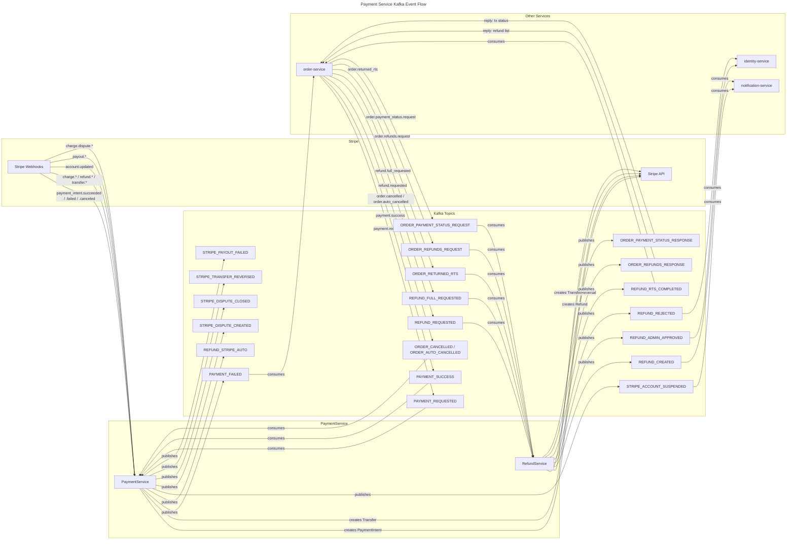
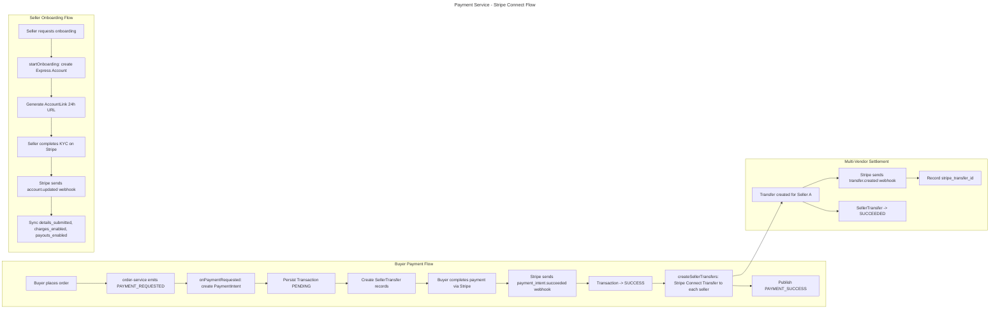

# C4 Code Level: Payment Service

## Overview

- **Name**: Payment Service
- **Description**: Axon CQRS-based payment service handling Stripe Connect payments, refunds, multi-vendor transfers, and payment saga orchestration. Uses PostgreSQL for JPA persistence, Kafka for async event-driven communication, and Stripe Java SDK for payment gateway integration.
- **Location**: `D:\dev\stealing-from-paradise\backend\payment-service\`
- **Language**: Java 25 + Spring Boot 4.0.4 + Axon Framework 4.13.0
- **Purpose**: Payment processing with Stripe Connect integration using CQRS event sourcing. Handles PaymentIntent creation, Stripe webhook event processing, seller Stripe Connect onboarding (Express accounts), multi-vendor fund transfers, partial/full refunds with admin approval workflow, and Return-to-Sender auto-refunds. Communicates asynchronously with order-service and identity-service via Kafka topics.

---

## Code Elements

### 1. Application Entry Point

#### `PaymentServiceApplication`

- **Description**: Spring Boot application entry point. Enables service discovery via Eureka and loads `DevDataProperties` for development data seeding. Scans the `com.flashsale` base package.
- **Location**: `D:\dev\stealing-from-paradise\backend\payment-service\src\main\java\com\flashsale\paymentservice\PaymentServiceApplication.java`
- **Annotations**: `@SpringBootApplication(scanBasePackages = {"com.flashsale"})`, `@EnableDiscoveryClient`, `@EnableConfigurationProperties(DevDataProperties.class)`
- **Dependencies**: `DevDataProperties` (from common-lib)

---

### 2. Configuration Classes

#### `StripeConfig`

- **Description**: Stripe SDK configuration. Initializes the Stripe API key on startup via `@PostConstruct`. Reads Stripe secret key, webhook secret, platform fee percentage, onboarding return/refresh URLs, and default country from application properties.
- **Location**: `D:\dev\stealing-from-paradise\backend\payment-service\src\main\java\com\flashsale\paymentservice\config\StripeConfig.java`
- **Properties**:
  - `stripe.secret-key` — Stripe API secret key
  - `stripe.webhook-secret` — Webhook signing secret for signature verification
  - `stripe.platform-fee-percentage` (default: 5.0) — Platform commission percentage
  - `stripe.onboarding-return-url` — Stripe Connect onboarding return URL
  - `stripe.onboarding-refresh-url` — Stripe Connect onboarding refresh URL
  - `stripe.default-country` (default: US) — Default country for Stripe account creation
- **Methods**:
  - `getWebhookSecret(): String`
  - `getPlatformFeePercentage(): double`
  - `getOnboardingReturnUrl(): String`
  - `getOnboardingRefreshUrl(): String`
  - `getDefaultCountry(): String`

#### `SecurityConfig`

- **Description**: Spring Security configuration. Disables CSRF, anonymous sessions, HTTP basic, and form login. Configures stateless session management. Registers `JwtTokenDecoderFilter` (from common-lib) inside the `SecurityFilterChain` -- prevents auto-registration as a top-level servlet filter to avoid SecurityContextHolderFilter race conditions. All requests are permitted (`permitAll`); role-based access is enforced at the method level via `@PreAuthorize`.
- **Location**: `D:\dev\stealing-from-paradise\backend\payment-service\src\main\java\com\flashsale\paymentservice\config\SecurityConfig.java`
- **Dependencies**: `JwtTokenDecoderFilter` (from common-lib)
- **Beans**:
  - `FilterRegistrationBean<JwtTokenDecoderFilter> jwtTokenDecoderFilterRegistration` — Disables auto-registration of the filter
  - `SecurityFilterChain securityFilterChain(HttpSecurity)` — Builds the filter chain

#### `KafkaConsumerConfig`

- **Description**: Kafka consumer configuration. Configures `StringDeserializer` for both key and value, manual commit control (`ENABLE_AUTO_COMMIT=false`), earliest auto-offset reset, max 100 records per poll, concurrency of 3, and batch acknowledgment mode. Topics are treated as non-fatal if missing.
- **Location**: `D:\dev\stealing-from-paradise\backend\payment-service\src\main\java\com\flashsale\paymentservice\config\KafkaConsumerConfig.java`
- **Properties**:
  - `spring.kafka.bootstrap-servers`
  - `spring.kafka.consumer.group-id` (default: `payment-service-group`)
- **Beans**:
  - `ConsumerFactory<String, String> consumerFactory()`
  - `ConcurrentKafkaListenerContainerFactory<String, String> kafkaListenerContainerFactory()`

#### `KafkaProducerConfig`

- **Description**: Kafka producer configuration. Configures `StringSerializer` for both key and value, with `acks=all` (strongest durability) and 3 retries.
- **Location**: `D:\dev\stealing-from-paradise\backend\payment-service\src\main\java\com\flashsale\paymentservice\config\KafkaProducerConfig.java`
- **Properties**:
  - `spring.kafka.bootstrap-servers`
- **Beans**:
  - `ProducerFactory<String, String> producerFactory()`
  - `KafkaTemplate<String, String> kafkaTemplate()`

#### `KafkaTopicConfig`

- **Description**: Declares all Kafka topics consumed and produced by the payment service. Creates topics at startup via `KafkaAdmin`, working even when `KAFKA_AUTO_CREATE_TOPICS_ENABLE=false`. All topics use 3 partitions and 1 replica.
- **Location**: `D:\dev\stealing-from-paradise\backend\payment-service\src\main\java\com\flashsale\paymentservice\config\KafkaTopicConfig.java`
- **Consumed Topics** (from order-service and event bus):
  - `KafkaTopics.PAYMENT_REQUESTED`
  - `KafkaTopics.PAYMENT_SUCCESS`
  - `KafkaTopics.ORDER_PAYMENT_STATUS_REQUEST`
  - `KafkaTopics.REFUND_REQUESTED`
  - `KafkaTopics.REFUND_FULL_REQUESTED`
  - `KafkaTopics.ORDER_RETURNED_RTS`
  - `KafkaTopics.ORDER_REFUNDS_REQUEST`
  - `KafkaTopics.ORDER_CANCELLED`
  - `KafkaTopics.ORDER_AUTO_CANCELLED`
- **Produced Topics** (to event bus, consumed by identity-service, notification-service):
  - `KafkaTopics.PAYMENT_FAILED`
  - `KafkaTopics.REFUND_STRIPE_AUTO`
  - `KafkaTopics.REFUND_CREATED`
  - `KafkaTopics.STRIPE_ACCOUNT_SUSPENDED`
  - `KafkaTopics.ORDER_PAYMENT_STATUS_RESPONSE`
  - `KafkaTopics.ORDER_REFUNDS_RESPONSE`
  - `KafkaTopics.REFUND_ADMIN_APPROVED`
  - `KafkaTopics.REFUND_REJECTED`
  - `KafkaTopics.REFUND_RTS_COMPLETED`
  - `KafkaTopics.STRIPE_DISPUTE_CREATED`
  - `KafkaTopics.STRIPE_DISPUTE_CLOSED`
  - `KafkaTopics.STRIPE_TRANSFER_REVERSED`
  - `KafkaTopics.STRIPE_PAYOUT_FAILED`
- **Beans**: One `NewTopic` bean for each topic listed above

#### `PaymentDevDataLoader`

- **Description**: Development-only data seeder activated with `dev` profile and `dev-data.enabled=true`. Seeds 5 seller Stripe accounts (all active with charges/payouts enabled), 10 transactions with varying statuses (PAID, PENDING), corresponding seller transfers, and 4 refund scenarios (COMPLETED full, PENDING partial with items, REJECTED, RTS_COMPLETED). Supports a reset mode (`dev-data.reset=true`) that wipes all data before re-seeding.
- **Location**: `D:\dev\stealing-from-paradise\backend\payment-service\src\main\java\com\flashsale\paymentservice\config\PaymentDevDataLoader.java`
- **Dependencies**: All 5 repositories, `DevDataProperties`
- **Methods**:
  - `run(String... args)` — Entry point; wipes or skips based on config
  - `seedSellerStripeAccounts()` — Creates 5 active Stripe Connect accounts
  - `seedTransactionsAndTransfers()` — Creates 10 transactions with transfers
  - `seedRefunds()` — Creates 4 refund scenarios with items

---

### 3. REST Controllers

#### `PaymentController`

- **Description**: REST controller exposing payment transaction queries and Stripe webhook endpoint. The webhook endpoint is unauthenticated (validated via Stripe-Signature), while the transaction query requires BUYER, SELLER, or ADMIN role.
- **Location**: `D:\dev\stealing-from-paradise\backend\payment-service\src\main\java\com\flashsale\paymentservice\controller\PaymentController.java`
- **Base Path**: `/v1`
- **Dependencies**: `PaymentService`
- **Endpoints**:

  | Method | Path | Auth | Description |
  |--------|------|------|-------------|
  | GET | `/payments/parent-order/{parentOrderId}` | BUYER/SELLER/ADMIN | Get transaction detail for a parent order, including seller transfers and remaining payment window seconds (if PENDING) |
  | POST | `/stripe/webhooks` | None (Stripe-Signature) | Receive Stripe webhook events: payment_intent.succeeded/failed/canceled, charge.*, refund.*, transfer.*, payout.*, account.* |

#### `SellerPaymentsController`

- **Description**: REST controller for seller payment management. Provides earnings overview and Stripe Express dashboard login link.
- **Location**: `D:\dev\stealing-from-paradise\backend\payment-service\src\main\java\com\flashsale\paymentservice\controller\SellerPaymentsController.java`
- **Base Path**: `/v1/seller/payments`
- **Dependencies**: `SellerPaymentsService`
- **Endpoints**:

  | Method | Path | Auth | Description |
  |--------|------|------|-------------|
  | GET | `/earnings` | SELLER | Get all earnings (SellerTransfer records) for the authenticated seller, with total/available/pending balance calculation |
  | GET | `/stripe-dashboard` | SELLER | Get Stripe Express dashboard single-use login link for the seller |

#### `StripeOnboardingController`

- **Description**: REST controller for Stripe Connect Express onboarding. Manages the complete onboarding lifecycle: starting onboarding, checking status, and refreshing expired links.
- **Location**: `D:\dev\stealing-from-paradise\backend\payment-service\src\main\java\com\flashsale\paymentservice\controller\StripeOnboardingController.java`
- **Base Path**: `/v1/stripe/onboarding`
- **Dependencies**: `StripeOnboardingService`
- **Endpoints**:

  | Method | Path | Auth | Description |
  |--------|------|------|-------------|
  | POST | `/start` | SELLER | Start Stripe Connect Express onboarding; creates Express Account + 24-hour AccountLink |
  | GET | `/status` | SELLER | Check Stripe account onboarding status (PENDING / IN_PROGRESS / COMPLETE / SUSPENDED) |
  | POST | `/refresh-link` | SELLER | Recreate onboarding AccountLink when the existing link has expired |

#### `AdminRefundController`

- **Description**: REST controller for admin refund management. Provides listing with filtering/pagination, detail view, manual approval (triggers Stripe refund + seller transfer reversal), and rejection.
- **Location**: `D:\dev\stealing-from-paradise\backend\payment-service\src\main\java\com\flashsale\paymentservice\controller\AdminRefundController.java`
- **Base Path**: `/v1/admin/refunds`
- **Dependencies**: `RefundService`
- **Endpoints**:

  | Method | Path | Auth | Description |
  |--------|------|------|-------------|
  | GET | `/` | ADMIN | List all refunds with optional filters: status, type, from_date, to_date, page, size |
  | GET | `/{refundId}` | ADMIN | Get full refund detail including items, tracking number, return evidence |
  | POST | `/{refundId}/approve` | ADMIN | Approve refund: execute Stripe refund, reverse seller transfer, publish `refund.admin_approved` |
  | POST | `/{refundId}/reject` | ADMIN | Reject refund: set status to REJECTED, publish `refund.rejected` |

---

### 4. Service Layer

#### `PaymentService`

- **Description**: Core payment orchestration service. Handles Stripe PaymentIntent creation (driven by `payment.requested` Kafka event), Stripe webhook event processing (20+ event types), multi-vendor Connect transfer creation, and order cancellation handling. Uses `KafkaListener` annotations to consume `PAYMENT_REQUESTED`, `PAYMENT_SUCCESS`, `ORDER_CANCELLED`, and `ORDER_AUTO_CANCELLED` topics.
- **Location**: `D:\dev\stealing-from-paradise\backend\payment-service\src\main\java\com\flashsale\paymentservice\service\PaymentService.java`
- **Dependencies**: `TransactionRepository`, `RefundRepository`, `SellerTransferRepository`, `SellerStripeAccountRepository`, `StripeConfig`, `KafkaTemplate<String, String>`, `ObjectMapper`
- **Kafka Consumers**:
  - `onPaymentRequested(String message)` — Listens to `PAYMENT_REQUESTED`; creates Stripe PaymentIntent, persists Transaction, creates SellerTransfer records for multi-vendor sub-orders. Idempotent (skips if transaction exists in PENDING/SUCCESS state).
  - `onPaymentSuccess(String message)` — Listens to `PAYMENT_SUCCESS` for idempotency.
  - `onOrderCancelled(String message)` — Listens to `ORDER_CANCELLED` and `ORDER_AUTO_CANCELLED`; cancels Stripe PaymentIntent if still pending, sets Transaction to CANCELLED, publishes PAYMENT_FAILED for saga cleanup.
- **Public Methods**:
  - `getTransactionByParentOrder(Long parentOrderId): TransactionDetailResponse` — Query transaction with seller transfer info
  - `handleStripeWebhook(String payload, String sigHeader)` — Verify signature and dispatch to event-specific handler
- **Webhook Event Handlers** (private):
  - `handlePaymentIntentSucceeded(Event)` — Sets transaction SUCCESS, creates seller transfers via Stripe Connect
  - `handlePaymentIntentFailed(Event)` — Sets transaction FAILED, publishes `payment.failed`
  - `handlePaymentIntentCanceled(Event)` — Sets transaction CANCELLED, publishes `payment.failed`
  - `handleChargeSucceeded(Event)` — Idempotent fallback for charge.succeeded
  - `handleChargeFailed(Event)` — Sets transaction FAILED, publishes `payment.failed`
  - `handleChargeRefunded(Event)` — Publishes `refund.stripe_auto` for external refunds
  - `handleChargeRefundUpdated(Event)` — Delegates to `handleRefundUpdated`
  - `handleDisputeCreated(Event)` — Publishes `stripe.dispute.created` alert
  - `handleDisputeClosed(Event)` — Publishes `stripe.dispute.closed`
  - `handleRefundCreated(Event)` — Logs untracked Stripe-originated refunds
  - `handleRefundUpdated(Event)` — Syncs refund status from Stripe (pending -> succeeded/failed)
  - `handleTransferCreated(Event)` — Records stripe_transfer_id on SellerTransfer
  - `handleTransferUpdated(Event)` — Backfills stripe_transfer_id if missing
  - `handleTransferReversed(Event)` — Sets SellerTransfer to REVERSED, publishes alert
  - `handlePayoutCreated/Updated/Paid/Failed(Event)` — Payout lifecycle monitoring
  - `handleAccountUpdated(Event)` — Syncs account status, handles requirements/verification
  - `handleExternalAccountChanged(Event)` — Logs bank account changes
- **Internal Helpers**:
  - `createSellerTransfers(Long parentOrderId, PaymentIntent pi)` — Creates Stripe Connect transfers to each seller's connected account
  - `createSellerTransferRecords(Long parentOrderId, Map<String, Object> payload, Long transactionId)` — Parses sub-order breakdown from payment.requested payload
  - `buildTransRef(Long parentOrderId): String` — Generates transaction reference code
  - `toStripeAmount(BigDecimal amount): long` — Converts VND amount to Stripe-compatible amount
  - `extractPiIdFromRawResponse(String rawResponse): String` — Extracts PI ID from stored JSON
  - `publish(String topic, String key, Object payload)` — Serializes and sends Kafka message

#### `SellerPaymentsService`

- **Description**: Handles seller-specific payment queries. Computes earnings summary (total/available/pending) from SellerTransfer records and generates Stripe Express dashboard login links.
- **Location**: `D:\dev\stealing-from-paradise\backend\payment-service\src\main\java\com\flashsale\paymentservice\service\SellerPaymentsService.java`
- **Dependencies**: `SellerTransferRepository`, `SellerStripeAccountRepository`, `StripeConfig`
- **Public Methods**:
  - `getSellerEarnings(Long sellerId): SellerEarningsResponse` — Aggregates all transfers by seller, computes total/available/pending balances with platform fee deduction
  - `getStripeDashboardUrl(Long sellerId): SellerStripeDashboardResponse` — Retrieves Stripe Express account and generates single-use login link
- **Internal Methods**:
  - `toTransferItem(SellerTransfer t): SellerTransferItem` — Maps entity to DTO

#### `StripeOnboardingService`

- **Description**: Manages Stripe Connect Express account onboarding lifecycle. Creates Express accounts with card payments and transfers capabilities, generates AccountLinks for KYC flow, and provides status derivation logic.
- **Location**: `D:\dev\stealing-from-paradise\backend\payment-service\src\main\java\com\flashsale\paymentservice\service\StripeOnboardingService.java`
- **Dependencies**: `SellerStripeAccountRepository`, `StripeConfig`
- **Public Methods**:
  - `startOnboarding(Long sellerId): StripeOnboardingResponse` — Creates Express account if not exists, generates 24-hour AccountLink
  - `getOnboardingStatus(Long sellerId): StripeOnboardingStatusResponse` — Queries Stripe for latest status (primary sync mechanism), derives onboarding phase
  - `refreshOnboardingLink(Long sellerId): StripeOnboardingResponse` — Creates fresh AccountLink for expired links
- **Internal Methods**:
  - `deriveOnboardingStatus(Account stripeAccount): String` — Derives status from Stripe account state: PENDING -> IN_PROGRESS -> COMPLETE / SUSPENDED
  - `createStripeExpressAccount(Long sellerId): SellerStripeAccount` — Creates Express account with card_payments + transfers capabilities
  - `createAccountLink(String stripeAccountId): AccountLink` — Creates standard AccountLink for onboarding

#### `RefundService`

- **Description**: Comprehensive refund management service. Handles admin refund listing/detail/approval/rejection, consumes Kafka refund events (REFUND_REQUESTED for partial, REFUND_FULL_REQUESTED for full parent-order refunds, ORDER_RETURNED_RTS for auto-refunds), executes Stripe refunds, reverses seller transfers proportionally, and replies to order-service payment status/refund queries.
- **Location**: `D:\dev\stealing-from-paradise\backend\payment-service\src\main\java\com\flashsale\paymentservice\service\RefundService.java`
- **Dependencies**: `RefundRepository`, `RefundItemRepository`, `TransactionRepository`, `SellerTransferRepository`, `KafkaTemplate<String, String>`, `ObjectMapper`
- **Admin Methods**:
  - `listAllRefunds(String status, String type, String fromDate, String toDate, int page, int size): PageResponse<RefundListResponse>` — Filtered, paginated refund listing
  - `getRefundById(Long refundId): RefundDetailResponse` — Full refund detail with items and return evidence
  - `approveRefund(Long refundId, Long adminId, AdminRefundApproveRequest req): AdminRefundApproveResponse` — Executes Stripe refund, reverses seller transfer, sets status to SUCCESS, publishes `refund.admin_approved`
  - `rejectRefund(Long refundId, Long adminId, AdminRefundRejectRequest req)` — Sets status to REJECTED, publishes `refund.rejected`
- **Kafka Consumers**:
  - `onRefundRequested(String message)` — Listens to `REFUND_REQUESTED`; creates Refund + RefundItems from buyer partial refund request (PENDING admin approval)
  - `onRefundFullRequested(String message)` — Listens to `REFUND_FULL_REQUESTED`; creates N Refund records (one per sub-order) with shared group_ref for full parent-order refund
  - `onOrderReturnedRts(String message)` — Listens to `ORDER_RETURNED_RTS`; auto-creates refund, executes Stripe refund without admin approval, reverses seller transfer, publishes `refund.rts_completed`
  - `onOrderRefundsRequest(String message)` — Listens to `ORDER_REFUNDS_REQUEST`; replies with refund list by orderId or userId with pagination
  - `onOrderPaymentStatusRequest(String message)` — Listens to `ORDER_PAYMENT_STATUS_REQUEST`; replies with transaction status by parentOrderId
- **Internal Methods**:
  - `executeStripeRefund(Long transactionId, BigDecimal amount): String` — Creates Stripe refund on the PaymentIntent
  - `reverseSellerTransfer(Long orderId, BigDecimal refundAmount, Long refundId): String` — Proportionally reverses Stripe Connect transfers to seller
  - `toListResponse(Refund r): RefundListResponse` — Maps entity to list DTO
  - `toRefundMap(Refund r): Map<String, Object>` — Serializes refund for Kafka reply
  - `extractPiIdFromRawResponse(String rawResponse): String` — Extracts PI ID from JSON
  - `buildRefundCode(Refund r): String` — Generates refund code (RF-yyyyMMdd-id)
  - `publish(String topic, String key, Object payload)` — Kafka publisher helper
  - `toJson(Object payload): String` — Serialization helper

---

### 5. Domain Models (JPA Entities)

#### `Transaction`

- **Description**: JPA entity mapping the `transactions` table. Records a payment transaction associated with a parent order, including Stripe PaymentIntent raw response, amounts, status, and timestamps.
- **Location**: `D:\dev\stealing-from-paradise\backend\payment-service\src\main\java\com\flashsale\paymentservice\domain\model\Transaction.java`
- **Table**: `transactions`, with index on `parent_order_id`
- **Fields**:
  - `id: Long` (PK, auto-increment)
  - `parentOrderId: Long` (not null) -- maps to order-service parent order
  - `amount: BigDecimal` (not null)
  - `transRef: String` -- transaction reference code (TXN-format)
  - `stripeTransferId: String` -- Stripe transfer ID (legacy)
  - `applicationFeeAmount: BigDecimal` -- platform commission
  - `stripeConnectMode: String` -- e.g., DESTINATION
  - `status: String` (not null) -- PENDING / SUCCESS / FAILED / CANCELLED
  - `rawResponse: String` (jsonb) -- full Stripe PaymentIntent JSON response
  - `payAt: LocalDateTime` -- payment completion timestamp
  - `createdAt, updatedAt: LocalDateTime` (auto-managed via `@PrePersist`/`@PreUpdate`)

#### `Refund`

- **Description**: JPA entity mapping the `refunds` table. Represents a refund request linked to a transaction. Supports FULL and PARTIAL types, tracks admin review, evidence images (jsonb), raw Stripe response (jsonb), and group_ref for multi-order refund groups.
- **Location**: `D:\dev\stealing-from-paradise\backend\payment-service\src\main\java\com\flashsale\paymentservice\domain\model\Refund.java`
- **Table**: `refunds`, with index on `order_id`
- **Fields**:
  - `id: Long` (PK, auto-increment)
  - `transactionId: Long` (not null) -- FK to transactions
  - `orderId: Long` (not null) -- FK to order-service sub-order
  - `groupRef: UUID` -- shared UUID for multi-order refund groups
  - `type: String` (not null) -- FULL / PARTIAL
  - `initiatedBy: String` (not null) -- BUYER / SELLER / ADMIN
  - `refundReasonType: String` -- e.g., DEFECTIVE, CHANGE_OF_MIND, BUYER_CANCEL, RETURN_TO_SENDER
  - `amount: BigDecimal` (not null)
  - `reason: String` (TEXT) -- buyer-provided reason
  - `status: String` (not null, default PENDING) -- PENDING / SUCCESS / FAILED / REJECTED / RTS_COMPLETED
  - `evidenceImages: List<String>` (jsonb) -- buyer-uploaded evidence
  - `rejectReason: String` (TEXT) -- admin rejection reason
  - `adminNote: String` (TEXT) -- admin internal note
  - `reviewedBy: Long` -- admin user ID
  - `reviewedAt: LocalDateTime`
  - `refundRef: String` -- Stripe refund ID
  - `rawResponse: Map<String, Object>` (jsonb) -- Stripe refund response
  - `createdAt, updatedAt: LocalDateTime` (auto-managed)

#### `RefundItem`

- **Description**: JPA entity mapping the `refund_items` table. Line-item detail within a refund request, tracking per-item amounts, reasons, return tracking information, and evidence images.
- **Location**: `D:\dev\stealing-from-paradise\backend\payment-service\src\main\java\com\flashsale\paymentservice\domain\model\RefundItem.java`
- **Table**: `refund_items`
- **Fields**:
  - `id: Long` (PK, auto-increment)
  - `refundId: Long` (not null) -- FK to refunds
  - `itemId: Long` (not null) -- FK to order-service order item
  - `quantity: Integer` (not null)
  - `refundAmount: BigDecimal`
  - `itemReason: String` (TEXT)
  - `status: String` (not null, default PENDING)
  - `returnTrackingNumber: String`
  - `returnEvidenceImages: List<String>` (jsonb)
  - `returnedAt: LocalDateTime`

#### `SellerStripeAccount`

- **Description**: JPA entity mapping the `seller_stripe_accounts` table. Links a seller to their Stripe Connect Express account, tracking onboarding status, capabilities, and onboarding URLs with expiration.
- **Location**: `D:\dev\stealing-from-paradise\backend\payment-service\src\main\java\com\flashsale\paymentservice\domain\model\SellerStripeAccount.java`
- **Table**: `seller_stripe_accounts`
- **Fields**:
  - `id: Long` (PK, auto-increment)
  - `sellerId: Long` (unique, not null) -- FK to identity-service seller
  - `stripeAccountId: String` (not null) -- Stripe Connect account ID (acct_xxx)
  - `accountStatus: String` (not null, default PENDING)
  - `chargesEnabled: Boolean` (not null, default false)
  - `payoutsEnabled: Boolean` (not null, default false)
  - `detailsSubmitted: Boolean` (not null, default false)
  - `onboardingUrl: String` (TEXT) -- Stripe AccountLink URL, valid 24h
  - `onboardingUrlExpiresAt: LocalDateTime`
  - `expressDashboardUrl: String` (TEXT) -- https://connect.stripe.com/express/{id}
  - `createdAt, updatedAt: LocalDateTime` (auto-managed)
- **Methods**:
  - `getOnboardingStatus(): String` -- Derives status from stored fields: COMPLETE if details+charges, SUSPENDED if suspended, IN_PROGRESS if url present, else PENDING

#### `SellerTransfer`

- **Description**: JPA entity mapping the `seller_transfers` table. Records a Stripe Connect transfer from platform to a seller's connected account for a specific sub-order, tracking amounts and reversal status.
- **Location**: `D:\dev\stealing-from-paradise\backend\payment-service\src\main\java\com\flashsale\paymentservice\domain\model\SellerTransfer.java`
- **Table**: `seller_transfers`, with index on `order_id`
- **Fields**:
  - `id: Long` (PK, auto-increment)
  - `orderId: Long` (not null) -- FK to order-service sub-order
  - `sellerId: Long` (not null) -- FK to identity-service seller
  - `transferAmount: BigDecimal` (not null)
  - `stripeTransferId: String` -- Stripe transfer ID (tr_xxx)
  - `status: String` (not null, default PENDING) -- PENDING / SUCCEEDED / FAILED / REVERSED / PARTIALLY_REVERSED / SKIPPED
  - `createdAt, updatedAt: LocalDateTime` (auto-managed)

---

### 6. JPA Converters

#### `MapStringObjectConverter`

- **Description**: JPA `AttributeConverter` that serializes `Map<String, Object>` to JSON string for database storage and deserializes back.
- **Location**: `D:\dev\stealing-from-paradise\backend\payment-service\src\main\java\com\flashsale\paymentservice\domain\converter\MapStringObjectConverter.java`

#### `ReturnEvidenceImagesConverter`

- **Description**: JPA `AttributeConverter` that serializes `List<String>` (return evidence image URLs) to JSON string and back.
- **Location**: `D:\dev\stealing-from-paradise\backend\payment-service\src\main\java\com\flashsale\paymentservice\domain\converter\ReturnEvidenceImagesConverter.java`

#### `StringListConverter`

- **Description**: JPA `AttributeConverter` that serializes `List<String>` to JSON string and back. Used as a general-purpose JSON string list converter.
- **Location**: `D:\dev\stealing-from-paradise\backend\payment-service\src\main\java\com\flashsale\paymentservice\domain\converter\StringListConverter.java`

#### `StringListJsonConverter`

- **Description**: Alternative JPA `AttributeConverter` for `List<String>` to JSON. Used by domain model fields annotated with `@JdbcTypeCode(SqlTypes.JSON)`.
- **Location**: `D:\dev\stealing-from-paradise\backend\payment-service\src\main\java\com\flashsale\paymentservice\domain\model\StringListJsonConverter.java`

#### `StringObjectMapJsonConverter`

- **Description**: Alternative JPA `AttributeConverter` for `Map<String, Object>` to JSON. Used by domain model fields annotated with `@JdbcTypeCode(SqlTypes.JSON)`.
- **Location**: `D:\dev\stealing-from-paradise\backend\payment-service\src\main\java\com\flashsale\paymentservice\domain\model\StringObjectMapJsonConverter.java`

---

### 7. Repository Interfaces (Data Access Layer)

#### `TransactionRepository`

- **Location**: `D:\dev\stealing-from-paradise\backend\payment-service\src\main\java\com\flashsale\paymentservice\domain\repository\TransactionRepository.java`
- **Methods**:
  - `findByParentOrderId(Long parentOrderId): Optional<Transaction>`

#### `RefundRepository`

- **Location**: `D:\dev\stealing-from-paradise\backend\payment-service\src\main\java\com\flashsale\paymentservice\domain\repository\RefundRepository.java`
- **Methods**:
  - `findByOrderId(Long orderId): Optional<Refund>`
  - `findAllByOrderId(Long orderId): List<Refund>`
  - `findAllWithFilters(String status, String type, LocalDateTime fromDate, LocalDateTime toDate, Pageable pageable): Page<Refund>` -- Custom JPQL with optional filters and DESC ordering
  - `findAllByUserIdWithFilters(Long userId, String status, String type, LocalDateTime fromDate, LocalDateTime toDate, Pageable pageable): Page<Refund>` -- Custom JPQL with userId filter
  - `existsByOrderIdAndStatus(Long orderId, String status): boolean`
  - `existsByOrderIdAndStatusIn(Long orderId, List<String> statuses): boolean`
  - `findByRefundRef(String refundRef): Optional<Refund>`

#### `RefundItemRepository`

- **Location**: `D:\dev\stealing-from-paradise\backend\payment-service\src\main\java\com\flashsale\paymentservice\domain\repository\RefundItemRepository.java`
- **Methods**:
  - `findAllByRefundId(Long refundId): List<RefundItem>`

#### `SellerStripeAccountRepository`

- **Location**: `D:\dev\stealing-from-paradise\backend\payment-service\src\main\java\com\flashsale\paymentservice\domain\repository\SellerStripeAccountRepository.java`
- **Methods**:
  - `findBySellerId(Long sellerId): Optional<SellerStripeAccount>`
  - `findByStripeAccountId(String stripeAccountId): Optional<SellerStripeAccount>`

#### `SellerTransferRepository`

- **Location**: `D:\dev\stealing-from-paradise\backend\payment-service\src\main\java\com\flashsale\paymentservice\domain\repository\SellerTransferRepository.java`
- **Methods**:
  - `findByOrderId(Long orderId): Optional<SellerTransfer>`
  - `findAllByParentOrderId(Long parentOrderId): List<SellerTransfer>`
  - `findAllByOrderId(Long orderId): List<SellerTransfer>`
  - `findAllBySellerIdOrderByCreatedAtDesc(Long sellerId): List<SellerTransfer>` -- Custom JPQL
  - `findAllBySellerIdWithFilters(Long sellerId, String status, LocalDateTime fromDate, LocalDateTime toDate, Pageable pageable): Page<SellerTransfer>` -- Custom JPQL with optional filters

---

### 8. DTOs (Data Transfer Objects)

#### Request DTOs

| Class | Location | Fields | Validation |
|-------|----------|--------|------------|
| `AdminRefundApproveRequest` | `dto/request/AdminRefundApproveRequest.java` | `adminNote: String`, `causedBy: String`, `trackingNumber: String` | `adminNote` @NotBlank, @Size(1,1000); `trackingNumber` @Pattern(`^[A-Z]{2}[0-9]{9}$`) |
| `AdminRefundRejectRequest` | `dto/request/AdminRefundRejectRequest.java` | `rejectReason: String`, `fraudEvidence: Boolean` (default false) | `rejectReason` @NotBlank |

#### Response DTOs

| Class | Location | Key Fields |
|-------|----------|------------|
| `TransactionDetailResponse` | `dto/response/TransactionDetailResponse.java` | transactionId, parentOrderId, amount, status, applicationFee, transRef, paidAt, remainingSeconds, sellers (List of SellerTransferInfo) |
| `SellerTransferInfo` | `dto/response/SellerTransferInfo.java` | sellerId, orderId, amount, fee, stripeTransferId, transferStatus |
| `SellerEarningsResponse` | `dto/response/SellerEarningsResponse.java` | totalEarnings, availableBalance, pendingBalance, platformFeePercentage, totalOrders, transfers (List of `SellerTransferItem` inner class) |
| `SellerStripeDashboardResponse` | `dto/response/SellerStripeDashboardResponse.java` | dashboardUrl, stripeAccountId, accountStatus |
| `SellerBalanceResponse` | `dto/response/SellerBalanceResponse.java` | sellerId, pendingBalance, availableBalance, totalEarned |
| `StripeOnboardingResponse` | `dto/response/StripeOnboardingResponse.java` | onboardingUrl, stripeAccountId, expiresAt |
| `StripeOnboardingStatusResponse` | `dto/response/StripeOnboardingStatusResponse.java` | stripeAccountId, accountStatus, detailsSubmitted, chargesEnabled, payoutsEnabled, onboardingStatus, onboardingUrl, expressDashboardUrl |
| `AdminRefundApproveResponse` | `dto/response/AdminRefundApproveResponse.java` | refundId, refundCode, status, type, amount, trackingNumber, returnEvidence (List of `ReturnEvidence`), reviewedBy, adminNote, reviewedAt, stripeRefundId |
| `RefundDetailResponse` | `dto/response/RefundDetailResponse.java` | refundId, refundCode, orderId, groupRef, type, status, amount, reason, initiatedBy, refundReasonType, evidenceImages, adminNote, rejectReason, trackingNumber, returnEvidence, reviewedBy, reviewedAt, stripeRefundId, items (List of `RefundItemInfo`), createdAt, updatedAt |
| `RefundListResponse` | `dto/response/RefundListResponse.java` | refundId, refundCode, orderId, groupRef, type, status, amount, initiatedBy, refundReasonType, adminNote, rejectReason, reviewedBy, reviewedAt, refundRef, createdAt |

---

### 9. Test

#### `PaymentServiceApplicationTests`

- **Description**: Basic Spring Boot context load test.
- **Location**: `D:\dev\stealing-from-paradise\backend\payment-service\src\test\java\com\flashsale\paymentservice\PaymentServiceApplicationTests.java`
- **Methods**:
  - `contextLoads()` — Verifies application context loads successfully

---

## Dependencies

### Internal Dependencies (common-lib)

| Dependency | Usage |
|------------|-------|
| `com.flashsale.commonlib.dto.ApiResponse` | Standard API response wrapper |
| `com.flashsale.commonlib.dto.PageResponse` | Paginated response wrapper |
| `com.flashsale.commonlib.event.KafkaTopics` | Kafka topic name constants |
| `com.flashsale.commonlib.event.payload.SellerStripeRequirementPayload` | Stripe requirement notification DTO |
| `com.flashsale.commonlib.exception.AppException` | Application exception |
| `com.flashsale.commonlib.exception.ErrorCode` | Error code enum |
| `com.flashsale.commonlib.security.UserDetailsImpl` | Authenticated user details |
| `com.flashsale.commonlib.filter.JwtTokenDecoderFilter` | JWT token decoding servlet filter |
| `com.flashsale.commonlib.config.DevDataProperties` | Dev data seed configuration properties |

### External Dependencies

| Dependency | Version | Usage |
|------------|---------|-------|
| Spring Boot Starter Web | 4.0.4 | REST endpoints, embedded Tomcat |
| Spring Boot Starter Data JPA | 4.0.4 | JPA/Hibernate ORM for PostgreSQL |
| Axon Spring Boot Starter | 4.13.0 | CQRS event sourcing framework |
| PostgreSQL JDBC Driver | (runtime) | Database connectivity |
| Spring Cloud Netflix Eureka Client | (current) | Service discovery registration |
| Flyway Core + PostgreSQL | (current) | Database migration management |
| Stripe Java SDK | 26.1.0 | Stripe API: PaymentIntent, Transfer, Account, Refund, Webhook |
| Spring Kafka | (current) | Kafka producer/consumer for async event communication |
| Spring Boot Starter Validation | 4.0.4 | Jakarta Bean Validation (`@NotBlank`, `@Pattern`, `@Size`) |
| Spring Boot Starter Actuator | 4.0.4 | Health check endpoint for Docker |
| Lombok | (provided) | `@Data`, `@Builder`, `@RequiredArgsConstructor`, `@Slf4j` |
| Jackson Databind | (bundled) | JSON serialization/deserialization for Kafka and JPA jsonb |

---

## Relationships

### Code Structure Diagram: Service Dependencies and Kafka Event Flow

```mermaid
---
title: Payment Service - Code Element Dependencies
---
classDiagram
    namespace Controllers {
        class PaymentController {
            +getTransactionByParentOrder(parentOrderId) ResponseEntity
            +handleStripeWebhook(payload, sigHeader) ResponseEntity
        }
        class SellerPaymentsController {
            +getEarnings(user) ResponseEntity
            +getStripeDashboardLink(user) ResponseEntity
        }
        class StripeOnboardingController {
            +startOnboarding(user) ResponseEntity
            +getOnboardingStatus(user) ResponseEntity
            +refreshOnboardingLink(user) ResponseEntity
        }
        class AdminRefundController {
            +listRefunds(status, type, from, to, page, size) ResponseEntity
            +getRefund(refundId) ResponseEntity
            +approveRefund(refundId, request, admin) ResponseEntity
            +rejectRefund(refundId, request, admin) ResponseEntity
        }
    }

    namespace Services {
        class PaymentService {
            +getTransactionByParentOrder(parentOrderId) TransactionDetailResponse
            +handleStripeWebhook(payload, sigHeader)
            -onPaymentRequested(message)
            -onOrderCancelled(message)
        }
        class SellerPaymentsService {
            +getSellerEarnings(sellerId) SellerEarningsResponse
            +getStripeDashboardUrl(sellerId) SellerStripeDashboardResponse
        }
        class StripeOnboardingService {
            +startOnboarding(sellerId) StripeOnboardingResponse
            +getOnboardingStatus(sellerId) StripeOnboardingStatusResponse
            +refreshOnboardingLink(sellerId) StripeOnboardingResponse
        }
        class RefundService {
            +listAllRefunds(...) PageResponse
            +getRefundById(refundId) RefundDetailResponse
            +approveRefund(...) AdminRefundApproveResponse
            +rejectRefund(...)
            -onRefundRequested(message)
            -onRefundFullRequested(message)
            -onOrderReturnedRts(message)
            -onOrderRefundsRequest(message)
            -onOrderPaymentStatusRequest(message)
        }
    }

    namespace DomainModels {
        class Transaction {
            Long id
            Long parentOrderId
            BigDecimal amount
            String status
            String rawResponse
        }
        class Refund {
            Long id
            Long orderId
            UUID groupRef
            String type
            String status
            BigDecimal amount
        }
        class RefundItem {
            Long id
            Long refundId
            Long itemId
            Integer quantity
            BigDecimal refundAmount
            String returnTrackingNumber
        }
        class SellerStripeAccount {
            Long id
            Long sellerId
            String stripeAccountId
            Boolean chargesEnabled
            Boolean detailsSubmitted
        }
        class SellerTransfer {
            Long id
            Long orderId
            Long sellerId
            BigDecimal transferAmount
            String stripeTransferId
            String status
        }
    }

    namespace Repositories {
        class TransactionRepository
        class RefundRepository
        class RefundItemRepository
        class SellerStripeAccountRepository
        class SellerTransferRepository
    }

    namespace Config {
        class StripeConfig
        class SecurityConfig
        class KafkaConsumerConfig
        class KafkaProducerConfig
        class KafkaTopicConfig
        class PaymentDevDataLoader
    }

    PaymentController --> PaymentService : uses
    SellerPaymentsController --> SellerPaymentsService : uses
    StripeOnboardingController --> StripeOnboardingService : uses
    AdminRefundController --> RefundService : uses

    PaymentService --> TransactionRepository : queries
    PaymentService --> RefundRepository : queries
    PaymentService --> SellerTransferRepository : queries
    PaymentService --> SellerStripeAccountRepository : queries
    PaymentService --> StripeConfig : reads config
    PaymentService ..> Stripe : PaymentIntent, Transfer, Webhook
    PaymentService ..> KafkaTopics : publishes PAYMENT_FAILED, PAYMENT_SUCCESS

    SellerPaymentsService --> SellerTransferRepository : queries
    SellerPaymentsService --> SellerStripeAccountRepository : queries
    SellerPaymentsService --> StripeConfig : reads fee %

    StripeOnboardingService --> SellerStripeAccountRepository : CRUD
    StripeOnboardingService --> StripeConfig : reads URLs
    StripeOnboardingService ..> Stripe : Account, AccountLink, LoginLink

    RefundService --> RefundRepository : CRUD
    RefundService --> RefundItemRepository : CRUD
    RefundService --> TransactionRepository : queries
    RefundService --> SellerTransferRepository : queries
    RefundService ..> Stripe : Refund, TransferReversal

    TransactionRepository ..> Transaction : manages
    RefundRepository ..> Refund : manages
    RefundItemRepository ..> RefundItem : manages
    SellerStripeAccountRepository ..> SellerStripeAccount : manages
    SellerTransferRepository ..> SellerTransfer : manages
```

### Kafka Event Flow Diagram

### Stripe Connect Flow Diagram

---

## Notes

- The payment service does NOT currently use Axon's aggregate/saga annotations in its source files. While the POM declares `axon-spring-boot-starter` as a dependency, the actual CQRS/saga orchestration is implemented through Kafka event consumers/producers and Stripe webhook handlers. The `ParentOrderPaymentSaga` referenced in the service description exists as an architectural pattern but is realized via event-driven service coordination rather than Axon Saga annotations.
- Stripe PaymentIntent ID is extracted from the `rawResponse` JSON column (stored during creation) rather than stored as a dedicated column. This means Stripe operations (refund, cancel) depend on successful JSON parsing of the stored response.
- The Refund entity has a `findAllByUserIdWithFilters` JPQL query referencing a `userId` field, but the entity does not have a `userId` column -- this query would likely fail at runtime and may represent an incomplete migration.
- All monetary amounts use VND (zero-decimal currency in Stripe -- no multiplication by 100).
- The `PaymentDevDataLoader` uses fictitious Stripe test account IDs prefixed with `acct_test_` and should never run in production.
- The Stripe webhook endpoint (`/v1/stripe/webhooks`) is intentionally unauthenticated by JWT; security relies on Stripe-Signature header verification.

---

*Generated from source code analysis on 2026-05-05*