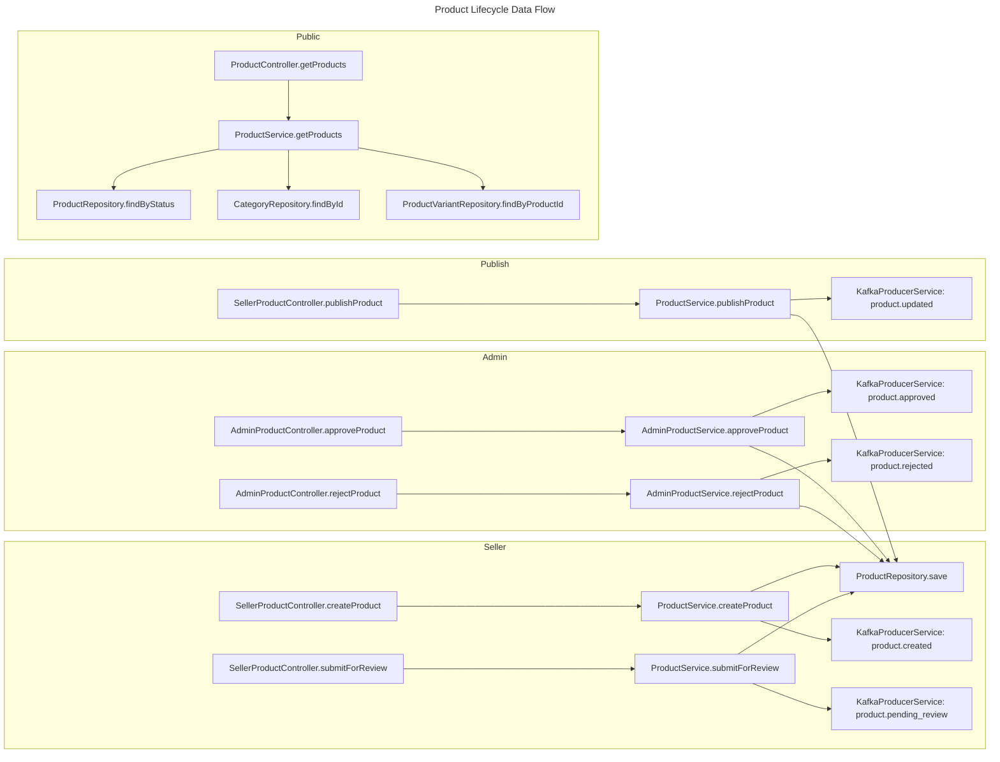
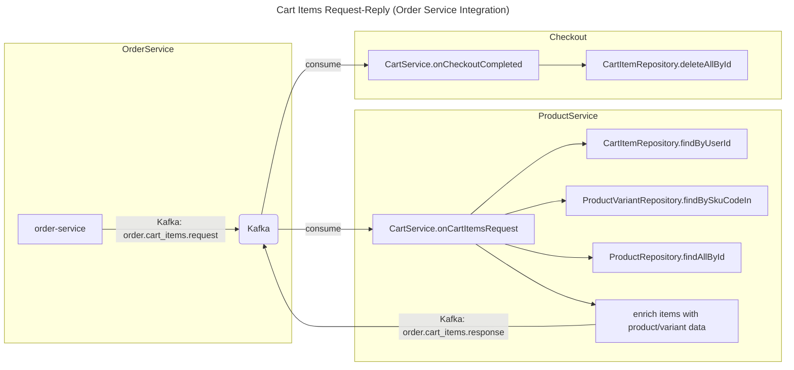

# C4 Code Level: Product Service

## Overview

- **Name**: Product Service
- **Description**: Product catalog management service handling products, product variants, categories, cart operations, and image uploads. Uses MongoDB for product data, Redis for caching, and MinIO for image storage.
- **Location**: `backend/product-service/`
- **Language**: Java 25 + Spring Boot 4.0.4 (Virtual Threads enabled)
- **Purpose**: Product catalog and cart management with image handling. Manages the full lifecycle of products (CRUD, review/approve/publish workflow), product variants with SKU tracking, hierarchical categories, shopping cart operations with Redis-backed caching, inventory management with atomic `$inc` operations, and pre-signed URL generation for MinIO image uploads. Publishes domain events to Kafka for inter-service communication.
- **Port**: 8090 (dev: 8090, configurable via `server.port`)

---

## Code Elements

### Application Entry Point

- **`ProductServiceApplication`**
  - Description: Spring Boot application entry point with `@EnableDiscoveryClient` (Eureka) and `@EnableConfigurationProperties(DevDataProperties.class)`. Scans `com.flashsale` packages for Spring beans.
  - Location: `ProductServiceApplication.java`
  - Methods:
    - `main(String[] args): void`
  - Dependencies: `common-lib`, `spring-cloud-starter-netflix-eureka-client`
  - Annotations: `@SpringBootApplication`, `@EnableDiscoveryClient`, `@EnableConfigurationProperties`

---

### Configuration Classes

- **`KafkaConfig`**
  - Description: Kafka producer and consumer configuration with idempotent producer (acks=all, retries=3, enable.idempotence=true), batch consumer (max.poll.records=100, concurrency=3, BATCH ack mode). Enables `@EnableKafka`.
  - Location: `config/KafkaConfig.java`
  - Beans:
    - `producerFactory(): ProducerFactory<String, String>`
    - `kafkaTemplate(): KafkaTemplate<String, String>`
    - `consumerFactory(): ConsumerFactory<String, String>`
    - `kafkaListenerContainerFactory(): ConcurrentKafkaListenerContainerFactory<String, String>`
  - Dependencies: `spring-kafka`

- **`MinioConfig`**
  - Description: Creates a `MinioClient` bean configured via `minio.url`, `minio.access-key`, `minio.secret-key` properties.
  - Location: `config/MinioConfig.java`
  - Beans:
    - `minioClient(): MinioClient`
  - Dependencies: `io.minio:minio:8.6.0`

- **`MongoConfig`**
  - Description: Enables MongoDB auditing (`@EnableMongoAuditing`) for automatic `@CreatedDate` and `@LastModifiedDate` population.
  - Location: `config/MongoConfig.java`
  - Dependencies: `spring-boot-starter-data-mongodb`

- **`MongoInitializationConfig`**
  - Description: Dev-only (`@Profile("dev")`) category initializer. Seeds 3 root categories (Dien Thoai & May Tinh Bang, Thoi Trang & Phu Kien, Nha Sach & Tro Choi) with 2 subcategories each. Only runs when `dev-data.enabled=false` (mutually exclusive with `ProductDevDataLoader`).
  - Location: `config/MongoInitializationConfig.java`
  - Profile: `dev`
  - Conditional: `dev-data.enabled=false`
  - Beans:
    - `initializeCategories(CategoryRepository): CommandLineRunner`
  - Dependencies: `CategoryRepository`

- **`ProductDevDataLoader`**
  - Description: Comprehensive dev data loader. Seeds categories (3 root + 6 sub), 30 products across 5 sellers (3 with variants + inventory for all), and shopping cart items for 10 users. Supports full reset via `dev-data.reset=true`. Mutually exclusive with `MongoInitializationConfig`.
  - Location: `config/ProductDevDataLoader.java`
  - Profile: `dev`
  - Conditional: `dev-data.enabled=true`
  - Implements: `CommandLineRunner`
  - Dependencies: `CategoryRepository`, `ProductRepository`, `ProductVariantRepository`, `InventoryRepository`, `CartRepository`, `CartItemRepository`, `MongoTemplate`, `DevDataProperties`
  - Key constants: `SELLER_IDS = {1L, 2L, 3L, 4L, 5L}`, `USER_IDS = {1L...10L}`

- **`SecurityConfig`**
  - Description: Spring Security configuration with STATELESS sessions, CSRF disabled, all requests permitted. Registers `JwtTokenDecoderFilter` before `UsernamePasswordAuthenticationFilter` to decode `X-User-*` headers from API Gateway into `SecurityContext`.
  - Location: `config/SecurityConfig.java`
  - Dependencies: `JwtTokenDecoderFilter` (from `common-lib`)
  - Beans:
    - `jwtTokenDecoderFilterRegistration(JwtTokenDecoderFilter): FilterRegistrationBean`
    - `securityFilterChain(HttpSecurity): SecurityFilterChain`

- **`SecurityFilterConfig`**
  - Description: Imports `JwtTokenDecoderFilter` from `common-lib` into the Spring component scan so it gets registered as a servlet filter.
  - Location: `config/SecurityFilterConfig.java`
  - Annotations: `@Import(JwtTokenDecoderFilter.class)`

---

### Domain Models

- **`Product`**
  - Description: Core product entity stored in `products` MongoDB collection. Tracks product lifecycle status (DRAFT/PENDING/APPROVED/REJECTED/PUBLISHED/UNPUBLISHED), flash sale flag, soft delete support, and stock availability.
  - Location: `domain/model/Product.java`
  - Collection: `products`
  - Indexes: `idx_seller_status` (sellerId + status), `idx_category_status` (categoryId + status)
  - Fields:
    - `id: String` (`@Id`)
    - `sellerId: Long` (`@Indexed`)
    - `categoryId: String` (`@Indexed`) -- FK to `categories`
    - `name: String`
    - `description: String`
    - `attributes: Map<String, Object>`
    - `images: List<String>`
    - `isFlash: Boolean`
    - `status: String` -- PENDING | APPROVED | REJECTED | PUBLISHED | DRAFT | UNPUBLISHED
    - `rejectReason: String`
    - `stockAvailable: Integer`
    - `deletedAt: LocalDateTime`
    - `createdAt: LocalDateTime` (`@CreatedDate`)
    - `updatedAt: LocalDateTime` (`@LastModifiedDate`)

- **`ProductVariant`**
  - Description: Product variant/SKU entity. Each variant has a unique SKU code, tier name (e.g., "Black - 256GB"), and selling price. Linked to product via `productId`.
  - Location: `domain/model/ProductVariant.java`
  - Collection: `product_variants`
  - Indexes: `idx_product_sku` (productId + skuCode), `skuCode` (unique)
  - Fields:
    - `id: String` (`@Id`)
    - `productId: String` (`@Indexed`) -- FK to `products`
    - `skuCode: String` (`@Indexed`, unique)
    - `tierName: String`
    - `price: BigDecimal`
    - `createdAt: LocalDateTime` (`@CreatedDate`)
    - `updatedAt: LocalDateTime` (`@LastModifiedDate`)

- **`Category`**
  - Description: Hierarchical product category. Supports parent-child relationships (`parentId`) and levels (0=root, 1=subcategory). URL-friendly slugs are unique.
  - Location: `domain/model/Category.java`
  - Collection: `categories`
  - Indexes: `idx_parent_level` (parentId + level), `slug` (unique)
  - Fields:
    - `id: String` (`@Id`)
    - `name: String` (`@Indexed`)
    - `slug: String` (`@Indexed`, unique)
    - `parentId: String` (`@Indexed`, sparse) -- null for root
    - `level: Integer`
    - `createdAt: LocalDateTime` (`@CreatedDate`)
    - `updatedAt: LocalDateTime` (`@LastModifiedDate`)

- **`Cart`**
  - Description: Shopping cart container stored in `carts` collection. Contains only metadata (userId, totalItems). Actual cart items stored separately in `cart_items` for independent querying.
  - Location: `domain/model/Cart.java`
  - Collection: `carts`
  - Fields:
    - `id: String` (`@Id`)
    - `userId: Long` (`@Indexed`, unique) -- FK to Users
    - `totalItems: Integer` -- denormalized count
    - `createdAt: LocalDateTime` (`@CreatedDate`)
    - `updatedAt: LocalDateTime` (`@LastModifiedDate`)

- **`CartItem`**
  - Description: Individual cart item stored in its own MongoDB collection. Contains price snapshot at add-time, SKU reference, optional flash sale item ID, and quantity.
  - Location: `domain/model/CartItem.java`
  - Collection: `cart_items`
  - Indexes: `idx_cart_user` (cartId + userId)
  - Fields:
    - `id: String` (`@Id`)
    - `cartId: String` (`@Indexed`) -- FK to `carts`
    - `userId: Long` (`@Indexed`) -- FK to Users (denormalized)
    - `variantId: String`
    - `skuCode: String` (`@Indexed`)
    - `fsItemId: Long` -- FK to Flash Sale items (nullable)
    - `priceSnapshot: BigDecimal`
    - `quantity: Integer`
    - `addedAt: LocalDateTime`

- **`Inventory`**
  - Description: Inventory tracking with atomic stock fields. All stock mutations MUST use MongoDB `$inc` operator to prevent lost updates. Tracks total, locked (for PENDING/PAID orders), available, and flash-reserved stock.
  - Location: `domain/model/Inventory.java`
  - Collection: `inventories`
  - Fields:
    - `id: String` (`@Id`)
    - `skuCode: String` (`@Indexed`, unique) -- 1:1 with `product_variants`
    - `productId: String` -- FK to `products`
    - `stockTotal: Integer`
    - `stockLocked: Integer`
    - `stockAvailable: Integer`
    - `stockFlashReserved: Integer`
    - `updatedAt: LocalDateTime` (`@LastModifiedDate`)

- **`InventoryLog`**
  - Description: Audit trail for inventory adjustments. Created whenever `InventoryManagementService` modifies stock quantities.
  - Location: `domain/model/InventoryLog.java`
  - Collection: `inventory_logs`
  - Fields:
    - `id: String` (`@Id`)
    - `skuCode: String` (`@Indexed`)
    - `delta: Integer`
    - `reason: String`
    - `sellerId: Long`
    - `timestamp: LocalDateTime` (default: `LocalDateTime.now()`)

---

### Domain Utility

- **`InventoryOperations`**
  - Description: Atomic inventory operations using MongoDB `$inc` operator. Provides thread-safe stock management for cart lock/unlock, flash sale reserve/release, and post-order consumption.
  - Location: `domain/util/InventoryOperations.java`
  - Methods:
    - `lockStock(skuCode: String, quantity: int): boolean`
    - `unlockStock(skuCode: String, quantity: int): boolean`
    - `reserveFlashStock(skuCode: String, quantity: int): boolean`
    - `releaseFlashStock(skuCode: String, unsoldQuantity: int): boolean`
    - `consumeLockedStock(skuCode: String, quantity: int): boolean`
    - `isStockAvailable(skuCode: String, quantity: int): boolean`
  - Dependencies: `MongoTemplate`
  - Constant: `COLLECTION = "inventories"`

---

### Repository Interfaces

- **`ProductRepository`**
  - Description: MongoDB repository for products. Provides query methods for seller-owned products, status/category filtering, published product search with regex name matching, and soft-delete-aware lookups.
  - Location: `domain/repository/ProductRepository.java`
  - Extends: `MongoRepository<Product, String>`
  - Methods:
    - `findByIdAndSellerId(String id, Long sellerId): Optional<Product>`
    - `findBySellerIdAndDeletedAtIsNull(Long sellerId, Pageable): Page<Product>`
    - `findByStatusAndDeletedAtIsNull(String status, Pageable): Page<Product>`
    - `findByStatusAndCategoryIdAndDeletedAtIsNull(String status, String categoryId, Pageable): Page<Product>`
    - `findByStatusAndSellerIdAndDeletedAtIsNull(String status, Long sellerId, Pageable): Page<Product>`
    - `countBySellerIdAndStatusAndDeletedAtIsNull(Long sellerId, String status): long`
    - `findByIdAndDeletedAtIsNull(String id): Optional<Product>`
    - `findPublishedByNameContaining(String namePattern, Pageable): Page<Product>` (`@Query`)
    - `findPublishedByCategoryAndNameContaining(String categoryId, String namePattern, Pageable): Page<Product>` (`@Query`)

- **`ProductVariantRepository`**
  - Description: MongoDB repository for product variants with SKU-based lookups and batch loading by SKU codes.
  - Location: `domain/repository/ProductVariantRepository.java`
  - Extends: `MongoRepository<ProductVariant, String>`
  - Methods:
    - `findBySkuCode(String skuCode): Optional<ProductVariant>`
    - `findBySkuCodeIn(List<String> skuCodes): List<ProductVariant>`
    - `findByProductId(String productId): List<ProductVariant>`
    - `existsBySkuCode(String skuCode): boolean`

- **`CategoryRepository`**
  - Description: MongoDB repository for hierarchical category management with parent-child queries.
  - Location: `domain/repository/CategoryRepository.java`
  - Extends: `MongoRepository<Category, String>`
  - Methods:
    - `findBySlug(String slug): Optional<Category>`
    - `findByParentId(String parentId): List<Category>`
    - `findByParentIdIsNull(): List<Category>` -- root categories
    - `findByLevel(Integer level): List<Category>`

- **`CartRepository`**
  - Description: MongoDB repository for shopping cart containers. One cart per user.
  - Location: `domain/repository/CartRepository.java`
  - Extends: `MongoRepository<Cart, String>`
  - Methods:
    - `findByUserId(Long userId): Optional<Cart>`

- **`CartItemRepository`**
  - Description: MongoDB repository for cart items. Supports query by cart, user, or SKU, and bulk delete by cart.
  - Location: `domain/repository/CartItemRepository.java`
  - Extends: `MongoRepository<CartItem, String>`
  - Methods:
    - `findByCartId(String cartId): List<CartItem>`
    - `findByUserId(Long userId): List<CartItem>`
    - `findByCartIdAndSkuCode(String cartId, String skuCode): Optional<CartItem>`
    - `deleteByCartId(String cartId): void`
    - `countByCartId(String cartId): long`

- **`InventoryRepository`**
  - Description: MongoDB repository for inventory records. 1:1 mapping with product variants by SKU code.
  - Location: `domain/repository/InventoryRepository.java`
  - Extends: `MongoRepository<Inventory, String>`
  - Methods:
    - `findBySkuCode(String skuCode): Optional<Inventory>`
    - `findByProductId(String productId): List<Inventory>`
    - `existsBySkuCode(String skuCode): boolean`

- **`InventoryLogRepository`**
  - Description: MongoDB repository for inventory adjustment audit logs.
  - Location: `domain/repository/InventoryLogRepository.java`
  - Extends: `MongoRepository<InventoryLog, String>`
  - Methods:
    - `findBySkuCodeOrderByTimestampDesc(String skuCode, Pageable): Page<InventoryLog>`

---

### Request DTOs

- **`CreateProductRequest`**
  - Description: Validated request for creating a new product. Requires name (5-200 chars), description (max 10000 chars), categoryId, and 1-10 image URLs. Attributes are optional.
  - Location: `dto/request/CreateProductRequest.java`
  - Fields: `name`, `description`, `categoryId`, `attributes: Map<String, Object>`, `images: List<String>`

- **`UpdateProductRequest`**
  - Description: Partial update request for products. All fields optional, validated when present.
  - Location: `dto/request/UpdateProductRequest.java`
  - Fields: `name`, `description`, `categoryId`, `attributes: Map<String, Object>`, `images: List<String>`

- **`AdminApproveRequest`**
  - Description: Optional note when admin approves a pending product.
  - Location: `dto/request/AdminApproveRequest.java`
  - Fields: `note: String`

- **`AdminRejectRequest`**
  - Description: Required rejection reason with optional note when admin rejects a pending product.
  - Location: `dto/request/AdminRejectRequest.java`
  - Fields: `reason: String` (`@NotBlank`), `note: String`

- **`CreateCategoryRequest`**
  - Description: Validated request for creating a category with required name, slug, level, and optional parentId.
  - Location: `dto/request/CreateCategoryRequest.java`
  - Fields: `name`, `slug`, `parentId`, `level`

- **`UpdateCategoryRequest`**
  - Description: Partial update request for categories. All fields optional.
  - Location: `dto/request/UpdateCategoryRequest.java`
  - Fields: `name`, `slug`, `parentId`, `level`

- **`CreateVariantRequest`**
  - Description: Validated request for creating a product variant. SKU must be alphanumeric with hyphens only (3-50 chars). Tier name 1-100 chars. Price must be >= 0.
  - Location: `dto/request/CreateVariantRequest.java`
  - Fields: `skuCode`, `tierName`, `price: BigDecimal`

- **`UpdateVariantRequest`**
  - Description: Partial update request for variants. Tier name and price optional. Price must be > 0 when provided.
  - Location: `dto/request/UpdateVariantRequest.java`
  - Fields: `tierName`, `price: BigDecimal`

- **`InventoryAdjustRequest`**
  - Description: Request for manual inventory adjustment with SKU, delta (positive or negative), and reason.
  - Location: `dto/request/InventoryAdjustRequest.java`
  - Fields: `skuCode`, `delta: Integer`, `reason`

- **`InventoryRestockRequest`**
  - Description: Request for adding stock. Quantity must be >= 1.
  - Location: `dto/request/InventoryRestockRequest.java`
  - Fields: `quantity: Integer`, `reason`, `note`

---

### Response DTOs

- **`ProductResponse`**
  - Description: Full product response with enriched data (category name/slug, first variant price, variants list). Contains static `from(Product)` factory.
  - Location: `dto/response/ProductResponse.java`
  - Fields: `productId`, `sellerId`, `name`, `description`, `categoryId`, `categoryName`, `categorySlug`, `attributes`, `images`, `isFlash`, `status`, `rejectReason`, `stockAvailable`, `price: Long`, `originalPrice: Long`, `rating: Double`, `reviewsCount: Integer`, `variants: List<VariantResponse>`, `createdAt`, `updatedAt`

- **`VariantResponse`**
  - Description: Variant response with optional stock enrichment. Provides two factory methods: `from(ProductVariant)` and `from(ProductVariant, Integer)` with stock.
  - Location: `dto/response/VariantResponse.java`
  - Fields: `variantId`, `productId`, `skuCode`, `tierName`, `variantName` (alias for tierName), `price: BigDecimal`, `stock: Integer`, `createdAt`, `updatedAt`

- **`CategoryResponse`**
  - Description: Category response with static `from(Category)` factory.
  - Location: `dto/response/CategoryResponse.java`
  - Fields: `categoryId`, `name`, `slug`, `parentId`, `level`, `createdAt`, `updatedAt`

- **`InventoryResponse`**
  - Description: Inventory snapshot response with static `from(Inventory)` factory. Excludes internal IDs.
  - Location: `dto/response/InventoryResponse.java`
  - Fields: `skuCode`, `stockTotal`, `stockLocked`, `stockAvailable`, `stockFlashReserved`

- **`InventoryLogResponse`**
  - Description: Inventory audit log response with JSON property naming (`log_id`, `sku_code`, `seller_id`).
  - Location: `dto/response/InventoryLogResponse.java`
  - Fields: `logId` (`@JsonProperty("log_id")`), `skuCode` (`@JsonProperty("sku_code")`), `delta`, `reason`, `sellerId` (`@JsonProperty("seller_id")`), `timestamp`

- **`PresignedUrlResponse`**
  - Description: Response for pre-signed MinIO upload URLs.
  - Location: `dto/response/PresignedUrlResponse.java`
  - Fields: `presignedUrl: String`, `objectUrl: String`, `expiresIn: int`

---

### Controllers

- **`ProductController`**
  - Description: Public and seller product endpoints. Handles product creation (seller), retrieval (public), update (seller), listing with category/search filtering (public), presigned URL generation (seller), and seller's own product listing.
  - Location: `controller/ProductController.java`
  - Base path: `/v1`
  - Dependencies: `ProductService`, `MinioService`
  - Endpoints:
    - `GET /products/{productId}` -- public, returns `ApiResponse<ProductResponse>`
    - `POST /products` -- `@PreAuthorize("hasRole('SELLER')")`, returns `ApiResponse<ProductResponse>`
    - `PUT /products/{productId}` -- `@PreAuthorize("hasRole('SELLER')")`, returns `ApiResponse<ProductResponse>`
    - `GET /products/{productId}/presigned-url` -- `@PreAuthorize("hasRole('SELLER')")`, returns `ApiResponse<PresignedUrlResponse>`
    - `GET /sellers/me/products` -- `@PreAuthorize("hasRole('SELLER')")`, returns `ApiResponse<PageResponse<ProductResponse>>`
    - `GET /products` -- public, query params: `category`, `search`, `page`, `size`, returns `ApiResponse<PageResponse<ProductResponse>>`

- **`AdminProductController`**
  - Description: Admin endpoints for product approval workflow. Admins can list pending products (filterable by category/seller), approve, or reject them.
  - Location: `controller/AdminProductController.java`
  - Base path: `/v1/admin/products`
  - Dependencies: `AdminProductService`
  - Endpoints:
    - `GET /pending` -- `@PreAuthorize("hasRole('ADMIN')")`, params: `categoryId`, `sellerId`, `page`, `size`
    - `POST /{productId}/approve` -- `@PreAuthorize("hasRole('ADMIN')")`, body: `AdminApproveRequest`
    - `POST /{productId}/reject` -- `@PreAuthorize("hasRole('ADMIN')")`, body: `AdminRejectRequest`

- **`SellerProductController`**
  - Description: Seller endpoints for product lifecycle management and variant CRUD. Sellers can soft-delete products, manage variants, submit for review, publish, and unpublish.
  - Location: `controller/SellerProductController.java`
  - Base path: `/v1/seller`
  - Dependencies: `VariantService`, `ProductService`
  - Endpoints:
    - `DELETE /products/{productId}` -- `@PreAuthorize("hasRole('SELLER')")`
    - `GET /products/{productId}/variants` -- `@PreAuthorize("hasRole('SELLER')")`
    - `POST /products/{productId}/variants` -- `@PreAuthorize("hasRole('SELLER')")`, body: `CreateVariantRequest`
    - `PUT /variants/{variantId}` -- `@PreAuthorize("hasRole('SELLER')")`, body: `UpdateVariantRequest`
    - `DELETE /variants/{variantId}` -- `@PreAuthorize("hasRole('SELLER')")`
    - `POST /products/{productId}/submit` -- `@PreAuthorize("hasRole('SELLER')")`, submit for review
    - `POST /products/{productId}/publish` -- `@PreAuthorize("hasRole('SELLER')")`, publish approved product
    - `POST /products/{productId}/unpublish` -- `@PreAuthorize("hasRole('SELLER')")`, unpublish product

- **`CartController`**
  - Description: Shopping cart endpoints directly in product-service (consolidated from standalone cart-service). Includes nested inner request/response DTOs: `AddItemRequest`, `UpdateQuantityRequest`, `CartItemResponse`, `CartSellerResponse`, `CartResponse`.
  - Location: `controller/CartController.java`
  - Base path: `/v1/cart`
  - Dependencies: `CartRepository`, `CartItemRepository`, `ProductVariantRepository`, `InventoryRepository`, `ProductRepository`, `CategoryRepository`
  - Inner DTOs:
    - `AddItemRequest` -- fields: `skuCode`, `quantity`, `fsItemId`
    - `UpdateQuantityRequest` -- fields: `quantity`
    - `CartItemResponse` -- fields: `cartItemId`, `skuCode`, `productId`, `productName`, `variantName`, `unitPrice`, `quantity`, `stockAvailable`, `isFlash`, `fsItemId`, `subtotal`, `addedAt`
    - `CartSellerResponse` -- fields: `sellerId`, `sellerName`, `items: List<CartItemResponse>`, `sellerSubtotal`
    - `CartResponse` -- fields: `sellers: List<CartSellerResponse>`, `totalItems`, `subtotal`
  - Endpoints:
    - `GET /cart` -- `@PreAuthorize("isAuthenticated()")`, returns grouped-by-seller cart
    - `POST /cart/items` -- `@PreAuthorize("isAuthenticated()")`, body: `AddItemRequest`, stock validation
    - `PUT /cart/items/{itemId}` -- `@PreAuthorize("isAuthenticated()")`, body: `UpdateQuantityRequest`, auto-deletes if qty <= 0
    - `DELETE /cart/items/{itemId}` -- `@PreAuthorize("isAuthenticated()")`
    - `DELETE /cart` -- `@PreAuthorize("isAuthenticated()")`, clear entire cart

- **`CategoryController`**
  - Description: Public category listing and admin CRUD for categories. Admin endpoints require ADMIN role.
  - Location: `controller/CategoryController.java`
  - Base path: `/v1`
  - Dependencies: `CategoryService`
  - Endpoints:
    - `GET /categories` -- public, returns all categories
    - `POST /admin/categories` -- `@PreAuthorize("hasRole('ADMIN')")`, body: `CreateCategoryRequest`
    - `PUT /admin/categories/{categoryId}` -- `@PreAuthorize("hasRole('ADMIN')")`, body: `UpdateCategoryRequest`
    - `DELETE /admin/categories/{categoryId}` -- `@PreAuthorize("hasRole('ADMIN')")`

- **`InventoryController`**
  - Description: Inventory lookup (authenticated users), restock (seller), and manual adjustment (seller) endpoints.
  - Location: `controller/InventoryController.java`
  - Base path: `/v1`
  - Dependencies: `InventoryManagementService`
  - Endpoints:
    - `GET /inventory/{skuCode}` -- `@PreAuthorize("isAuthenticated()")`
    - `PUT /inventory/{skuCode}/restock` -- `@PreAuthorize("hasRole('SELLER')")`, body: `InventoryRestockRequest`
    - `POST /seller/inventory/adjust` -- `@PreAuthorize("hasRole('SELLER')")`, body: `InventoryAdjustRequest`

---

### Services

- **`ProductService`**
  - Description: Core product business logic: create, update, soft-delete, get detail, list published products (with category/search filtering), seller listing, submit for review, publish, unpublish. Publishes Kafka events for product lifecycle: created, updated, deleted, pending review. Listens to `product.approved` topic.
  - Location: `service/ProductService.java`
  - Dependencies: `ProductRepository`, `CategoryRepository`, `ProductVariantRepository`, `KafkaProducerService`
  - Kafka producers: `product.created`, `product.updated`, `product.deleted`, `product.pending_review`
  - Kafka consumer: `product.approved` (via `@KafkaListener`)
  - Key methods:
    - `createProduct(sellerId: Long, req: CreateProductRequest): ProductResponse`
    - `updateProduct(productId: String, sellerId: Long, req: UpdateProductRequest): ProductResponse`
    - `deleteProduct(productId: String, sellerId: Long): void`
    - `getProduct(productId: String): ProductResponse`
    - `getProducts(category: String, search: String, page: int, size: int): Page<ProductResponse>`
    - `getSellerProducts(sellerId: Long, page: int, size: int): Page<ProductResponse>`
    - `submitForReview(productId: String, sellerId: Long): ProductResponse`
    - `publishProduct(productId: String, sellerId: Long): ProductResponse`
    - `unpublishProduct(productId: String, sellerId: Long): ProductResponse`
    - `enrichResponse(p: Product): ProductResponse` -- private, adds category name/slug and variants

- **`AdminProductService`**
  - Description: Admin product moderation logic: list pending products (filterable by category/seller), approve, reject. Publishes Kafka events `product.approved` (with `ProductApprovedPayload`) and `product.rejected`.
  - Location: `service/AdminProductService.java`
  - Dependencies: `ProductRepository`, `CategoryRepository`, `ProductVariantRepository`, `InventoryRepository`, `KafkaProducerService`
  - Key methods:
    - `getPendingProducts(categoryId: String, sellerId: Long, page: int, size: int): Page<ProductResponse>`
    - `approveProduct(productId: String, req: AdminApproveRequest): ProductResponse`
    - `rejectProduct(productId: String, req: AdminRejectRequest): ProductResponse`

- **`VariantService`**
  - Description: Product variant management: list (with batch-loaded stock), create (auto-creates inventory with zero stock), update, delete (blocks if stock_locked > 0). All operations verify seller ownership.
  - Location: `service/VariantService.java`
  - Dependencies: `ProductVariantRepository`, `ProductRepository`, `InventoryRepository`
  - Key methods:
    - `listVariants(productId: String, sellerId: Long): List<VariantResponse>`
    - `createVariant(productId: String, sellerId: Long, req: CreateVariantRequest): VariantResponse`
    - `updateVariant(variantId: String, sellerId: Long, req: UpdateVariantRequest): VariantResponse`
    - `deleteVariant(variantId: String, sellerId: Long): void`

- **`CartService`**
  - Description: Kafka-driven cart service for inter-service communication. Handles `order.cart_items.request` (responds with enriched cart item data via `order.cart_items.response`), `order.checkout_completed` (removes purchased items), and `inventory.adjusted` (placeholder). Uses batch-loading for variants and products to minimize DB queries.
  - Location: `service/CartService.java`
  - Dependencies: `CartRepository`, `CartItemRepository`, `ProductVariantRepository`, `ProductRepository`, `KafkaTemplate<String, String>`, `ObjectMapper`
  - Kafka consumers:
    - `order.cart_items.request` -- request-reply pattern for Order Service
    - `order.checkout_completed` -- cleanup purchased items
    - `inventory.adjusted` -- placeholder for future cart availability updates
  - Key methods:
    - `onCartItemsRequest(message: String): void` (`@KafkaListener`)
    - `onCheckoutCompleted(message: String): void` (`@KafkaListener`)
    - `onInventoryAdjusted(message: String): void` (`@KafkaListener`)
    - `addItemToCart(userId: Long, skuCode: String, quantity: int): void` (TODO)
    - `removeItemFromCart(userId: Long, skuCode: String): void` (TODO)
    - `clearCart(userId: Long): void` (TODO)

- **`CategoryService`**
  - Description: Category CRUD: list all, create (slug uniqueness check), update (slug uniqueness guard), delete (blocks if has sub-categories or active products).
  - Location: `service/CategoryService.java`
  - Dependencies: `CategoryRepository`, `ProductRepository`
  - Key methods:
    - `getAllCategories(): List<CategoryResponse>`
    - `createCategory(req: CreateCategoryRequest): CategoryResponse`
    - `updateCategory(categoryId: String, req: UpdateCategoryRequest): CategoryResponse`
    - `deleteCategory(categoryId: String): void`

- **`InventoryManagementService`**
  - Description: Inventory management: get inventory by SKU, restock (atomic `$inc` on stockTotal + stockAvailable), manual adjust (atomic `$inc` with negative guard). All operations verify seller ownership. Publishes `inventory.adjusted` Kafka events.
  - Location: `service/InventoryManagementService.java`
  - Dependencies: `InventoryRepository`, `ProductVariantRepository`, `ProductRepository`, `MongoTemplate`, `KafkaProducerService`
  - Key methods:
    - `getInventory(skuCode: String): InventoryResponse`
    - `restock(skuCode: String, sellerId: Long, req: InventoryRestockRequest): InventoryResponse`
    - `adjust(sellerId: Long, req: InventoryAdjustRequest): InventoryResponse`

- **`InventoryService`**
  - Description: Low-level atomic stock decrease operation using `MongoTemplate` `$inc`. Used by CartController and potentially by order-service integration.
  - Location: `service/InventoryService.java`
  - Dependencies: `MongoTemplate`
  - Key methods:
    - `decreaseStock(skuCode: String, qty: int): boolean`

- **`KafkaProducerService`**
  - Description: Generic Kafka producer that serializes payloads to JSON and sends asynchronously via `KafkaTemplate`. Uses `whenComplete` for async logging.
  - Location: `service/KafkaProducerService.java`
  - Dependencies: `KafkaTemplate<String, String>`, `ObjectMapper`
  - Key methods:
    - `publish(topic: String, payload: Object): void`

- **`MinioService`**
  - Description: Generates pre-signed PUT URLs for product image uploads to MinIO. Path pattern: `products/{sellerId}/{productId}/{uuid}.{ext}`. TTL: 15 minutes.
  - Location: `service/MinioService.java`
  - Dependencies: `MinioClient`
  - Constants: `BUCKET = "products-media"`, `PRESIGNED_TTL_SECONDS = 900`
  - Key methods:
    - `generatePresignedUrl(sellerId: Long, productId: String, fileName: String, contentType: String): PresignedUrlResponse`

---

## Dependencies

### Internal Dependencies

| Dependency | Type | Usage |
|---|---|---|
| `common-lib` (`com.flashsale:common-lib:0.0.1-SNAPSHOT`) | Library | `ApiResponse<T>`, `PageResponse<T>`, `UserDetailsImpl`, `AppException`, `ErrorCode`, `KafkaTopics`, `ProductApprovedPayload`, `JwtTokenDecoderFilter`, `DevDataProperties` |

### External Dependencies (Maven)

| Dependency | Version | Purpose |
|---|---|---|
| `spring-boot-starter-web` | managed | REST controllers, embedded Tomcat |
| `spring-boot-starter-data-mongodb` | managed | MongoDB data access, `MongoRepository`, `MongoTemplate`, `@Document`, auditing |
| `spring-boot-starter-data-redis` | managed | Redis for caching (configured but not directly used in current code) |
| `spring-boot-starter-validation` | managed | `@Valid`, `@NotBlank`, `@Size`, `@DecimalMin`, etc. |
| `spring-boot-starter-actuator` | managed | Health checks, metrics |
| `spring-boot-configuration-processor` | managed | Configuration metadata generation (optional) |
| `spring-kafka` | managed | Kafka producer/consumer, `@KafkaListener`, `KafkaTemplate` |
| `spring-cloud-starter-netflix-eureka-client` | managed | Service discovery registration |
| `io.minio:minio` | 8.6.0 | MinIO S3-compatible storage client, pre-signed URLs |
| `io.micrometer:micrometer-registry-prometheus` | managed | Prometheus metrics export |
| `org.projectlombok:lombok` | provided | `@Data`, `@Builder`, `@RequiredArgsConstructor`, `@Slf4j` |
| `jakarta.validation:jakarta.validation-api` | managed | Validation annotations |

### Infrastructure Dependencies

| Dependency | Purpose | Configuration |
|---|---|---|
| **MongoDB** | Primary data store for products, variants, categories, carts, cart items, inventories, inventory logs | `spring.mongodb.host` / `port` / `database` (default: `localhost:27017/fs_product`) |
| **Redis** | Cart caching / session storage | `spring.data.redis.host` / `port` (default: `localhost:6379`) |
| **Kafka** | Event-driven inter-service communication (product lifecycle, cart reply, checkout) | `spring.kafka.bootstrap-servers` (default: `localhost:9092`) |
| **MinIO** | Product image storage with pre-signed URL uploads | `minio.url` / `access-key` / `secret-key` (default: `http://localhost:9000`) |
| **Eureka** | Service discovery registration | `eureka.client.serviceUrl.defaultZone` (default: `http://localhost:8761/eureka/`) |

---

## Relationships

### Module Structure Diagram

```mermaid
---
title: Code Diagram for Product Service
---
classDiagram
    namespace ProductService {
        class ProductServiceApplication {
            <<main>>
            +main(String[]) void
        }

        class SecurityConfig {
            <<configuration>>
            +securityFilterChain(HttpSecurity) SecurityFilterChain
        }

        class KafkaConfig {
            <<configuration>>
            +kafkaTemplate() KafkaTemplate
            +kafkaListenerContainerFactory() ConcurrentKafkaListenerContainerFactory
        }

        class MinioConfig {
            <<configuration>>
            +minioClient() MinioClient
        }

        class MongoConfig {
            <<configuration>>
        }
    }

    namespace Controllers {
        class ProductController {
            <<controller>>
            +getProduct(productId) ApiResponse
            +createProduct(user, req) ApiResponse
            +updateProduct(productId, user, req) ApiResponse
            +getPresignedUrl(productId, user, fileName, contentType) ApiResponse
            +getMyProducts(user, page, size) ApiResponse
            +getProducts(category, search, page, size) ApiResponse
        }

        class AdminProductController {
            <<controller>>
            +getPendingProducts(categoryId, sellerId, page, size) ApiResponse
            +approveProduct(productId, req) ApiResponse
            +rejectProduct(productId, req) ApiResponse
        }

        class SellerProductController {
            <<controller>>
            +deleteProduct(productId, user) ApiResponse
            +listVariants(productId, user) ApiResponse
            +createVariant(productId, user, req) ApiResponse
            +updateVariant(variantId, user, req) ApiResponse
            +deleteVariant(variantId, user) ApiResponse
            +submitForReview(productId, user) ApiResponse
            +publishProduct(productId, user) ApiResponse
            +unpublishProduct(productId, user) ApiResponse
        }

        class CartController {
            <<controller>>
            +getCart(user) ApiResponse
            +addItem(user, req) ApiResponse
            +updateItemQuantity(user, itemId, req) ApiResponse
            +removeItem(user, itemId) ApiResponse
            +clearCart(user) ApiResponse
        }

        class CategoryController {
            <<controller>>
            +getAllCategories() ApiResponse
            +createCategory(req) ApiResponse
            +updateCategory(categoryId, req) ApiResponse
            +deleteCategory(categoryId) ApiResponse
        }

        class InventoryController {
            <<controller>>
            +getInventory(skuCode) ApiResponse
            +restock(skuCode, user, req) ApiResponse
            +adjust(user, req) ApiResponse
        }
    }

    namespace Services {
        class ProductService {
            <<service>>
            +createProduct(sellerId, req) ProductResponse
            +updateProduct(id, sellerId, req) ProductResponse
            +deleteProduct(id, sellerId) void
            +getProduct(id) ProductResponse
            +getProducts(category, search, page, size) Page
            +getSellerProducts(sellerId, page, size) Page
            +submitForReview(id, sellerId) ProductResponse
            +publishProduct(id, sellerId) ProductResponse
            +unpublishProduct(id, sellerId) ProductResponse
        }

        class AdminProductService {
            <<service>>
            +getPendingProducts(categoryId, sellerId, page, size) Page
            +approveProduct(productId, req) ProductResponse
            +rejectProduct(productId, req) ProductResponse
        }

        class VariantService {
            <<service>>
            +listVariants(productId, sellerId) List
            +createVariant(productId, sellerId, req) VariantResponse
            +updateVariant(variantId, sellerId, req) VariantResponse
            +deleteVariant(variantId, sellerId) void
        }

        class CartService {
            <<service>>
            +onCartItemsRequest(message) void
            +onCheckoutCompleted(message) void
            +onInventoryAdjusted(message) void
        }

        class CategoryService {
            <<service>>
            +getAllCategories() List
            +createCategory(req) CategoryResponse
            +updateCategory(id, req) CategoryResponse
            +deleteCategory(id) void
        }

        class InventoryManagementService {
            <<service>>
            +getInventory(skuCode) InventoryResponse
            +restock(skuCode, sellerId, req) InventoryResponse
            +adjust(sellerId, req) InventoryResponse
        }

        class InventoryService {
            <<service>>
            +decreaseStock(skuCode, qty) boolean
        }

        class KafkaProducerService {
            <<service>>
            +publish(topic, payload) void
        }

        class MinioService {
            <<service>>
            +generatePresignedUrl(sellerId, productId, fileName, contentType) PresignedUrlResponse
        }
    }

    namespace Domain {
        class Product {
            <<model>>
            +id String
            +sellerId Long
            +categoryId String
            +name String
            +status String
        }

        class ProductVariant {
            <<model>>
            +id String
            +productId String
            +skuCode String
            +price BigDecimal
        }

        class Category {
            <<model>>
            +id String
            +name String
            +slug String
            +parentId String
            +level Integer
        }

        class Cart {
            <<model>>
            +id String
            +userId Long
            +totalItems Integer
        }

        class CartItem {
            <<model>>
            +id String
            +cartId String
            +userId Long
            +skuCode String
            +priceSnapshot BigDecimal
            +quantity Integer
        }

        class Inventory {
            <<model>>
            +id String
            +skuCode String
            +stockTotal Integer
            +stockLocked Integer
            +stockAvailable Integer
            +stockFlashReserved Integer
        }

        class InventoryLog {
            <<model>>
            +id String
            +skuCode String
            +delta Integer
            +reason String
        }

        class InventoryOperations {
            <<utility>>
            +lockStock(skuCode, quantity) boolean
            +unlockStock(skuCode, quantity) boolean
            +reserveFlashStock(skuCode, quantity) boolean
            +releaseFlashStock(skuCode, unsoldQuantity) boolean
            +consumeLockedStock(skuCode, quantity) boolean
            +isStockAvailable(skuCode, quantity) boolean
        }
    }

    namespace Repositories {
        class ProductRepository {
            <<interface>> <<MongoRepository>>
        }
        class ProductVariantRepository {
            <<interface>> <<MongoRepository>>
        }
        class CategoryRepository {
            <<interface>> <<MongoRepository>>
        }
        class CartRepository {
            <<interface>> <<MongoRepository>>
        }
        class CartItemRepository {
            <<interface>> <<MongoRepository>>
        }
        class InventoryRepository {
            <<interface>> <<MongoRepository>>
        }
        class InventoryLogRepository {
            <<interface>> <<MongoRepository>>
        }
    }

    %% Controller -> Service relationships
    ProductController --> ProductService : uses
    ProductController --> MinioService : uses
    AdminProductController --> AdminProductService : uses
    SellerProductController --> ProductService : uses
    SellerProductController --> VariantService : uses
    CartController --> CartRepository : uses (direct)
    CartController --> CartItemRepository : uses (direct)
    CartController --> ProductVariantRepository : uses (direct)
    CartController --> InventoryRepository : uses (direct)
    CartController --> ProductRepository : uses (direct)
    CategoryController --> CategoryService : uses
    InventoryController --> InventoryManagementService : uses

    %% Service -> Repository relationships
    ProductService --> ProductRepository : uses
    ProductService --> CategoryRepository : uses
    ProductService --> ProductVariantRepository : uses
    AdminProductService --> ProductRepository : uses
    AdminProductService --> CategoryRepository : uses
    AdminProductService --> ProductVariantRepository : uses
    AdminProductService --> InventoryRepository : uses
    VariantService --> ProductVariantRepository : uses
    VariantService --> ProductRepository : uses
    VariantService --> InventoryRepository : uses
    CartService --> CartRepository : uses
    CartService --> CartItemRepository : uses
    CartService --> ProductVariantRepository : uses
    CartService --> ProductRepository : uses
    CategoryService --> CategoryRepository : uses
    CategoryService --> ProductRepository : uses
    InventoryManagementService --> InventoryRepository : uses
    InventoryManagementService --> ProductVariantRepository : uses
    InventoryManagementService --> ProductRepository : uses
    InventoryService --> MongoTemplate : uses ($inc)

    %% Service -> Kafka relationships
    ProductService --> KafkaProducerService : publishes events
    AdminProductService --> KafkaProducerService : publishes events
    InventoryManagementService --> KafkaProducerService : publishes events
    CartService --> KafkaTemplate : sends reply

    %% Domain relationships
    ProductVariant --> Product : belongs to
    CartItem --> Cart : belongs to
    Cart --> CartItem : has many
    CartItem --> ProductVariant : references (via skuCode)
    Inventory --> ProductVariant : 1:1 via skuCode
    InventoryOperations --> Inventory : atomic operations
    InventoryLog --> ProductVariant : audit trail
    Category --> Category : self-referential (parentId)
```

### Data Flow Diagram -- Key Business Flows



### Cart Request-Reply Flow



---

## Notes

- **Cart consolidation**: Cart functionality was consolidated from a standalone `cart-service` into `product-service`. The `CartController` handles CRUD directly via repositories (no service layer), while `CartService` handles Kafka request-reply with `order-service`.
- **Soft delete**: Products use soft delete (`deletedAt` field). All repository queries filter by `deletedAt == null`. Variants are hard-deleted.
- **Atomic inventory**: All stock mutations use MongoDB `$inc` operator via `MongoTemplate` to prevent lost updates. The `Inventory` model explicitly has NO version field for optimistic locking -- `$inc` is the required pattern.
- **Product lifecycle states**: `DRAFT -> PENDING -> APPROVED -> PUBLISHED` (forward) or `PUBLISHED -> UNPUBLISHED` (toggle). `REJECTED` products can be resubmitted from `DRAFT` or `REJECTED` back to `PENDING`.
- **Image uploads**: Uses MinIO pre-signed URLs (15 min TTL). Path: `products-media/products/{sellerId}/{productId}/{uuid}.{ext}`. The `objectUrl` points to a CDN domain (`cdn.marketplace.vn`).
- **Dev data**: `ProductDevDataLoader` (enabled via `dev-data.enabled=true`) seeds a rich dataset with 30 products, variants, inventory, and cart items. `MongoInitializationConfig` (enabled when `dev-data.enabled=false`) seeds only categories. The `dev-data.reset=true` flag wipes all collections before re-seeding.
- **Kafka topics used** (producer): `product.created`, `product.updated`, `product.deleted`, `product.pending_review`, `product.approved`, `product.rejected`, `inventory.adjusted`.
- **Kafka topics used** (consumer): `product.approved`, `order.cart_items.request`, `order.checkout_completed`, `inventory.adjusted`.
- **Redis dependency**: Although `spring-boot-starter-data-redis` is in the POM and Redis is configured, the current codebase does not directly use Redis. It is available for future caching of cart or product data.
- **Virtual threads**: Enabled via `spring.threads.virtual.enabled=true` for non-blocking MVC request handling.
