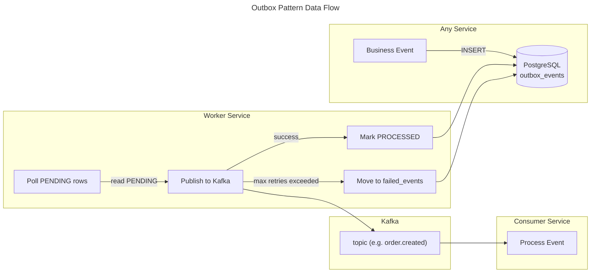

# C4 Code Level: Worker Service

## Overview

- **Name**: Worker Service
- **Description**: Background worker service responsible for reliable event publishing via the outbox pattern, Dead Letter Queue (DLQ) handling with retry logic, and scheduled cron jobs for system maintenance tasks such as auto-cancelling expired orders and cleaning up abandoned carts.
- **Location**: `D:\dev\stealing-from-paradise\backend\worker-service\`
- **Language**: Java 25 + Spring Boot 4.0.4
- **Purpose**: Background job processing, outbox pattern for reliable event publishing, DLQ retry handling, distributed locking via ShedLock, and scheduled system maintenance tasks. The service currently contains its configuration infrastructure (security, database, Kafka) and migration scripts; the scheduled job logic (outbox publisher, DLQ retry, cron jobs) is designed to reside in scheduled service classes within this module.

## Code Elements

### Configuration Classes

#### `SecurityConfig`
- **Description**: Spring Security configuration for the Worker Service. Registers the `JwtTokenDecoderFilter` (from common-lib) inside the `SecurityFilterChain` so that `X-User-*` headers set by the API Gateway are decoded into a `SecurityContext` before any authorization checks. Disables CSRF, HTTP Basic, form login, and anonymous access. Sets session management to STATELESS and permits all requests (the service relies on gateway-level auth for scheduled/background tasks). Registers the `JwtTokenDecoderFilter` as a `FilterRegistrationBean` with `setEnabled(false)` to prevent double registration (it runs inside the `SecurityFilterChain` instead).
- **Location**: `D:\dev\stealing-from-paradise\backend\worker-service\src\main\java\com\flashsale\workerservice\config\SecurityConfig.java`
- **Dependencies**: `JwtTokenDecoderFilter` (common-lib), `HttpSecurity`, `SecurityFilterChain`

##### Fields
| Visibility | Type | Name | Description |
|---|---|---|---|
| `private final` | `JwtTokenDecoderFilter` | `jwtTokenDecoderFilter` | Filter that decodes `X-User-*` headers into `SecurityContext` |

##### Constructor
- `SecurityConfig(JwtTokenDecoderFilter jwtTokenDecoderFilter)` — Injects the `JwtTokenDecoderFilter` from common-lib.

##### Methods
- `FilterRegistrationBean<JwtTokenDecoderFilter> jwtTokenDecoderFilterRegistration(JwtTokenDecoderFilter filter)` — Creates a `FilterRegistrationBean` with `setEnabled(false)` to prevent Spring Boot from auto-registering the filter globally, since it runs inside the `SecurityFilterChain`.
  - Location: Line 33-38
  - Dependencies: `FilterRegistrationBean`
- `SecurityFilterChain securityFilterChain(HttpSecurity http)` — Builds the `SecurityFilterChain`:
  - Disables CSRF, HTTP Basic, form login, anonymous access
  - Sets `SessionCreationPolicy.STATELESS`
  - Configures headers: frame options deny, referrer policy `STRICT_ORIGIN_WHEN_CROSS_ORIGIN`
  - Permits all requests (`.anyRequest().permitAll()`)
  - Adds `jwtTokenDecoderFilter` before `UsernamePasswordAuthenticationFilter`
  - Location: Line 41-59
  - Dependencies: `HttpSecurity`, `SecurityFilterChain`, `AbstractHttpConfigurer`, `SessionCreationPolicy`, `ReferrerPolicyHeaderWriter`

### External Dependencies (from common-lib)

The Worker Service depends on the following classes from the `common-lib` module:

#### `JwtTokenDecoderFilter` (common-lib)
- **Description**: A `OncePerRequestFilter` that extracts `X-User-Id`, `X-User-Email`, and `X-User-Role` headers (set by the API Gateway after JWT validation) and populates Spring Security's `SecurityContextHolder` with a `UsernamePasswordAuthenticationToken`. Includes defense-in-depth: validates `userId` as a positive long integer and checks the role against a whitelist (`ADMIN`, `SELLER`, `BUYER`). Runs at `HIGHEST_PRECEDENCE + 10` to precede `AuthorizationFilter`.
- **Location**: `D:\dev\stealing-from-paradise\backend\common-lib\src\main\java\com\flashsale\commonlib\filter\JwtTokenDecoderFilter.java`

##### Methods
- `void doFilterInternal(HttpServletRequest request, HttpServletResponse response, FilterChain filterChain)` — Main filter logic: reads headers, validates userId/role, creates `UserDetailsImpl`, sets `UsernamePasswordAuthenticationToken` in `SecurityContextHolder`.
  - Location: Line 44-94
- `long parseAndValidateUserId(String userId)` — Parses userId string to `long` and validates it is a positive number. Throws `IllegalArgumentException` on failure.
  - Location: Line 99-108
- `String validateRole(String role)` — Validates the role against `ALLOWED_ROLES` set. Returns uppercase validated role or `null`.
  - Location: Line 114-120

#### `UserDetailsImpl` (common-lib)
- **Description**: Custom `UserDetails` implementation used by the `JwtTokenDecoderFilter` to represent authenticated principals. Built with Lombok `@Builder`.
- **Location**: `D:\dev\stealing-from-paradise\backend\common-lib\src\main\java\com\flashsale\commonlib\security\UserDetailsImpl.java`

##### Fields
| Type | Name | Description |
|---|---|---|
| `Long` | `id` | User ID |
| `String` | `username` | Username (same as userId) |
| `String` | `email` | User email |
| `String` | `password` | Password (null for header-based auth) |
| `String` | `role` | User role (ADMIN, SELLER, BUYER) |
| `boolean` | `enabled` | Account enabled status |

##### Methods
- `Collection<? extends GrantedAuthority> getAuthorities()` — Returns a singleton list with `ROLE_<role>` or empty list.

#### `KafkaTopics` (common-lib)
- **Description**: Utility class defining constant Kafka topic names used across all services. While not directly referenced in the current Worker Service Java code, these topics are the targets for the planned outbox event publisher.
- **Location**: `D:\dev\stealing-from-paradise\backend\common-lib\src\main\java\com\flashsale\commonlib\event\KafkaTopics.java`

##### Key Topic Constants
| Constant | Value | Producer |
|---|---|---|
| `PRODUCT_CREATED` | `product.created` | Product Service |
| `PRODUCT_APPROVED` | `product.approved` | Product Service |
| `ORDER_CREATED` | `order.created` | Order Service |
| `ORDER_CANCELLED` | `order.cancelled` | Order Service |
| `ORDER_AUTO_CANCELLED` | `order.auto_cancelled` | Worker Service |
| `PAYMENT_SUCCESS` | `payment.success` | Payment Service |
| `REFUND_REQUESTED` | `refund.requested` | Payment Service |
| `FLASH_SALE_SESSION_STARTED` | `flash_sale.session_started` | Flash Sale Service |
| `FLASH_SALE_SESSION_ENDED` | `flash_sale.session_ended` | Flash Sale Service / Worker |

### Database Migrations

#### `V1__init_outbox_failed_events_shedlock.sql`
- **Description**: Flyway migration (schema `worker`) that creates three core tables:
  - `outbox_events` — Stores events to be published to Kafka reliably via the outbox pattern. Columns: `id` (BIGSERIAL PK), `topic`, `payload` (JSONB), `status`, `retry_count`, `processed_at`, `created_at`, `updated_at`.
  - `failed_events` — Dead Letter Queue table for events that failed after maximum retries. Columns: `id` (BIGSERIAL PK), `topic_or_task`, `payload` (JSONB), `error_reason`, `retry_count`, `status`, `created_at`, `updated_at`.
  - `shedlock` — Distributed lock table for ShedLock to ensure only one instance runs scheduled jobs. Columns: `name` (VARCHAR 64 PK), `lock_until`, `locked_at`, `locked_by`.
  - Indexes on `outbox_events(status)` and `failed_events(status)` for efficient status-based queries.
- **Location**: `D:\dev\stealing-from-paradise\backend\worker-service\src\main\resources\db\migration\V1__init_outbox_failed_events_shedlock.sql`

### Planned / Future Code Elements

Based on the database schema and application configuration, the Worker Service is designed to host the following logical components (to be implemented in scheduled service classes):

#### `OutboxEventPublisher` (planned)
- **Description**: Scheduled job that polls the `outbox_events` table for `PENDING` records, publishes each event to the corresponding Kafka topic, updates status to `PROCESSED`, and increments `retry_count` on failure. Events exceeding max retries are moved to `failed_events`.
- **Technology**: Spring `@Scheduled` or Quartz `@DisallowConcurrentExecution` + Kafka `KafkaTemplate`
- **Dependencies**: `JdbcTemplate` or Spring Data JPA, `KafkaTemplate`

#### `DlqRetryProcessor` (planned)
- **Description**: Scheduled job that polls the `failed_events` table for `PENDING` records and retries publishing them. Provides a backoff mechanism and manual DLQ management.
- **Technology**: Spring `@Scheduled`
- **Dependencies**: `JdbcTemplate` or Spring Data JPA, `KafkaTemplate`

#### `OrderAutoCancellationJob` (planned)
- **Description**: Scheduled job that finds unpaid orders past their payment deadline and publishes `ORDER_AUTO_CANCELLED` events to Kafka via the outbox pattern.
- **Technology**: Quartz `@DisallowConcurrentExecution`

#### `CartCleanupJob` (planned)
- **Description**: Scheduled job that removes abandoned cart entries older than a configured threshold.
- **Technology**: Quartz `@DisallowConcurrentExecution`

## Dependencies

### Internal Dependencies

| Dependency | Type | Description |
|---|---|---|
| `common-lib` | Maven module (`com.flashsale:common-lib:0.0.1-SNAPSHOT`) | Shared library providing `JwtTokenDecoderFilter`, `UserDetailsImpl`, `KafkaTopics`, and utility classes |

### External Dependencies

#### Build / Framework

| Dependency | Version | Scope | Description |
|---|---|---|---|
| Spring Boot Starter Web | 4.0.4+ | compile | REST endpoints, embedded Tomcat |
| Spring Boot Starter Data JPA | 4.0.4+ | compile | JPA/Hibernate for database access |
| Spring Boot Configuration Processor | 4.0.4+ | optional | IDE support for `@ConfigurationProperties` |
| Spring Boot Flyway | 4.0.4+ | compile | Database migration management |
| Flyway Core | (managed) | compile | Core Flyway migration engine |
| Flyway Database PostgreSQL | (managed) | compile | PostgreSQL dialect for Flyway |
| Spring Cloud Starter Netflix Eureka Client | (managed) | compile | Service discovery registration |
| Spring Boot Starter Quartz | 4.0.4+ | compile | Quartz scheduler for cron jobs |
| Lombok | (managed) | provided | Boilerplate reduction (`@Slf4j`, `@Builder`) |

#### Database

| Dependency | Version | Scope | Description |
|---|---|---|---|
| PostgreSQL JDBC Driver | (managed) | runtime | PostgreSQL database connectivity |
| ShedLock Spring | 5.13.0 | compile | Distributed lock abstraction for scheduled tasks |
| ShedLock JDBC Template Provider | 5.13.0 | compile | JDBC-based lock store for ShedLock |

#### Infrastructure

| Dependency | Description |
|---|---|
| Apache Kafka | Event streaming platform (outbox target) |
| PostgreSQL | Primary database (outbox_events, failed_events, shedlock tables) |
| Eureka | Service discovery server registration |
| API Gateway | Sets `X-User-*` headers after JWT validation |

## Configuration

### Application Properties (`application.yml`)
- **Server port**: `8088`
- **Database**: PostgreSQL, schema `worker` in database `flashsale_platform`
- **Kafka**: Bootstrap at `localhost:9092`, consumer group `worker-service-group`, JSON serialization, `earliest` auto-offset reset, manual commit disabled
- **Flyway**: Enabled, baseline on migrate, schema `worker`, clean disabled
- **JPA**: Hibernate PostgreSQL dialect, DDL none, batch inserts enabled
- **Eureka**: Registered with service discovery at `http://localhost:8761/eureka/`, prefers IP address
- **Virtual Threads**: Enabled (`spring.threads.virtual.enabled: true`) for Java 21+ project loom

### Prod Profile (`application-prod.yml`)
- Disables SQL logging, sets root logging to INFO, suppresses verbose Hibernate/Kafka logs, disables dev-data loading.

## Database Schema

### `outbox_events`

| Column | Type | Constraints | Description |
|---|---|---|---|
| `id` | BIGSERIAL | PK | Auto-increment event ID |
| `topic` | VARCHAR(100) | NOT NULL | Kafka topic name |
| `payload` | JSONB | NOT NULL | Event payload as JSON |
| `status` | VARCHAR(20) | NOT NULL, DEFAULT 'PENDING' | Event processing status |
| `retry_count` | INT | NOT NULL, DEFAULT 0 | Number of retry attempts |
| `processed_at` | TIMESTAMP | nullable | When the event was processed |
| `created_at` | TIMESTAMP | NOT NULL, DEFAULT NOW() | Row creation timestamp |
| `updated_at` | TIMESTAMP | NOT NULL, DEFAULT NOW() | Row last update timestamp |

**Index**: `idx_outbox_events_status` on `status`

### `failed_events`

| Column | Type | Constraints | Description |
|---|---|---|---|
| `id` | BIGSERIAL | PK | Auto-increment event ID |
| `topic_or_task` | VARCHAR(100) | NOT NULL | Kafka topic or task identifier |
| `payload` | JSONB | nullable | Event payload as JSON |
| `error_reason` | TEXT | nullable | Error description |
| `retry_count` | INT | NOT NULL, DEFAULT 0 | Number of retry attempts |
| `status` | VARCHAR(30) | NOT NULL, DEFAULT 'PENDING' | DLQ entry status |
| `created_at` | TIMESTAMP | NOT NULL, DEFAULT NOW() | Row creation timestamp |
| `updated_at` | TIMESTAMP | NOT NULL, DEFAULT NOW() | Row last update timestamp |

**Index**: `idx_failed_events_status` on `status`

### `shedlock`

| Column | Type | Constraints | Description |
|---|---|---|---|
| `name` | VARCHAR(64) | PK | Lock name (unique per scheduled task) |
| `lock_until` | TIMESTAMP | NOT NULL | Timestamp until which the lock is held |
| `locked_at` | TIMESTAMP | NOT NULL | When the lock was acquired |
| `locked_by` | VARCHAR(255) | NOT NULL | Instance that holds the lock |

## Relationships

The Worker Service is a single-configuration module with no controllers, services, or repositories implemented yet. The diagram below depicts the planned architecture based on the existing database schema and configuration.

```mermaid
---
title: Code Diagram for Worker Service
---
flowchart TB
    subgraph WorkerService["Worker Service (port 8088)"]
        direction TB
        Security[SecurityConfig<br/>JWT Header Decoder]

        subgraph ScheduledJobs["Planned Scheduled Jobs"]
            OutboxPublisher[OutboxEventPublisher<br/>@Scheduled]
            DlqRetry[DlqRetryProcessor<br/>@Scheduled]
            AutoCancel[OrderAutoCancellationJob<br/>Quartz Job]
            CartCleanup[CartCleanupJob<br/>Quartz Job]
        end

        subgraph Database["PostgreSQL (schema: worker)"]
            OutboxTable[outbox_events<br/>PENDING -> PROCESSED]
            FailedTable[failed_events<br/>DLQ storage]
            ShedLockTable[shedlock<br/>distributed locks]
        end
    end

    subgraph CommonLib["common-lib"]
        JwtFilter[JwtTokenDecoderFilter<br/>X-User-* -> SecurityContext]
        UserDetails[UserDetailsImpl]
        KafkaTopics[KafkaTopics<br/>topic constants]
    end

    subgraph Infrastructure["Infrastructure"]
        Gateway[API Gateway<br/>sets X-User-* headers]
        Eureka[Eureka Discovery]
        Kafka["Kafka<br/>(event streaming)"]
    end

    Security --> JwtFilter
    JwtFilter --> UserDetails
    OutboxPublisher --> OutboxTable
    OutboxPublisher -->|publishes to| Kafka
    OutboxPublisher -->|moves failed to| FailedTable
    DlqRetry --> FailedTable
    DlqRetry -->|retries| Kafka
    AutoCancel --> OutboxTable
    CartCleanup --> OutboxTable
    OutboxPublisher --> ShedLockTable
    DlqRetry --> ShedLockTable
    AutoCancel --> ShedLockTable
    CartCleanup --> ShedLockTable
    WorkerService --> Eureka
    WorkerService --> KafkaTopics
    Gateway -->|X-User-Id, X-User-Email, X-User-Role| Security
```

### Data Flow: Outbox Pattern



## Notes

- The Worker Service currently contains its security configuration, database migrations, and application configuration. The scheduled job implementations (outbox publisher, DLQ retry, order auto-cancellation, cart cleanup) are planned components that will reside in service classes within the `com.flashsale.workerservice` package.
- The outbox pattern ensures reliable event publishing: services write events to the shared `outbox_events` table in a local transaction, and the Worker Service asynchronously publishes them to Kafka. This eliminates the dual-write problem (database + Kafka) and ensures at-least-once delivery.
- ShedLock provides distributed locking so that only one instance of the Worker Service executes each scheduled job at a time, critical when multiple replicas are running.
- Virtual threads (Java 21+ Project Loom) are enabled for improved throughput in I/O-bound scheduled tasks.
- The service registers with Eureka for service discovery, enabling other services to locate it if needed, though as a background worker it primarily consumes from the database rather than exposing HTTP endpoints.
