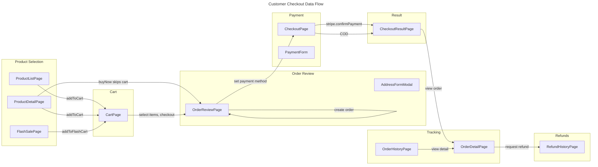

# C4 Code Level: Customer Web App

## Overview

- **Name**: Customer Web App (flashsale-customer)
- **Description**: React SPA for customers -- browsing products, flash sales, cart management, multi-step checkout with Stripe, order tracking with refunds, loyalty points, trust score, profile management, and shipping address management. Served by Vite dev server on port 3000.
- **Location**: [frontend/apps/customer/](../../frontend/apps/customer/)
- **Language**: TypeScript 5.6.2 + React 19.0.0 + Vite 6.0.0 + Tailwind CSS 3.4.1
- **Purpose**: Customer-facing shopping portal that consumes backend microservice APIs via the shared API layer.

## Code Elements

### Entry Point

#### `main.tsx`
- **Description**: Application bootstrap. Creates the React Query client, wraps the app in `ErrorBoundary`, `QueryClientProvider`, and `BrowserRouter`.
- **Location**: [frontend/apps/customer/src/main.tsx](../../frontend/apps/customer/src/main.tsx)
- **Dependencies**: `@shared/lib/queryClient`, `@shared/components/ErrorBoundary`, `react-router-dom`, `@/App`
- **Imports**:
  - `createQueryClient` from `@shared/lib/queryClient`
  - `ErrorBoundary` from `@shared/components/ErrorBoundary`
  - `App` from `@/App`

### App Root

#### `App.tsx`
- **Description**: Root component with lazy-loaded route definitions. Defines navigation links (products, flash sales, cart, orders, refunds, profile, addresses, settings). Auth pages (login, register) render without `Layout`. All other pages render inside `Layout` with navbar and footer. Private routes are wrapped in `PrivateRoute`.
- **Location**: [frontend/apps/customer/src/App.tsx](../../frontend/apps/customer/src/App.tsx)
- **Lazy-loaded Pages**:
  - `LoginPage`, `RegisterPage` (from `@shared/pages`)
  - `ProductListPage`, `ProductDetailPage`, `CartPage`, `OrderReviewPage`, `CheckoutPage`, `CheckoutResultPage`, `FlashSalePage`, `OrderHistoryPage`, `OrderDetailPage`, `ProfilePage`, `AddressPage`, `AccountSettingsPage`, `RefundHistoryPage`
- **Route Structure**:
  - `/login`, `/register` -- no layout
  - `/products` -- public product listing
  - `/products/:productId` -- product detail
  - `/flash-sales` -- flash sale sessions
  - `/checkout/result` -- checkout result
  - `/cart`, `/checkout`, `/checkout/payment` -- private (cart/checkout flow)
  - `/orders`, `/orders/:parentOrderId` -- private (order tracking)
  - `/refunds` -- private (refund history)
  - `/profile`, `/addresses`, `/account-settings` -- private (account management)
  - `/` redirects to `/products`
- **Dependencies**: `react-router-dom`, `@shared/components/Layout`, `@shared/components/PrivateRoute`

### Pages

#### `ProductListPage.tsx`
- **Description**: Product catalog page with search bar, category filter (electronics, fashion, home, accessories, books, footwear, bags), paginated product grid. Each `ProductCard` shows image, name, price, discount badge, flash sale badge, rating, and "Add to cart" / "Detail" buttons. Handles loading skeletons, error state, and empty state.
- **Location**: [frontend/apps/customer/src/pages/ProductListPage.tsx](../../frontend/apps/customer/src/pages/ProductListPage.tsx)
- **Local Components**:
  - `ProductCard({ product, onAddToCart })` -- renders individual product card with add-to-cart
- **Hooks**: `useState`, `useNavigate`, `useQuery`, `useCartStore`
- **API Dependencies**:
  - `productApi.getProducts(params)` -- fetches paginated product list
  - `cartStore.addToCart(skuCode, quantity, fsItemId)` -- adds first variant to cart
- **Params**: `category`, `search`, `page`, `size: 20`

#### `ProductDetailPage.tsx`
- **Description**: Full product detail view with breadcrumb, image gallery, price with discount, variant selection, quantity selector, "Add to cart" and "Buy now" buttons. "Buy now" auto-selects default address, adds to cart, creates checkout, and navigates to payment. Includes description section. Handles loading, error, missing productId, and success/error feedback.
- **Location**: [frontend/apps/customer/src/pages/ProductDetailPage.tsx](../../frontend/apps/customer/src/pages/ProductDetailPage.tsx)
- **Hooks**: `useState`, `useRef`, `useParams`, `useNavigate`, `useQuery`, `useMutation`, `useQueryClient`, `useCartStore`
- **API Dependencies**:
  - `productApi.getProductById(productId)` -- fetch product detail
  - `addressApi.list()` -- fetch addresses for "Buy now" flow
  - `cartApi.addItem(skuCode, quantity, fsItemId)` -- direct API call for Buy Now
  - `orderApi.checkout({ addressId, itemIds })` -- creates order for Buy Now
- **State**: `selectedVariant` (index), `quantity`, `isAdding`, `isBuyNow`, `successMsg`, `addError`

#### `CartPage.tsx`
- **Description**: Shopping cart page with seller-grouped items. Shows cart items grouped by seller with checkboxes for selection. Features: select all, individual item selection, quantity increment/decrement with stock/limit validation, flash sale indicators (expired/active), order summary sidebar with subtotal/free shipping. Empty cart state with "Continue shopping" link.
- **Location**: [frontend/apps/customer/src/pages/CartPage.tsx](../../frontend/apps/customer/src/pages/CartPage.tsx)
- **Hooks**: `useEffect`, `useState`, `useCartStore`
- **Dependencies**: `@shared/store/cartStore`
- **Store Methods Used**: `cart`, `isLoading`, `fetchCart`, `updateQuantity`, `removeFromCart`
- **State**: `selectedItems` (Set of cartItemIds)
- **Utility Functions**:
  - `isFlashExpired(iso?)` -- checks if flash sale time has expired
  - `fmt(n)` -- formats number to VND currency

#### `OrderReviewPage.tsx`
- **Description**: Multi-step order review page (step 1: select address, step 2: review order summary, step 3: payment method selection). Includes `AddressFormModal` (create/edit address with province/district selectors), `DeleteAddressModal` (confirm delete), and `NoDefaultAddressDialog`. Supports Stripe and COD payment methods. Persists checkout data to `sessionStorage` for recovery after page refresh.
- **Location**: [frontend/apps/customer/src/pages/OrderReviewPage.tsx](../../frontend/apps/customer/src/pages/OrderReviewPage.tsx)
- **Internal Components**:
  - `AddressFormModal({ address?, onClose, onSuccess })` -- create/edit address modal with province/district dropdowns
  - `DeleteAddressModal({ address, onClose, onSuccess })` -- confirm deletion modal
- **Hooks**: `useEffect`, `useState`, `useNavigate`, `useLocation`, `useQuery`, `useMutation`, `useQueryClient`, `useCartStore`
- **API Dependencies**:
  - `addressApi.list()` -- fetch all addresses
  - `addressApi.create(data)` -- create new address
  - `addressApi.update(id, data)` -- update existing address
  - `addressApi.remove(id)` -- delete address
  - `orderApi.checkout({ addressId, itemIds })` -- create checkout
- **State**: `selectedAddressId`, `orderData`, `step` (address/review/payment), `paymentMethod` (stripe/cod), `showAddressForm`, `editingAddress`, `deletingAddress`, `apiError`
- **Province/District Data**: Hardcoded for HCMC, Hanoi, Da Nang, Hai Phong, Can Tho, Binh Duong, Dong Nai

#### `CheckoutPage.tsx`
- **Description**: Payment page with Stripe `PaymentElement` and countdown timer. Recoverable from `sessionStorage` if navigated directly. Shows shipping address, sub-order list (per seller), price breakdown, payment form with Stripe Elements. Auto-redirects on timeout. Handles payment success/failure.
- **Location**: [frontend/apps/customer/src/pages/CheckoutPage.tsx](../../frontend/apps/customer/src/pages/CheckoutPage.tsx)
- **Internal Components**:
  - `PaymentForm({ orderData, onSuccess })` -- renders Stripe `PaymentElement` and handles `confirmPayment` with `redirect: 'if_required'`
- **Hooks**: `useState`, `useEffect`, `useNavigate`, `useLocation`, `useQuery`, `useStripe`, `useElements`
- **API Dependencies**:
  - `paymentApi.getClientSecret(parentOrderId)` -- fetch Stripe client secret
  - `orderApi.getParentOrder(parentOrderId)` -- fetch parent order for shipping address
- **Stripe Methods**: `stripe.confirmPayment()`
- **State**: `countdown` (timer), `orderData` (from location state or sessionStorage)

#### `CheckoutResultPage.tsx`
- **Description**: Checkout result page showing success or failure status. On success: payment details card, COD info, order tracking link. On failure: error message, retry button. Recovers state from URL search params (`?payment_intent`, `?redirect_status`), location state, and `sessionStorage`. Polls payment status and order status for COD. Clears cart on success.
- **Location**: [frontend/apps/customer/src/pages/CheckoutResultPage.tsx](../../frontend/apps/customer/src/pages/CheckoutResultPage.tsx)
- **Hooks**: `useEffect`, `useState`, `useSearchParams`, `useLocation`, `useNavigate`, `useQuery`, `useCartStore`
- **API Dependencies**:
  - `paymentApi.getPayment(parentOrderId)` -- poll payment status
  - `orderApi.getParentOrder(parentOrderId)` -- poll COD order status
  - `cartStore.clearCart()` -- clear cart on success
- **Utility Functions**:
  - `recoverStoredOrderData()` -- recovers checkout from sessionStorage

#### `FlashSalePage.tsx`
- **Description**: Flash sale landing page with hero section, countdown timer for active/upcoming sessions, session tab navigation, product grid with `FlashItemCard` (shows discount %, progress bar for sold/remaining, sold-out overlay). Includes "All sessions" overview table. Handles loading skeletons and empty states.
- **Location**: [frontend/apps/customer/src/pages/FlashSalePage.tsx](../../frontend/apps/customer/src/pages/FlashSalePage.tsx)
- **Internal Components**:
  - `Countdown({ targetTime })` -- real-time countdown with HH:MM:SS display
  - `FlashItemCard({ item, sessionActive, onBuy, isBuying })` -- flash sale product card with progress bar
- **Hooks**: `useState`, `useEffect`, `useCallback`, `useNavigate`, `useQuery`, `useCartStore`
- **API Dependencies**:
  - `flashSaleApi.getSessions({ size })` -- list all sessions
  - `flashSaleApi.getSession(sessionId)` -- get session with items
  - `cartStore.addToCart(skuCode, 1, fsItemId)` -- add flash item to cart
- **State**: `activeSessionId`, `successMsg`, `buyingSku`
- **Stale Time**: sessions: 60s, session detail: 30s

#### `OrderHistoryPage.tsx`
- **Description**: Buyer order history with status filters (ALL, PENDING, PAID, SHIPPING, DELIVERED, CANCELLED, PARTIALLY_REFUNDED, REFUNDED, RETURNED). Paginated list showing order code, seller, item count, amount, status badge, date, and action label. Auto-refreshes every 10s when active orders exist. Handles loading, error, and empty states.
- **Location**: [frontend/apps/customer/src/pages/OrderHistoryPage.tsx](../../frontend/apps/customer/src/pages/OrderHistoryPage.tsx)
- **Hooks**: `useState`, `useNavigate`, `useQuery`
- **API Dependencies**:
  - `orderApi.getOrders({ status, page, size })` -- paginated order list
- **State**: `filter` (OrderStatus | 'ALL'), `page`

#### `OrderDetailPage.tsx`
- **Description**: Parent order detail with sub-orders per seller. Shows payment info (amount, method, status, timestamp), shipping address, sub-order status, items list, tracking info, and action buttons (cancel, confirm received, partial refund, full refund). Includes modals: `CancelModal` (reason + note), `PartialRefundModal` (item selection with quantity/reason), `FullRefundModal` (reason), `ConfirmReceivedModal`. Paginated.
- **Location**: [frontend/apps/customer/src/pages/OrderDetailPage.tsx](../../frontend/apps/customer/src/pages/OrderDetailPage.tsx)
- **Internal Components**:
  - `CancelModal({ order, queryClient, parentOrderId, onClose, onSuccess })` -- cancel order with reason dropdown
  - `PartialRefundModal({ order, onClose, onSuccess })` -- partial refund with item-level selection
  - `FullRefundModal({ parentOrderId, onClose, onSuccess })` -- full refund for all sub-orders
  - `ConfirmReceivedModal({ order, onClose, onSuccess })` -- confirm delivery receipt
- **Hooks**: `useState`, `useParams`, `useNavigate`, `useQuery`, `useMutation`, `useQueryClient`
- **API Dependencies**:
  - `orderApi.getParentOrder(parentOrderId)` -- parent order with sub-orders
  - `paymentApi.getPayment(parentOrderId)` -- payment details
  - `orderApi.cancelOrder(orderId, { reason, note })` -- cancel sub-order
  - `orderApi.confirmReceived(orderId)` -- confirm delivery
  - `refundApi.requestFullRefund(parentOrderId, { reason })` -- full refund
  - `refundApi.requestPartialRefund(orderId, { reason, items })` -- partial refund
- **Status Helper Functions**:
  - `canCancel(status)` -- PENDING only
  - `canConfirmReceived(status)` -- SHIPPING only
  - `canRequestFullRefund(order)` -- PAID only
  - `canRequestPartialRefund(order)` -- PAID, SHIPPING, DELIVERED, PARTIALLY_REFUNDED

#### `RefundHistoryPage.tsx`
- **Description**: Refund history with status filters (ALL, PENDING, APPROVED, REJECTED, PROCESSING, COMPLETED). Paginated list of refund cards showing refund type (FULL/PARTIAL), amount, status, items, admin notes, reject reason, Stripe refund ID, review timestamp. Links to related order. Handles loading, error, and empty states.
- **Location**: [frontend/apps/customer/src/pages/RefundHistoryPage.tsx](../../frontend/apps/customer/src/pages/RefundHistoryPage.tsx)
- **Hooks**: `useState`, `useQuery`
- **API Dependencies**:
  - `refundApi.getMyRefunds({ status, page, size })` -- list buyer's refunds
- **State**: `filter`, `page`

#### `ProfilePage.tsx`
- **Description**: User profile page with avatar (upload via presigned URL), name, status badge, account info grid (email, phone, fullName, roles, status), and seller registration banner for non-sellers. Includes `EditModal` with `AvatarUpload` sub-component (5MB limit, image validation). Handles loading, error states.
- **Location**: [frontend/apps/customer/src/pages/ProfilePage.tsx](../../frontend/apps/customer/src/pages/ProfilePage.tsx)
- **Internal Components**:
  - `AvatarUpload({ currentAvatar, username, onUploadSuccess })` -- file picker with presigned URL upload flow
  - `EditModal({ profile, onClose, onSuccess })` -- inline editor for full name, phone, avatar
  - `StatusBadge({ status })` -- styled status indicator
- **Hooks**: `useState`, `useRef`, `useQuery`, `useMutation`, `useQueryClient`
- **API Dependencies**:
  - `userApi.getProfile()` -- fetch user profile
  - `userApi.updateProfile(data)` -- update fullName, phone, avatarUrl
  - `userApi.getAvatarPresignedUrl(contentType)` -- get presigned upload URL
  - `userApi.registerAsSeller()` -- register as SELLER role

#### `AddressPage.tsx`
- **Description**: Address management page with CRUD operations. Lists all addresses with "Default" badge, province/district display, edit and delete buttons. Includes `AddressModal` for create/edit with full Vietnam province/district data (63 provinces, HCMC + Hanoi districts). Delete confirmation modal. Handles loading, error, and empty states.
- **Location**: [frontend/apps/customer/src/pages/AddressPage.tsx](../../frontend/apps/customer/src/pages/AddressPage.tsx)
- **Internal Components**:
  - `AddressModal({ address?, defaultData?, onClose, onSuccess })` -- create/edit modal with province/district data
- **Hooks**: `useState`, `useQuery`, `useMutation`, `useQueryClient`
- **API Dependencies**:
  - `addressApi.list()` -- list all addresses
  - `addressApi.create(data)` -- create address
  - `addressApi.update(id, data)` -- update address
  - `addressApi.remove(id)` -- delete address
- **Data Constants**: `PROVINCES` (63 provinces), `DISTRICTS` (40 districts for HCMC, Hanoi, Da Nang)
- **Helper Functions**: `getProvinceName(id)`, `getDistrictName(id)`

#### `AccountSettingsPage.tsx`
- **Description**: Account settings page with three tabs: Password (change password form with current/new/confirm fields, show/hide toggle, client-side validation), Notifications (toggle switches for email/push notifications for orders, promos, flash sales), Security (current session display, 2FA toggle, login devices list).
- **Location**: [frontend/apps/customer/src/pages/AccountSettingsPage.tsx](../../frontend/apps/customer/src/pages/AccountSettingsPage.tsx)
- **Internal Components**:
  - `PasswordTab()` -- password change form with validation and mutation
  - `NotificationsTab()` -- notification preference toggles (local state only, not persisted)
  - `SecurityTab()` -- static display of sessions and devices
- **Hooks**: `useState`, `useMutation`
- **API Dependencies**:
  - `userApi.changePassword({ currentPassword, newPassword })` -- change password

#### `LoyaltyPage.tsx`
- **Description**: Placeholder page for loyalty/reward points. Currently displays a title and description only.
- **Location**: [frontend/apps/customer/src/pages/LoyaltyPage.tsx](../../frontend/apps/customer/src/pages/LoyaltyPage.tsx)
- **Status**: Stub/placeholder

#### `TrustScorePage.tsx`
- **Description**: Placeholder page for user trust score. Currently displays a title and description only.
- **Location**: [frontend/apps/customer/src/pages/TrustScorePage.tsx](../../frontend/apps/customer/src/pages/TrustScorePage.tsx)
- **Status**: Stub/placeholder

### Components

#### `StripeCheckout.tsx`
- **Description**: Reusable Stripe checkout wrapper. Wraps `Elements` provider with `CheckoutForm`. The form handles `stripe.confirmPayment()` with `return_url` set to `/checkout/result`. Shows loading spinner and error messages.
- **Location**: [frontend/apps/customer/src/components/checkout/StripeCheckout.tsx](../../frontend/apps/customer/src/components/checkout/StripeCheckout.tsx)
- **Exports**: `StripeCheckout({ clientSecret })`
- **Internal**: `CheckoutForm()` -- uses `useStripe`, `useElements` hooks
- **Dependencies**: `@stripe/react-stripe-js`, `@/lib/stripe`

### Lib

#### `lib/stripe.ts`
- **Description**: Stripe.js singleton loader. Lazily initializes Stripe instance with `VITE_STRIPE_PUBLISHABLE_KEY` environment variable.
- **Location**: [frontend/apps/customer/src/lib/stripe.ts](../../frontend/apps/customer/src/lib/stripe.ts)
- **Exports**: `getStripe()` -- returns `Promise<Stripe | null>`
- **Dependencies**: `@stripe/stripe-js`

## Dependencies

### Internal Dependencies (from `frontend/shared/`)

| Module | Path | Used By |
|--------|------|---------|
| `Layout` | `@shared/components/Layout` | App.tsx |
| `PrivateRoute` | `@shared/components/PrivateRoute` | App.tsx |
| `ErrorBoundary` | `@shared/components/ErrorBoundary` | main.tsx |
| `createQueryClient` | `@shared/lib/queryClient` | main.tsx |
| `productApi` | `@shared/api/product.api` | ProductListPage, ProductDetailPage |
| `orderApi` | `@shared/api/order.api` | ProductDetailPage, OrderReviewPage, CheckoutPage, CheckoutResultPage, OrderHistoryPage, OrderDetailPage |
| `cartApi` | `@shared/api/cart.api` | ProductDetailPage (Buy Now) |
| `addressApi` | `@shared/api/address.api` | ProductDetailPage, OrderReviewPage, AddressPage |
| `paymentApi` | `@shared/api/payment.api` | CheckoutPage, CheckoutResultPage, OrderDetailPage |
| `flashSaleApi` | `@shared/api/flashSale.api` | FlashSalePage |
| `refundApi` | `@shared/api/refund.api` | OrderDetailPage, RefundHistoryPage |
| `userApi` | `@shared/api/user.api` | ProfilePage, AccountSettingsPage, AddressPage |
| `useCartStore` (zustand) | `@shared/store/cartStore` | ProductListPage, ProductDetailPage, FlashSalePage, OrderReviewPage, CheckoutResultPage, CartPage |
| `ApiResponse`, `PageResponse` | `@shared/types/api` | (Type imports) |
| `LoginPage`, `RegisterPage` | `@shared/pages` | App.tsx (lazy-loaded) |
| `axios` instance | `@shared/lib/axios` | (Used via API modules) |

### External Dependencies

| Package | Version | Usage |
|---------|---------|-------|
| `react` | ^19.0.0 | UI framework |
| `react-dom` | ^19.0.0 | DOM rendering |
| `react-router-dom` | ^6.26.0 | Client-side routing |
| `axios` | ^1.7.9 | HTTP client |
| `@tanstack/react-query` | ^5.62.0 | Server state management, caching, polling |
| `zustand` | ^5.0.2 | Client-side state management (cart store) |
| `js-cookie` | ^3.0.5 | Cookie management (access/refresh tokens) |
| `@stripe/stripe-js` | ^5.5.0 | Stripe.js SDK for payment intents |
| `@stripe/react-stripe-js` | ^3.2.0 | React bindings for Stripe Elements |

### Development Dependencies

| Package | Version | Usage |
|---------|---------|-------|
| `vite` | ^6.0.0 | Build tool and dev server |
| `typescript` | ^5.6.2 | Type checking |
| `tailwindcss` | ^3.4.1 | Utility-first CSS framework |
| `postcss` | ^8.4.38 | CSS processing |
| `autoprefixer` | ^10.4.18 | CSS vendor prefixes |

## Relationships

### Page-Component-Relationship Diagram

The following diagram shows the page-to-component relationships, shared dependencies, and the checkout flow.

```mermaid
---
title: Code Diagram for Customer Web App
---
classDiagram
    namespace Shared_Layer {
        class Layout {
            <<component>>
            +appName
            +links[] NavLink
            +authLinks[] NavLink
        }
        class PrivateRoute {
            <<component>>
            +role?
            +loginPath?
        }
        class ErrorBoundary {
            <<component>>
            +fallback?
        }
        class cartStore {
            <<zustand>>
            +cart Cart
            +fetchCart()
            +addToCart(skuCode, qty, fsItemId)
            +updateQuantity(itemId, qty)
            +removeFromCart(itemId)
            +clearCart()
        }
        class productApi {
            <<api module>>
            +getProducts(params)
            +getProductById(id)
        }
        class orderApi {
            <<api module>>
            +checkout(req)
            +getOrders(params)
            +getParentOrder(id)
            +cancelOrder(id, body)
            +confirmReceived(id)
        }
        class cartApi {
            <<api module>>
            +getCart()
            +addItem(skuCode, qty, fsItemId)
            +updateItemQuantity(itemId, qty)
            +removeItem(itemId)
            +clearCart()
        }
        class addressApi {
            <<api module>>
            +list()
            +create(data)
            +update(id, data)
            +remove(id)
        }
        class paymentApi {
            <<api module>>
            +getPayment(parentOrderId)
            +getClientSecret(parentOrderId)
        }
        class flashSaleApi {
            <<api module>>
            +getSessions(params)
            +getSession(id)
        }
        class refundApi {
            <<api module>>
            +getMyRefunds(params)
            +requestFullRefund(poId, body)
            +requestPartialRefund(oId, body)
        }
        class userApi {
            <<api module>>
            +getProfile()
            +updateProfile(data)
            +changePassword(data)
            +getAvatarPresignedUrl(contentType)
            +registerAsSeller()
        }
    }

    namespace Customer_App {
        class App {
            <<root>>
            +lazy route definitions
        }
        class main {
            <<entry>>
            +bootstrap
        }
    }

    namespace Pages {
        class ProductListPage {
            +search, filter, paginate
            +ProductCard component
        }
        class ProductDetailPage {
            +variants, qty, add-to-cart, buy-now
        }
        class FlashSalePage {
            +Countdown, FlashItemCard
            +sessions, tabs
        }
        class CartPage {
            +seller-grouped items
            +select/deselect, qty controls
        }
        class OrderReviewPage {
            +AddressFormModal, DeleteAddressModal
            +3-step: address, review, payment
        }
        class CheckoutPage {
            +PaymentForm (Stripe Elements)
            +countdown timer
        }
        class CheckoutResultPage {
            +success/failure states
            +payment polling
        }
        class OrderHistoryPage {
            +status filters, pagination
        }
        class OrderDetailPage {
            +CancelModal, PartialRefundModal
            +FullRefundModal, ConfirmReceivedModal
        }
        class RefundHistoryPage {
            +status filters, pagination
        }
        class ProfilePage {
            +AvatarUpload, EditModal
        }
        class AddressPage {
            +AddressModal
            +province/district data
        }
        class AccountSettingsPage {
            +PasswordTab, NotificationsTab, SecurityTab
        }
        class LoyaltyPage {
            +stub
        }
        class TrustScorePage {
            +stub
        }
    }

    namespace Stripe {
        class StripeCheckout {
            <<component>>
            +clientSecret
        }
        class getStripe {
            <<lib>>
            +singleton loader
        }
    }

    %% Layer connections
    main --> App : renders
    main --> ErrorBoundary : wraps
    main --> Layout : uses
    App --> PrivateRoute : wrapper for auth pages
    App --> Layout : wrapper for main pages
    App --> Pages : lazy-loaded routes

    %% Page to API/store connections
    ProductListPage --> productApi : getProducts()
    ProductListPage --> cartStore : addToCart()
    ProductDetailPage --> productApi : getProductById()
    ProductDetailPage --> cartApi : addItem()
    ProductDetailPage --> addressApi : list()
    ProductDetailPage --> orderApi : checkout()
    ProductDetailPage --> cartStore : addToCart()
    FlashSalePage --> flashSaleApi : getSessions(), getSession()
    FlashSalePage --> cartStore : addToCart()
    CartPage --> cartStore : fetchCart(), updateQuantity(), removeFromCart()
    OrderReviewPage --> addressApi : list(), create(), update(), remove()
    OrderReviewPage --> orderApi : checkout()
    OrderReviewPage --> cartStore : cart data
    CheckoutPage --> paymentApi : getClientSecret()
    CheckoutPage --> orderApi : getParentOrder()
    CheckoutResultPage --> paymentApi : getPayment()
    CheckoutResultPage --> orderApi : getParentOrder()
    CheckoutResultPage --> cartStore : clearCart()
    OrderHistoryPage --> orderApi : getOrders()
    OrderDetailPage --> orderApi : getParentOrder(), cancelOrder(), confirmReceived()
    OrderDetailPage --> paymentApi : getPayment()
    OrderDetailPage --> refundApi : requestFullRefund(), requestPartialRefund()
    RefundHistoryPage --> refundApi : getMyRefunds()
    ProfilePage --> userApi : getProfile(), updateProfile(), registerAsSeller()
    AddressPage --> addressApi : list(), create(), update(), remove()
    AccountSettingsPage --> userApi : changePassword()

    %% Stripe connections
    CheckoutPage --> StripeCheckout : delegates payment form
    StripeCheckout --> getStripe : initializes Stripe.js
    CheckoutPage --> orderApi : getParentOrder (address lookup)
```

### Checkout Data Flow



### Page Route Hierarchy

```mermaid
---
title: Route Structure for Customer App
---
flowchart TB
    subgraph Public Routes
        LOGIN[/login/]
        REG[/register/]
        PL[/products]
        PD[/products/:productId]
        FS[/flash-sales]
    end
    subgraph Private Routes
        CART[/cart]
        OR[/checkout]
        CH[/checkout/payment]
        CR[/checkout/result]
        OH[/orders]
        OD[/orders/:parentOrderId]
        RH[/refunds]
        PRO[/profile]
        ADDR[/addresses]
        AS[/account-settings]
    end
    subgraph Stub Routes
        LP[/loyalty]
        TS[/trust-score]
    end

    ROOT[/] -->|redirect| PL
    LOGIN --> PL
    REG --> PL
    PL -->|click product| PD
    PL -->|add to cart| CART
    PD -->|buy now| OR
    FS -->|add to cart| CART
    CART -->|checkout| OR
    OR -->|payment| CH
    CH -->|result| CR
    CR -->|view order| OD
    OH -->|click order| OD
    OD -->|refunds| RH
```

## Notes

- **State Management**: The app uses TanStack React Query for all server state (products, orders, addresses, payments, flash sales, refunds) with automatic caching, polling, and invalidation. Zustand is used only for the cart store (client-side cart state with cartApi as persistence layer).
- **Authentication**: Managed via cookies (`accessToken`, `refreshToken`) with automatic 401 interception and token refresh in `@shared/lib/axios`. The `PrivateRoute` component checks `authStore.isAuthenticated` or cookie presence.
- **Checkout Resilience**: The checkout flow persists `pending_checkout` data to `sessionStorage` so the payment page and result page can recover state after page refreshes or direct URL access. The `CheckoutResultPage` can recover from URL search params (`payment_intent`, `redirect_status`), React Router location state, and `sessionStorage`.
- **Flash Sale Validation**: Cart items check `flashExpiresAt` to detect expired flash sales and display warning states. Quantity controls respect `maxQuantityPerUser` and `stockAvailable` limits.
- **Stripe Integration**: Payment uses Stripe Elements with `redirect: 'if_required'` for a modal-style flow (no full-page redirect in most cases). The `return_url` is set to `/checkout/result` as fallback.
- **Localization**: All UI text is in Vietnamese with Vietnamese number formatting (`vi-VN` locale for VND).
- **Stub Pages**: `LoyaltyPage` and `TrustScorePage` are placeholders with static content only. They are not linked from the navigation (NAV_LINKS or AUTH_LINKS in App.tsx).
- **Order Detail Modals**: The order detail page uses four distinct modals (Cancel, ConfirmReceived, PartialRefund, FullRefund) each with separate mutations and state management, demonstrating a feature-rich order management UX.
