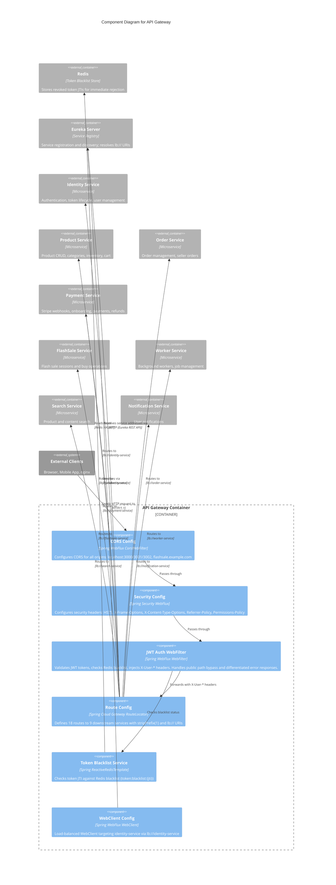

# C4 Component Level: API Gateway

## Overview

- **Name**: API Gateway
- **Description**: Spring Cloud Gateway (WebFlux/Reactive) serving as the single entry point for all client requests. Handles JWT validation, token blacklist checking via Redis, CORS, security headers, and routes requests to all downstream microservices through Eureka service discovery.
- **Type**: Infrastructure / API Gateway
- **Technology**: Spring Cloud Gateway (WebFlux/Reactive), Redis, JWT (HMAC-SHA256)

## Purpose

The API Gateway is the single entry point for all external client traffic entering the FlashSale platform. It centralizes cross-cutting concerns that would otherwise be duplicated across every microservice: authentication, authorization, CORS, security headers, rate limiting, and token revocation checking.

**Problems Solved**:

1. **Centralized Authentication**: Clients authenticate once at the gateway; downstream services receive pre-validated user context via `X-User-*` headers, eliminating the need for each service to independently validate JWT tokens.
2. **Token Revocation**: Checks a Redis-backed token blacklist on every authenticated request so that revoked tokens (from logout, password reset, or admin action) are rejected immediately without waiting for expiration.
3. **Routing Abstraction**: Clients send all requests to a single domain/port. The gateway resolves logical service names (`lb://identity-service`) to actual instances via Eureka, applies `stripPrefix(1)` to remove `/api` from paths, and forwards to the appropriate downstream service.
4. **Security Hardening**: Injects security headers (HSTS, X-Frame-Options, X-Content-Type-Options, Referrer-Policy, Permissions-Policy) on every response, centralizing browser security policy enforcement.
5. **CORS Management**: Configures Cross-Origin Resource Sharing once for all services, supporting multiple frontend origins (localhost:3000/3001/3002, production domain).
6. **Operational Visibility**: Exposes actuator endpoints (health, metrics, gateway routes, Prometheus) for monitoring and observability.

**Role in System**: The API Gateway sits between external clients (browser, mobile app, nginx) and the internal microservice mesh. All service-to-external communication flows through this component.

## Software Features

- **JWT Authentication**: Validates access tokens on every protected request using HMAC-SHA256. Extracts userId, email, role, and JTI (JWT ID) from the token and injects them as HTTP headers (`X-User-Id`, `X-User-Email`, `X-User-Role`, `X-Token-Jti`) for downstream services. Returns structured JSON error responses with error codes (AUTH_001, AUTH_004, AUTH_005) and Vietnamese messages.
- **Token Blacklist / Revocation**: Checks whether a token's JTI exists in Redis (`token:blacklist:{jti}`) on every authenticated request. Provides both blocking (`isTokenBlacklisted`) and reactive (`isTokenBlacklistedReactive`) check methods. Rejects blacklisted tokens with HTTP 401 and AUTH_005 error code ("Token da bi huy (logout)").
- **Public Path Bypass**: Maintains a whitelist of public paths (login, register, refresh, forgot-password, reset-password, Stripe webhooks, actuator health/info) that skip JWT authentication entirely.
- **Differentiated Protected-Path Handling**: For protected paths missing an Authorization header: returns 401 for sensitive endpoints (cart, orders, payments, notifications, users/me, support); passes through for non-sensitive endpoints (allowing public product browsing without authentication).
- **Routing to 9 Downstream Services**: Defines 18 named routes mapping path patterns to Eureka-registered services using `lb://` URIs with `stripPrefix(1)`. Target services: identity-service, product-service, order-service, payment-service, flashsale-service, worker-service, search-service, notification-service.
- **CORS Configuration**: Configures allowed origins, methods (GET/POST/PUT/PATCH/DELETE/OPTIONS), headers, exposed headers (Authorization, X-Total-Count), credentials support, and max age (3600s) for both programmatic (`CorsConfig`) and declarative (application.yml) CORS handling.
- **Security Headers**: Injects HSTS (includeSubdomains, maxAge 365 days), X-Frame-Options (DENY), X-Content-Type-Options, Referrer-Policy (STRICT_ORIGIN_WHEN_CROSS_ORIGIN), and Permissions-Policy (geolocation, microphone, camera, payment restricted) on every response.
- **Load-Balanced WebClient**: Provides a `@LoadBalanced` `WebClient.Builder` and a pre-configured `WebClient` targeting `identity-service` for gateway-to-service communication with client-side load balancing.
- **Elastic Connection Pooling**: Configures a reactive HTTP connection pool (max 500 connections default, 1000 in production) with configurable connect and response timeouts.

## Code Elements

This component contains the following code-level elements:

- [c4-code-backend-api-gateway.md](./c4-code-backend-api-gateway.md) -- Full code-level documentation for the API Gateway

### Key Classes

| Class | Role |
|---|---|
| `ApiGatewayApplication` | Spring Boot entry point; enables Eureka discovery and scans `com.flashsale` base package |
| `CorsConfig` | Configures CORS for the reactive WebFlux environment via `CorsWebFilter` bean |
| `SecurityConfig` | Configures WebFlux security: disables CSRF, sets security headers, permits all exchanges (auth delegated to `JwtAuthWebFilter`) |
| `WebClientConfig` | Creates load-balanced `WebClient.Builder` and `WebClient` bean targeting `lb://identity-service` |
| `RouteConfig` | Defines all 18 route mappings using Spring Cloud Gateway Java DSL with `stripPrefix(1)` and `lb://` target URIs |
| `JwtAuthWebFilter` | Primary reactive WebFilter for JWT authentication; runs at highest precedence; validates tokens and checks blacklist |
| `JwtAuthGatewayFilterFactory` | **Deprecated** GatewayFilterFactory-based JWT filter; marked for removal |
| `TokenBlacklistCheckService` | Checks JWT token JTI against Redis blacklist; provides both blocking and reactive methods |

## Interfaces

### HTTP Routing Interface

- **Protocol**: HTTP/1.1 (via Netty)
- **Description**: The API Gateway exposes a unified REST interface on port 8080 (configurable via `SERVER_PORT`) that accepts all client requests and routes them to downstream services.
- **Operations**:

  Public (unauthenticated):
  | Method | Path Pattern | Target Service |
  |---|---|---|
  | ALL | `/api/v1/auth/**` | identity-service |
  | ALL | `/api/v1/users/register` | identity-service |
  | ALL | `/api/v1/stripe/webhooks` | payment-service |
  | ALL | `/actuator/health`, `/actuator/info` | Gateway itself |

  Protected (JWT required):
  | Method | Path Pattern | Target Service |
  |---|---|---|
  | GET/POST/PUT/DELETE | `/api/v1/users/**` | identity-service |
  | GET | `/api/v1/products/**`, `/api/v1/categories/**`, `/api/v1/seller/**`, `/api/v1/inventory/**` | product-service |
  | POST/PUT/DELETE | `/api/v1/products/**`, `/api/v1/categories/**`, `/api/v1/seller/**`, `/api/v1/inventory/**` | product-service |
  | ALL | `/api/v1/cart/**` | product-service |
  | ALL | `/api/v1/orders/**`, `/api/v1/sellers/**` | order-service |
  | ALL | `/api/v1/payments/**`, `/api/v1/refunds/**`, `/api/v1/stripe/onboarding/**`, `/api/v1/seller/payments/**` | payment-service |
  | GET | `/api/v1/flash-sales/**` | flashsale-service |
  | POST | `/api/v1/flash-sales/*/buy` | flashsale-service |
  | POST/PUT/DELETE | `/api/v1/flash-sales/**` | flashsale-service |
  | ALL | `/api/v1/workers/**`, `/api/v1/jobs/**` | worker-service |
  | ALL | `/api/v1/search/**` | search-service |
  | ALL | `/api/v1/notifications/**` | notification-service |

### JWT Validation Interface (Internal)

- **Protocol**: In-process method calls
- **Description**: The `JwtAuthWebFilter` validates tokens and injects user context headers before forwarding to routes.
- **Operations**:
  - `validateToken(token: String): UserContext` -- Validates JWT, checks blacklist, returns decoded claims
  - `isPublicPath(path: String): boolean` -- Determines if a path bypasses authentication

### Token Blacklist Interface (Redis)

- **Protocol**: TCP/RESP (Redis protocol)
- **Description**: The `TokenBlacklistCheckService` reads from Redis to check if a token's JTI has been revoked.
- **Operations**:
  - `isTokenBlacklisted(token: String): boolean` -- Blocking check via Redis `HASKEY`
  - `isTokenBlacklistedReactive(token: String): Mono<Boolean>` -- Reactive check

### Monitoring Interface

- **Protocol**: HTTP (Actuator)
- **Description**: Exposes operational endpoints for health checks and monitoring.
- **Operations**:
  - `GET /actuator/health` -- Health check
  - `GET /actuator/info` -- Application info
  - `GET /actuator/metrics` -- Prometheus-compatible metrics
  - `GET /actuator/gateway` -- Gateway route listing and status

## Dependencies

### Components Used

| Component | Relationship | Description |
|---|---|---|
| **Common Library** | Uses (`com.flashsale:common-lib`) | Consumes `JwtUtils` for JWT validation, parsing, and claim extraction |
| **Service Discovery** | Registers with and queries | Registers itself with Eureka; resolves `lb://` URIs to actual service instances |
| **Identity Service** | Routes to (`lb://identity-service`) | Authentication endpoints, user management |
| **Product Service** | Routes to (`lb://product-service`) | Product CRUD, categories, inventory, cart |
| **Order Service** | Routes to (`lb://order-service`) | Order management, seller orders |
| **Payment Service** | Routes to (`lb://payment-service`) | Stripe webhooks, onboarding, payments, refunds |
| **FlashSale Service** | Routes to (`lb://flashsale-service`) | Flash sale sessions and buy operations |
| **Worker Service** | Routes to (`lb://worker-service`) | Background workers and job management |
| **Search Service** | Routes to (`lb://search-service`) | Product and content search |
| **Notification Service** | Routes to (`lb://notification-service`) | User notifications |

### External Systems

| System | Protocol | Purpose |
|---|---|---|
| **Redis** (port 6379) | TCP (RESP) | Token blacklist storage -- key pattern `token:blacklist:{jti}` |
| **Browser / Mobile App** | HTTP/1.1 | External clients sending requests to the platform |
| **nginx (production)** | HTTP/1.1 | Reverse proxy sitting in front of the API Gateway |

## Component Diagram

