# C4 Component Level: Common Library

## Overview

- **Name**: Common Library
- **Description**: Shared Java library (JAR) providing DTOs, Kafka topic definitions, JWT utilities, security configurations, exception handling, and base classes consumed by all FlashSale microservices. Eliminates code duplication across services and enforces consistent patterns.
- **Type**: Library
- **Technology**: Java 25, Spring Boot 4.0.4, Spring Security, Spring WebFlux/Servlet (optional), JJWT 0.12.3, Hibernate 6, Lombok

## Purpose

The Common Library is the foundational building block of the FlashSale platform. It provides a single source of truth for shared data transfer objects, event contracts, security utilities, and base configurations used by every microservice. Without this library, each service would independently define its own DTOs, error codes, JWT handling, and security filters -- leading to inconsistency, duplication, and divergent behavior.

**Problems Solved**:

1. **DTO Consistency**: All services use the same `ApiResponse<T>`, `PageResponse<T>`, `LoginRequest`, `RegisterRequest`, and `AuthResponse` DTOs. Clients receive a uniform API contract regardless of which backend service processes the request.
2. **Error Code Standardization**: The `ErrorCode` enum defines 16 error codes across 4 categories (AUTH, RES, BIZ, VAL/SYS) with Vietnamese default messages and HTTP status codes. All services throw `AppException(ErrorCode)` which the shared `GlobalExceptionHandler` formats into a consistent JSON error response.
3. **Event Contract Centralization**: The `KafkaTopics` utility class defines all 52 Kafka topic name constants organized into 6 domain groups. The `BaseKafkaEvent` class and its subclasses (e.g., `OrderDeliveredPayload`, `ProductApprovedPayload`, `SellerStripeRequirementPayload`) enforce a uniform event envelope with eventId (idempotency key), correlationId (distributed tracing), eventType, and timestamp.
4. **JWT Handling**: The `JwtUtils` component provides HMAC-SHA256 token generation, parsing, validation, and claim extraction. Both the API Gateway (validating tokens) and identity-service (generating tokens) use the same implementation, guaranteeing compatibility.
5. **Security Configuration**: Provides conditional Spring Security configurations for both servlet-based (`MvcSecurityConfig`) and reactive (`WebFluxSecurityConfig`) services. A single library covers both web stacks, activating only the relevant beans via `@ConditionalOnWebApplication` and `@ConditionalOnClass`.
6. **Defense-in-Depth Security**: The `JwtTokenDecoderFilter` (servlet) and `JwtTokenDecoderWebFilter` (reactive) decode `X-User-*` headers (set by the API Gateway) into Spring Security's `SecurityContext`, enabling `@PreAuthorize` annotations to work. The `InternalAuthInterceptor` provides an additional layer that rejects requests missing the `X-User-Id` header. Header extractor utilities (`SecurityHeaderExtractor`, `ServletSecurityHeaderExtractor`) provide type-safe access to security headers from both web stacks.
7. **Database Compatibility**: The `ByteaPostgreSQLDialect` forces Hibernate to map BLOB/CLOB to BYTEA/TEXT in PostgreSQL, resolving a Hibernate 7 compatibility issue with Axon Framework's token store.

**Role in System**: The Common Library is a compile-time dependency (`com.flashsale:common-lib:0.0.1-SNAPSHOT`) for every FlashSale microservice and the API Gateway. It is packaged as a standard JAR (Spring Boot repackaging is skipped) and does not run as a standalone service.

## Software Features

- **Shared DTOs**: Provides `ApiResponse<T>` (generic API response wrapper with success/error factory methods and timestamp), `PageResponse<T>` (paginated response wrapping Spring Data `Page`), `LoginRequest` (flexible credential field: username/email/phone), `RegisterRequest` (user profile fields), and `AuthResponse` (tokens, user profile, expiration timestamps).
- **Kafka Topic Definitions**: Defines 52 Kafka topic name constants in `KafkaTopics` organized into 6 domain groups: Product (8 topics), Order (8 topics), Payment (9 topics), Refund (7 topics), Flash Sale (6 topics), and Request-Reply (14 topics -- temporary MVP substitute for gRPC inter-service communication).
- **Kafka Event Payloads**: Provides abstract `BaseKafkaEvent` with eventId (UUID-based idempotency key), eventType, occurredAt timestamp, correlationId (distributed tracing), and sourceService. Includes concrete payloads: `OrderDeliveredPayload`, `ProductApprovedPayload`, and `SellerStripeRequirementPayload`.
- **JWT Utilities**: `JwtUtils` generates and validates access/refresh tokens using HMAC-SHA256 (JJWT 0.12.3). Configurable secret key, access token expiration (default 1 hour), and refresh token expiration (default 7 days) via `application.yml`. Extracts userId (subject), role, email, JTI, and token type from parsed tokens.
- **Error Handling**: `ErrorCode` enum defines 16 error codes with Vietnamese default messages and HTTP status codes. `AppException` wraps an `ErrorCode` for domain-specific exceptions. `GlobalExceptionHandler` (`@RestControllerAdvice`) catches all exceptions and formats them into standardized `ApiResponse` JSON.
- **Security Configurations**: `MvcSecurityConfig` configures stateless, JWT-based Spring Security for servlet services (CSRF disabled, security headers, method-level security via `@EnableMethodSecurity`). `WebFluxSecurityConfig` provides the equivalent for reactive services. Both are conditionally loaded based on the web stack in use.
- **Request Filter Chain (Defense-in-Depth)**: `JwtTokenDecoderFilter` (servlet `OncePerRequestFilter`) and `JwtTokenDecoderWebFilter` (reactive `WebFilter`) decode `X-User-*` headers into `SecurityContext`. `InternalAuthInterceptor` (servlet `HandlerInterceptor`) validates the presence of `X-User-Id` header, returning 401 if missing.
- **Security Header Extraction**: `SecurityHeaderExtractor` (WebFlux) and `ServletSecurityHeaderExtractor` (Servlet) provide static utility methods to extract `X-Access-Token`, `X-User-Id`, `X-User-Email`, `X-User-Role`, and `X-Token-Jti` from request objects. Includes `isAuthenticated()` convenience methods.
- **Custom `UserDetails` Implementation**: `UserDetailsImpl` stores user ID, username, email, role, and enabled status. Converts the role into a Spring Security `SimpleGrantedAuthority` with `ROLE_` prefix for use with `@PreAuthorize`.
- **PostgreSQL Hibernate Dialect**: `ByteaPostgreSQLDialect` extends `PostgreSQLDialect` to force BYTEA (not OID) for BLOB columns and TEXT for CLOB columns, ensuring compatibility with Axon Framework's JPA token store.
- **Development Data Seeding Properties**: `DevDataProperties` binds to the `dev-data` configuration prefix, controlling whether development data seeding is enabled and whether the database should be reset.

## Code Elements

This component contains the following code-level elements:

- [c4-code-backend-common-lib.md](./c4-code-backend-common-lib.md) -- Full code-level documentation for the Common Library

### Key Packages and Classes

| Package | Key Classes | Purpose |
|---|---|---|
| `com.flashsale.commonlib.config` | `ByteaPostgreSQLDialect`, `DevDataProperties`, `MvcSecurityConfig`, `ReactiveSecurityContextConfig`, `WebFluxSecurityConfig`, `WebMvcConfig` | Database dialect, dev properties, security configurations (MVC + WebFlux), interceptor registration |
| `com.flashsale.commonlib.dto` | `ApiResponse<T>`, `AuthResponse`, `LoginRequest`, `PageResponse<T>`, `RegisterRequest` | Shared data transfer objects for REST API contracts |
| `com.flashsale.commonlib.event` | `KafkaTopics` | All 52 Kafka topic name constants |
| `com.flashsale.commonlib.event.payload` | `BaseKafkaEvent`, `OrderDeliveredPayload`, `ProductApprovedPayload`, `SellerStripeRequirementPayload` | Event envelope and domain-specific Kafka message payloads |
| `com.flashsale.commonlib.exception` | `ErrorCode`, `AppException`, `GlobalExceptionHandler` | Error codes, application exceptions, global exception-to-JSON formatting |
| `com.flashsale.commonlib.filter` | `JwtTokenDecoderFilter`, `JwtTokenDecoderWebFilter` | Servlet and reactive filters that decode X-User-* headers into SecurityContext |
| `com.flashsale.commonlib.interceptor` | `InternalAuthInterceptor` | Servlet interceptor validating X-User-Id header presence |
| `com.flashsale.commonlib.security` | `JwtUtils`, `SecurityHeaderExtractor`, `ServletSecurityHeaderExtractor`, `UserDetailsImpl` | JWT generation/validation, security header extraction (both stacks), custom UserDetails |

## Interfaces

### JWT Token Interface

- **Protocol**: In-process method calls
- **Description**: `JwtUtils` provides the canonical JWT implementation used by the API Gateway (for validation) and identity-service (for generation). All token operations are HMAC-SHA256 based.
- **Operations**:
  - `generateAccessToken(userId: String, email: String, role: String): String` -- Creates a signed access token with userId, email, role, JTI, and expiration claims
  - `generateRefreshToken(userId: String): String` -- Creates a signed refresh token with userId, JTI, and longer expiration
  - `parseToken(token: String): Claims` -- Parses and validates a JWT, throwing `JwtException` on failure
  - `isTokenValid(token: String): boolean` -- Validates token signature and expiration
  - `extractUserId(token: String): String` -- Extracts the subject claim (userId)
  - `extractRole(token: String): String` -- Extracts the role claim
  - `extractEmail(token: String): String` -- Extracts the email claim
  - `extractJti(token: String): String` -- Extracts the JWT ID (JTI)
  - `extractTokenType(token: String): String` -- Extracts the token type (ACCESS or REFRESH)
  - `isRefreshToken(token: String): boolean` -- Checks if token type is REFRESH
  - `isAccessToken(token: String): boolean` -- Checks if token type is ACCESS

### REST API Response Contract

- **Protocol**: JSON over HTTP (used by all services)
- **Description**: `ApiResponse<T>` defines the standard JSON response envelope for all REST endpoints. `GlobalExceptionHandler` ensures all errors follow this contract. `PageResponse<T>` standardizes paginated responses.
- **Operations** (static factory methods):
  - `ApiResponse.success(data: T): ApiResponse<T>` -- Creates `{"success":true, "data":..., "timestamp":...}`
  - `ApiResponse.success(data: T, message: String): ApiResponse<T>` -- With custom message
  - `ApiResponse.error(errorCode: String, message: String): ApiResponse<T>` -- Creates `{"success":false, "errorCode":..., "message":..., "timestamp":...}`
  - `PageResponse.of(page: Page<T>): PageResponse<T>` -- Converts Spring Data Page to standard paginated response

### Error Code Contract

- **Protocol**: In-process enum values
- **Description**: `ErrorCode` defines all application error codes with Vietnamese messages and HTTP status codes. Used by `AppException` and `GlobalExceptionHandler`.
- **Operations**:
  - `ErrorCode.getCode(): String` -- e.g., "AUTH_001", "BIZ_003", "VAL_002"
  - `ErrorCode.getDefaultMessage(): String` -- Vietnamese error message
  - `ErrorCode.getHttpStatus(): int` -- HTTP status code (401, 403, 404, 409, 400, 402, 410, 429, 500)

### Kafka Event Contract

- **Protocol**: Apache Kafka (JSON serialized messages)
- **Description**: `BaseKafkaEvent` defines the standard event envelope with idempotency and tracing support. Subclasses add domain-specific fields. `KafkaTopics` defines all topic name constants.
- **Operations** (from BaseKafkaEvent):
  - `eventId: String` -- UUID-based idempotency key (auto-generated)
  - `eventType: String` -- Kafka topic name
  - `occurredAt: long` -- Epoch millis timestamp (auto-set)
  - `correlationId: String` -- Distributed trace ID for cross-service correlation
  - `sourceService: String` -- Name of the publishing service

### Security Context Interface

- **Protocol**: In-process Spring Security context
- **Description**: `JwtTokenDecoderFilter` (servlet) and `JwtTokenDecoderWebFilter` (reactive) decode `X-User-*` headers into Spring Security's authentication context. `UserDetailsImpl` provides the user representation.
- **Operations**:
  - `SecurityHeaderExtractor.extractUserId(exchange): String` -- Reads X-User-Id from reactive exchange
  - `SecurityHeaderExtractor.extractRole(exchange): String` -- Reads X-User-Role from reactive exchange
  - `SecurityHeaderExtractor.isAuthenticated(exchange): boolean` -- Checks if user context is present
  - `ServletSecurityHeaderExtractor.extractUserId(req): String` -- Reads X-User-Id from servlet request
  - `ServletSecurityHeaderExtractor.extractRole(req): String` -- Reads X-User-Role from servlet request

### Internal Auth Interceptor Interface

- **Protocol**: In-process servlet filter chain
- **Description**: `InternalAuthInterceptor` validates the presence of `X-User-Id` header on `/api/**` paths (excluding `/api/v1/auth/**` and actuator endpoints). Returns HTTP 401 if missing.
- **Operations**:
  - `preHandle(request, response, handler): boolean` -- Returns false (with 401 response) if X-User-Id is missing or blank

## Dependencies

### Components Used

The Common Library has **no dependencies on other FlashSale components**. It is the root-level shared dependency consumed by all other services.

### Components That Depend on Common Library

| Component | Relationship | Description |
|---|---|---|
| **API Gateway** | Compile dependency | Uses `JwtUtils` for JWT validation and claim extraction |
| **Identity Service** | Compile dependency | Uses `JwtUtils` for token generation, `ApiResponse`/`AuthResponse` DTOs, security configs, exception handling |
| **Product Service** | Compile dependency | Uses `ApiResponse`/`PageResponse` DTOs, `ErrorCode`/`AppException`/`GlobalExceptionHandler`, security configs, `KafkaTopics` for publishing events |
| **Order Service** | Compile dependency | Uses DTOs, error handling, security configs, Kafka topic constants, event payloads |
| **Payment Service** | Compile dependency | Uses DTOs, error handling, security configs, Kafka topic constants, event payloads |
| **FlashSale Service** | Compile dependency | Uses DTOs, error handling, security configs, Kafka topic constants |
| **Notification Service** | Compile dependency | Uses DTOs, error handling, security configs, Kafka topic constants, event payloads |
| **Search Service** | Compile dependency | Uses DTOs, error handling, security configs |
| **Worker Service** | Compile dependency | Uses DTOs, error handling, security configs, Kafka topic constants |

### External Systems (Maven Dependencies)

| GroupId | ArtifactId | Scope | Purpose |
|---|---|---|---|
| `org.springframework.boot` | `spring-boot-starter-security` | compile | Spring Security for both MVC and WebFlux configs |
| `org.springframework.boot` | `spring-boot-starter-web` | optional | Servlet web stack support (conditional beans) |
| `org.springframework.boot` | `spring-boot-starter-webflux` | optional | Reactive web stack support (conditional beans) |
| `org.springframework` | `spring-webmvc` | compile | MVC framework support |
| `org.springframework` | `spring-jdbc` | compile | JDBC support (Axon token store) |
| `org.springframework.data` | `spring-data-commons` | compile | Page abstraction for PageResponse |
| `org.springframework.kafka` | `spring-kafka` | compile | Kafka topic/consumer/producer support |
| `org.hibernate.orm` | `hibernate-core` | provided | PostgreSQL dialect extension |
| `io.jsonwebtoken` | `jjwt-api` | compile | JWT creation and parsing API |
| `io.jsonwebtoken` | `jjwt-impl` | runtime | JWT implementation |
| `io.jsonwebtoken` | `jjwt-jackson` | runtime | JWT JSON serialization/deserialization |
| `org.projectlombok` | `lombok` | provided | Boilerplate reduction (@Data, @Builder, @Slf4j, etc.) |

## Component Diagram

```mermaid
C4Component
    title Component Diagram for Common Library (Shared JAR)

    Container_Boundary(common_lib, "Common Library (JAR)") {
        Component(dto_pkg, "DTOs", "Java Records / Lombok", "Shared data transfer objects: ApiResponse<T>, PageResponse<T>, LoginRequest, RegisterRequest, AuthResponse")
        Component(event_pkg, "Kafka Events", "Kafka + JJWT", "52 Kafka topic name constants (KafkaTopics) and event payloads (BaseKafkaEvent, OrderDeliveredPayload, ProductApprovedPayload, SellerStripeRequirementPayload)")
        Component(exception_pkg, "Exception Handling", "Spring Web", "ErrorCode enum (16 codes), AppException, GlobalExceptionHandler (@RestControllerAdvice)")
        Component(security_pkg, "JWT & Security", "JJWT 0.12.3 + Spring Security", "JwtUtils (token generation/validation), SecurityHeaderExtractor/ServletSecurityHeaderExtractor, UserDetailsImpl")
        Component(filter_pkg, "Request Filters", "Spring Security Filter Chain", "JwtTokenDecoderFilter (servlet) and JwtTokenDecoderWebFilter (reactive) for decoding X-User-* headers into SecurityContext")
        Component(interceptor_pkg, "Auth Interceptor", "Spring WebMVC", "InternalAuthInterceptor validates X-User-Id header presence on /api/** paths")
        Component(config_pkg, "Configurations", "Spring Boot Auto-Config", "MvcSecurityConfig, WebFluxSecurityConfig (conditional), WebMvcConfig, ByteaPostgreSQLDialect, DevDataProperties")
    }

    Container_Ext(api_gateway, "API Gateway", "Spring Cloud Gateway", "Uses JwtUtils for token validation")
    Container_Ext(identity, "Identity Service", "Microservice", "Uses JwtUtils, DTOs, security configs, exception handling")
    Container_Ext(product, "Product Service", "Microservice", "Uses DTOs, error handling, security configs, Kafka topics")
    Container_Ext(order, "Order Service", "Microservice", "Uses DTOs, error handling, security configs, Kafka topics, event payloads")
    Container_Ext(payment, "Payment Service", "Microservice", "Uses DTOs, error handling, security configs, Kafka topics, event payloads")
    Container_Ext(flashsale, "FlashSale Service", "Microservice", "Uses DTOs, error handling, security configs, Kafka topics")
    Container_Ext(notification, "Notification Service", "Microservice", "Uses DTOs, error handling, security configs, Kafka topics, event payloads")
    Container_Ext(search, "Search Service", "Microservice", "Uses DTOs, error handling, security configs")
    Container_Ext(worker, "Worker Service", "Microservice", "Uses DTOs, error handling, security configs, Kafka topics")

    System_Ext(kafka, "Apache Kafka", "Message Broker", "Consumes and produces messages on topics defined by KafkaTopics")

    Rel(api_gateway, security_pkg, "Uses JwtUtils for", "Token validation and claim extraction")
    Rel(identity, security_pkg, "Uses JwtUtils for", "Token generation and validation")
    Rel(identity, dto_pkg, "Uses", "ApiResponse, AuthResponse, LoginRequest, RegisterRequest")
    Rel(identity, exception_pkg, "Uses", "ErrorCode, AppException, GlobalExceptionHandler")
    Rel(identity, config_pkg, "Uses", "Security configs, WebMvcConfig")
    Rel(identity, filter_pkg, "Uses", "JwtTokenDecoderFilter for X-User-* header decoding")
    Rel(identity, interceptor_pkg, "Uses", "InternalAuthInterceptor for header validation")
    Rel(product, dto_pkg, "Uses", "ApiResponse, PageResponse")
    Rel(product, exception_pkg, "Uses", "Error codes and exception handling")
    Rel(product, event_pkg, "Publishes to", "KafkaTopics for Product domain events")
    Rel(order, event_pkg, "Publishes to", "KafkaTopics for Order domain events")
    Rel(payment, event_pkg, "Publishes to", "KafkaTopics for Payment/Refund domain events")
    Rel(flashsale, event_pkg, "Publishes to", "KafkaTopics for Flash Sale domain events")
    Rel(notification, event_pkg, "Consumes from", "KafkaTopics for notification events")
    Rel(event_pkg, kafka, "Defines topics for", "All inter-service event communication")
```

