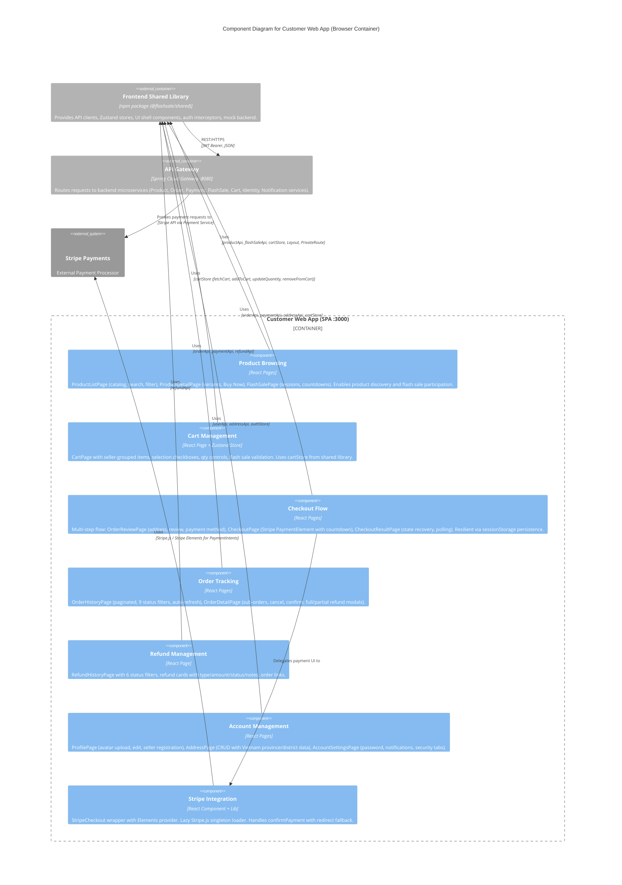

# C4 Component Level: Customer Web App

## Overview

- **Name**: Customer Web App
- **Description**: Customer-facing React Single Page Application for browsing products, managing a shopping cart, completing multi-step checkout with Stripe payments, tracking orders with refunds, and managing user profile and shipping addresses.
- **Type**: Web Application (SPA)
- **Technology**: React 19, Vite 6, TypeScript 5.6, Tailwind CSS 3.4, TanStack React Query 5, Zustand 5, Stripe Elements, Stripe.js

## Purpose

The Customer Web App is the primary shopping portal for end users of the FlashSale platform. It provides a complete e-commerce experience: discovering products through search and category filtering, participating in time-limited flash sales with real-time countdowns, managing a multi-seller shopping cart with flash sale validation, completing a resilient multi-step checkout flow (address selection, order review, Stripe payment with countdown timer), tracking order status across the full lifecycle (pending through delivered/returned), initiating full or partial refunds with evidence upload, and managing user profile and shipping addresses.

The app is designed for resilience: the checkout flow persists critical state to `sessionStorage` so users can recover after page refreshes or direct URL navigation. Payment results are recoverable from URL search params (`payment_intent`, `redirect_status`), React Router location state, and `sessionStorage`. The order list auto-refreshes every 10 seconds when active orders exist.

All server state is managed through TanStack React Query with automatic caching, polling, and cache invalidation. The only Zustand store used directly is the cart store (for client-side cart state). Authentication is transparent via cookie-based JWT tokens with automatic 401 refresh handled by the shared Axios interceptor.

## Software Features

- **Product Discovery**: Browse a paginated product catalog with search bar (keyword matching) and category filter (7 categories: electronics, fashion, home, accessories, books, footwear, bags). Each product card shows image, price with discount badge, flash sale indicator, rating, and add-to-cart / detail buttons.
- **Product Detail with Buy Now**: Full product view with breadcrumb, image gallery, variant selection (SKU-based), quantity selector, and "Buy Now" flow that auto-selects default address, adds item to cart, creates checkout, and navigates directly to payment -- skipping the cart entirely.
- **Flash Sale Shopping**: Flash sale landing page with hero banner, real-time countdown timers for active/upcoming sessions, session tab navigation, flash item cards showing discount percentage and sold/remaining progress bars with sold-out overlays. Items can be added to cart with flash sale item ID linking.
- **Multi-Seller Cart**: Shopping cart grouped by seller with item-level checkboxes for selective checkout. Supports quantity increment/decrement with stock and flash sale limit validation, flash sale expiration warnings, and a summarized order sidebar with subtotal and free shipping indicator.
- **Multi-Step Checkout Flow**: Three-step order review (address selection with create/edit/delete modals, order summary per seller, payment method selection -- Stripe or COD). Address form includes province/district dropdowns with hardcoded Vietnam administrative data (63 provinces). `NoDefaultAddressDialog` prompts users to create an address if none exists.
- **Stripe Payment Integration**: Payment page with Stripe `PaymentElement` embedded form, countdown timer (order timeout), sub-order breakdown per seller, shipping address display, and auto-redirect on timeout. Uses `confirmPayment` with `redirect: 'if_required'` for modal-style flow.
- **Checkout Result Handling**: Result page recovers state from URL search params, location state, and sessionStorage. Polls payment status and COD order status on success. Displays payment details card or COD info, with order tracking link and clear-cart on success.
- **Order Tracking**: Paginated order history with 9 status filters (ALL, PENDING, PAID, SHIPPING, DELIVERED, CANCELLED, PARTIALLY_REFUNDED, REFUNDED, RETURNED). Auto-refreshes every 10 seconds when active orders exist.
- **Order Detail with Actions**: Full parent-order view with per-seller sub-orders. Displays payment info, shipping address, item list with snapshots, and action buttons: cancel (PENDING only), confirm received (SHIPPING only), full refund (PAID only), partial refund (PAID/SHIPPING/DELIVERED/PARTIALLY_REFUNDED). Includes dedicated modals for each action.
- **Refund Management**: Paginated refund history with 6 status filters, showing refund type, amount, items, admin notes, reject reason, and Stripe refund ID. Links to related orders.
- **Profile Management**: User profile page with avatar upload via presigned URL (S3/MinIO), editable display name/phone, account status badge, and seller registration banner for non-seller users.
- **Address Management**: Full CRUD address management with 63 Vietnam provinces and district-level data for HCMC/Hanoi/Da Nang. Default address badge, create/edit modal, and delete confirmation.
- **Account Settings**: Three-tab settings page: Password change (with validation and show/hide toggle), Notification preferences (email/push toggles for orders/promos/flash sales), Security (session display, 2FA toggle placeholder, login devices list).

## Code Elements

This component contains the following code-level elements:

- [c4-code-frontend-customer.md](./c4-code-frontend-customer.md) -- Complete customer web app code-level documentation

### Key Pages (17 pages)

| Page | Route | Description |
|------|-------|-------------|
| `ProductListPage` | `/products` | Paginated product catalog with search, category filter |
| `ProductDetailPage` | `/products/:productId` | Product detail with variant selection, Buy Now flow |
| `FlashSalePage` | `/flash-sales` | Flash sale sessions with countdown timers |
| `CartPage` | `/cart` | Multi-seller cart with selection, qty controls |
| `OrderReviewPage` | `/checkout` | 3-step checkout: address, review, payment method |
| `CheckoutPage` | `/checkout/payment` | Stripe PaymentElement with countdown timer |
| `CheckoutResultPage` | `/checkout/result` | Payment success/failure with state recovery |
| `OrderHistoryPage` | `/orders` | Paginated order list with status filters |
| `OrderDetailPage` | `/orders/:parentOrderId` | Full order detail with action modals |
| `RefundHistoryPage` | `/refunds` | Paginated refund list with status filters |
| `ProfilePage` | `/profile` | User profile with avatar upload and edit |
| `AddressPage` | `/addresses` | Address CRUD with Vietnam province/district data |
| `AccountSettingsPage` | `/account-settings` | Password, notifications, security tabs |
| `LoyaltyPage` | `/loyalty` | Stub: loyalty/reward points placeholder |
| `TrustScorePage` | `/trust-score` | Stub: user trust score placeholder |
| `LoginPage` | `/login` | Shared login page (from `@shared/pages`) |
| `RegisterPage` | `/register` | Shared registration page (from `@shared/pages`) |

### Key Internal Components

| Component | Scope | Purpose |
|-----------|-------|---------|
| `StripeCheckout` | `components/checkout/` | Wraps Stripe Elements provider with `CheckoutForm` |
| `PaymentForm` | Co-located in `CheckoutPage` | Renders `PaymentElement` and handles `confirmPayment` |
| `AddressFormModal` | Co-located in `OrderReviewPage` | Create/edit address with province/district selectors |
| `AddressModal` | Co-located in `AddressPage` | Standalone address create/edit modal |
| `CancelModal` | Co-located in `OrderDetailPage` | Cancel order with reason dropdown |
| `PartialRefundModal` | Co-located in `OrderDetailPage` | Partial refund with item-level selection |
| `FullRefundModal` | Co-located in `OrderDetailPage` | Full refund for all sub-orders |
| `ConfirmReceivedModal` | Co-located in `OrderDetailPage` | Confirm delivery receipt |
| `AvatarUpload` | Co-located in `ProfilePage` | File picker with presigned URL upload |
| `EditModal` | Co-located in `ProfilePage` | Profile field editor |
| `PasswordTab` | Co-located in `AccountSettingsPage` | Password change form |
| `NotificationsTab` | Co-located in `AccountSettingsPage` | Notification preference toggles |
| `SecurityTab` | Co-located in `AccountSettingsPage` | Session and device display |
| `Countdown` | Co-located in `FlashSalePage` | Real-time HH:MM:SS countdown |
| `FlashItemCard` | Co-located in `FlashSalePage` | Flash sale product card with progress bar |

### Lib

| Module | File | Purpose |
|--------|------|---------|
| Stripe Loader | `lib/stripe.ts` | Lazy singleton Stripe.js initialization from `VITE_STRIPE_PUBLISHABLE_KEY` |

## Interfaces

### Consumed Interfaces (REST API)

All API calls go through the shared library's API modules, which communicate with the API Gateway:

- **Protocol**: REST over HTTPS (HTTP in development)
- **Gateway**: API Gateway at port 8080
- **Authentication**: JWT Bearer token (cookie-based, auto-injected by Axios interceptor)

| API Module | Key Endpoints Used |
|------------|--------------------|
| `productApi` | `GET /products`, `GET /products/{id}` |
| `cartApi` | `GET /cart`, `POST /cart/items`, `PUT /cart/items/{id}`, `DELETE /cart/items/{id}`, `DELETE /cart` |
| `orderApi` | `POST /orders/checkout`, `GET /orders`, `GET /orders/{id}`, `GET /orders/parent/{id}`, `POST /orders/{id}/cancel`, `POST /orders/{id}/confirm-received` |
| `paymentApi` | `GET /payments/parent-order/{id}`, `GET /payments/parent-order/{id}/client-secret` |
| `flashSaleApi` | `GET /flash-sales`, `GET /flash-sales/{id}` |
| `refundApi` | `POST /orders/parent/{id}/refund`, `POST /orders/{id}/refunds`, `GET /orders/refunds` |
| `userApi` | `GET /users/me`, `PUT /users/me`, `POST /users/me/change-password`, `GET /users/me/avatar/presigned-url`, `POST /users/me/roles/seller` |
| `addressApi` | `GET /users/me/addresses`, `POST /users/me/addresses`, `PUT /users/me/addresses/{id}`, `DELETE /users/me/addresses/{id}` |

### Browser Routing Interface

| Route Path | Auth Required | Page Component |
|------------|---------------|----------------|
| `/` | No | Redirect to `/products` |
| `/login` | No | `LoginPage` |
| `/register` | No | `RegisterPage` |
| `/products` | No | `ProductListPage` |
| `/products/:productId` | No | `ProductDetailPage` |
| `/flash-sales` | No | `FlashSalePage` |
| `/checkout/result` | No | `CheckoutResultPage` |
| `/cart` | Yes (PrivateRoute) | `CartPage` |
| `/checkout` | Yes (PrivateRoute) | `OrderReviewPage` |
| `/checkout/payment` | Yes (PrivateRoute) | `CheckoutPage` |
| `/orders` | Yes (PrivateRoute) | `OrderHistoryPage` |
| `/orders/:parentOrderId` | Yes (PrivateRoute) | `OrderDetailPage` |
| `/refunds` | Yes (PrivateRoute) | `RefundHistoryPage` |
| `/profile` | Yes (PrivateRoute) | `ProfilePage` |
| `/addresses` | Yes (PrivateRoute) | `AddressPage` |
| `/account-settings` | Yes (PrivateRoute) | `AccountSettingsPage` |

## Dependencies

### Internal Dependencies

- [Frontend Shared Library](./c4-component-frontend-shared.md) -- API clients (productApi, cartApi, orderApi, paymentApi, flashSaleApi, refundApi, userApi, addressApi), Zustand stores (cartStore, authStore), UI components (Layout, PrivateRoute, ErrorBoundary), query client factory, Axios instance, shared types

### External Systems

| System | Purpose |
|--------|---------|
| Backend API Gateway (port 8080) | All REST API calls for products, cart, orders, payments, flash sales, refunds, users, addresses |
| Stripe Payments | Payment intent processing via Stripe Elements (`@stripe/stripe-js`, `@stripe/react-stripe-js`) |
| MinIO / S3 | Avatar image upload via presigned URLs |

### npm Dependencies

| Package | Version | Purpose |
|---------|---------|---------|
| `react` | ^19.0.0 | UI framework |
| `react-dom` | ^19.0.0 | DOM rendering |
| `react-router-dom` | ^6.26.0 | Client-side routing |
| `@tanstack/react-query` | ^5.62.0 | Server state management, caching, polling |
| `zustand` | ^5.0.2 | Cart store |
| `@stripe/stripe-js` | ^5.5.0 | Stripe.js SDK |
| `@stripe/react-stripe-js` | ^3.2.0 | React bindings for Stripe Elements |
| `tailwindcss` | ^3.4.1 | Utility-first CSS |
| `vite` | ^6.0.0 | Build tool and dev server |

## Component Diagram

The following diagram shows the Customer Web App's internal logical components, their interactions, and external dependencies.

