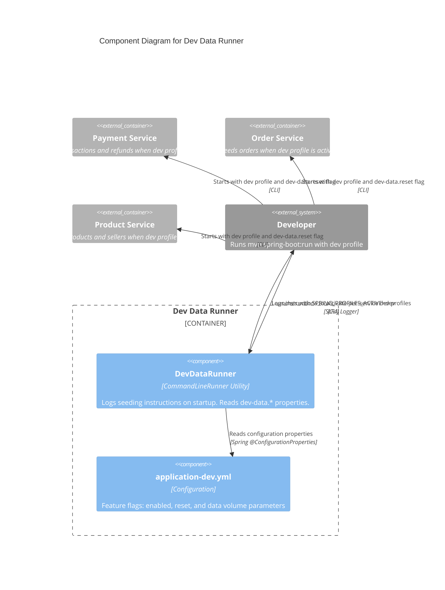

# C4 Component Level: Dev Data Runner

## Overview

- **Name**: Dev Data Runner
- **Description**: Standalone utility service that coordinates development and demonstration data seeding across the FlashSale microservice ecosystem. Provides a centralized entry point (`CommandLineRunner`) with configuration-driven data generation parameters, logging seeding instructions and delegating actual data population to each service's `dev` profile.
- **Type**: Utility
- **Technology**: Java 25, Spring Boot 4, PostgreSQL, SLF4J/Logback, Maven (standalone fat JAR)

## Purpose

The Dev Data Runner serves as the orchestration layer for populating development and local testing environments with realistic, consistent fake data. Its primary responsibilities are:

1. **Centralized Dev Data Orchestration**: Provides a single launch point for seeding all services (payment, order, product) with coordinated parameters (seller count, product count, order count, etc.).
2. **Configuration-Driven Seeding**: Exposes tunable properties via `application-dev.yml` for controlling data volume and whether to perform a destructive reset before seeding.
3. **Developer Convenience**: Logs clear, actionable instructions on startup so developers know exactly which profiles and properties to activate.
4. **Non-Production Utility**: Packaged as a standalone fat JAR that is never deployed to production environments.

## Software Features

- **Command-Line Runner Entry Point**: Implements `CommandLineRunner` to execute automatically when the Spring context is fully loaded. Logs a banner with seeding instructions.
- **Feature Flag System**: Uses `dev-data.enabled` (master switch) and `dev-data.reset` (destructive wipe before seed) properties to control seeding behavior.
- **Configurable Data Volume**: Tunable parameters for `seller-count`, `product-count`, `order-count`, `transaction-count`, and `refund-count` control how much data is generated.
- **Service Profile Coordination**: Provides instructions for activating per-service `dev` profiles that trigger each microservice's own data seeding logic.
- **Standalone Packaging**: Packaged as an executable fat JAR via `spring-boot-maven-plugin`. No runtime dependencies on other FlashSale services.
- **Future Conditional Seeding**: The `@ConditionalOnProperty` annotation is available on the classpath for conditionally enabling/disabling seeding logic in future iterations.

## Code Elements

This component contains the following code-level elements:

- [c4-code-backend-dev-data-runner.md](./c4-code-backend-dev-data-runner.md) -- Complete code-level documentation for the Dev Data Runner

### Key Classes

| Class | Type | Responsibility |
|---|---|---|
| `DevDataRunner` | Application (CommandLineRunner) | Spring Boot entry point that logs seeding instructions on startup |

### Configuration Properties (`application-dev.yml`)

| Property | Default | Description |
|---|---|---|
| `dev-data.enabled` | `true` | Master switch for dev data seeding |
| `dev-data.reset` | `false` | When `true`, drops all collections/tables before seeding |
| `dev-data.seller-count` | `3` | Number of seller records to seed |
| `dev-data.product-count` | `14` | Number of product records to seed |
| `dev-data.order-count` | `6` | Number of order records to seed |
| `dev-data.transaction-count` | `5` | Number of transaction records to seed |
| `dev-data.refund-count` | `4` | Number of refund records to seed |

## Interfaces

### Command-Line Interface

```bash
# Run with dev profile to see instructions
cd backend/dev-data-runner
mvn spring-boot:run -Dspring-boot.run.profiles=dev

# Set environment variable
SPRING_PROFILES_ACTIVE=dev

# For destructive reset of a specific service:
# Set dev-data.reset=true in the service's application-dev.yml
```

### Feature Flags

The Dev Data Runner itself does not connect to databases or services. It outputs instructions. The actual seeding happens in each downstream service when started with the `dev` profile. Each service reads the shared `dev-data.*` properties from its own `application-dev.yml`:

| Service | Dev Profile Behavior |
|---|---|
| Payment Service | Seeds transactions, refunds using `dev-data.transaction-count` and `dev-data.refund-count` |
| Order Service | Seeds orders using `dev-data.order-count` |
| Product Service | Seeds products and sellers using `dev-data.product-count` and `dev-data.seller-count` |

### `DevDataProperties` (common-lib)

The `common-lib` module provides `DevDataProperties` -- a `@ConfigurationProperties(prefix = "dev-data")` class that binds to the same property keys, allowing all services to share the same configuration contract.

## Dependencies

### Components Used

The Dev Data Runner has no runtime dependencies on other FlashSale components. It does not call any REST APIs, read from any databases, or interact with any other services. It orchestrates data seeding purely through instructions to the developer.

### External Systems

| System | Protocol | Purpose |
|---|---|---|
| PostgreSQL | JDBC (via downstream services) | Target database for seeded data (indirect, through each service's dev profile) |

### Build Dependencies

| Dependency | Scope | Purpose |
|---|---|---|
| `spring-boot-starter` | compile | Core Spring Boot auto-configuration and DI |
| `spring-boot-starter-logging` | compile | Logback-based logging (SLF4J + Logback) |
| `lombok` | provided | `@Slf4j` annotation processing |
| `spring-boot-maven-plugin` | build | Fat JAR packaging (excludes Lombok from artifact) |

### Shared Library

| Library | Usage |
|---|---|
| `common-lib` | `DevDataProperties` -- shared configuration properties for `dev-data.*` prefix (used by downstream services, not directly by the runner) |

## Component Diagram


