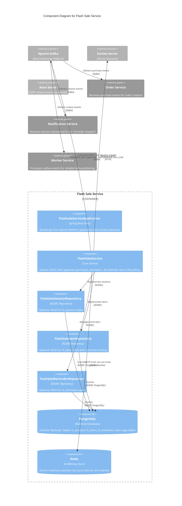

# C4 Component Level: Flash Sale Service

## Overview

- **Name**: Flash Sale Service
- **Description**: Core service managing flash sale sessions, item lifecycle (submission, approval, rejection), buyer purchase flow with anti-oversell protection via Redis atomic operations, and reminder notifications. Uses Axon CQRS infrastructure (provisioned, not yet active in code) and Kafka for event-driven communication.
- **Type**: Service
- **Technology**: Java 25, Spring Boot 4 (WebFlux), PostgreSQL (R2DBC), Redis (Lua scripts), Kafka, Axon Framework 4.13.0, Flyway, Eureka Client

## Purpose

The Flash Sale Service is the central orchestrator of timed discount events on the FlashSale platform. Its primary responsibilities are:

1. **Session Lifecycle Management**: Create, update, soft-delete, and query flash sale sessions with status transitions (UPCOMING, ACTIVE, ENDED).
2. **Item Approval Workflow**: Sellers submit items to a session; administrators approve or reject them through a review process.
3. **Anti-Oversell Protection**: Uses Redis Lua scripts for atomic stock decrement to guarantee inventory never goes below zero during concurrent flash sale purchases.
4. **Buyer Purchase Flow**: Accepts purchase requests, calculates totals, and publishes order events for downstream processing.
5. **Reminder Management**: Buyers can set/remove reminders for upcoming sessions to receive notifications when a session starts.

## Software Features

- **Session CRUD**: Create, read, update, and soft-delete flash sale sessions with start/end time scheduling and status tracking (UPCOMING, ACTIVE, ENDED).
- **Server-Time Synchronization**: Exposes the current server epoch time to all session responses, enabling clients to synchronize countdown timers accurately.
- **Item Submission**: Sellers submit product variants (SKUs) to a flash sale session with a discounted flash price, dedicated flash stock, and per-user purchase limit. Items enter in PENDING status.
- **Admin Approval/Rejection**: Administrators approve or reject pending flash sale items. Approved items become available for purchase; rejected items are blocked.
- **Flash Sale Purchase**: Buyers purchase approved items during an active session. The service calculates total amount from flash price and quantity. Redis Lua script provides atomic stock decrement with oversell prevention. The purchase flow publishes an order event to Kafka for the Order Service.
- **Reminder Notifications**: Buyers set reminders on sessions they are interested in. The service can trigger notifications when the session starts (Kafka listener on `flash_sale.session_started`).
- **Optimistic Locking**: Flash sale items use a `version` column for optimistic concurrency control during high-traffic purchase flows.
- **Soft Delete**: Sessions are soft-deleted (not physically removed) to preserve referential integrity.

## Code Elements

This component contains the following code-level elements:

- [c4-code-backend-flashsale-service.md](./c4-code-backend-flashsale-service.md) -- Complete code-level documentation for the Flash Sale Service

### Key Classes

| Class | Type | Responsibility |
|---|---|---|
| `FlashsaleServiceApplication` | Application Entry | Spring Boot bootstrap with Eureka discovery |
| `KafkaConfig` | Configuration | Kafka consumer factory with batch ack, concurrency 3 |
| `SecurityConfig` | Configuration | Delegates to common-lib `WebFluxSecurityConfig` for JWT auth |
| `FlashSaleService` | Service | Core business logic: sessions, items, purchases, reminders |
| `FlashSaleSession` | Domain Model | `fs_sessions` table: name, start/end time, status |
| `FlashSaleItem` | Domain Model | `fs_items` table: SKU, flash price/stock, limit, sold qty, version |
| `FlashSaleReminder` | Domain Model | `fs_reminders` table: customer-session pair for reminder tracking |
| `FlashSaleSessionRepository` | Repository | Reactive R2DBC: `findByStatus()` |
| `FlashSaleItemRepository` | Repository | Reactive R2DBC: `findBySessionId()`, `findBySkuCode()` |
| `FlashSaleReminderRepository` | Repository | Reactive R2DBC: `findByCustomerIdAndSessionId()` |
| `ApproveItemRequest` | DTO | Admin approval payload with optional note |
| `BuyRequest` | DTO | Purchase request: fsItemId, quantity, addressId |
| `CreateFlashSaleItemRequest` | DTO | Item creation: skuCode, flashPrice, flashStock, limitPerUser |
| `CreateSessionRequest` | DTO | Session creation: name, startTime, endTime |
| `RejectItemRequest` | DTO | Rejection payload with required reason |
| `UpdateSessionRequest` | DTO | Partial update: name, startTime, endTime (all optional) |
| `BuyResponse` | DTO | Purchase result: orderId, totalAmount, etc. |
| `FlashSaleItemResponse` | DTO | Item details including soldQty and status |
| `SessionResponse` | DTO | Session with computed secondsRemaining and isEnded |
| `SessionDetailResponse` | DTO | Session plus its items |
| `SessionListResponse` | DTO | Session list plus serverTime |
| `ServerTimeResponse` | DTO | Server epoch millis for client time sync |

### Database Migrations

| Migration | Purpose |
|---|---|
| `V1__init_fs_sessions_items_reminders.sql` | Creates `fs_sessions`, `fs_items`, `fs_reminders` tables with indexes |
| `V2__add_axon_saga_tables.sql` | Creates Axon infrastructure: `token_entry`, `saga_entry`, `association_value_entry` |
| `V3__rename_user_id_to_customer_id.sql` | Renames `user_id` to `customer_id` on `fs_reminders` |

## Interfaces

### REST API (WebFlux Reactive)

| Method | Endpoint | Description |
|---|---|---|
| `GET` | `/api/v1/flash-sales/sessions?status={status}` | List sessions, optionally filtered by status |
| `GET` | `/api/v1/flash-sales/sessions/{sessionId}` | Get session detail with items |
| `POST` | `/api/v1/flash-sales/sessions` | Create a new flash sale session |
| `PUT` | `/api/v1/flash-sales/sessions/{sessionId}` | Update session name/time fields |
| `DELETE` | `/api/v1/flash-sales/sessions/{sessionId}` | Soft-delete a session |
| `GET` | `/api/v1/flash-sales/admin/sessions?status={status}&page={page}&size={size}` | Admin paginated session list |
| `POST` | `/api/v1/flash-sales/sessions/{sessionId}/items` | Create a flash sale item under a session |
| `PUT` | `/api/v1/flash-sales/sessions/{sessionId}/items/{itemId}/approve` | Approve a pending item |
| `PUT` | `/api/v1/flash-sales/sessions/{sessionId}/items/{itemId}/reject` | Reject a pending item |
| `POST` | `/api/v1/flash-sales/sessions/{sessionId}/buy` | Purchase a flash sale item |
| `POST` | `/api/v1/flash-sales/sessions/{sessionId}/reminders` | Set a reminder for a session |
| `DELETE` | `/api/v1/flash-sales/sessions/{sessionId}/reminders` | Remove a reminder |

### Kafka Topics

| Topic Constant | Topic Name | Direction | Purpose |
|---|---|---|---|
| `FLASH_SALE_SESSION_STARTED` | `flash_sale.session_started` | Consume | React to session lifecycle transitions |
| `FLASH_SALE_SESSION_ENDED` | `flash_sale.session_ended` | Consume/Produce | Signal session end for downstream services |
| `FLASH_SALE_ITEM_APPROVED` | `flash_sale.item_approved` | Produce | Notify search/indexing when an item is approved |
| `FLASH_SALE_ITEM_REJECTED` | `flash_sale.item_rejected` | Produce | Notify seller when an item is rejected |
| `FLASH_SALE_ITEM_SOLD` | `flash_sale.item_sold` | Produce | Publish purchase events for order creation |

### Internal API

- **`FlashSaleService` (Reactive Service Class)**: All public methods return `Mono` or `Flux` from Project Reactor. The service is injected into a WebFlux `@RestController` (not yet present in the codebase; endpoints are expected to be provided by a controller class that wires into this service).

## Dependencies

### Components Used (Synchronous / API calls)

| Component | Relationship | Protocol |
|---|---|---|
| Identity Service | Validates buyer/seller/admin identity (via JWT token decoded by API Gateway, passed in `X-User-*` headers) | HTTP Headers |
| Product Service | SKU code validation for flash sale items (indirect, via shared data contract) | Shared data contract |

### Components Used (Asynchronous / Event-driven)

| Component | Relationship | Direction |
|---|---|---|
| Worker Service | Publishes session lifecycle events for outbox processing | Produce to Kafka |
| Order Service | Publishes purchase events for order creation | Produce to Kafka |
| Notification Service | Session-started events consumed by notification service for reminder dispatch | Produce to Kafka |

### External Systems

| System | Protocol | Purpose |
|---|---|---|
| PostgreSQL | R2DBC (reactive) | Primary data store: sessions, items, reminders, Axon saga tables |
| Redis | Reactive client + Lua scripts | Atomic inventory counter for anti-oversell |
| Kafka | Spring Kafka | Event bus for interservice communication |
| Axon Server | gRPC (provisioned) | CQRS event/command bus (infrastructure declared, not yet active) |
| Eureka | HTTP | Service discovery registration |

### Shared Library

| Library | Usage |
|---|---|
| `common-lib` | `KafkaTopics` constants, `WebFluxSecurityConfig` for reactive security, `ApiResponse` DTO wrapper |

## Component Diagram

