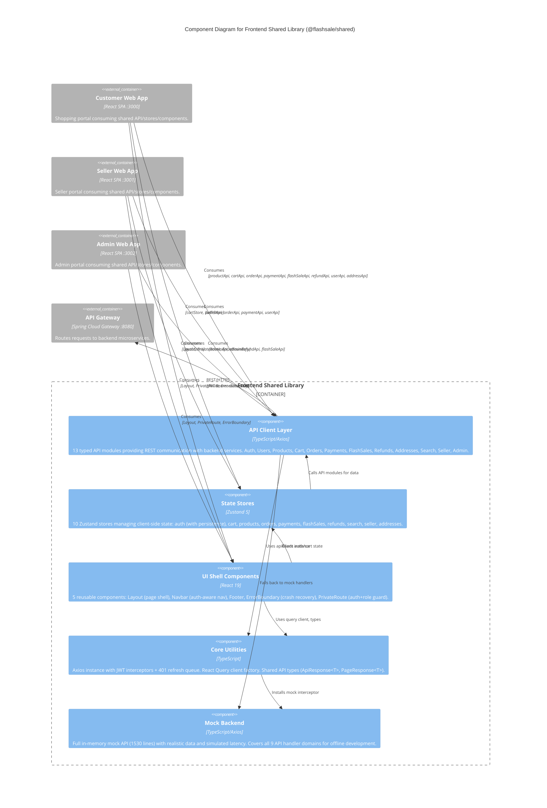

# C4 Component Level: Frontend Shared Library

## Overview

- **Name**: Frontend Shared Library (`@flashsale/shared`)
- **Description**: Shared React/TypeScript library providing common API clients, Zustand state stores, reusable UI components, mock backend infrastructure, and core utilities consumed by all three frontend applications (Customer Web App, Seller Web App, Admin Web App).
- **Type**: Library / Shared UI
- **Technology**: TypeScript 5.6, React 19, Zustand 5, TanStack React Query 5, Axios 1.7, js-cookie 3.0, Vite 6

## Purpose

The Frontend Shared Library eliminates code duplication across the three SPA frontends (customer, seller, admin) by centralizing cross-cutting concerns into a single internal package. It provides a consistent API abstraction layer over the backend microservices via typed Axios clients, global state management through Zustand stores with persistence, reusable UI shell components (Layout, Navbar, Footer, ErrorBoundary, PrivateRoute) that enforce consistent branding and auth gating, and a full mock backend infrastructure for offline development.

Its secondary role is to manage the authentication lifecycle: JWT token injection via Axios interceptors, automatic 401 token refresh with request queuing (preventing thundering herd on concurrent 401s), cookie-based token persistence, and a unified `authStore` that all three apps consume for login/logout/profile state.

## Software Features

- **Typed API Client Layer**: Consistent, strongly-typed API modules (13 modules) covering all backend endpoints -- auth, users, products, cart, orders, payments, flash sales, refunds, addresses, search, seller dashboard, admin operations. All modules use a shared `ApiResponse<T>` generic envelope and a singleton `apiClient` Axios instance.
- **JWT Authentication Lifecycle**: Cookie-based access/refresh token management with Axios request interceptor (inject `Authorization: Bearer` header) and response interceptor (auto-refresh on 401, queue concurrent requests, redirect to login on refresh failure).
- **Zustand State Stores**: Ten Zustand stores for client-side state: auth (with sessionStorage persistence), cart, product catalog, order lifecycle, payment, flash sales, refunds, search, seller dashboard/earnings, and address management.
- **Reusable UI Shell Components**: `Layout` (Navbar + content + Footer flex column), `Navbar` (brand logo, desktop/mobile nav links, user dropdown with logout, unauthenticated CTAs), `Footer` (brand, support links, legal links, status indicator), `ErrorBoundary` (class component with retry button), `PrivateRoute` (auth guard with optional role check).
- **Mock Backend Infrastructure**: Full in-memory mock API with realistic data (products, carts, orders, payments, refunds, addresses, auth) and simulated latency (100-800ms). Activated via `VITE_BACKEND_MODE=mock` or automatically on network errors. Covers all 9 handler domains.
- **React Query Client Factory**: Default-configured `QueryClient` with 60s stale time, no refetch on window focus, 1 retry for queries, 0 retries for mutations.
- **Shared Type System**: `ApiResponse<T>`, `PageResponse<T>`, and `AxiosApiError` types used by all API modules and consuming apps.

## Code Elements

This component contains the following code-level elements:

- [c4-code-frontend-shared.md](./c4-code-frontend-shared.md) -- Complete shared library code-level documentation

### Key API Clients (13 modules)

| Module | File | Purpose |
|--------|------|---------|
| `authApi` | `api/auth.api.ts` | Login, register, logout, token refresh, profile fetch |
| `userApi` / `adminUserApi` | `api/user.api.ts` | User profile CRUD, avatar presigned URL, admin user management |
| `productApi` | `api/product.api.ts` | Product listing, detail, search |
| `cartApi` | `api/cart.api.ts` | Shopping cart CRUD |
| `orderApi` | `api/order.api.ts` | Checkout, order listing, detail, cancel, tracking, confirm, return |
| `paymentApi` | `api/payment.api.ts` | Payment detail, Stripe client secret, lookup by intent |
| `flashSaleApi` | `api/flashSale.api.ts` | Flash sale sessions, detail, purchase |
| `refundApi` / `adminRefundApi` | `api/refund.api.ts` | Full/partial refunds, admin refund approval/rejection |
| `sellerApi` | `api/seller.api.ts` | Seller dashboard, Stripe onboarding, product CRUD, inventory, earnings |
| `addressApi` | `api/address.api.ts` | User address CRUD |
| `adminApi` | `api/admin.api.ts` | Product moderation, user management, flash sale config |
| `mock` | `api/mock.ts` | Mock backend (1530 lines) with 9 handler domains |

### Key Zustand Stores (10 stores)

| Store | File | State Managed |
|-------|------|---------------|
| `useAuthStore` | `store/authStore.ts` | User, profile, isAuthenticated, login/register/logout |
| `useCartStore` | `store/cartStore.ts` | Cart, items, totals, add/update/remove/clear |
| `useProductStore` | `store/productStore.ts` | Products list, current product, filters, pagination |
| `useOrderStore` | `store/orderStore.ts` | Orders, current order, checkout result, seller orders |
| `usePaymentStore` | `store/paymentStore.ts` | Payment details, Stripe client secret |
| `useFlashSaleStore` | `store/flashSaleStore.ts` | Sessions, active/upcoming sessions, purchase |
| `useRefundStore` | `store/refundStore.ts` | Refund requests, full refund status |
| `useSearchStore` | `store/searchStore.ts` | Search query, results, pagination |
| `useSellerStore` | `store/sellerStore.ts` | Dashboard stats, Stripe status, earnings |
| `useAddressStore` | `store/addressStore.ts` | Addresses, default address, CRUD |

### Key UI Components (5 components)

| Component | File | Purpose |
|-----------|------|---------|
| `Layout` | `components/Layout.tsx` | Page shell: Navbar + content + Footer |
| `Navbar` | `components/Navbar.tsx` | Top navigation with auth-aware menus |
| `Footer` | `components/Footer.tsx` | Site footer with links and status |
| `ErrorBoundary` | `components/ErrorBoundary.tsx` | React error boundary with retry |
| `PrivateRoute` | `components/PrivateRoute.tsx` | Auth guard with optional role check |

### Key Utilities (3 modules)

| Module | File | Purpose |
|--------|------|---------|
| Axios Client | `lib/axios.ts` | Singleton `apiClient` with auth interceptors, 401 refresh queue |
| Query Client | `lib/queryClient.ts` | TanStack React Query client factory |
| API Types | `types/api.ts` | `ApiResponse<T>`, `PageResponse<T>`, `AxiosApiError` |

## Interfaces

### Consumed Interfaces (Backend API Consumption)

All API modules communicate with the backend API Gateway through a shared Axios instance:

- **Protocol**: REST over HTTPS (HTTP in development)
- **Base URL**: `${VITE_API_URL}/api/v1` (proxied to `http://localhost:8080` in development)
- **Authentication**: JWT Bearer token in `Authorization` header, refresh token in cookie
- **Content Type**: `application/json` (multipart/form-data for return-to-sender evidence uploads)
- **Timeout**: 15 seconds
- **Response Envelope**: `{ success: boolean, message?: string, data?: T, errorCode?: string, timestamp: number }`

The library consumes endpoints across all backend services:

| Service | Key Endpoints |
|---------|---------------|
| Identity Service | `/auth/login`, `/auth/register`, `/auth/refresh`, `/auth/logout`, `/users/me` |
| Product Service | `/products`, `/products/{id}`, `/products/{id}/presigned-url` |
| Order Service | `/orders/checkout`, `/orders`, `/orders/{id}`, `/orders/parent/{id}`, `/sellers/me/orders` |
| Payment Service | `/payments/parent-order/{id}`, `/payments/parent-order/{id}/client-secret` |
| Flash Sale Service | `/flash-sales`, `/flash-sales/{id}`, `/flash-sales/{id}/buy` |
| Cart Service | `/cart`, `/cart/items`, `/cart/items/{id}` |
| Search Service | `/search?q={query}` |
| Seller Service | `/sellers/me/dashboard`, `/seller/products/{id}/submit`, `/seller/inventory/adjust` |
| Stripe Service | `/stripe/onboarding/start`, `/stripe/onboarding/status`, `/stripe/onboarding/refresh-link` |
| Notification Service | (via shared event consumers, not directly called) |

### Provided Interface (Module Exports)

The shared library exports the following for consuming apps:

- 13 API module objects (each with typed functions)
- 10 Zustand store hooks (each with state + actions)
- 5 React components (Layout, Navbar, Footer, ErrorBoundary, PrivateRoute)
- `createQueryClient` factory function + `QueryClientProvider`
- `apiClient` Axios instance (for direct API calls)
- `logoutApi()` helper (bypasses interceptors)
- `isAuthFromCookie()` utility
- All TypeScript type definitions (request/response types)

## Dependencies

### Components That Consume This Library

- [Customer Web App](./c4-component-customer-app.md) -- Uses API clients, stores, Layout, PrivateRoute, ErrorBoundary, query client
- [Seller Web App](./c4-component-seller-app.md) -- Uses API clients, auth store, Layout, PrivateRoute, ErrorBoundary, query client
- [Admin Web App](./c4-component-admin-app.md) -- Uses admin/flash-sale/refund API clients, Layout, PrivateRoute, ErrorBoundary, query client

### External Systems

| System | Purpose |
|--------|---------|
| Backend API Gateway (port 8080) | All REST API calls pass through the API gateway to backend microservices |
| Stripe API (via `@stripe/stripe-js`) | Payment intent creation and confirmation (indirect, through payment service) |

### npm Dependencies

| Package | Version | Purpose |
|---------|---------|---------|
| `react` | ^19.0.0 | UI rendering (peer dep) |
| `react-dom` | ^19.0.0 | DOM rendering (peer dep) |
| `react-router-dom` | ^6.26.0 | Routing (peer dep) |
| `@tanstack/react-query` | ^5.62.0 | Server state caching (peer dep) |
| `zustand` | ^5.0.2 | Global state management |
| `axios` | ^1.7.9 | HTTP client |
| `js-cookie` | ^3.0.5 | Cookie read/write for auth tokens |
| `axios-mock-adapter` | ^2.1.0 | HTTP mocking (dev) |

## Component Diagram

The following diagram shows the Frontend Shared Library's internal components, their relationships to each other, and external consumers/dependencies.

