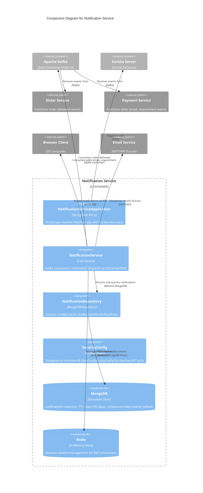

# C4 Component Level: Notification Service

## Overview

- **Name**: Notification Service
- **Description**: Real-time notification service using Spring WebFlux (reactive stack) for Server-Sent Events (SSE) push to connected clients, plus email and SMS notification dispatching. Consumes domain events from Kafka (order lifecycle, payment/refund status, Stripe compliance requirements, flash sale session events) and persists notification records in MongoDB with a 90-day TTL auto-expiry.
- **Type**: Service
- **Technology**: Java 25, Spring Boot 4 (WebFlux reactive stack), MongoDB (Reactive), Redis (Reactive), Kafka, SSE, Eureka Client

## Purpose

The Notification Service acts as the central hub for all user-facing notifications on the FlashSale platform. Its primary responsibilities are:

1. **Real-Time Push Notifications**: Delivers live notifications to connected buyers and sellers via Server-Sent Events (SSE) over HTTP. Clients establish a long-lived connection and receive notifications in real time without polling.
2. **Multi-Channel Dispatch**: Routes notifications through the appropriate channel (SSE for browser-connected users, email for asynchronous delivery, SMS for urgent alerts).
3. **Event-Driven Notification Generation**: Consumes domain events from Kafka across multiple services (order delivery, payment success, refund approval, Stripe compliance, flash sale reminders) and translates them into user-facing notifications.
4. **Notification Persistence**: Stores all notification records in MongoDB with a compound index on `(user_id, is_read)` for efficient unread-notification queries and a TTL index that auto-expires documents after 90 days.

## Software Features

- **SSE Push Endpoints**: WebFlux-based Server-Sent Events endpoints that push real-time notifications to authenticated clients. Uses reactive `Sinks.Many` or `Flux<ServerSentEvent>` for broadcasting.
- **Order Delivery Notifications**: Consumes `order.delivered` events from Kafka and pushes delivery confirmation notifications to buyers.
- **Stripe Compliance Alerts**: Consumes `seller.stripe_requirement` events from Kafka and notifies sellers about pending Stripe account verification requirements.
- **Notification History**: Persists all notification records in MongoDB with read/unread tracking. Supports querying notifications by user, sorted by recency.
- **Unread Notification Count**: Efficient query for unread notifications via the `idx_user_read` compound index on `(user_id, is_read)`.
- **Auto-Expiry**: TTL index on `createdAt` automatically purges notifications older than 90 days, preventing unbounded collection growth.
- **Multi-Channel Future Support**: Architecture supports future integration with Email (SMTP/API) and SMS gateways for notifications to offline users.
- **Reactive Stack**: Full reactive pipeline from Kafka consumption (via reactive listeners) to MongoDB persistence (via reactive driver) to SSE push (via WebFlux).

## Code Elements

This component contains the following code-level elements:

- [c4-code-backend-notification-service.md](./c4-code-backend-notification-service.md) -- Complete code-level documentation for the Notification Service

### Key Classes

| Class | Type | Responsibility |
|---|---|---|
| `NotificationServiceApplication` | Application Entry | Spring Boot bootstrap with Eureka discovery |
| `SecurityConfig` | Configuration | Delegates to common-lib `WebFluxSecurityConfig` for reactive JWT auth |
| `Notification` | Domain Model (Document) | MongoDB document: userId, type, title, body, metadata, isRead, createdAt |
| `NotificationRepository` | Repository | MongoDB: findByUserIdOrderByCreatedAtDesc, findByUserIdAndIsReadFalse |
| `NotificationService` | Service | Kafka listeners for `order.delivered` and `seller.stripe_requirement`; placeholder `sendNotification()` |

### Kafka Event Payloads (from common-lib)

| Payload Class | Fields | Source Topic |
|---|---|---|
| `OrderDeliveredPayload` | `orderId`, `buyerId`, `sellerId`, `totalAmount`, `autoDelivered` | `order.delivered` |
| `SellerStripeRequirementPayload` | `sellerId`, `stripeAccountId`, `requirementType`, `requirementReason`, `accountLinkUrl`, `accountLinkExpiresAt` | `seller.stripe_requirement` |

## Interfaces

### REST API (WebFlux Reactive)

| Method | Endpoint | Description |
|---|---|---|
| `GET` | `/api/v1/notifications` | List all notifications for the authenticated user (most recent first) |
| `GET` | `/api/v1/notifications/unread` | List unread notifications for the authenticated user |
| `GET` | `/api/v1/notifications/stream` | SSE endpoint: long-lived connection for real-time notification push |
| `PUT` | `/api/v1/notifications/{id}/read` | Mark a notification as read |
| `PUT` | `/api/v1/notifications/read-all` | Mark all notifications as read for the authenticated user |

### Kafka Topics (Consumer Only)

| Topic Constant | Topic Name | Direction | Purpose |
|---|---|---|---|
| `ORDER_DELIVERED` | `order.delivered` | Consume | Send delivery confirmation notification to buyer |
| `SELLER_STRIPE_REQUIREMENT` | `seller.stripe_requirement` | Consume | Alert seller about Stripe verification requirements |

Consumer group: `notification-service-group`

Note: The `KafkaTopics` class in `common-lib` defines additional topics (payment success/failure, refund lifecycle, flash sale session events) that this service could consume in future iterations.

### Internal API

- **`NotificationService.sendNotification(userId, message)`**: Placeholder for pushing a notification to a specific connected user via SSE. Future implementation will use WebFlux `Sinks.Many` for broadcasting.

## Dependencies

### Components Used (Asynchronous / Event-driven)

| Component | Relationship | Direction |
|---|---|---|
| Order Service | Publishes `order.delivered` events consumed for delivery notifications | Consume from Kafka |
| Payment Service | Publishes `seller.stripe_requirement` events consumed for compliance alerts | Consume from Kafka |

### External Systems

| System | Protocol | Purpose |
|---|---|---|
| MongoDB (port 27017) | Reactive MongoDB driver | Persistent storage for notification documents with TTL auto-expiry |
| Redis (port 6379) | Reactive Redis client | Reactive session management (Spring Session) |
| Kafka (port 9092) | Kafka consumer protocol | Event ingestion from order and payment services |
| Eureka (port 8761) | HTTP | Service registration and discovery |

### Future External Integrations

| System | Protocol | Purpose |
|---|---|---|
| Email Service (SMTP/API) | SMTP or REST | Async email notifications for offline users |
| SMS Gateway | REST or SMPP | SMS alerts for urgent notifications |

### Shared Library

| Library | Usage |
|---|---|
| `common-lib` | `KafkaTopics` constants, `OrderDeliveredPayload`, `SellerStripeRequirementPayload`, `WebFluxSecurityConfig` for reactive security, `ReactiveSecurityContextConfig`, `ApiResponse` DTO wrapper |

## Component Diagram

