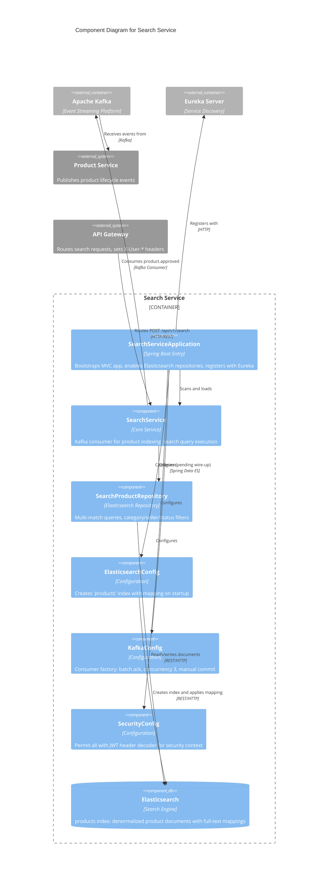

# C4 Component Level: Search Service

## Overview

- **Name**: Search Service
- **Description**: Full-text product search service using Elasticsearch 8.x as the search engine. Follows a consumer-only Kafka pattern -- it ingests product lifecycle events (created, approved, updated, deleted) to maintain a denormalized read model in Elasticsearch, but does not produce any events back to Kafka. Exposes search endpoints for product discovery.
- **Type**: Service (Consumer)
- **Technology**: Java 25, Spring Boot 4 (MVC, virtual threads), Elasticsearch 8.10, Spring Data Elasticsearch, Kafka (consumer-only), Eureka Client

## Purpose

The Search Service provides fast, relevance-ranked full-text product search across the FlashSale platform. Its primary responsibilities are:

1. **Full-Text Product Search**: Multi-field search across product name, description (boosted 2x), and tags (boosted 1.5x) with category and seller filtering.
2. **Event-Driven Indexing**: Consumes `product.approved` events from Kafka to index new and updated products into Elasticsearch, keeping the search index synchronized with the product catalog.
3. **Denormalized Read Model**: Stores a flattened, search-optimized view of products that includes denormalized fields (seller name, category name) to avoid join queries at search time.
4. **Flash Sale Discovery**: Supports querying for products marked as flash sale items, enabling buyers to discover active flash deals.

## Software Features

- **Multi-Match Full-Text Search**: Search across product `name`, `description` (2x boost), and `tags` (1.5x boost) with relevance scoring from Elasticsearch.
- **Category Filtering**: Filter search results by exact category match using Elasticsearch term queries.
- **Seller Filtering**: Filter products by seller ID for seller-specific product listings.
- **Approved-Only Search**: Combined keyword + category search automatically restricts results to APPROVED products only.
- **Flash Sale Discovery**: Query all products currently in flash sales via `findByIsFlashTrue()`.
- **Status-Based Filtering**: Query products by approval status (PENDING, APPROVED, REJECTED) for admin workflows.
- **Denormalized Indexing**: Stores seller name, category name, and price range (min/max) as part of the product document to eliminate cross-index joins.
- **Index Auto-Creation**: On startup, creates the `products` Elasticsearch index with proper mappings if it does not already exist. Gracefully handles Elasticsearch unavailability (non-blocking).
- **Virtual Threads**: Uses Java 21+ virtual threads for improved throughput with blocking I/O (Elasticsearch and Kafka clients).

## Code Elements

This component contains the following code-level elements:

- [c4-code-backend-search-service.md](./c4-code-backend-search-service.md) -- Complete code-level documentation for the Search Service

### Key Classes

| Class | Type | Responsibility |
|---|---|---|
| `SearchServiceApplication` | Application Entry | Spring Boot bootstrap with Eureka discovery and Elasticsearch repository scanning |
| `ElasticsearchConfig` | Configuration | Creates `products` index with mapping on startup if not present |
| `KafkaConfig` | Configuration | Kafka consumer factory: batch ack, concurrency 3, earliest offset, manual commit |
| `SecurityConfig` | Configuration | Registers `JwtTokenDecoderFilter`, permit-all access (public search) |
| `SearchProduct` | Domain Model (Document) | Elasticsearch document: denormalized product with full-text mapped fields |
| `SearchProductRepository` | Repository | Spring Data Elasticsearch: multi-match queries, category/seller/status filters |
| `SearchService` | Service | Kafka listener for `product.approved`, search query execution (partially stubbed) |

### SearchProduct Document Mapping

| Field | ES Type | Description |
|---|---|---|
| `id` | `_id` | MongoDB ObjectId as document ID |
| `name` | `keyword` | Product name for exact matching |
| `description` | `text` (standard analyzer) + `keyword` sub-field | Full-text searchable description |
| `sellerId` | `long` | Seller identifier |
| `sellerName` | `keyword` | Denormalized seller display name |
| `categoryId` | `keyword` | Category reference |
| `categoryName` | `keyword` | Denormalized category name |
| `priceMin` | `double` | Minimum variant price |
| `priceMax` | `double` | Maximum variant price |
| `stockAvailable` | `integer` | Available stock count |
| `isFlash` | `boolean` | Flash sale flag |
| `status` | `keyword` | Product status: PENDING, APPROVED, REJECTED |
| `images` | `keyword` (list) | Product image URLs |
| `attributes` | `nested` | Product variant attributes |
| `tags` | `keyword` (list) | Search relevance tags |
| `createdAt` | `date` | Creation timestamp |
| `updatedAt` | `date` | Last update timestamp |

## Interfaces

### REST API

| Method | Endpoint | Description |
|---|---|---|
| `GET` | `/api/v1/search?q={query}&page={page}&size={size}` | Full-text product search with pagination |
| `GET` | `/api/v1/search/category/{categoryId}?q={query}` | Search within a category (APPROVED products only) |
| `GET` | `/api/v1/search/flash-sales` | List all products currently in flash sales |
| `GET` | `/api/v1/search/seller/{sellerId}` | List products by seller |
| `GET` | `/api/v1/search/status/{status}` | List products by approval status (admin) |

Note: The search endpoint implementations in `SearchService.search()` are currently stubbed as TODO placeholders. The `SearchProductRepository` query methods are fully defined with Elasticsearch `@Query` annotations and ready to be wired in.

### Kafka Topics (Consumer Only)

| Topic Constant | Topic Name | Direction | Purpose |
|---|---|---|---|
| `PRODUCT_APPROVED` | `product.approved` | Consume | Index newly approved products into Elasticsearch |
| `PRODUCT_CREATED` | `product.created` | Consume (planned) | Index new products |
| `PRODUCT_UPDATED` | `product.updated` | Consume (planned) | Update indexed product data |
| `PRODUCT_DELETED` | `product.deleted` | Consume (planned) | Remove products from the search index |

Consumer group: `search-service-group`

## Dependencies

### Components Used (Asynchronous / Event-driven)

| Component | Relationship | Direction |
|---|---|---|
| Product Service | Publishes `product.approved` events consumed for indexing | Consume from Kafka |

### External Systems

| System | Protocol | Purpose |
|---|---|---|
| Elasticsearch (port 9200) | HTTP/REST (Spring Data Elasticsearch) | Index storage and full-text query execution |
| Kafka (port 9092) | Kafka consumer protocol | Event ingestion for product lifecycle events |
| Eureka (port 8761) | HTTP | Service registration and discovery |

### Shared Library

| Library | Usage |
|---|---|
| `common-lib` | `KafkaTopics` constants, `ProductApprovedPayload` event class, `JwtTokenDecoderFilter` for security context, `ApiResponse` DTO wrapper |

## Component Diagram

