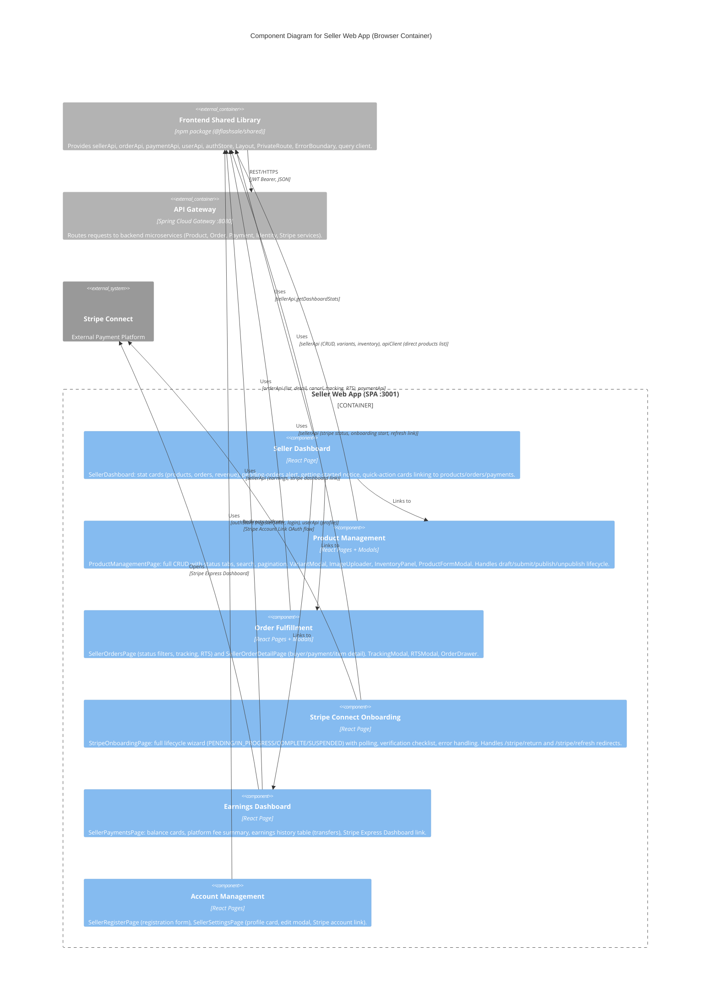

# C4 Component Level: Seller Web App

## Overview

- **Name**: Seller Web App
- **Description**: Seller-facing React Single Page Application for product management, inventory control, order fulfillment, Stripe Connect onboarding, earnings tracking, and seller profile management.
- **Type**: Web Application (SPA)
- **Technology**: React 19, Vite 6, TypeScript 5.6, Tailwind CSS 3.4, TanStack React Query 5, Zustand 5, Stripe Connect

## Purpose

The Seller Web App is the shop management portal for sellers on the FlashSale platform. It provides a complete seller toolchain: registering as a seller, managing a product catalog through a full lifecycle (draft, submit for review, approval/rejection, publish/unpublish), controlling per-SKU inventory with adjustment logs, fulfilling orders (view, cancel, add tracking, confirm returns), onboarding with Stripe Connect for payment processing (handling the full Account Link lifecycle with polling and auto-refresh), and monitoring earnings through transfer history and the Stripe Express Dashboard.

The app enforces the SELLER role on all protected routes via the shared `PrivateRoute` component. All server state is managed through TanStack React Query with automatic caching and cache invalidation after mutations. The only Zustand store directly used is the auth store (for login/logout/registerSeller). The app uses the shared Axios instance for all API calls, benefiting from automatic JWT token injection and 401 refresh handling.

All UI text is in Vietnamese, and the app includes Stripe redirect catch routes (`/stripe/return`, `/stripe/refresh`) to handle the Stripe Connect OAuth flow seamlessly.

## Software Features

- **Seller Dashboard**: Landing page with stat cards (total products, orders today, monthly revenue), pending-orders alert banner, getting-started notice for new sellers with links to add products and connect Stripe, and quick-action cards.
- **Product Lifecycle Management**: Full CRUD product management with status filter tabs (ALL, APPROVED, PUBLISHED, PENDING, REJECTED, DRAFT). Tabbed create/edit modal (Info, Images, Variants, Inventory). Inline actions: submit for review, publish, unpublish, delete (DRAFT/REJECTED only). Search with 300ms debounce and pagination.
- **Variant Management**: CRUD operations for product variants (SKUs) with SKU code, variant name, price, and stock fields. Accessed through the product form modal.
- **Image Upload**: Presigned URL-based image upload to MinIO/S3. Image uploader component integrated into the product form.
- **Inventory Control**: Per-SKU inventory management with quick +/-1 adjustment, manual delta input with reason, restock with quantity and reason, and per-SKU change log viewer (development in progress).
- **Order Fulfillment**: Paginated seller order list with 8 status filter tabs. Inline actions: cancel (PENDING orders), add tracking number and carrier (PAID orders), return-to-sender confirmation with evidence image upload (RETURNED orders). Slide-in order drawer for quick detail view.
- **Order Detail**: Full order detail view showing buyer info (name, username, shipping address), payment info (amount, method, transaction reference, paid timestamp), line items with image/price snapshots, and price summary.
- **Stripe Connect Onboarding**: Full onboarding lifecycle wizard: PENDING (start onboarding button), IN_PROGRESS (continue verification with 3-second polling), COMPLETE (celebration with earnings/dashboard links), SUSPENDED (resolution guidance). Handles Stripe redirect return/refresh query params. Verification checklist (identity, charges, payouts enabled). Error handling distinguishes platform-level errors from transient failures.
- **Earnings Dashboard**: Balance cards (total earnings, available balance, pending balance), platform fee and transaction count summary, dual-tab view: earnings history table (order ID, transfer amount, fee, net amount, status, date) and Stripe Dashboard tab (link to open Stripe Express Dashboard for payout management).
- **Seller Registration**: Dedicated registration page with two-panel layout. Calls the `/auth/register/seller` endpoint via the auth store.
- **Seller Profile Settings**: Profile card display (avatar, name, email, phone) with editable fields, and Stripe account management section with link to onboarding page.

## Code Elements

This component contains the following code-level elements:

- [c4-code-frontend-seller.md](./c4-code-frontend-seller.md) -- Complete seller web app code-level documentation

### Key Pages (9 pages)

| Page | Route | Description |
|------|-------|-------------|
| `SellerDashboard` | `/dashboard` | Stat cards, pending orders alert, quick-action cards |
| `ProductManagementPage` | `/products` | Full product CRUD with tabs, variants, images, inventory |
| `SellerOrdersPage` | `/orders` | Paginated orders with status filters, tracking, RTS |
| `SellerOrderDetailPage` | `/orders/:orderId` | Full order detail with buyer/payment/item info |
| `SellerPaymentsPage` | `/payments` | Earnings summary, transfer history, Stripe dashboard link |
| `StripeOnboardingPage` | `/stripe-onboarding` | Stripe Connect onboarding wizard with polling |
| `SellerRegisterPage` | `/register` | Seller registration form |
| `SellerSettingsPage` | `/settings` | Profile display/edit and Stripe account management |
| `TrustScorePage` | N/A (unlinked) | Stub: seller trust score placeholder |

### Key Internal Components (co-located within pages)

| Component | Parent Page | Purpose |
|-----------|-------------|---------|
| `StatusBadge` | ProductManagementPage | Colored status pill for product lifecycle |
| `ProductFormModal` | ProductManagementPage | Tabbed modal for product CRUD (Info/Images/Variants/Inventory) |
| `VariantModal` | ProductManagementPage | Create/edit variant with SKU, name, price, stock |
| `ImageUploader` | ProductManagementPage | Presigned URL upload to MinIO |
| `InventoryPanel` | ProductManagementPage | Adjust/restock inventory, view per-SKU logs |
| `TrackingModal` | SellerOrdersPage | Enter tracking number and carrier |
| `RTSModal` | SellerOrdersPage | Return-to-sender confirmation with evidence upload |
| `OrderDrawer` | SellerOrdersPage | Slide-in quick order detail panel |
| `SellerProfileCard` | SellerSettingsPage | Avatar, name, email, phone display |
| `EditProfileModal` | SellerSettingsPage | Inline profile field editor |
| `VerificationChecklist` | StripeOnboardingPage | Stripe verification step progress |

### Stripe Redirect Handling

| Route | Behavior |
|-------|----------|
| `/stripe/return` | Redirects to `/stripe-onboarding?from=stripe` (triggers polling) |
| `/stripe/refresh` | Redirects to `/stripe-onboarding?refresh=1` (triggers new AccountLink) |

## Interfaces

### Consumed Interfaces (REST API)

All API calls go through the shared library's API modules, which communicate with the API Gateway:

- **Protocol**: REST over HTTPS (HTTP in development)
- **Gateway**: API Gateway at port 8080
- **Authentication**: JWT Bearer token (cookie-based, auto-injected by Axios interceptor)
- **Role Enforcement**: SELLER role required on all routes via `PrivateRoute`

| API Module | Key Endpoints Used |
|------------|--------------------|
| `sellerApi` | `GET /sellers/me/dashboard`, `GET /sellers/me/products`, `POST /products`, `PUT /products/{id}`, `DELETE /products/{id}`, `POST /seller/products/{id}/submit`, `POST /seller/products/{id}/publish`, `POST /seller/products/{id}/unpublish`, `GET /seller/products/{id}/variants`, `POST /seller/products/{id}/variants`, `PUT /seller/variants/{id}`, `DELETE /seller/variants/{id}`, `GET /products/{id}/presigned-url`, `POST /seller/inventory/adjust`, `GET /seller/inventory/{sku}/logs`, `PUT /inventory/{sku}/restock`, `GET /seller/payments/earnings`, `GET /seller/payments/stripe-dashboard`, `POST /stripe/onboarding/start`, `GET /stripe/onboarding/status`, `POST /stripe/onboarding/refresh-link` |
| `orderApi` | `GET /sellers/me/orders`, `GET /orders/{id}`, `POST /orders/{id}/cancel`, `PUT /orders/{id}/tracking`, `POST /orders/{id}/return-to-sender` |
| `paymentApi` | `GET /payments/parent-order/{id}` |
| `userApi` | `GET /users/me`, `PUT /users/me` |
| `authStore` (via Zustand) | `registerSeller` (calls `POST /auth/register/seller`), `login`, `logout` |

### Browser Routing Interface

| Route Path | Auth Required | Page Component |
|------------|---------------|----------------|
| `/` | SELLER | Redirect to `/dashboard` |
| `/login` | No | `LoginPage` (shared) |
| `/register` | No | `SellerRegisterPage` |
| `/dashboard` | SELLER | `SellerDashboard` |
| `/products` | SELLER | `ProductManagementPage` |
| `/orders` | SELLER | `SellerOrdersPage` |
| `/orders/:orderId` | SELLER | `SellerOrderDetailPage` |
| `/stripe-onboarding` | SELLER | `StripeOnboardingPage` |
| `/stripe/return` | SELLER | Redirect to `/stripe-onboarding?from=stripe` |
| `/stripe/refresh` | SELLER | Redirect to `/stripe-onboarding?refresh=1` |
| `/payments` | SELLER | `SellerPaymentsPage` |
| `/settings` | SELLER | `SellerSettingsPage` |
| `/*` | SELLER | Redirect to `/` |

## Dependencies

### Internal Dependencies

- [Frontend Shared Library](./c4-component-frontend-shared.md) -- API clients (sellerApi, orderApi, paymentApi, userApi), auth store (`useAuthStore`), UI components (Layout with "FlashSale Seller" branding, PrivateRoute with role="SELLER", ErrorBoundary), query client factory, Axios instance, shared types (`ApiResponse`, `PageResponse`)

### External Systems

| System | Purpose |
|--------|---------|
| Backend API Gateway (port 8080) | All REST API calls for products, orders, payments, earnings, Stripe onboarding |
| Stripe Connect | Seller account onboarding (Account Links), payment processing, Express Dashboard for payout management |
| MinIO / S3 | Product image upload via presigned URLs |

### npm Dependencies

| Package | Version | Purpose |
|---------|---------|---------|
| `react` | 19.0.0 | UI framework |
| `react-dom` | 19.0.0 | DOM rendering |
| `react-router-dom` | 7.1.1 | Client-side routing |
| `@tanstack/react-query` | 5.62.7 | Server state management, caching, mutations, polling |
| `zustand` | 5.0.2 | Auth store |
| `axios` | 1.7.9 | HTTP client |
| `js-cookie` | 3.0.5 | Cookie-based token storage |
| `tailwindcss` | 3.4.1 | Utility-first CSS |
| `vite` | 6.0.0 | Build tool and dev server |

## Component Diagram

The following diagram shows the Seller Web App's internal logical components, their interactions, and external dependencies.

