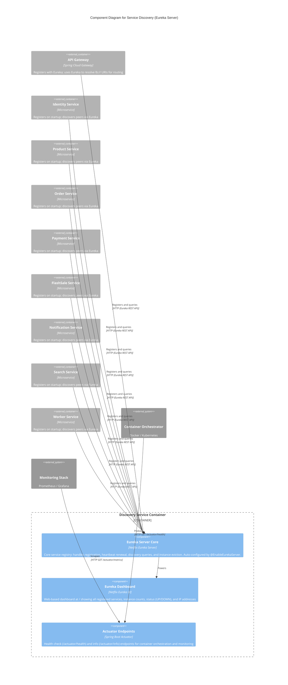

# C4 Component Level: Service Discovery

## Overview

- **Name**: Service Discovery
- **Description**: Netflix Eureka service registry for the FlashSale microservice ecosystem. All backend services register with this Eureka server on startup and use it to discover peers via logical service names (`lb://` URIs).
- **Type**: Infrastructure / Service Registry
- **Technology**: Netflix Eureka (Spring Cloud Netflix Eureka Server), embedded Tomcat

## Purpose

The Service Discovery component provides dynamic service registration and discovery for the FlashSale platform's microservice architecture. In a microservice ecosystem, services must locate each other without hardcoded IP addresses or ports. Eureka solves this by acting as a central registry where services register their location on startup and query for peer locations at runtime.

**Problems Solved**:

1. **Dynamic Service Location**: Services register their IP address and port at startup and send heartbeats every 30 seconds. Other services resolve logical names (e.g., `identity-service`) to actual network locations without configuration changes when instances scale up or down.
2. **Health-Aware Routing**: Eureka tracks instance health via heartbeats. If an instance stops sending heartbeats, it is removed from the registry after the eviction timeout, preventing requests from being routed to unhealthy instances.
3. **Load Balancing Foundation**: Spring Cloud LoadBalancer integrates with Eureka to provide client-side load balancing across multiple instances of the same service. The API Gateway and inter-service `WebClient` calls use `lb://` URIs resolved through Eureka.
4. **Operational Visibility**: The Eureka dashboard (at `http://discovery-service:8761/`) provides a real-time view of all registered services, their instance count, status (UP/DOWN), and IP addresses for debugging and monitoring.

**Role in System**: Eureka is the backbone of inter-service communication. The API Gateway uses it to route requests to downstream services. All microservices register themselves and use Eureka to discover peers when making inter-service calls. Without Eureka, every service would need hardcoded URLs for every peer, making scaling and failover impossible.

## Software Features

- **Service Registration**: Each microservice registers with Eureka on startup, providing its application name, instance ID, IP address, port, and health status. Registration is automatic via `@EnableDiscoveryClient` and `spring.cloud.netflix.eureka` configuration.
- **Service Discovery**: Services query Eureka's REST API to retrieve the list of instances for a given application name. Spring Cloud LoadBalancer integrates this with `lb://service-name` URIs for transparent client-side resolution.
- **Heartbeat / Lease Renewal**: Registered services send periodic heartbeats (every 30 seconds by default) to renew their lease. Eureka removes instances that fail to renew within the eviction timeout.
- **Self-Preservation Mode**: Prevents the server from evicting instances during network partitions. If fewer than 85% of expected heartbeats are received, Eureka assumes a network issue and stops evicting instances to avoid cascading failures.
- **Eureka Dashboard**: Provides a web-based UI at the root path (`/`) showing all registered services, their status, instance count, and IP addresses.
- **REST API**: Exposes the standard Eureka REST API (`/eureka/apps`, `/eureka/v2/apps`) for programmatic registration, discovery, and deregistration.
- **Health Check Endpoints**: Exposes Spring Boot Actuator endpoints (`/actuator/health`, `/actuator/info`) for container orchestration and monitoring.

## Code Elements

This component contains the following code-level elements:

- [c4-code-backend-discovery-service.md](./c4-code-backend-discovery-service.md) -- Full code-level documentation for the Discovery Service

### Key Classes

| Class | Role |
|---|---|
| `DiscoveryServiceApplication` | Spring Boot entry point; `@EnableEurekaServer` activates Netflix Eureka server auto-configuration |
| `application.yml` | Configuration: port 8761, disables self-registration and self-fetching, sets peer timeouts |
| `application-prod.yml` | Production logging configuration (INFO level for root and Eureka) |
| `DiscoveryServiceApplicationTests` | Smoke test verifying the Spring application context loads successfully |

## Interfaces

### Eureka REST API

- **Protocol**: HTTP (REST/JSON, also supports XML via `/eureka/v2/`)
- **Description**: The standard Netflix Eureka REST API for service registration, heartbeat renewal, discovery queries, and deregistration. All endpoints are provided by the Netflix Eureka library, not custom application code.
- **Operations**:

  | Endpoint | Method | Description |
  |---|---|---|
  | `/eureka/apps` | GET | List all registered applications and their instances |
  | `/eureka/apps/{appName}` | GET | Get a specific application and its instances |
  | `/eureka/apps/{appName}/{instanceId}` | GET | Get a specific instance's details |
  | `/eureka/apps/{appName}` | POST | Register a new application instance |
  | `/eureka/apps/{appName}/{instanceId}` | PUT | Send heartbeat / renew lease |
  | `/eureka/apps/{appName}/{instanceId}` | DELETE | Deregister an instance |
  | `/eureka/v2/apps` | * | Versioned API mirror (XML/JSON) |

### Monitoring Interface

- **Protocol**: HTTP (Actuator)
- **Description**: Spring Boot Actuator endpoints for health checks and monitoring.
- **Operations**:
  - `GET /actuator/health` -- Health check (used by Docker/Kubernetes health probes)
  - `GET /actuator/info` -- Application information

### Eureka Dashboard

- **Protocol**: HTTP (HTML)
- **Description**: Web-based dashboard showing all registered services and their status.
- **Operations**:
  - `GET /` -- Eureka dashboard UI

## Dependencies

### Components Used

The Service Discovery component has **no dependencies on other FlashSale components**. It is a root-level infrastructure service with no internal Maven dependencies.

### Components That Depend on Service Discovery

| Component | Relationship | Description |
|---|---|---|
| **API Gateway** | Registers with and queries Eureka | Resolves `lb://` URIs for routing to all downstream services |
| **Identity Service** | Registers with Eureka | Publishes its location; discovers other services for inter-service calls |
| **Product Service** | Registers with Eureka | Publishes its location; discovers other services for inter-service calls |
| **Order Service** | Registers with Eureka | Publishes its location; discovers other services for inter-service calls |
| **Payment Service** | Registers with Eureka | Publishes its location; discovers other services for inter-service calls |
| **FlashSale Service** | Registers with Eureka | Publishes its location; discovers other services for inter-service calls |
| **Notification Service** | Registers with Eureka | Publishes its location; discovers other services for inter-service calls |
| **Search Service** | Registers with Eureka | Publishes its location; discovers other services for inter-service calls |
| **Worker Service** | Registers with Eureka | Publishes its location; discovers other services for inter-service calls |

### External Systems

| System | Protocol | Purpose |
|---|---|---|
| **Docker / Kubernetes** | HTTP | Container orchestration uses `/actuator/health` for readiness/liveness probes |
| **Monitoring Stack (Prometheus)** | HTTP | Scrapes actuator metrics for monitoring and alerting |

## Component Diagram

