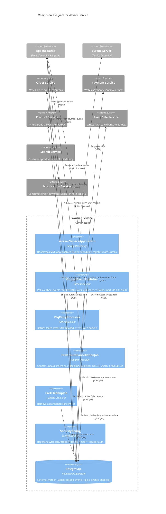

# C4 Component Level: Worker Service

## Overview

- **Name**: Worker Service
- **Description**: Background worker service responsible for reliable event publishing via the transactional outbox pattern, Dead Letter Queue (DLQ) handling with retry logic, and scheduled cron jobs for system maintenance tasks. Uses ShedLock for distributed locking, Quartz for scheduling, and Kafka for event transport. Designed as a shared infrastructure component that all services write to but only the Worker Service reads from and publishes.
- **Type**: Service (Background Worker)
- **Technology**: Java 25, Spring Boot 4 (MVC), PostgreSQL (JDBC/JPA), ShedLock 5.13.0, Quartz Scheduler, Kafka, Flyway, Eureka Client

## Purpose

The Worker Service solves two critical distributed system problems on the FlashSale platform:

1. **Transactional Outbox Pattern**: Eliminates the dual-write problem (writing to both database and Kafka in a single transaction). All services write events to the shared `outbox_events` table within their local database transaction. The Worker Service polls this table, publishes events to Kafka, and marks them as processed. This guarantees at-least-once delivery without distributed transactions.

2. **Scheduled Background Jobs**: Executes time-based maintenance tasks that do not belong in any single domain service:
   - Auto-cancelling unpaid orders past their payment deadline
   - Cleaning up abandoned shopping carts
   - Processing Dead Letter Queue entries for retry

## Software Features

- **Outbox Event Publisher**: Scheduled job that polls the `outbox_events` table for `PENDING` records, publishes each event to the corresponding Kafka topic, updates the status to `PROCESSED`, and increments `retry_count` on failure. Events exceeding the maximum retry count are moved to `failed_events`.
- **Dead Letter Queue (DLQ) Retry Processor**: Scheduled job that polls `failed_events` for `PENDING` entries and retries publishing them to Kafka. Supports configurable backoff and manual intervention workflows.
- **Order Auto-Cancellation**: Cron job that finds unpaid orders past their payment deadline and publishes `ORDER_AUTO_CANCELLED` events to Kafka via the outbox pattern, triggering refund processing and inventory release.
- **Cart Cleanup**: Cron job that removes abandoned shopping cart entries older than a configured threshold to reclaim database space.
- **Distributed Locking via ShedLock**: Ensures that only one Worker Service instance executes each scheduled job at a time, critical when multiple replicas are running. Lock state is stored in the `shedlock` table.
- **Virtual Threads (Project Loom)**: Uses Java 21+ virtual threads for high concurrency during I/O-bound tasks (database polling and Kafka publishing).

## Code Elements

This component contains the following code-level elements:

- [c4-code-backend-worker-service.md](./c4-code-backend-worker-service.md) -- Complete code-level documentation for the Worker Service

### Key Classes

| Class | Type | Responsibility |
|---|---|---|
| `WorkerServiceApplication` | Application Entry | Spring Boot bootstrap with Eureka discovery (implied by configuration) |
| `SecurityConfig` | Configuration | Registers `JwtTokenDecoderFilter` for internal auth via `X-User-*` headers |
| `OutboxEventPublisher` | Planned | Polls `outbox_events` for PENDING rows, publishes to Kafka, marks PROCESSED |
| `DlqRetryProcessor` | Planned | Retries failed events from `failed_events` table |
| `OrderAutoCancellationJob` | Planned | Quartz job: cancels unpaid orders past payment deadline |
| `CartCleanupJob` | Planned | Quartz job: removes abandoned cart entries |

### Database Migrations

| Migration | Purpose |
|---|---|
| `V1__init_outbox_failed_events_shedlock.sql` | Creates `outbox_events`, `failed_events`, and `shedlock` tables with status indexes |

## Interfaces

### REST API (Internal / Admin)

The Worker Service primarily operates as a background processor. Any REST endpoints would be for operational management:

| Method | Endpoint | Description |
|---|---|---|
| `GET` | `/api/v1/admin/outbox/status` | Outbox event statistics (pending, processed, failed counts) |
| `GET` | `/api/v1/admin/dlq` | List failed events in the DLQ |
| `POST` | `/api/v1/admin/dlq/{id}/retry` | Manually retry a specific failed event |
| `DELETE` | `/api/v1/admin/dlq/{id}` | Discard a failed event from the DLQ |

### Kafka Topics (Producer)

| Topic Constant | Topic Name | Direction | Purpose |
|---|---|---|---|
| `ORDER_AUTO_CANCELLED` | `order.auto_cancelled` | Produce | Signal that an unpaid order was automatically cancelled |
| `FLASH_SALE_SESSION_ENDED` | `flash_sale.session_ended` | Produce | Signal session end for downstream processing |

### Kafka Topics (Outbox -- Relays from other services)

The Worker Service publishes events written to `outbox_events` by other services. Key topics include:

| Topic | Source Service | Purpose |
|---|---|---|
| `product.created` | Product Service | New product indexing |
| `product.approved` | Product Service | Approved product indexing |
| `order.created` | Order Service | Order processing pipeline |
| `order.cancelled` | Order Service | Order cancellation handling |
| `payment.success` | Payment Service | Payment confirmation |
| `refund.requested` | Payment Service | Refund processing |
| `flash_sale.item_approved` | Flash Sale Service | Item approval notifications |
| `flash_sale.item_sold` | Flash Sale Service | Purchase event routing |

### Internal API

- **`shedlock` Table (PostgreSQL)**: Provides distributed lock primitives. Any scheduled job annotates its method with `@SchedulerLock(name = "...", lockAtMostFor = "...")` and ShedLock acquires/releases the lock atomically via the database.

## Dependencies

### Components Used (Data Sharing)

All domain services (Order, Payment, Product, Flash Sale) write to the shared `outbox_events` table as part of their local database transactions. The Worker Service is the sole reader and publisher.

| Component | Relationship | Protocol |
|---|---|---|
| Order Service | Writes `order.created`, `order.cancelled` to outbox | Shared PostgreSQL table |
| Payment Service | Writes `payment.success`, `refund.requested` to outbox | Shared PostgreSQL table |
| Product Service | Writes `product.created`, `product.approved` to outbox | Shared PostgreSQL table |
| Flash Sale Service | Writes `flash_sale.item_approved`, `flash_sale.item_sold` to outbox | Shared PostgreSQL table |

### External Systems

| System | Protocol | Purpose |
|---|---|---|
| PostgreSQL (port 5432) | JDBC (JPA/Hibernate) | Primary data store: `outbox_events`, `failed_events`, `shedlock` tables in `worker` schema |
| Kafka (port 9092) | Spring Kafka (producer) | Event publishing for outbox events and auto-cancellation notifications |
| Eureka (port 8761) | HTTP | Service registration and discovery |
| API Gateway | HTTP Headers | Sets `X-User-*` headers for internal auth |

### Shared Library

| Library | Usage |
|---|---|
| `common-lib` | `KafkaTopics` constants, `JwtTokenDecoderFilter` for internal security, `UserDetailsImpl`, `ApiResponse` DTO wrapper |

## Component Diagram

