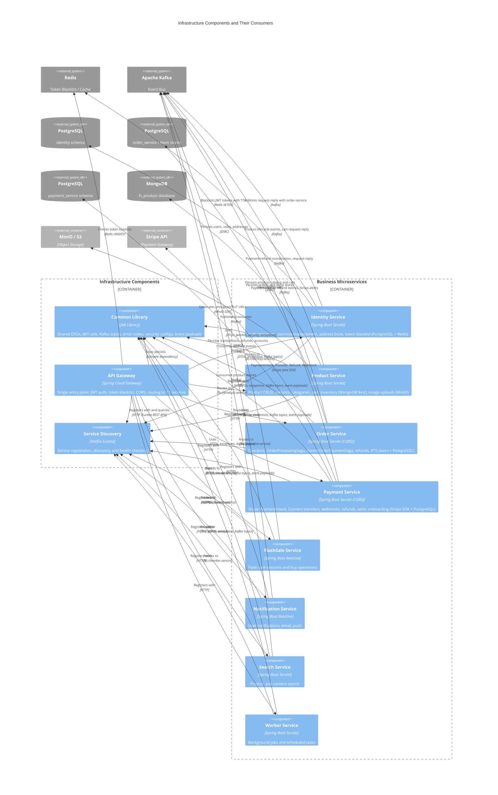

# C4 Component Level: System Overview

## Infrastructure Components

### API Gateway
- **Name**: API Gateway
- **Description**: Spring Cloud Gateway (WebFlux/Reactive) serving as the single entry point for all client requests. Handles JWT validation, token blacklist checking via Redis, CORS, security headers, and routes to all downstream microservices.
- **Type**: Infrastructure / API Gateway
- **Documentation**: [c4-component-api-gateway.md](./c4-component-api-gateway.md)

### Service Discovery
- **Name**: Service Discovery
- **Description**: Netflix Eureka service registry for microservice discovery. All backend services register here on startup and use it to discover peers via logical service names.
- **Type**: Infrastructure / Service Registry
- **Documentation**: [c4-component-service-discovery.md](./c4-component-service-discovery.md)

### Common Library
- **Name**: Common Library
- **Description**: Shared Java library (JAR) providing DTOs, Kafka topic definitions, JWT utilities, security configurations, exception handling, and base classes consumed by all FlashSale microservices.
- **Type**: Library
- **Documentation**: [c4-component-common-lib.md](./c4-component-common-lib.md)

## Business Services

### Identity Service
- **Name**: Identity Service
- **Description**: Central authentication and user management component handling JWT token generation/validation, user registration/login, role-based access control (BUYER/SELLER/ADMIN), address management, token blacklisting, and session management.
- **Type**: Service
- **Documentation**: [c4-component-identity-service.md](./c4-component-identity-service.md)

### Product Service
- **Name**: Product Service
- **Description**: Product catalog and cart management component handling products, product variants (SKUs), hierarchical categories, shopping cart operations, atomic inventory tracking, presigned image uploads to MinIO, and admin product approval workflow.
- **Type**: Service
- **Documentation**: [c4-component-product-service.md](./c4-component-product-service.md)

### Order Service
- **Name**: Order Service
- **Description**: Axon CQRS-based order lifecycle orchestrator managing multi-vendor checkout, dual-saga orchestration (OrderProcessingSaga per sub-order + ParentOrderPaymentSaga per checkout), order status state machine, refund workflows, Return To Sender, and seller dashboard.
- **Type**: Service (CQRS)
- **Documentation**: [c4-component-order-service.md](./c4-component-order-service.md)

### Payment Service
- **Name**: Payment Service
- **Description**: Stripe Connect payment processing component handling PaymentIntent creation, Stripe webhook event processing (20+ event types), multi-vendor fund transfers, seller Stripe Express onboarding, partial/full/RTS refund management with admin approval workflow, and seller earnings aggregation.
- **Type**: Service (CQRS)
- **Documentation**: [c4-component-payment-service.md](./c4-component-payment-service.md)

### Flash Sale Service
- **Name**: Flash Sale Service
- **Description**: Core service managing flash sale sessions, item lifecycle (submission, approval, rejection), buyer purchase flow with anti-oversell protection via Redis Lua scripts, and reminder notifications.
- **Type**: Service
- **Documentation**: [c4-component-flashsale-service.md](./c4-component-flashsale-service.md)

### Search Service
- **Name**: Search Service
- **Description**: Full-text product search using Elasticsearch, consuming Kafka events from Product Service to maintain a denormalized read model. Consumer-only Kafka pattern.
- **Type**: Service (Consumer)
- **Documentation**: [c4-component-search-service.md](./c4-component-search-service.md)

### Notification Service
- **Name**: Notification Service
- **Description**: Real-time notification delivery via Server-Sent Events (SSE), plus email/SMS dispatching. Consumes domain events from Kafka (order lifecycle, Stripe compliance) and persists notifications in MongoDB with 90-day TTL auto-expiry.
- **Type**: Service
- **Documentation**: [c4-component-notification-service.md](./c4-component-notification-service.md)

### Worker Service
- **Name**: Worker Service
- **Description**: Background worker for reliable event publishing via the transactional outbox pattern, Dead Letter Queue (DLQ) handling with retry logic, and scheduled cron jobs (order auto-cancellation, cart cleanup). Uses ShedLock for distributed locking.
- **Type**: Service (Background Worker)
- **Documentation**: [c4-component-worker-service.md](./c4-component-worker-service.md)

## Frontend Components

### Frontend Shared Library
- **Name**: Frontend Shared Library
- **Description**: Shared React/TypeScript library providing 13 API client modules, 11 Zustand state stores, 5 UI shell components (Layout, Navbar, Footer, ErrorBoundary, PrivateRoute), mock backend infrastructure, and core utilities (Axios instance with JWT auth, TanStack Query client, TypeScript types). Consumed by all three frontend apps.
- **Type**: Library / Shared UI
- **Documentation**: [c4-component-frontend-shared.md](./c4-component-frontend-shared.md)

### Customer Web App
- **Name**: Customer Web App
- **Description**: React 19 SPA (port 3000) for customers — product browsing, flash sale participation, cart management, Stripe checkout, order tracking, refund requests, loyalty points, trust score, and profile management.
- **Type**: Web Application (SPA)
- **Documentation**: [c4-component-customer-app.md](./c4-component-customer-app.md)

### Seller Web App
- **Name**: Seller Web App
- **Description**: React 19 SPA (port 3001) for sellers — product CRUD with image uploads, inventory management, order fulfillment, Stripe Connect onboarding, earnings dashboard, seller registration, and trust score.
- **Type**: Web Application (SPA)
- **Documentation**: [c4-component-seller-app.md](./c4-component-seller-app.md)

### Admin Web App
- **Name**: Admin Web App
- **Description**: React 19 SPA (port 3002) for platform administrators — user management (ban/unban), product moderation (approve/reject), refund processing (approve/reject), flash sale session configuration, and dashboard monitoring.
- **Type**: Web Application (SPA)
- **Documentation**: [c4-component-admin-app.md](./c4-component-admin-app.md)

## Utilities

### Dev Data Runner
- **Name**: Dev Data Runner
- **Description**: Standalone utility that coordinates development and demonstration data seeding across all microservices. Provides a centralized entry point with configuration-driven data generation parameters. Not deployed to production.
- **Type**: Utility
- **Documentation**: [c4-component-dev-data-runner.md](./c4-component-dev-data-runner.md)

## Code-Level Documentation Index

Each component is synthesized from these code-level documentation files:

| Component | Code-Level File |
|---|---|
| API Gateway | [c4-code-backend-api-gateway.md](./c4-code-backend-api-gateway.md) |
| Service Discovery | [c4-code-backend-discovery-service.md](./c4-code-backend-discovery-service.md) |
| Common Library | [c4-code-backend-common-lib.md](./c4-code-backend-common-lib.md) |
| Identity Service | [c4-code-backend-identity-service.md](./c4-code-backend-identity-service.md) |
| Product Service | [c4-code-backend-product-service.md](./c4-code-backend-product-service.md) |
| Order Service | [c4-code-backend-order-service.md](./c4-code-backend-order-service.md) |
| Payment Service | [c4-code-backend-payment-service.md](./c4-code-backend-payment-service.md) |
| Flash Sale Service | [c4-code-backend-flashsale-service.md](./c4-code-backend-flashsale-service.md) |
| Search Service | [c4-code-backend-search-service.md](./c4-code-backend-search-service.md) |
| Notification Service | [c4-code-backend-notification-service.md](./c4-code-backend-notification-service.md) |
| Worker Service | [c4-code-backend-worker-service.md](./c4-code-backend-worker-service.md) |
| Dev Data Runner | [c4-code-backend-dev-data-runner.md](./c4-code-backend-dev-data-runner.md) |
| Frontend Shared | [c4-code-frontend-shared.md](./c4-code-frontend-shared.md) |
| Customer App | [c4-code-frontend-customer.md](./c4-code-frontend-customer.md) |
| Seller App | [c4-code-frontend-seller.md](./c4-code-frontend-seller.md) |
| Admin App | [c4-code-frontend-admin.md](./c4-code-frontend-admin.md) |

## Component Relationships

