# Luồng Nghiệp Vụ Tổng Hợp — Business Flows Overview

**Phiên bản:** v1.0
**Ngày:** 2026-04-22
**Trạng thái:** Production-Ready
**Ngôn ngữ:** Tiếng Việt + English (Mermaid diagrams)

---

## Mục Lục

1. [Tổng Quan Kiến Trúc](#1-tổng-quan-kiến-trúc)
2. [Luồng Xác Thực & Tài Khoản](#2-luồng-xác-thực--tài-khoản)
3. [Luồng Sản Phẩm](#3-luồng-sản-phẩm)
4. [Luồng Giỏ Hàng](#4-luồng-giỏ-hàng)
5. [Luồng Đặt Hàng & Thanh Toán](#5-luồng-đặt-hàng--thanh-toán)
6. [Luồng Vận Chuyển & Giao Hàng](#6-luồng-vận-chuyển--giao-hàng)
7. [Luồng Hoàn Tiền & RTS](#7-luồng-hoàn-tiền--rts)
8. [Luồng Flash Sale](#8-luồng-flash-sale)
9. [Kafka Topics Overview](#9-kafka-topics-overview)

---

## 1. Tổng Quan Kiến Trúc

### 1.1 Services & Giao Tiếp

```mermaid
graph TB
    subgraph Frontend["Frontend (React)"]
        C[Customer App<br>:3000]
        S[Seller App<br>:3001]
        A[Admin App<br>:3002]
    end

    subgraph Gateway["Infrastructure"]
        GW[API Gateway<br>:8080]
        EU[Eureka<br>:8761]
    end

    subgraph AxonServices["Axon Services (CQRS + Event Sourcing)"]
        ORD[order-service<br>:8083<br>OrderAggregate<br>ParentOrderPaymentSaga<br>OrderProcessingSaga]
        PAY[payment-service<br>:8082<br>PaymentAggregate<br>RefundModule]
        FS[flashsale-service<br>:8085<br>FlashSaleAggregate]
        WRK[flashsale-service<br>:8085<br>FlashSaleAggregate<br>Cronjobs<br>(JOB-01/02/08/21)]
    end

    subgraph TraditionalServices["Traditional Services"]
        IDT[identity-service<br>:8081<br>PostgreSQL<br>JWT Auth]
        PRD[product-service<br>:8090<br>MongoDB<br>Carts]
        SCH[search-service<br>:8091<br>Elasticsearch]
        NTF[notification-service<br>:8092<br>MongoDB<br>Email/SMS]
    end

    subgraph Infra["Infrastructure"]
        KFK[Kafka<br>7.4.0]
        RED[Redis<br>7.0]
        PGS[PostgreSQL<br>15.4]
        MNG[MongoDB<br>6.0]
        AXN[AxonServer<br>:8124]
    end

    C & S & A --> GW
    GW --> EU
    GW --> IDT
    GW --> PRD
    GW --> ORD
    GW --> PAY
    GW --> FS
    GW --> SCH
    GW --> NTF

    ORD <--> KFK
    PAY <--> KFK
    FS <--> KFK
    WRK <--> KFK
    IDT <--> KFK
    PRD <--> KFK
    NTF <--> KFK

    ORD <--> AXN
    PAY <--> AXN
    FS <--> AXN

    PRD <--> RED
    FS <--> RED
    IDT <--> RED
```

### 1.2 Frontend → API Gateway Routes

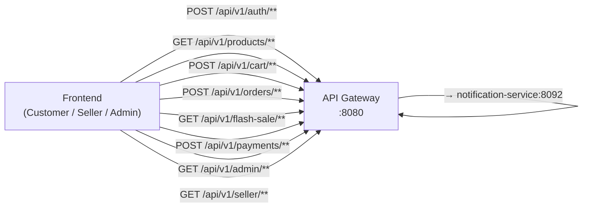

---

## 2. Luồng Xác Thực & Tài Khoản

### 2.1 Đăng Ký & Đăng Nhập

Khi người dùng mới tham gia sàn:

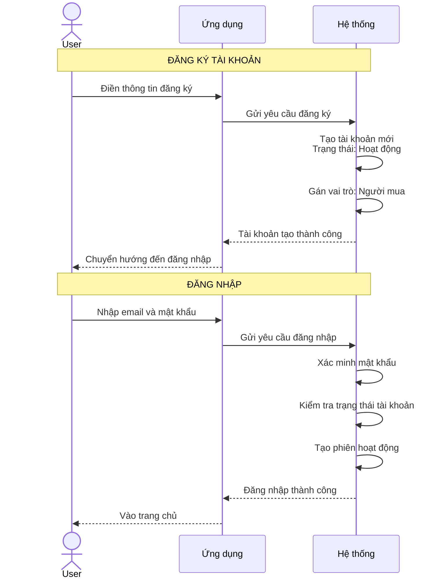

**Quy trình:**
- Tài khoản hoạt động ngay lập tức
- Phiên làm việc được bảo vệ và có thể gia hạn


### 2.2 Khóa / Mở Khóa Tài Khoản

```mermaid
stateDiagram-v2
    [*] --> ACTIVE: Tạo tài khoản mới

    ACTIVE --> LOCKED: Admin gọi<br>POST /admin/users/{id}/lock

    LOCKED --> ACTIVE: Admin gọi<br>POST /admin/users/{id}/unlock
    LOCKED --> ACTIVE: JOB-17<br>(locked_until <= NOW)

    LOCKED --> LOCKED: Admin gọi lại<br>POST /admin/users/{id}/lock<br>(update locked_until)

    note right of ACTIVE: JWT Revocation:<br>Identity Service thêm JTI vào<br>Redis blocklist ngay lập tức
    note right of LOCKED: Tài khoản bị khóa:<br>- Không đăng nhập được<br>- Không đặt hàng<br>- Đơn đang xử lý vẫn tiếp tục
```

### 2.3 Đăng Ký Trở Thành Seller

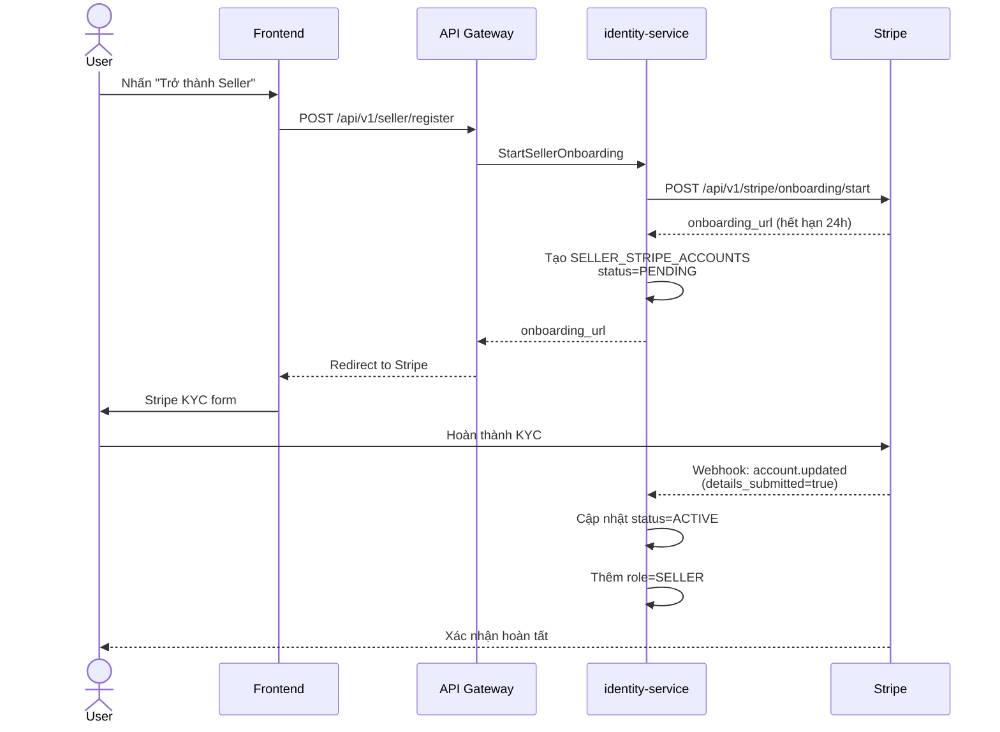

---

## 3. Luồng Sản Phẩm

### 3.1 Vòng Đời Sản Phẩm

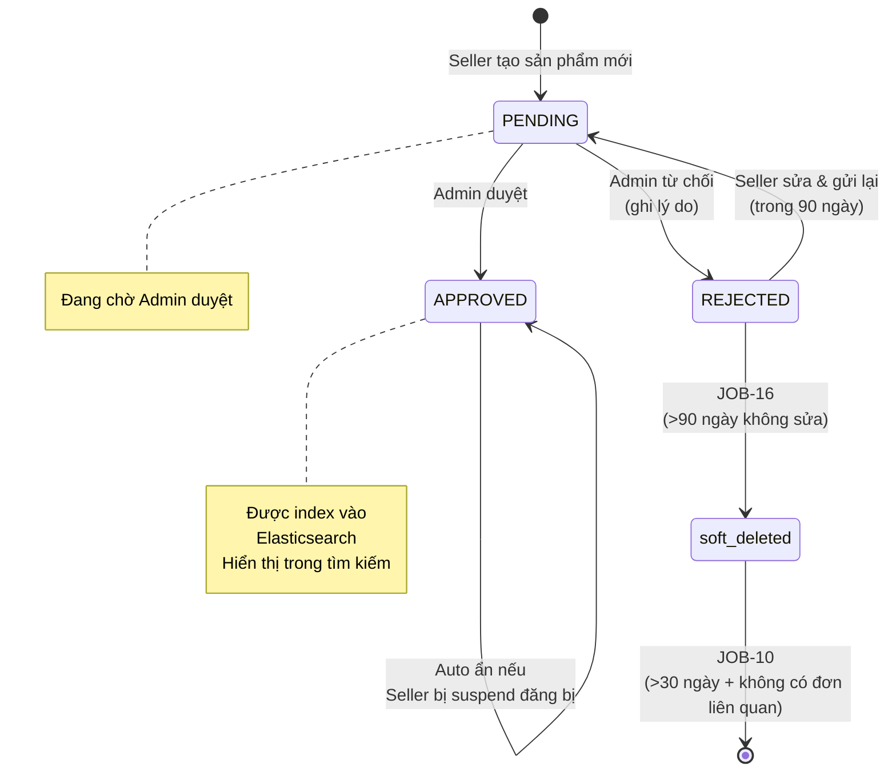

### 3.2 Seller Tạo Sản Phẩm

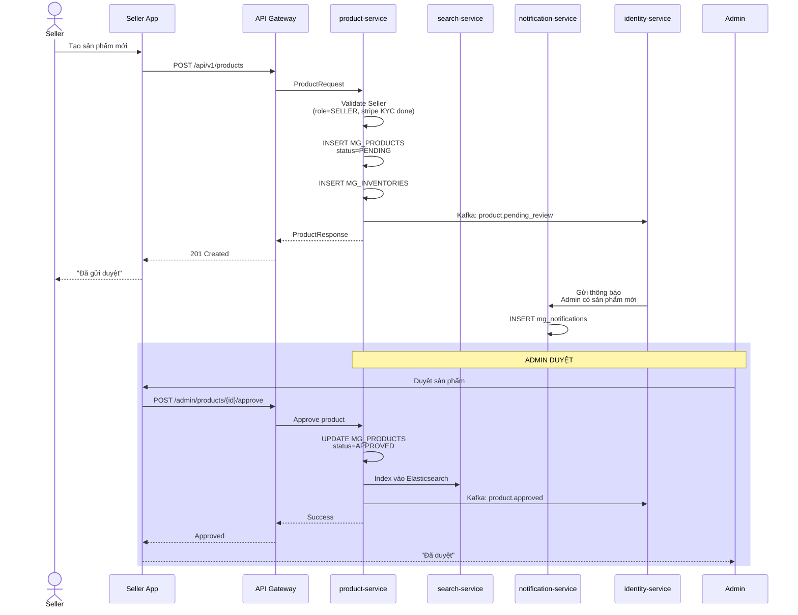

---

## 4. Luồng Giỏ Hàng

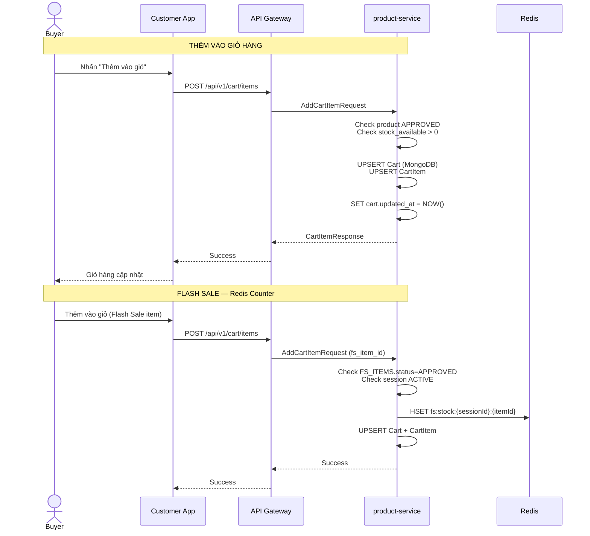

---

## 5. Luồng Đặt Hàng & Thanh Toán

### 5.1 Tổng Quan Checkout (Multi-Vendor)

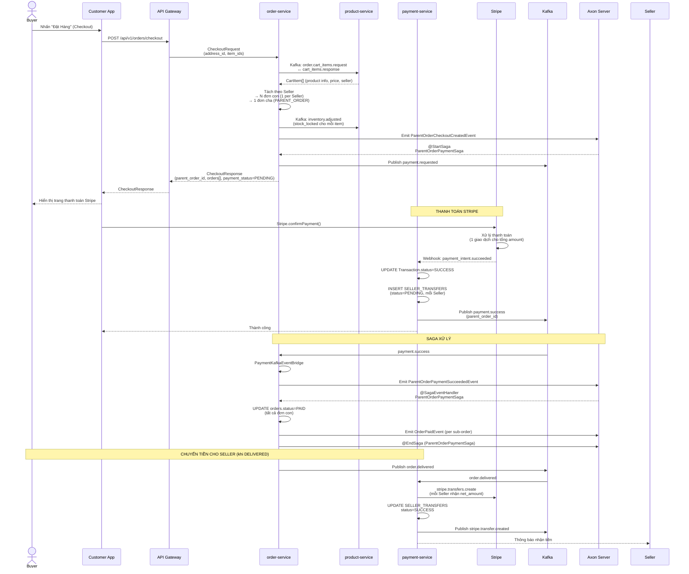

### 5.2 Saga State Machine

```mermaid
stateDiagram-v2
    [*] --> CHECKOUT_PENDING: Buyer checkout

    CHECKOUT_PENDING --> PAYMENT_REQUESTED: ParentOrderCheckoutCreatedEvent<br>@StartSaga

    PAYMENT_REQUESTED --> PAYMENT_SUCCEEDED: ParentOrderPaymentSucceededEvent<br>payment.success Kafka
    PAYMENT_REQUESTED --> PAYMENT_FAILED: ParentOrderPaymentFailedEvent<br>payment.failed Kafka

    PAYMENT_SUCCEEDED --> ORDERS_PAID: ParentOrderPaymentSaga<br>UPDATE orders → PAID
    PAYMENT_FAILED --> ORDERS_CANCELLED: ParentOrderPaymentSaga<br>UPDATE orders → CANCELLED

    ORDERS_PAID --> SHIPPING: Seller cập nhật tracking
    SHIPPING --> DELIVERED: Buyer xác nhận nhận hàng
    SHIPPING --> DELIVERED_AUTO: JOB-22 (>7 ngày, không RTS)
    SHIPPING --> RETURNED: Seller RTS

    DELIVERED --> REFUNDED: Buyer yêu cầu hoàn tiền<br>Admin duyệt
    DELIVERED --> PARTIALLY_REFUNDED: Hoàn một phần

    ORDERS_CANCELLED --> [*]: @EndSaga

    ORDERS_PAID --> [*]: @EndSaga (ParentPaymentSaga)
    RETURNED --> REFUNDED_AUTO: RTS auto-refund

    note right of PAYMENT_REQUESTED: Đơn chờ thanh toán<br>Timeout: 30 phút (thường)<br>Timeout: 10 phút (Flash Sale)
    note right of ORDERS_PAID: JOB-13 auto-cancel nếu<br>quá timeout mà chưa thanh toán
```

### 5.3 Parent Order vs Sub-Orders

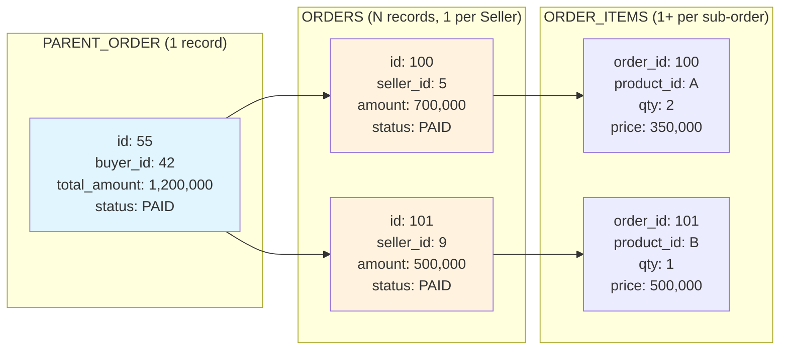

---

## 6. Luồng Vận Chuyển & Giao Hàng

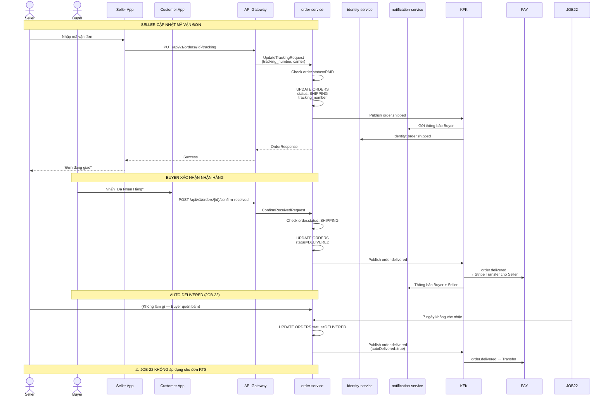

---

## 7. Luồng Hoàn Tiền & RTS

### 7.1 Buyer Yêu Cầu Hoàn Tiền

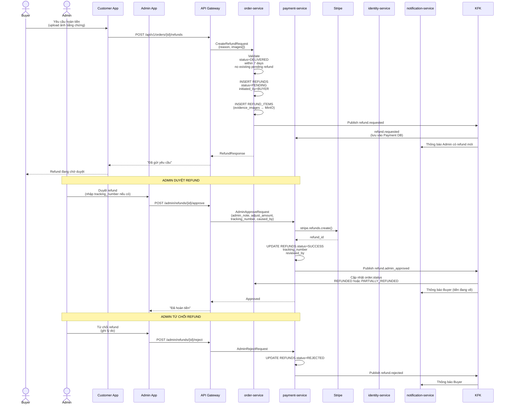

### 7.2 Return To Sender (RTS) — Tự Động Hoàn Tiền

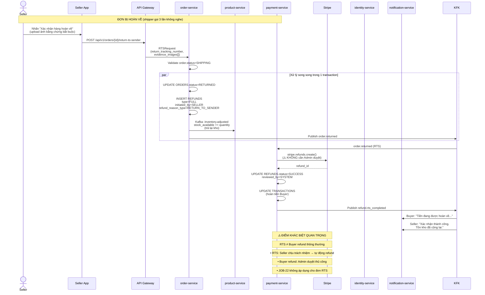

### 7.3 So Sánh: Buyer Refund vs RTS

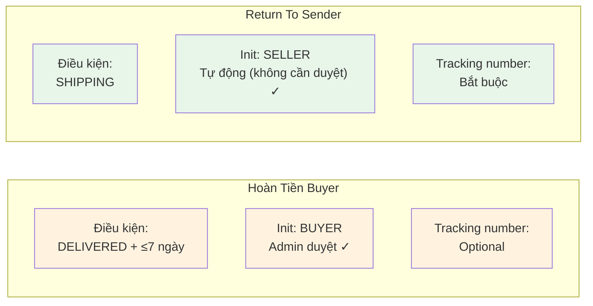

---

## 8. Luồng Flash Sale

### 8.1 Tổng Quan Flash Sale

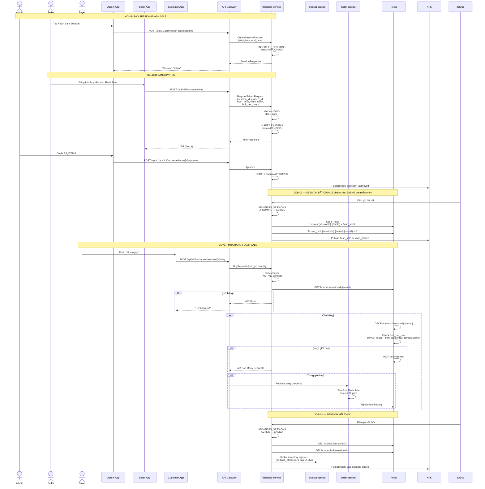

### 8.2 Anti-Oversell Mechanism

```mermaid
graph TD
    A["Buyer: POST /buy"] --> B{"fs:stock Redis > 0 ?"}

    B -->|Không| D["410 Hết hàng"]
    B -->|Có| E["DECR Redis counter<br>(Atomic)"]

    E --> F{"Redis counter < 0 ?"}
    F -->|Có| G["INCR lại<br>(hoàn tác)"]
    G --> D
    F -->|Không| H["Check limit_per_user<br>fs:user_limit:{userId}"]

    H --> I{"Đã vượt giới hạn ?"}
    I -->|Có| J["INCR lại<br>429 Too Many Requests"]
    I -->|Không| K["Tạo Order<br>(timeout 10 phút)"]

    K --> L["Tiếp tục thanh toán<br>(Stripe → Saga)"]

    style E fill:#e8f5e9
    style K fill:#e8f5e9
    style L fill:#c8e6c9

    Note over A,L: JOB-21 (mỗi 5 phút): Reconciliation Redis vs DB để sửa bất đồng bộ do Pod crash
```

---

## 9. Kafka Topics Overview

### 9.1 Event Flow Between Services

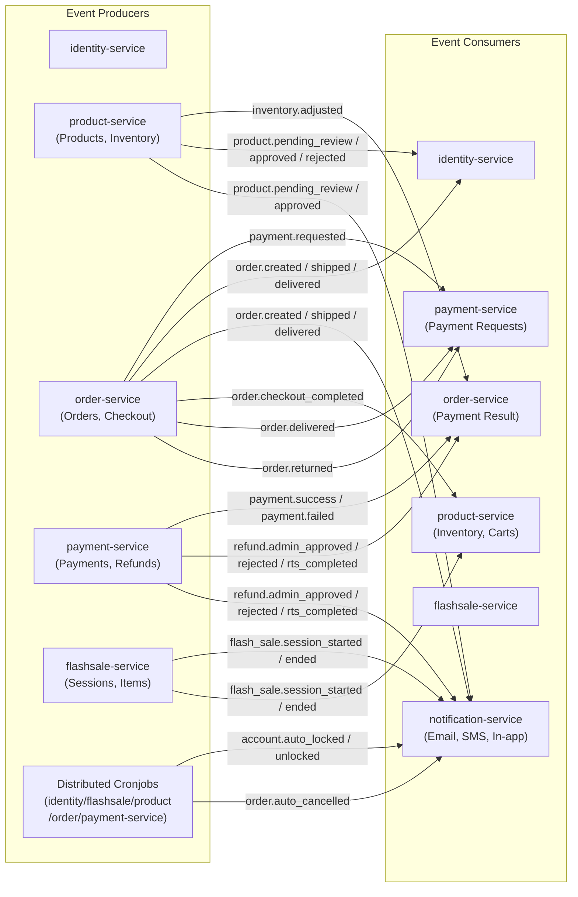

### 9.2 Topic Summary Table

| Topic | Producer | Consumers | Purpose |
|-------|----------|-----------|---------|
| `payment.requested` | order-service (Saga) | payment-service | Khởi tạo thanh toán Stripe |
| `payment.success` | payment-service | order-service | Thanh toán thành công |
| `payment.failed` | payment-service | order-service | Thanh toán thất bại |
| `order.created` | order-service | identity, notification | Đơn mới được tạo |
| `order.shipped` | order-service | notification | Đơn đang giao |
| `order.delivered` | order-service | identity, payment, notification | Đơn hoàn thành |
| `order.returned` | order-service | payment, notification | RTS - hàng hoàn về |
| `order.cancelled` | order-service | notification | Đơn bị hủy |
| `order.auto_cancelled` | order-service (JOB-13) | notification | Đơn auto hủy (timeout) |
| `order.checkout_completed` | order-service | product-service | Xóa cart items |
| `product.pending_review` | product-service | notification | Sản phẩm chờ duyệt |
| `product.approved` | product-service | identity, notification | Sản phẩm được duyệt |
| `product.rejected` | product-service | identity, notification | Sản phẩm bị từ chối |
| `inventory.adjusted` | product-service, order-service | order-service, flashsale | Điều chỉnh tồn kho |
| `refund.requested` | order-service | payment | Yêu cầu hoàn tiền |
| `refund.admin_approved` | payment-service | order, notification | Admin duyệt hoàn tiền |
| `refund.rts_completed` | payment-service | order, notification | RTS hoàn tiền tự động |
| `flash_sale.session_started` | flashsale-service | notification, product | Flash Sale bắt đầu |
| `flash_sale.session_ended` | flashsale-service | notification, product | Flash Sale kết thúc |
| `account.auto_locked` | worker (JOB-17) | notification | Tài khoản bị khóa tự động |
| `account.unlocked` | worker (JOB-17) | notification | Tài khoản được mở khóa |

---

## 📚 Related Documents

- **[03_BUSINESS.md](03_BUSINESS.md)** — Tài liệu nghiệp vụ chi tiết (9 workflows, policies, cronjobs)
- **[04_POLICIES.md](04_POLICIES.md)** — System policies chi tiết
- **[06_PAYMENT_SAGA_FLOW.md](06_PAYMENT_SAGA_FLOW.md)** — Saga implementation chi tiết
- **[08_PAYMENT_ORDER_INTEGRATION.md](08_PAYMENT_ORDER_INTEGRATION.md)** — Integration patterns chi tiết
- **[05_OPERATIONS.md](05_OPERATIONS.md)** — Cronjobs chi tiết

---

**Tài liệu tạo:** 2026-04-22
**Phiên bản:** v1.0
