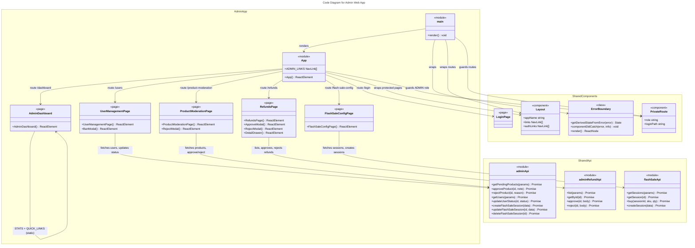
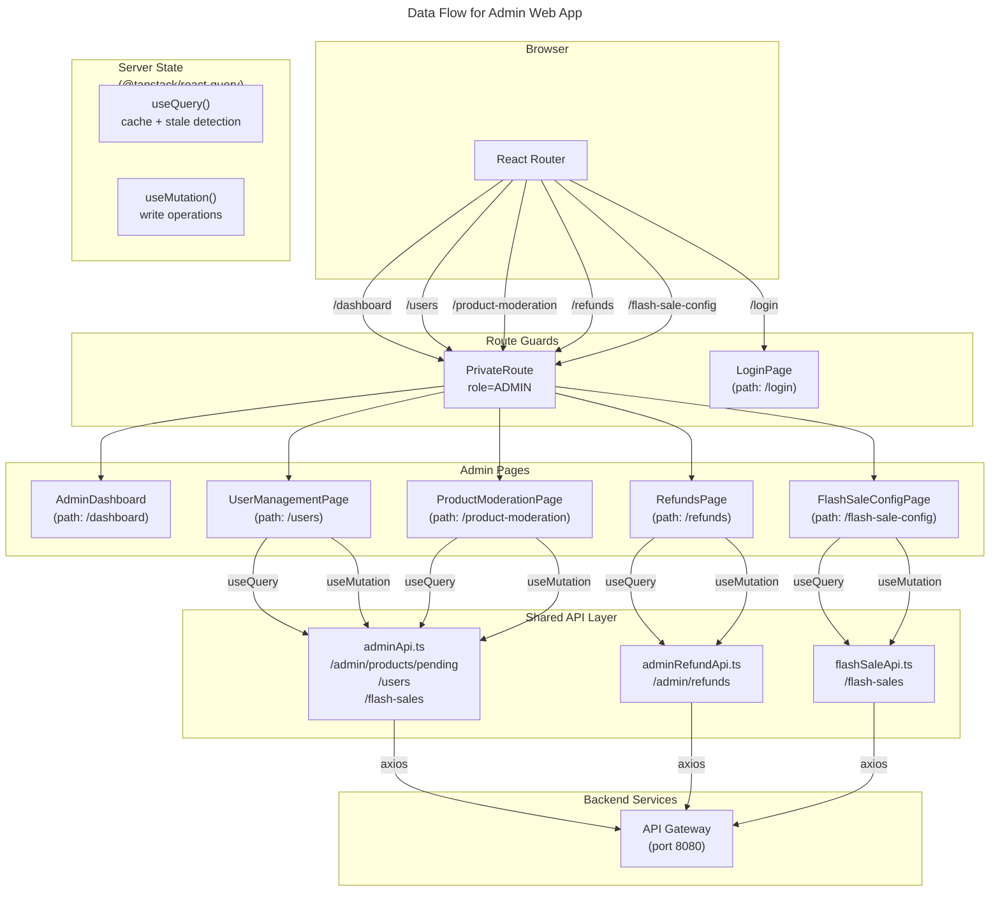

# C4 Code Level: Admin Web App

## Overview

- **Name**: Admin Web App
- **Description**: React SPA for platform administrators -- user management, product approval/rejection, system monitoring, analytics dashboard, and platform configuration. Runs on port 3002.
- **Location**: `D:\dev\stealing-from-paradise\frontend\apps\admin\`
- **Language**: TypeScript 5.6.2 + React 19.0.0 + Vite 6.0.0 + Tailwind CSS 3.4.1
- **Purpose**: Admin-facing platform management portal providing tools to manage users, moderate products, process refunds, configure flash sale sessions, and view system analytics.

## Code Elements

### Entry Points

---

#### `main.tsx`

- **Description**: Application bootstrap. Creates a React Query client, mounts the React root inside StrictMode, wraps the app with ErrorBoundary, QueryClientProvider, and BrowserRouter.
- **Location**: `D:\dev\stealing-from-paradise\frontend\apps\admin\src\main.tsx`
- **Dependencies**:
  - `@shared/lib/queryClient` -- `createQueryClient`, `QueryClientProvider`
  - `react-router-dom` -- `BrowserRouter`
  - `@shared/components/ErrorBoundary`
  - `@/App` (local alias)

---

#### `App.tsx`

- **Description**: Root component defining all routes for the admin SPA. Uses lazy-loaded pages and wraps protected routes with `Layout` and `PrivateRoute` (role `ADMIN`). Defines the `ADMIN_LINKS` navigation array for the sidebar/header.
- **Location**: `D:\dev\stealing-from-paradise\frontend\apps\admin\src\App.tsx`
- **Dependencies**:
  - `react-router-dom` -- `Routes`, `Route`, `Navigate`
  - `@shared/components/Layout`
  - `@shared/components/PrivateRoute`
  - `@shared/pages/LoginPage` (lazy)
  - `@/pages/AdminDashboard` (lazy)
  - `@/pages/UserManagementPage` (lazy)
  - `@/pages/ProductModerationPage` (lazy)
  - `@/pages/RefundsPage` (lazy)
  - `@/pages/FlashSaleConfigPage` (lazy)

**Route table defined in App.tsx**:

| Path                     | Component (lazy)         | Auth Required |
| ------------------------ | ------------------------ | ------------- |
| `/login`                 | `LoginPage`              | No            |
| `/dashboard`             | `AdminDashboard`         | ADMIN role    |
| `/users`                 | `UserManagementPage`     | ADMIN role    |
| `/product-moderation`    | `ProductModerationPage`  | ADMIN role    |
| `/refunds`               | `RefundsPage`            | ADMIN role    |
| `/flash-sale-config`     | `FlashSaleConfigPage`    | ADMIN role    |
| `/`                      | Redirect to `/dashboard` | N/A           |
| `*`                      | Redirect to `/`          | N/A           |

---

### Pages

---

#### `AdminDashboard`

- **Description**: Main admin dashboard landing page. Displays four stat cards (total users, pending products, refund requests, active flash sales) with gradient backgrounds and mock data (all values currently "0"). Provides quick link cards to each admin section and a "recent activity" placeholder.
- **Location**: `D:\dev\stealing-from-paradise\frontend\apps\admin\src\pages\AdminDashboard.tsx`
- **State**: None (static mock data)
- **Dependencies**: None (no API calls)

**Exported function**:
- `AdminDashboard()` -- returns the full dashboard layout with stats grid, quick links grid, and recent activity placeholder.

---

#### `UserManagementPage`

- **Description**: User list and management page. Fetches paginated users with role/status filters and search. Displays users in a table with avatar, username, email, role badge, status badge, creation date, and action buttons (view, ban/unban). Includes a `BanModal` sub-component for confirming user ban/unban operations.
- **Location**: `D:\dev\stealing-from-paradise\frontend\apps\admin\src\pages\UserManagementPage.tsx`
- **State**: `roleFilter`, `statusFilter`, `page`, `searchQuery`, `banUser`
- **Query key**: `['admin-users', roleFilter, statusFilter, page]`
- **API endpoints consumed**:
  - `adminApi.getUsers({ role?, status?, page, size })` -- GET /users
  - `adminApi.updateUserStatus(userId, status)` -- PUT /users/{userId}/status

**Exported function**:
- `UserManagementPage()` -- returns the full user management UI with filters, table, pagination, and ban modal.

**Internal component**:
- `BanModal({ user: AdminUser, onClose: () => void, onSuccess: () => void })` -- confirmation dialog for banning/unbanning a user. Uses `useMutation` to call `adminApi.updateUserStatus`.

---

#### `ProductModerationPage`

- **Description**: Product moderation page for approving or rejecting seller-submitted products. Displays products in a card list with image, name, seller info, price, category, description, and status badge. Provides tab-based filtering (Pending / Approved / Rejected). Includes approve confirmation dialog and a `RejectModal` sub-component with reason selection.
- **Location**: `D:\dev\stealing-from-paradise\frontend\apps\admin\src\pages\ProductModerationPage.tsx`
- **State**: `tab`, `page`, `rejectProduct`, `approveProduct`
- **Query key**: `['admin-pending-products', tab, page]`
- **API endpoints consumed**:
  - `adminApi.getPendingProducts({ page, size })` -- GET /admin/products/pending
  - `adminApi.approveProduct(productId)` -- POST /admin/products/{productId}/approve
  - `adminApi.rejectProduct(productId, reason)` -- POST /admin/products/{productId}/reject

**Exported function**:
- `ProductModerationPage()` -- returns the full product moderation UI with tabs, product cards, approve/reject modals, and pagination.

**Internal component**:
- `RejectModal({ product: PendingProduct, onClose, onSuccess })` -- dialog for rejecting a product with a reason dropdown (6 options: incomplete info, invalid images, invalid price, policy violation, prohibited product).

---

#### `RefundsPage`

- **Description**: Refund management page for processing refund requests from buyers and sellers. Shows a table of refund records with columns for ID, order ID, type (full/partial), amount, initiator, reason, status, date, and actions (approve/reject/retry). Provides status filter pills, type filter dropdown, and pagination. Includes three internal components: `ApproveModal`, `RejectModal`, and `DetailDrawer`.
- **Location**: `D:\dev\stealing-from-paradise\frontend\apps\admin\src\pages\RefundsPage.tsx`
- **State**: `statusFilter`, `typeFilter`, `page`, `approveRefund`, `rejectRefund`, `detailRefund`
- **Query key**: `['admin-refunds', statusFilter, typeFilter, page]`
- **API endpoints consumed**:
  - `adminRefundApi.list({ status?, type?, page, size })` -- GET /admin/refunds
  - `adminRefundApi.approve(refundId, body)` -- POST /admin/refunds/{refundId}/approve
  - `adminRefundApi.reject(refundId, body)` -- POST /admin/refunds/{refundId}/reject

**Exported function**:
- `RefundsPage()` -- returns the full refund management UI with filters, table, pagination, approve/reject modals, and detail drawer.

**Internal components**:
- `ApproveModal({ refund: RefundResponse, onClose, onSuccess })` -- approval dialog with admin note, adjustable amount, cause (buyer/seller), and tracking number fields. Shows a success confirmation before closing.
- `RejectModal({ refund: RefundResponse, onClose, onSuccess })` -- rejection dialog with reason dropdown (6 options) and a fraud evidence checkbox. Shows a success confirmation before closing.
- `DetailDrawer({ refund: RefundResponse, onClose })` -- slide-in drawer showing full refund details: IDs, type, status, amount, adjustments, initiator, reason, admin note, reject reason, Stripe refund ID, and timestamps.

---

#### `FlashSaleConfigPage`

- **Description**: Flash sale session configuration page for creating and managing flash sale time windows. Provides a toggle-able creation form with name, start time, and end time fields. Displays existing sessions in a table with name, start/end time, product count, status badge, and actions (edit, delete). Includes client-side validation for required fields and time ordering.
- **Location**: `D:\dev\stealing-from-paradise\frontend\apps\admin\src\pages\FlashSaleConfigPage.tsx`
- **State**: `showForm`, `editingSession`, `name`, `startTime`, `endTime`, `formError`
- **Query key**: `['admin-flash-sale-sessions']`
- **Stale time**: 60 seconds (1000 * 60)
- **API endpoints consumed**:
  - `flashSaleApi.getSessions({ size: 100 })` -- GET /flash-sales
  - `flashSaleApi.createSession({ name, start_time, end_time })` -- POST /flash-sales

**Exported function**:
- `FlashSaleConfigPage()` -- returns the full flash sale config UI with create form, sessions table, and loading/error/empty states.

---

### Shared Components (used by admin app)

---

#### `ErrorBoundary` (from `@shared/components/ErrorBoundary`)

- **Description**: React class component that catches JavaScript errors in its child tree. Displays a fallback UI with an error icon, message, and "Try Again" button that resets the error state. Accepts an optional custom `fallback` prop.
- **Location**: `D:\dev\stealing-from-paradise\frontend\shared\components\ErrorBoundary.tsx`
- **Methods**:
  - `getDerivedStateFromError(error: Error): State` -- static lifecycle method
  - `componentDidCatch(error: Error, errorInfo: React.ErrorInfo): void` -- logs error to console
  - `render(): ReactNode` -- renders fallback or children

---

#### `Layout` (from `@shared/components/Layout`)

- **Description**: Application shell component that wraps page content with a `Navbar` on top and `Footer` on bottom. Accepts `appName`, `links`, and `authLinks` props passed to the navbar.
- **Location**: `D:\dev\stealing-from-paradise\frontend\shared\components\Layout.tsx`
- **Props**:
  - `children: ReactNode`
  - `appName: string`
  - `links?: NavLink[]`
  - `authLinks?: NavLink[]`

---

#### `PrivateRoute` (from `@shared/components/PrivateRoute`)

- **Description**: Route guard component that checks authentication from Zustand store or cookie fallback. Optionally checks for a specific role. Redirects to login (or custom path) if not authenticated, or to "/" if role mismatch.
- **Location**: `D:\dev\stealing-from-paradise\frontend\shared\components\PrivateRoute.tsx`
- **Props**:
  - `children: ReactNode`
  - `role?: string` -- e.g. "SELLER", "ADMIN"
  - `loginPath?: string` -- defaults to "/login"

---

## Dependencies

### Internal Dependencies (from `frontend/shared/`)

| Dependency                       | Used By             | Description                                  |
| -------------------------------- | ------------------- | -------------------------------------------- |
| `@shared/api/admin.api`          | All admin pages     | Admin API client and types (`AdminUser`, `PendingProduct`, `adminApi`) |
| `@shared/api/flashSale.api`      | FlashSaleConfigPage | Flash sale API client and types (`FlashSaleSession`, `FlashSaleItem`, `flashSaleApi`) |
| `@shared/api/refund.api`         | RefundsPage         | Refund API client and types (`RefundResponse`, `adminRefundApi`) |
| `@shared/components/Layout`      | App.tsx (Router)    | Application layout shell with Navbar + Footer |
| `@shared/components/PrivateRoute`| App.tsx (Router)    | Route guard component for ADMIN role          |
| `@shared/components/ErrorBoundary`| main.tsx           | Error boundary wrapper                        |
| `@shared/lib/queryClient`        | main.tsx            | React Query client factory and provider       |
| `@shared/pages/LoginPage`        | App.tsx (Router)    | Shared login page                             |
| `@shared/lib/axios`              | admin.api, flashSale.api, refund.api | Axios HTTP client instance |
| `@shared/types/api`              | admin.api, flashSale.api, refund.api | Shared API response types (`ApiResponse`, `PageResponse`) |

### External Dependencies

| Dependency                      | Version | Used By             | Description                          |
| ------------------------------- | ------- | ------------------- | ------------------------------------ |
| `react`                         | 19.0.0  | All components      | UI library                           |
| `react-dom`                     | 19.0.0  | main.tsx            | DOM rendering                        |
| `react-router-dom`              | *       | App.tsx, PrivateRoute| Client-side routing                  |
| `@tanstack/react-query`         | *       | All pages           | Server state management (API queries, mutations) |
| `zustand`                       | *       | PrivateRoute        | State management (auth store)        |
| `axios`                         | *       | Shared API modules  | HTTP client                          |
| `vite`                          | 6.0.0   | Build system        | Build tool and dev server            |
| `tailwindcss`                   | 3.4.1   | All components      | Utility-first CSS framework          |

## Relationships

### Module Structure

### Data Flow Diagram

## Notes

- All pages use lazy loading via `React.lazy()` and `Suspense` for code splitting.
- Every data-fetching page follows the same pattern: `useQuery` for reads, `useMutation` for writes, and `queryClient.invalidateQueries` to refresh after mutations.
- The admin app shares the `PrivateRoute` component with other frontend apps (customer, seller) but enforces `role="ADMIN"`.
- `AdminDashboard` currently shows static/mock data (all values "0") -- it is a placeholder awaiting real analytics API integration.
- The admin app uses `@shared/pages/LoginPage` with `showRegisterLink={false}` and `redirectTo="/dashboard"` -- registration is disabled for the admin login context.
- All API calls pass through the shared `axios` instance configured in `@shared/lib/axios`, which includes base URL, interceptors, and auth token injection.
- Vietnamese language is used throughout the UI for labels, buttons, and messages.
