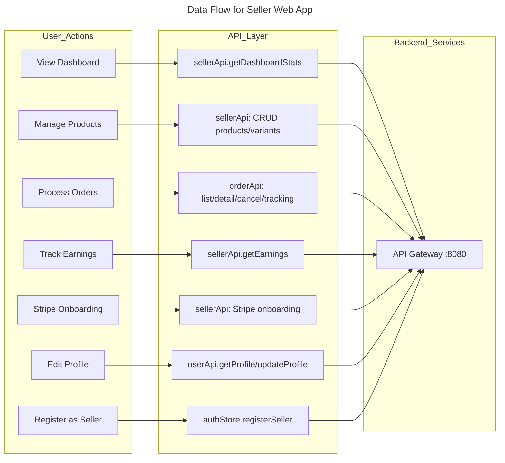
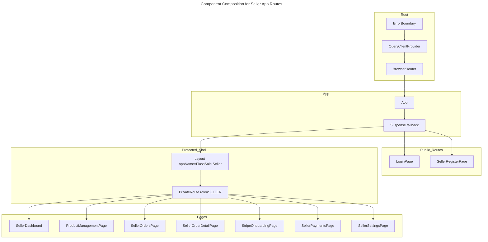

# C4 Code Level: Seller Web App

## Overview

- **Name**: Seller Web App
- **Description**: React SPA for sellers -- product management, inventory, order fulfillment, Stripe Connect onboarding, earnings dashboard, and trust score. Runs on port 3001.
- **Location**: `frontend/apps/seller/`
- **Language**: TypeScript 5.6.2 + React 19.0.0 + Vite 6.0.0 + Tailwind CSS 3.4.1
- **Purpose**: Seller-facing shop management portal enabling sellers to manage products, process orders, track earnings via Stripe Connect, and monitor trust scores.

## Code Elements

### Entry Points

#### `main.tsx`
- **Description**: Application bootstrap. Creates the React Query client, wraps the app with ErrorBoundary, QueryClientProvider, and BrowserRouter.
- **Location**: `frontend/apps/seller/src/main.tsx`
- **Dependencies**:
  - `@shared/lib/queryClient` (createQueryClient)
  - `@shared/components/ErrorBoundary`
  - `@/App`

#### `App.tsx`
- **Description**: Root component defining all routes. Uses React.lazy for code-splitting and Suspense for loading states. Public routes (`/login`, `/register`) are rendered without layout; all other routes are protected by `PrivateRoute` with role `SELLER` and wrapped in `Layout` with the "FlashSale Seller" branding. Includes Stripe redirect catch routes (`/stripe/return`, `/stripe/refresh` with query param forwarding).
- **Location**: `frontend/apps/seller/src/App.tsx`
- **Dependencies**:
  - `@shared/components/Layout`
  - `@shared/components/PrivateRoute`
  - `@shared/pages/LoginPage`
  - `@/pages/SellerRegisterPage`
  - `@/pages/SellerDashboard`
  - `@/pages/ProductManagementPage`
  - `@/pages/SellerOrdersPage`
  - `@/pages/SellerOrderDetailPage`
  - `@/pages/StripeOnboardingPage`
  - `@/pages/SellerPaymentsPage`
  - `@/pages/SellerSettingsPage`
- **Route table**:

| Path | Component | Auth |
|---|---|---|
| `/login` | `LoginPage` | Public |
| `/register` | `SellerRegisterPage` | Public |
| `/dashboard` | `SellerDashboard` | SELLER |
| `/products` | `ProductManagementPage` | SELLER |
| `/orders` | `SellerOrdersPage` | SELLER |
| `/orders/:orderId` | `SellerOrderDetailPage` | SELLER |
| `/stripe-onboarding` | `StripeOnboardingPage` | SELLER |
| `/stripe/return` | Navigate to `/stripe-onboarding?from=stripe` | SELLER |
| `/stripe/refresh` | Navigate to `/stripe-onboarding?refresh=1` | SELLER |
| `/payments` | `SellerPaymentsPage` | SELLER |
| `/settings` | `SellerSettingsPage` | SELLER |
| `/` | Redirect to `/dashboard` | SELLER |
| `/*` | Redirect to `/` | SELLER |

### Pages

#### `SellerDashboard`
- **Description**: Seller dashboard landing page. Displays stat cards (total products, orders today, monthly revenue), a pending-orders alert banner, a getting-started notice for new sellers (with links to add products and connect Stripe), and quick-action cards linking to products, orders, and payments.
- **Location**: `frontend/apps/seller/src/pages/SellerDashboard.tsx`
- **Exported function**: `SellerDashboard()`
- **Data fetching**:
  - `useQuery(['seller-dashboard-stats'], ...)` -- calls `sellerApi.getDashboardStats()`
- **Dependencies**:
  - `@tanstack/react-query`
  - `@shared/api/seller.api` (sellerApi, SellerDashboardStats)

#### `ProductManagementPage`
- **Description**: Full CRUD product management page. Table view with status filter tabs (ALL/APPROVED/PUBLISHED/PENDING/REJECTED/DRAFT), search with 300ms debounce, and pagination. Inline action buttons for submit-for-review, publish, unpublish, and delete (DRAFT/REJECTED only). Contains a tabbed `ProductFormModal` (Info / Images / Variants / Inventory tabs) for create/edit, `VariantModal` for variant CRUD, `ImageUploader` for presigned-URL-based image upload to MinIO, and `InventoryPanel` for stock adjustments.
- **Location**: `frontend/apps/seller/src/pages/ProductManagementPage.tsx`
- **Exported function**: `ProductManagementPage()`
- **Internal components**:
  - `StatusBadge({ status: string })` -- renders colored badge for product status
  - `VariantModal({ productId, initial?, onClose, onSuccess })` -- create/edit variant with SKU, name, price, stock
  - `ImageUploader({ productId, images, onChange })` -- upload images via presigned URLs
  - `InventoryPanel({ productId, variants })` -- adjust/restock inventory with delta adjustment, restock quantity, reason input, and per-SKU log viewer
  - `ProductFormModal({ product?, onClose, onSuccess })` -- tabbed modal for product creation/editing
- **Data fetching**:
  - `useQuery(['seller-products', statusFilter, page, debouncedSearch], ...)` -- paginated product list via `apiClient.get('/sellers/me/products')`
  - `useQuery(['seller-variants', productId], ...)` -- variant list for a product
  - `useQuery(['inventory-logs', logSku], ...)` -- inventory adjustment logs for a SKU
  - `useMutation` calls for: `submitForReview`, `publishProduct`, `unpublishProduct`, `deleteProduct`, `createVariant`, `updateVariant`, `adjustInventory`, `restockInventory`
- **Dependencies**:
  - `@tanstack/react-query`
  - `@shared/lib/axios` (apiClient)
  - `@shared/api/seller.api` (sellerApi, SellerProduct, SellerVariant, InventoryLogEntry)
  - `@shared/types/api` (ApiResponse, PageResponse)

#### `SellerOrdersPage`
- **Description**: Paginated orders list page with status filter tabs (ALL/PENDING/PAID/SHIPPING/DELIVERED/CANCELLED/PARTIALLY_REFUNDED/REFUNDED). Inline actions per row: cancel (PENDING), add tracking (PAID), return-to-sender confirmation (RETURNED). Includes `TrackingModal` for entering tracking number/carrier/note, `RTSModal` (Return to Sender) for uploading evidence images and confirming return, and `OrderDrawer` (slide-in panel) for quick order detail view.
- **Location**: `frontend/apps/seller/src/pages/SellerOrdersPage.tsx`
- **Exported function**: `SellerOrdersPage()`
- **Internal components**:
  - `TrackingModal({ order, onClose, onSuccess })` -- modal for updating tracking number and carrier
  - `RTSModal({ order, onClose, onSuccess })` -- modal for return-to-sender confirmation with evidence image upload
  - `OrderDrawer({ order, onClose })` -- slide-in drawer showing customer info, shipping, payment, and link to full detail page
- **Data fetching**:
  - `useQuery(['seller-orders', filter, page], ...)` -- calls `orderApi.getSellerOrders({ status, page, size: 20 })`
  - `useMutation` calls for: `updateTracking`, `returnToSender`, direct `cancelOrder` calls
- **Dependencies**:
  - `@tanstack/react-query`
  - `react-router-dom`
  - `@shared/api/order.api` (orderApi, SellerOrderSummary, OrderStatus)

#### `SellerOrderDetailPage`
- **Description**: Full order detail view. Displays order status badge, buyer info (name, username, shipping address), payment info (amount, method, transaction reference, paid time -- fetched from payment service), line items with snapshots, and price summary. Cancel button is shown for PENDING orders.
- **Location**: `frontend/apps/seller/src/pages/SellerOrderDetailPage.tsx`
- **Exported function**: `SellerOrderDetailPage()`
- **Data fetching**:
  - `useQuery(['seller-order', id], ...)` -- calls `orderApi.getOrderById(id)`
  - `useQuery(['payment-for-seller', parentOrderId], ...)` -- calls `paymentApi.getPayment(parentOrderId)`
  - `useMutation` -- `cancelOrder` mutation
- **Dependencies**:
  - `react-router-dom`
  - `@tanstack/react-query`
  - `@shared/api/order.api` (orderApi)
  - `@shared/api/payment.api` (paymentApi)

#### `SellerPaymentsPage`
- **Description**: Earnings and Stripe dashboard page. Shows balance cards (total earnings, available balance, pending balance), platform fee and transaction count summary, and a dual-tab view. "Earnings History" tab displays a table of transfer records (order ID, transfer amount, fee, net amount, status, date). "Stripe Dashboard" tab provides a link to open the Stripe Express Dashboard for payout management, account settings, and reports.
- **Location**: `frontend/apps/seller/src/pages/SellerPaymentsPage.tsx`
- **Exported function**: `SellerPaymentsPage()`
- **Data fetching**:
  - `useQuery(['seller-earnings'], ...)` -- calls `sellerApi.getEarnings()`
  - `useMutation` -- `getStripeDashboardLink` mutation that opens the dashboard URL in a new tab
- **Dependencies**:
  - `@tanstack/react-query`
  - `@shared/api/seller.api` (sellerApi)

#### `SellerRegisterPage`
- **Description**: Seller registration page with a two-panel layout (brand panel on desktop left, form on right). Form fields: username, email, password (with show/hide toggle), confirm password. Validates password match and min length. Calls `registerSeller` from the auth store on submit.
- **Location**: `frontend/apps/seller/src/pages/SellerRegisterPage.tsx`
- **Exported function**: `SellerRegisterPage()`
- **Dependencies**:
  - `react-router-dom`
  - `@shared/store/authStore` (useAuthStore)

#### `SellerSettingsPage`
- **Description**: Seller profile settings page. Displays the `SellerProfileCard` (avatar, full name, email, phone) and a Stripe account management section. `EditProfileModal` allows updating display name and phone via `userApi.updateProfile`. Includes a link to the Stripe onboarding page.
- **Location**: `frontend/apps/seller/src/pages/SellerSettingsPage.tsx`
- **Exported function**: `SellerSettingsPage()`
- **Internal components**:
  - `SellerProfileCard({ profile })` -- avatar, name, email, phone display
  - `EditProfileModal({ profile, onClose })` -- inline modal for editing profile fields
- **Data fetching**:
  - `useQuery(['seller-profile'], ...)` -- calls `userApi.getProfile()`
  - `useMutation` -- `userApi.updateProfile` mutation
- **Dependencies**:
  - `@tanstack/react-query`
  - `@shared/api/user.api` (userApi)

#### `StripeOnboardingPage`
- **Description**: Stripe Connect onboarding wizard. Manages the full lifecycle: PENDING (start onboarding), IN_PROGRESS (continue verification with real-time polling), COMPLETE (celebrate with links to earnings/dashboard), SUSPENDED (guidance for resolution). Handles Stripe redirect return/refresh query params. Shows verification checklist (identity, charges, payouts), step-by-step progress, and Express Dashboard link. Error handling distinguishes platform-level errors (Connect not activated, country unsupported) from transient failures.
- **Location**: `frontend/apps/seller/src/pages/StripeOnboardingPage.tsx`
- **Exported function**: `StripeOnboardingPage()`
- **Internal components**:
  - `VerificationChecklist({ status })` -- checkmark list for detailsSubmitted, chargesEnabled, payoutsEnabled
  - `normalizeStatus(raw)` -- utility to normalize raw status string
  - `parseStripeError(err)` -- utility to parse Stripe Connect error responses into user-facing messages
- **Data fetching**:
  - `useQuery(['stripe-onboarding-status'], ...)` -- calls `sellerApi.getStripeStatus()`, with `refetchInterval: 3000` when returning from Stripe
  - `useMutation` -- `startStripeOnboarding` and `refreshStripeLink` mutations
  - `useEffect` hook auto-fires `refreshStripeLink` when `?refresh=1` query param is present
- **Dependencies**:
  - `react-router-dom` (useSearchParams)
  - `@tanstack/react-query`
  - `@shared/api/seller.api` (sellerApi, StripeOnboardingStatus)

### Internal Components (co-located within pages)

Components are declared inside page files and are not exported for external reuse:

| Component | Parent Page | Purpose |
|---|---|---|
| `StatusBadge` | ProductManagementPage | Renders colored status pill for product lifecycle |
| `VariantModal` | ProductManagementPage | Create/edit product variant with SKU, name, price, stock |
| `ImageUploader` | ProductManagementPage | Upload product images via presigned URL to MinIO |
| `InventoryPanel` | ProductManagementPage | Adjust inventory, restock, view per-SKU change logs |
| `ProductFormModal` | ProductManagementPage | Tabbed modal for product CRUD (Info/Images/Variants/Inventory) |
| `TrackingModal` | SellerOrdersPage | Update order tracking number and carrier |
| `RTSModal` | SellerOrdersPage | Return-to-sender confirmation with evidence image uploads |
| `OrderDrawer` | SellerOrdersPage | Slide-in drawer for quick order summary |
| `SellerProfileCard` | SellerSettingsPage | Display seller profile avatar and contact info |
| `EditProfileModal` | SellerSettingsPage | Modal form to edit seller display name and phone |
| `VerificationChecklist` | StripeOnboardingPage | Checkmark list for Stripe verification steps |
| `SellerDashboard` (page) | N/A | Quick-action cards for add product, view orders, view payments |

## Dependencies

### Internal Dependencies (from `frontend/shared/`)

| Import Path | Symbol(s) Used | Used By |
|---|---|---|
| `@shared/components/Layout` | `Layout` | App.tsx |
| `@shared/components/PrivateRoute` | `PrivateRoute` | App.tsx |
| `@shared/components/ErrorBoundary` | `ErrorBoundary` | main.tsx |
| `@shared/lib/queryClient` | `createQueryClient`, `QueryClientProvider` | main.tsx |
| `@shared/lib/axios` | `apiClient` | ProductManagementPage |
| `@shared/api/seller.api` | `sellerApi`, `SellerProduct`, `SellerVariant`, `InventoryLogEntry`, `SellerDashboardStats`, `SellerEarnings`, `StripeOnboardingStatus`, `StripeDashboardLink` | Multiple pages |
| `@shared/api/order.api` | `orderApi`, `SellerOrderSummary`, `OrderStatus`, `Order` | SellerOrdersPage, SellerOrderDetailPage |
| `@shared/api/payment.api` | `paymentApi` | SellerOrderDetailPage |
| `@shared/api/user.api` | `userApi`, `UserProfileResponse` | SellerSettingsPage |
| `@shared/api/auth.api` | (indirect via authStore) | (indirect) |
| `@shared/store/authStore` | `useAuthStore` | SellerRegisterPage |
| `@shared/types/api` | `ApiResponse`, `PageResponse` | ProductManagementPage |
| `@shared/pages/LoginPage` | `LoginPage` (lazy) | App.tsx |

### External Dependencies (npm packages)

| Package | Version | Purpose |
|---|---|---|
| `react` | 19.0.0 | UI framework |
| `react-dom` | 19.0.0 | DOM rendering |
| `react-router-dom` | 7.1.1 | Client-side routing |
| `@tanstack/react-query` | 5.62.7 | Server state management, caching, mutations |
| `zustand` | 5.0.2 | Client state management (auth store) |
| `axios` | 1.7.9 | HTTP client for API calls |
| `js-cookie` | 3.0.5 | Cookie-based token storage |
| `@vitejs/plugin-react` | 4.3.4 | Vite React plugin |
| `vite` | 6.0.0 | Build tool and dev server |
| `typescript` | 5.6.2 | Type checking |
| `tailwindcss` | 3.4.1 | Utility-first CSS |
| `autoprefixer` / `postcss` | latest | CSS processing |

### Backend API Endpoints Consumed

The seller app calls into the API gateway at `http://localhost:8080/api/v1`:

| Endpoint | Method | Page | Purpose |
|---|---|---|---|
| `/sellers/me/dashboard` | GET | SellerDashboard | Fetch dashboard stats |
| `/sellers/me/products` | GET | ProductManagementPage | Fetch paginated product list |
| `/products` | POST | ProductManagementPage | Create product |
| `/products/{id}` | PUT | ProductManagementPage | Update product |
| `/products/{id}` | DELETE | ProductManagementPage | Delete product |
| `/seller/products/{id}/submit` | POST | ProductManagementPage | Submit for review |
| `/seller/products/{id}/publish` | POST | ProductManagementPage | Publish product |
| `/seller/products/{id}/unpublish` | POST | ProductManagementPage | Unpublish product |
| `/seller/products/{id}/variants` | GET/POST | ProductManagementPage | List/create variants |
| `/seller/variants/{id}` | PUT | ProductManagementPage | Update variant |
| `/seller/variants/{id}` | DELETE | ProductManagementPage | Delete variant |
| `/products/{id}/presigned-url` | GET | ProductManagementPage | Get image upload URL |
| `/seller/inventory/adjust` | POST | ProductManagementPage | Adjust inventory |
| `/seller/inventory/{sku}/logs` | GET | ProductManagementPage | Get inventory change logs |
| `/inventory/{sku}/restock` | PUT | ProductManagementPage | Restock inventory |
| `/sellers/me/orders` | GET | SellerOrdersPage | Fetch seller orders |
| `/orders/{id}` | GET | SellerOrderDetailPage | Get order detail |
| `/orders/{id}/cancel` | POST | SellerOrdersPage, SellerOrderDetailPage | Cancel order |
| `/orders/{id}/tracking` | PUT | SellerOrdersPage | Update tracking |
| `/orders/{id}/return-to-sender` | POST | SellerOrdersPage | Confirm return |
| `/payments/parent-order/{id}` | GET | SellerOrderDetailPage | Get payment info |
| `/stripe/onboarding/start` | POST | StripeOnboardingPage | Start Stripe onboarding |
| `/stripe/onboarding/status` | GET | StripeOnboardingPage | Get onboarding status |
| `/stripe/onboarding/refresh-link` | POST | StripeOnboardingPage | Refresh expired link |
| `/seller/payments/earnings` | GET | SellerPaymentsPage | Get earnings summary |
| `/seller/payments/stripe-dashboard` | GET | SellerPaymentsPage | Get Stripe Dashboard link |
| `/users/me` | GET/PUT | SellerSettingsPage | Fetch/update profile |

## Relationships

### Module Structure

The seller app follows a feature-based page architecture with centralized API modules shared across the monorepo. All API calls go through `@shared/lib/axios` (the shared Axios instance with token refresh) to the backend API gateway.

```mermaid
---
title: Module Structure for Seller Web App
---
classDiagram
    namespace Seller_App {
        class main_tsx {
            <<module>>
            +bootstrap()
        }
        class App_tsx {
            <<module>>
            +App()
        }
        class SellerDashboard {
            <<page>>
            +SellerDashboard()
        }
        class ProductManagementPage {
            <<page>>
            +ProductManagementPage()
        }
        class SellerOrdersPage {
            <<page>>
            +SellerOrdersPage()
        }
        class SellerOrderDetailPage {
            <<page>>
            +SellerOrderDetailPage()
        }
        class SellerPaymentsPage {
            <<page>>
            +SellerPaymentsPage()
        }
        class SellerRegisterPage {
            <<page>>
            +SellerRegisterPage()
        }
        class SellerSettingsPage {
            <<page>>
            +SellerSettingsPage()
        }
        class StripeOnboardingPage {
            <<page>>
            +StripeOnboardingPage()
        }
    }

    namespace Shared_Layer {
        class Layout {
            <<component>>
            +Layout()
        }
        class PrivateRoute {
            <<component>>
            +PrivateRoute()
        }
        class ErrorBoundary {
            <<component>>
            +ErrorBoundary()
        }
        class apiClient {
            <<axios>>
            +interceptors
            +baseURL
        }
        class queryClient {
            <<react-query>>
            +createQueryClient()
        }
        class sellerApi {
            <<api module>>
            +getDashboardStats()
            +getProducts()
            +createProduct()
            +getVariants()
            +adjustInventory()
            +getEarnings()
            +getStripeStatus()
        }
        class orderApi {
            <<api module>>
            +getSellerOrders()
            +getOrderById()
            +cancelOrder()
            +updateTracking()
            +returnToSender()
        }
        class paymentApi {
            <<api module>>
            +getPayment()
        }
        class userApi {
            <<api module>>
            +getProfile()
            +updateProfile()
        }
        class authStore {
            <<zustand>>
            +registerSeller()
            +login()
            +logout()
        }
    }

    main_tsx --> ErrorBoundary : wraps
    main_tsx --> queryClient : creates
    main_tsx --> App_tsx : renders

    App_tsx --> Layout : wraps protected routes
    App_tsx --> PrivateRoute : guards routes

    SellerDashboard --> sellerApi : useQuery
    ProductManagementPage --> sellerApi : useQuery + useMutation
    ProductManagementPage --> apiClient : direct GET /sellers/me/products
    SellerOrdersPage --> orderApi : useQuery + useMutation
    SellerOrderDetailPage --> orderApi : useQuery
    SellerOrderDetailPage --> paymentApi : useQuery
    SellerPaymentsPage --> sellerApi : useQuery + useMutation
    SellerRegisterPage --> authStore : registerSeller
    SellerSettingsPage --> userApi : useQuery + useMutation
    StripeOnboardingPage --> sellerApi : useQuery + useMutation
```

### Data Flow Diagram

### Component Composition (App Routing)

## Notes

- **Language**: All seller-facing UI text is in Vietnamese (e.g., "San pham cua toi", "Don hang", "Thu nhap").
- **Vite path aliases**: `@` maps to `src/`, `@shared` maps to `../../shared/` relative to the seller app root.
- **Dev server**: Runs on port 3001 with host: true. Proxies `/api` requests to `http://localhost:8080`.
- **Deduplication**: `vite.config.ts` deduplicates shared packages (react, react-dom, react-router-dom, @tanstack/react-query, zustand, axios, js-cookie) to prevent multiple React instances when resolving from the shared folder.
- **Auth flow**: Token-based authentication with access token in cookie and refresh token rotation via Axios interceptor. Seller registration calls the dedicated `/auth/register/seller` endpoint and auto-sets auth cookies.
- **Stripe onboarding**: The app handles the full Stripe Connect account link lifecycle -- returning from Stripe triggers polling (3s interval), and expired links trigger automatic refresh. The `?refresh=1` query param auto-fires a new AccountLink request via `useEffect`.
- **Inventory management**: Supports quick +/-1 adjustment, manual delta input, restock with reason, and per-SKU change log viewing -- though the logs endpoint may return an error indicating it is still under development.
- **Pagination**: Products and orders tables both use client-side pagination state with page/size parameters passed to the backend. `PageResponse` is the shared paginated response wrapper.
