# C4 Code Level: Frontend Shared Library

## Overview

- **Name**: Frontend Shared Library (`@flashsale/shared`)
- **Description**: Shared React/TypeScript library providing common API clients, UI components, Zustand state stores, shared types, and utility modules used across all three frontend applications (customer, seller, admin).
- **Location**: `D:\dev\stealing-from-paradise\frontend\shared\`
- **Language**: TypeScript 5.6.2 + React 19.0.0
- **Purpose**: Centralize shared frontend code to avoid duplication across the customer, seller, and admin apps. Provides API abstraction layer, global state management, reusable UI shells, and mock API infrastructure for development.

## Code Elements

### API Clients (`/api/`)

All API modules export named objects containing typed Axios request functions. They depend on the singleton `apiClient` from `../lib/axios`.

---

#### `addressApi` (address.api.ts)

- **Location**: `D:\dev\stealing-from-paradise\frontend\shared\api/address.api.ts`
- **Description**: User address CRUD operations.

**Exported Type** `UserAddress`:
```
addressId: number
provinceId: number
districtId: number
fullAddress: string
isDefault: boolean
```

**Functions**:
- `addressApi.list(): Promise<AxiosResponse<ApiResponse<UserAddress[]>>>` -- GET `/users/me/addresses`
- `addressApi.create(data: { provinceId, districtId, fullAddress, isDefault? }): Promise<AxiosResponse<ApiResponse<UserAddress>>>` -- POST `/users/me/addresses`
- `addressApi.update(addressId: number, data: Partial<{ provinceId, districtId, fullAddress, isDefault }>): Promise<AxiosResponse<ApiResponse<UserAddress>>>` -- PUT `/users/me/addresses/{addressId}`
- `addressApi.remove(addressId: number): Promise<AxiosResponse<ApiResponse<void>>>` -- DELETE `/users/me/addresses/{addressId}`

---

#### `adminApi` (admin.api.ts)

- **Location**: `D:\dev\stealing-from-paradise\frontend\shared\api/admin.api.ts`
- **Description**: Admin panel operations -- product moderation, user management, flash sale session management.

**Exported Types**:
- `PendingProduct { productId, sellerId, sellerName?, name, description?, category?, price?, images?, status, submittedAt }`
- `AdminUser { userId, username, email, role, status: 'ACTIVE'|'BANNED'|'PENDING', createdAt }`
- `CreateFlashSaleRequest { name, startTime, endTime, description? }`

**Functions**:
- `adminApi.getPendingProducts(params?: { page?, size? }): Promise<...ApiResponse<PageResponse<PendingProduct>>>` -- GET `/admin/products/pending`
- `adminApi.approveProduct(productId: string, adminNote?: string): Promise<...ApiResponse<{ productId, status }>>` -- POST `/admin/products/{productId}/approve`
- `adminApi.rejectProduct(productId: string, reason: string): Promise<...ApiResponse<{ productId, status }>>` -- POST `/admin/products/{productId}/reject`
- `adminApi.getUsers(params?: { role?, status?, page?, size? }): Promise<...ApiResponse<PageResponse<AdminUser>>>` -- GET `/users`
- `adminApi.updateUserStatus(userId: number, status: 'ACTIVE'|'BANNED'): Promise<...ApiResponse<{ userId, status }>>` -- PUT `/users/{userId}/status`
- `adminApi.createFlashSaleSession(data: CreateFlashSaleRequest): Promise<...ApiResponse<{ sessionId, status }>>` -- POST `/flash-sales`
- `adminApi.updateFlashSaleSession(sessionId: number, data: Partial<CreateFlashSaleRequest>): Promise<...ApiResponse<{ sessionId }>>` -- PUT `/flash-sales/{sessionId}`
- `adminApi.deleteFlashSaleSession(sessionId: number): Promise<...ApiResponse<void>>` -- DELETE `/flash-sales/{sessionId}`

---

#### `authApi` (auth.api.ts)

- **Location**: `D:\dev\stealing-from-paradise\frontend\shared\api/auth.api.ts`
- **Description**: Authentication endpoints -- login, register, logout, token refresh, profile fetch.

**Exported Types**:
- `LoginRequest { credential: string, password: string }`
- `RegisterRequest { username, email, phone?, password, fullName? }`
- `AuthResponse { accessToken, refreshToken, tokenType, expiresIn, refreshExpiresIn, userId, username, email, phone?, fullName?, role, roles: string[], status, avatarUrl? }`

**Functions**:
- `authApi.login(body: LoginRequest): Promise<...ApiResponse<AuthResponse>>` -- POST `/auth/login`
- `authApi.register(body: RegisterRequest): Promise<...ApiResponse<AuthResponse>>` -- POST `/auth/register`
- `authApi.registerSeller(body: RegisterRequest): Promise<...ApiResponse<AuthResponse>>` -- POST `/auth/register/seller`
- `authApi.logout(): Promise<...ApiResponse<void>>` -- POST `/auth/logout`
- `authApi.refresh(): Promise<...ApiResponse<AuthResponse>>` -- POST `/auth/refresh`
- `authApi.getProfile(): Promise<...ApiResponse<unknown>>` -- GET `/users/me`

---

#### `cartApi` (cart.api.ts)

- **Location**: `D:\dev\stealing-from-paradise\frontend\shared\api/cart.api.ts`
- **Description**: Shopping cart operations.

**Exported Types**:
- `CartItem { cartItemId, skuCode, productId?, productName, variantName, unitPrice, quantity, stockAvailable, isFlash, fsItemId?, flashPrice?, flashExpiresAt?, maxQuantityPerUser?, subtotal?, addedAt? }`
- `CartSeller { sellerId, sellerName, items: CartItem[], sellerSubtotal? }`
- `Cart { cartId?, userId?, sellers: CartSeller[], totalItems, subtotal }`

**Functions**:
- `cartApi.getCart(): Promise<...ApiResponse<Cart>>` -- GET `/cart`
- `cartApi.addItem(skuCode: string, quantity: number, fsItemId?: number): Promise<...ApiResponse<CartItem>>` -- POST `/cart/items`
- `cartApi.updateItemQuantity(itemId: number, quantity: number): Promise<...ApiResponse<CartItem>>` -- PUT `/cart/items/{itemId}`
- `cartApi.removeItem(itemId: number): Promise<...ApiResponse<void>>` -- DELETE `/cart/items/{itemId}`
- `cartApi.clearCart(): Promise<...ApiResponse<void>>` -- DELETE `/cart`

---

#### `flashSaleApi` (flashSale.api.ts)

- **Location**: `D:\dev\stealing-from-paradise\frontend\shared\api/flashSale.api.ts`
- **Description**: Flash sale session listing, detail, purchase.

**Exported Types**:
- `FlashSaleItem { id, sessionId, skuCode, productName, productDescription?, imageUrl?, flashPrice, originalPrice, flashStock, soldQty, limitPerUser, status }`
- `FlashSaleSession { id, name, startTime, endTime, status: 'UPCOMING'|'ACTIVE'|'ENDED', items?: FlashSaleItem[] }`

**Functions**:
- `flashSaleApi.getSessions(params?: { status?, page?, size? }): Promise<...ApiResponse<PageResponse<FlashSaleSession>>>` -- GET `/flash-sales`
- `flashSaleApi.getSession(sessionId: number): Promise<...ApiResponse<FlashSaleSession>>` -- GET `/flash-sales/{sessionId}`
- `flashSaleApi.buy(sessionId: number, skuCode: string, quantity: number): Promise<...ApiResponse<{ orderId, orderCode, amount }>>` -- POST `/flash-sales/{sessionId}/buy`
- `flashSaleApi.createSession(data: { name, startTime, endTime, description? }): Promise<...ApiResponse<{ sessionId, status }>>` -- POST `/flash-sales`

---

#### `orderApi` (order.api.ts)

- **Location**: `D:\dev\stealing-from-paradise\frontend\shared\api/order.api.ts`
- **Description**: Order lifecycle -- checkout, listing, detail, cancel, tracking, confirm receipt, return to sender, seller order list.

**Exported Types** (14 types):
- `OrderStatus` -- Union: `'PENDING'|'PAID'|'SHIPPING'|'DELIVERED'|'CANCELLED'|'RETURNED'|'PARTIALLY_REFUNDED'|'REFUNDED'`
- `OrderItem { orderItemId, skuCode, productName, variantName, imageSnapshot?, priceSnapshot, quantity, refundedQuantity, fsItemId? }`
- `ShippingAddress { fullAddress, provinceId, districtId }`
- `Order { orderId, parentOrderId, orderCode, sellerId, sellerName, buyerId?, buyerName?, status, totalAmt, finalAmt, isFlashSale?, itemCount?, cancelledBy?, cancelReason?, shippingAddress?, trackingNumber?, carrier?, shippingDeadline?, returnTrackingNumber?, items?, createdAt, updatedAt? }`
- `CheckoutSubOrder { orderId, orderCode, sellerId, sellerName, totalAmt, finalAmt, status, itemCount, createdAt }`
- `CheckoutResponse { parentOrderId, orderCode, orders, totalAmount, finalAmount, itemsCount, paymentStatus?, timeoutAt?, createdAt }`
- `CheckoutRequest { addressId, itemIds: string[] }`
- `ParentOrderDetail { parentOrderId, orderCode, status, totalAmt, finalAmt, shippingAddress?, orders, createdAt, updatedAt? }`
- `CancelOrderRequest { reason, note? }`
- `CancelOrderResponse { orderId, orderCode, status, cancelledBy, cancelledAt }`
- `UpdateTrackingRequest { trackingNumber, carrier?, note? }`
- `TrackingUpdateResponse { orderId, orderCode, status, trackingNumber, carrier, shippingDeadline }`
- `OrderSummary { orderId, parentOrderId, orderCode, sellerId, sellerName, status, totalAmt, finalAmt, isFlashSale?, itemCount, createdAt, updatedAt? }`
- `SellerOrderItem { orderItemId, skuCode, productName, variantName, imageSnapshot?, priceSnapshot, quantity, refundedQuantity }`
- `SellerOrderSummary { orderId, parentOrderId, orderCode, buyerId, buyerName?, buyerUsername?, status, totalAmt, finalAmt, isFlashSale?, itemCount, shippingAddress?, trackingNumber?, carrier?, createdAt, updatedAt? }`

**Functions**:
- `orderApi.checkout(data: CheckoutRequest): Promise<...ApiResponse<CheckoutResponse>>` -- POST `/orders/checkout`
- `orderApi.getOrders(params?: { status?, from_date?, to_date?, page?, size? }): Promise<...ApiResponse<PageResponse<OrderSummary>>>` -- GET `/orders`
- `orderApi.getOrderById(orderId: number): Promise<...ApiResponse<Order>>` -- GET `/orders/{orderId}`
- `orderApi.getParentOrder(parentOrderId: number): Promise<...ApiResponse<ParentOrderDetail>>` -- GET `/orders/parent/{parentOrderId}`
- `orderApi.cancelOrder(orderId: number, body: CancelOrderRequest): Promise<...ApiResponse<CancelOrderResponse>>` -- POST `/orders/{orderId}/cancel`
- `orderApi.updateTracking(orderId: number, body: UpdateTrackingRequest): Promise<...ApiResponse<TrackingUpdateResponse>>` -- PUT `/orders/{orderId}/tracking`
- `orderApi.confirmReceived(orderId: number): Promise<...ApiResponse<{ orderId, status }>>` -- POST `/orders/{orderId}/confirm-received`
- `orderApi.returnToSender(orderId: number, formData: FormData): Promise<...ApiResponse<{ orderId, orderCode, orderStatus, refundId, refundStatus, refundAmount }>>` -- POST `/orders/{orderId}/return-to-sender` (multipart/form-data)
- `orderApi.getSellerOrders(params?: { status?, from_date?, to_date?, page?, size? }): Promise<...ApiResponse<PageResponse<SellerOrderSummary>>>` -- GET `/sellers/me/orders`

---

#### `paymentApi` (payment.api.ts)

- **Location**: `D:\dev\stealing-from-paradise\frontend\shared\api/payment.api.ts`
- **Description**: Payment/transaction queries and Stripe PaymentIntent client secret retrieval.

**Exported Types**:
- `PaymentDetail { transactionId, parentOrderId, amount, method, status, stripePiId, applicationFee, transRef, paidAt, remainingSeconds }`
- `ClientSecretResponse { parentOrderId, transactionId, clientSecret, status }`

**Functions**:
- `paymentApi.getPayment(parentOrderId: number): Promise<...ApiResponse<PaymentDetail>>` -- GET `/payments/parent-order/{parentOrderId}`
- `paymentApi.getClientSecret(parentOrderId: number): Promise<...ApiResponse<ClientSecretResponse>>` -- GET `/payments/parent-order/{parentOrderId}/client-secret`
- `paymentApi.getByPaymentIntent(paymentIntentId: string): Promise<...ApiResponse<PaymentDetail>>` -- GET `/payments/by-intent/{paymentIntentId}`

---

#### `productApi` (product.api.ts)

- **Location**: `D:\dev\stealing-from-paradise\frontend\shared\api/product.api.ts`
- **Description**: Product listing, detail, and search.

**Exported Types**:
- `ProductVariant { skuCode, variantName, stock }`
- `ProductDetail { productId, sellerId, sellerName?, name, description?, price?, originalPrice?, categoryId?, categoryName?, categorySlug?, attributes?, images?, isFlash?, status?, rejectReason?, stockAvailable, variants?, rating?, reviewsCount?, createdAt?, updatedAt? }`
- `ProductListItem { productId, sellerId, sellerName?, name, description?, price?, originalPrice?, categoryName?, images?, stock?, rating?, reviewsCount?, isFlash?, createdAt? }`

**Functions**:
- `productApi.getProducts(params?: { category?, search?, page?, size?, sort? }): Promise<...ApiResponse<ProductDetail[]>>` -- GET `/products`
- `productApi.getProductById(productId: string): Promise<...ApiResponse<ProductDetail>>` -- GET `/products/{productId}`
- `productApi.searchProducts(query: string, params?: { category?, page?, size? }): Promise<...ApiResponse<ProductDetail[]>>` -- GET `/search?q={query}`

---

#### `refundApi` (refund.api.ts)

- **Location**: `D:\dev\stealing-from-paradise\frontend\shared\api/refund.api.ts`
- **Description**: Refund request and admin refund management operations.

**Exported Types** (11 types):
- `RefundItemRequest { orderItemId, quantity, itemReason? }`
- `FullRefundRequest { reason, evidenceImages? }`
- `PartialRefundRequest { reason, items: RefundItemRequest[], evidenceImages? }`
- `RefundItemResponse { orderItemId, quantity, refundAmount, itemReason?, status, trackingNumber?, returnedAt? }`
- `RefundResponse { refundId, orderId, groupRef, type, status, amount, reason, initiatedBy, refundReasonType?, evidenceImages?, adminNote?, rejectReason?, adjustAmount?, reviewedBy?, reviewedAt?, stripeRefundId?, items?, createdAt, updatedAt? }`
- `FullRefundCreatedResponse { groupRef, type, totalAmount, status, refunds[], estimatedDays }`
- `FullRefundStatus { groupRef, type, overallStatus, totalAmount, refunds[] }`
- `AdminRefundApproveRequest { adminNote, adjustAmount?, causedBy?, trackingNumber? }`
- `AdminRefundRejectRequest { rejectReason, fraudEvidence? }`
- `AdminRefundApproveResponse { refundId, status, amount, trackingNumber?, reviewedBy, reviewedAt }`

**Exported API Objects**:

`adminRefundApi`:
- `adminRefundApi.list(params?): Promise<...>` -- GET `/admin/refunds`
- `adminRefundApi.getById(refundId): Promise<...>` -- GET `/admin/refunds/{refundId}`
- `adminRefundApi.approve(refundId, body): Promise<...>` -- POST `/admin/refunds/{refundId}/approve`
- `adminRefundApi.reject(refundId, body): Promise<...>` -- POST `/admin/refunds/{refundId}/reject`

`refundApi`:
- `refundApi.requestFullRefund(parentOrderId, body): Promise<...>` -- POST `/orders/parent/{parentOrderId}/refund`
- `refundApi.getFullRefundStatus(parentOrderId): Promise<...>` -- GET `/orders/parent/{parentOrderId}/refund`
- `refundApi.requestPartialRefund(orderId, body): Promise<...>` -- POST `/orders/{orderId}/refunds`
- `refundApi.requestMultiPartialRefund(parentOrderId, body): Promise<...>` -- POST `/orders/parent/{parentOrderId}/refunds/partial`
- `refundApi.getRefundsByOrder(orderId): Promise<...>` -- GET `/orders/{orderId}/refunds`
- `refundApi.getRefundById(orderId, refundId): Promise<...>` -- GET `/orders/{orderId}/refunds/{refundId}`
- `refundApi.getMyRefunds(params?): Promise<...>` -- GET `/orders/refunds`

---

#### `sellerApi` (seller.api.ts)

- **Location**: `D:\dev\stealing-from-paradise\frontend\shared\api/seller.api.ts`
- **Description**: Seller dashboard, Stripe onboarding, product management, inventory, variants, earnings.

**Exported Types** (10 types):
- `SellerDashboardStats { totalProducts, ordersToday, revenueMonth, pendingOrders, activeProducts }`
- `StripeOnboardingStatus { stripeAccountId?, accountStatus?, detailsSubmitted?, chargesEnabled?, payoutsEnabled?, onboardingStatus?, onboardingUrl?, expressDashboardUrl? }`
- `StripeDashboardLink { dashboardUrl, stripeAccountId, accountStatus }`
- `SellerEarnings { totalEarnings, availableBalance, pendingBalance, platformFeePercentage, totalOrders, transfers: SellerTransferItem[] }`
- `SellerTransferItem { id, orderId, orderCode?, transferAmount, feeAmount, netAmount, stripeTransferId, status, createdAt, updatedAt }`
- `SellerVariant { variantId, skuCode, variantName, price, stock }`
- `SellerProduct { productId, name, category, price, originalPrice?, status, stockAvailable, images?, variantsCount, variants?, createdAt, updatedAt? }`
- `InventoryLogEntry { logId, skuCode, delta, stockBefore, stockAfter, reason, note?, changedBy, createdAt }`
- `PresignedUrlResponse { presignedUrl, objectUrl, expiresIn }`

**Functions**:
- `sellerApi.getDashboardStats(): Promise<...>` -- GET `/sellers/me/dashboard`
- `sellerApi.startStripeOnboarding(): Promise<...ApiResponse<{ onboardingUrl, expiresAt }>>` -- POST `/stripe/onboarding/start`
- `sellerApi.getStripeStatus(): Promise<...ApiResponse<StripeOnboardingStatus>>` -- GET `/stripe/onboarding/status`
- `sellerApi.refreshStripeLink(): Promise<...ApiResponse<{ onboardingUrl, expiresAt }>>` -- POST `/stripe/onboarding/refresh-link`
- `sellerApi.submitForReview(productId: string): Promise<...ApiResponse<SellerProduct>>` -- POST `/seller/products/{productId}/submit`
- `sellerApi.publishProduct(productId: string): Promise<...ApiResponse<SellerProduct>>` -- POST `/seller/products/{productId}/publish`
- `sellerApi.unpublishProduct(productId: string): Promise<...ApiResponse<SellerProduct>>` -- POST `/seller/products/{productId}/unpublish`
- `sellerApi.getVariants(productId: string): Promise<...ApiResponse<SellerVariant[]>>` -- GET `/seller/products/{productId}/variants`
- `sellerApi.createVariant(productId, data): Promise<...ApiResponse<SellerVariant>>` -- POST `/seller/products/{productId}/variants`
- `sellerApi.updateVariant(variantId, data): Promise<...ApiResponse<SellerVariant>>` -- PUT `/seller/variants/{variantId}`
- `sellerApi.deleteVariant(variantId: string): Promise<...ApiResponse<void>>` -- DELETE `/seller/variants/{variantId}`
- `sellerApi.getPresignedUrl(productId, fileName, contentType): Promise<...ApiResponse<PresignedUrlResponse>>` -- GET `/products/{productId}/presigned-url`
- `sellerApi.getEarnings(): Promise<...ApiResponse<SellerEarnings>>` -- GET `/seller/payments/earnings`
- `sellerApi.getStripeDashboardLink(): Promise<...ApiResponse<StripeDashboardLink>>` -- GET `/seller/payments/stripe-dashboard`
- `sellerApi.createProduct(data): Promise<...ApiResponse<SellerProduct>>` -- POST `/products`
- `sellerApi.deleteProduct(productId: string): Promise<...ApiResponse<void>>` -- DELETE `/products/{productId}`
- `sellerApi.updateProduct(productId, data): Promise<...ApiResponse<SellerProduct>>` -- PUT `/products/{productId}`
- `sellerApi.adjustInventory(data): Promise<...ApiResponse<{ skuCode, stockAvailable }>>` -- POST `/seller/inventory/adjust`
- `sellerApi.getInventoryLogs(skuCode: string): Promise<...ApiResponse<InventoryLogEntry[]>>` -- GET `/seller/inventory/{skuCode}/logs`
- `sellerApi.restockInventory(skuCode, data): Promise<...ApiResponse<{ skuCode, stockAvailable }>>` -- PUT `/inventory/{skuCode}/restock`

---

#### `userApi` (user.api.ts)

- **Location**: `D:\dev\stealing-from-paradise\frontend\shared\api/user.api.ts`
- **Description**: User profile CRUD, avatar presigned URL, seller role registration, and admin user management.

**Exported Types** (7 types):
- `UserProfileResponse { userId, username, email, phone?, fullName?, avatarUrl?, roles, status, createdAt, updatedAt }`
- `UserProfileUpdateRequest { fullName?, avatarUrl?, phone? }`
- `PresignedUrlResponse { uploadUrl, objectKey, cdnUrl, expiresIn }`
- `AddressResponse { addressId, provinceId, districtId, fullAddress, isDefault }`
- `AddressCreateRequest { provinceId, districtId, fullAddress, isDefault? }`
- `AddressUpdateRequest { provinceId?, districtId?, fullAddress?, isDefault? }`
- `InternalUserInfoResponse { userId, username, email, phone?, role, status }`
- `AdminUserDetail extends AdminUser { phone?, fullName?, avatarUrl?, addresses?, banHistory? }`
- `BanHistoryResponse { id, bannedBy, reason, bannedAt, unbannedAt?, unbannedBy? }`
- `AdminUser { userId, username, email, role, status, createdAt }`

**Exported API Objects**:

`userApi`:
- `userApi.getProfile(): Promise<...ApiResponse<UserProfileResponse>>` -- GET `/users/me`
- `userApi.updateProfile(data: UserProfileUpdateRequest): Promise<...ApiResponse<UserProfileResponse>>` -- PUT `/users/me`
- `userApi.changePassword(data: { currentPassword, newPassword }): Promise<...ApiResponse<void>>` -- POST `/users/me/change-password`
- `userApi.getAvatarPresignedUrl(contentType: string): Promise<...ApiResponse<PresignedUrlResponse>>` -- GET `/users/me/avatar/presigned-url`
- `userApi.registerAsSeller(): Promise<...ApiResponse<void>>` -- POST `/users/me/roles/seller`

`adminUserApi`:
- `adminUserApi.getUserDetail(userId): Promise<...ApiResponse<AdminUserDetail>>` -- GET `/users/{userId}`
- `adminUserApi.getUsers(params?): Promise<...ApiResponse<PageResponse<AdminUser>>>` -- GET `/users`
- `adminUserApi.lockUser(userId, body): Promise<...ApiResponse<void>>` -- POST `/admin/users/{userId}/lock`
- `adminUserApi.unlockUser(userId, body): Promise<...ApiResponse<void>>` -- POST `/admin/users/{userId}/unlock`
- `adminUserApi.getBanHistory(userId): Promise<...ApiResponse<BanHistoryResponse[]>>` -- GET `/admin/users/{userId}/ban-history`

---

#### `mock.ts` (Mock API Infrastructure)

- **Location**: `D:\dev\stealing-from-paradise\frontend\shared\api/mock.ts`
- **Description**: Full mock backend for development. Provides in-memory mock data, simulated API handlers, and Axios request interceptors. Activated when `VITE_BACKEND_MODE=mock` or when no `VITE_API_URL` is set.

**Exported Functions**:
- `isMockMode(): boolean` -- Checks `import.meta.env` if mock mode is enabled.
- `isNetworkError(error: unknown): boolean` -- Detects network errors by checking message content and error codes.
- `shouldUseMock(error: unknown): boolean` -- Returns true if mock mode is on OR original request failed due to network error.
- `installMockInterceptor(apiClient: AxiosInstance): void` -- Installs a request interceptor that routes requests through mock handlers when mock mode is active.

**Internal Mock Data**:
- `MOCK_ADDRESSES` -- 2 sample addresses
- `MOCK_CART` -- 2 sellers with 3 items, total 11,169,000 VND
- `MOCK_PRODUCTS` -- 4 products with variants
- `MOCK_ORDERS` -- 6 orders in various statuses
- `MOCK_PARENT_ORDERS` -- 6 parent orders wrapping mock orders
- `MOCK_PAYMENTS` -- 6 payment transactions
- `MOCK_REFUNDS` -- 5 refund requests
- `MOCK_SELLER_ORDERS` -- 6 seller-scoped orders

**Internal Handlers** (9 handler arrays covering): Cart, Orders (checkout, list, detail, cancel, tracking, confirm, return-to-sender, seller orders, refunds), Payments, Addresses, Products, Auth, User Identity, Admin Refunds. Each handler matches URL patterns and method types to return appropriate mock JSON responses with simulated latency (100-800ms).

**Internal State**: `checkoutOrderData` -- In-memory map storing checkout results keyed by parentOrderId.

---

### Shared Types (`/types/`)

#### `api.ts`

- **Location**: `D:\dev\stealing-from-paradise\frontend\shared\types/api.ts`
- **Description**: Generic API response wrapper types used across all API modules.

**Exported Interfaces**:
- `ApiResponse<T> { success: boolean, message?: string, data?: T, errorCode?: string, timestamp: number }` -- Standard envelope for all backend responses.
- `PageResponse<T> { content: T[], page_number?: number, page_size?: number, page?: number, size?: number, totalElements: number, totalPages: number, last: boolean }` -- Paginated list response envelope.
- `AxiosApiError { response?: { data: ApiResponse<never>, status: number } }` -- Typed Axios error shape.

---

### Library Utilities (`/lib/`)

#### `axios.ts`

- **Location**: `D:\dev\stealing-from-paradise\frontend\shared\lib/axios.ts`
- **Description**: Singleton Axios instance with request/response interceptors for auth token injection, auto-refresh on 401, mock mode integration, and a raw logout helper.

**Exports**:
- `apiClient: AxiosInstance` -- Singleton Axios instance configured with base URL from `VITE_API_URL`, 15s timeout, `application/json` content type, `withCredentials: true`. Includes mock interceptor, JWT token injection, and 401 auto-refresh logic.
- `logoutApi(): Promise<void>` -- Bypasses interceptors to call `POST /auth/logout` using raw Axios, preventing 401-refresh loops.

**Internal**:
- `isRefreshing: boolean` -- Flag to prevent concurrent refresh token calls.
- `failedQueue: Array<{ resolve, reject }>` -- Queue of pending requests waiting for token refresh.
- `processQueue(error, token?)` -- Resolves or rejects all queued requests after refresh.
- `rawAxios: AxiosInstance` -- Second Axios instance (no interceptors) for refresh token calls only.

**Interceptor Behavior**:
- Request interceptor: Reads `accessToken` from cookie (`js-cookie`), sets `Authorization: Bearer` header. Skips in mock mode.
- Response interceptor: On 401, attempts token refresh via raw POST to `/auth/refresh` with `refreshToken` cookie. On success, retries original request. On failure, clears cookies and redirects to `/login`. Also handles refresh-specific error codes `AUTH_003`, `AUTH_002`.

---

#### `queryClient.ts`

- **Location**: `D:\dev\stealing-from-paradise\frontend\shared\lib/queryClient.ts`
- **Description**: TanStack React Query client factory.

**Exports**:
- `QueryClientProvider` -- Re-exported from `@tanstack/react-query`
- `createQueryClient(): QueryClient` -- Creates a new `QueryClient` with defaults: 60s stale time, no refetch on window focus, 1 retry for queries, 0 retries for mutations.

---

### React Components (`/components/`)

#### `ErrorBoundary` (ErrorBoundary.tsx)

- **Location**: `D:\dev\stealing-from-paradise\frontend\shared\components/ErrorBoundary.tsx`
- **Type**: Class component extending `React.Component`
- **Description**: Error boundary that catches render errors and displays a fallback UI with "retry" button. Accepts optional custom fallback.

**Exports**: `default class ErrorBoundary extends Component<Props, State>`
- `Props { children: ReactNode, fallback?: ReactNode }`
- `State { hasError: boolean, error?: Error }`
- `static getDerivedStateFromError(error: Error): State`
- `componentDidCatch(error: Error, errorInfo: React.ErrorInfo): void`
- `render(): ReactNode`

---

#### `Footer` (Footer.tsx)

- **Location**: `D:\dev\stealing-from-paradise\frontend\shared\components/Footer.tsx`
- **Type**: Functional component
- **Description**: Site footer with brand, support links, legal links, and operational status indicator.

**Exports**: `default function Footer({ appName = 'FlashSale' }: FooterProps)`
- `FooterProps { appName?: string }`

---

#### `Layout` (Layout.tsx)

- **Location**: `D:\dev\stealing-from-paradise\frontend\shared\components/Layout.tsx`
- **Type**: Functional component
- **Description**: Page layout wrapper composing Navbar (top), children (main content), and Footer (bottom) in a flex column with `min-h-screen`.

**Exports**: `default function Layout({ children, appName, links, authLinks }: LayoutProps)`
- `LayoutProps { children: React.ReactNode, appName: string, links?: NavLink[], authLinks?: NavLink[] }`
- Dependencies: `Navbar`, `Footer`

---

#### `Navbar` (Navbar.tsx)

- **Location**: `D:\dev\stealing-from-paradise\frontend\shared\components/Navbar.tsx`
- **Type**: Functional component
- **Description**: Top navigation bar with brand logo, desktop/mobile nav links, user menu dropdown with logout, and login/register CTAs for unauthenticated users. Checks auth via cookie.

**Exports**: `default function Navbar({ appName, links = [], authLinks = [] }: NavbarProps)`
- `NavbarProps { appName: string, links?: NavLink[], authLinks?: NavLink[] }`
- `NavLink { label: string, to: string, icon?: string }`
- Dependencies: `useAuthStore`, `isAuthFromCookie` from `authStore`, `react-router-dom` (`Link`, `useLocation`, `useNavigate`)

---

#### `PrivateRoute` (PrivateRoute.tsx)

- **Location**: `D:\dev\stealing-from-paradise\frontend\shared\components/PrivateRoute.tsx`
- **Type**: Functional component
- **Description**: Route guard component. Redirects unauthenticated users to login. Optionally checks for a specific role (e.g., `'SELLER'`, `'ADMIN'`) and redirects to home on mismatch.

**Exports**: `default function PrivateRoute({ children, role?, loginPath = '/login' }: PrivateRouteProps)`
- `PrivateRouteProps { children: React.ReactNode, role?: string, loginPath?: string }`
- Dependencies: `useAuthStore`, `isAuthFromCookie` from `authStore`, `Navigate` from `react-router-dom`

---

### Zustand State Stores (`/store/`)

#### `authStore` (authStore.ts)

- **Location**: `D:\dev\stealing-from-paradise\frontend\shared\store/authStore.ts`
- **Description**: Authentication state -- login, register, logout, profile fetch, token persistence via cookies and sessionStorage.

**Exported**:
- `useAuthStore` -- Zustand store with `persist` middleware (sessionStorage, key `auth-store`). Partializes only `user` to storage. On rehydrate, sets `isAuthenticated` from cookie presence.
- `AuthUser { userId, username, email, phone?, fullName?, role, roles, status, avatarUrl? }`
- `isAuthFromCookie(): boolean` -- Utility checking `Cookies.get('accessToken')`

**State**: `user`, `profile`, `isAuthenticated`, `_hasHydrated`
**Actions**: `login`, `register`, `registerSeller`, `logout`, `setHydrated`, `fetchProfile`, `syncFromAuthResponse`
**Dependencies**: `authApi`, `userApi`, `logoutApi`, `js-cookie`, `zustand`

---

#### `addressStore` (addressStore.ts)

- **Location**: `D:\dev\stealing-from-paradise\frontend\shared\store/addressStore.ts`
- **Description**: Address CRUD state management.

**Exported**: `useAddressStore`
**State**: `addresses`, `defaultAddress`, `isLoading`, `error`
**Actions**: `fetchAddresses`, `createAddress`, `updateAddress`, `removeAddress`, `clearError`
**Dependencies**: `addressApi`

---

#### `cartStore` (cartStore.ts)

- **Location**: `D:\dev\stealing-from-paradise\frontend\shared\store/cartStore.ts`
- **Description**: Shopping cart state management.

**Exported**: `useCartStore`
**State**: `cart`, `isLoading`, `error`
**Actions**: `fetchCart`, `addToCart`, `updateQuantity`, `removeFromCart`, `clearCart`
**Computed**: `getTotalItems`, `getTotalAmount`, `getItemCount`
**Dependencies**: `cartApi`

---

#### `flashSaleStore` (flashSaleStore.ts)

- **Location**: `D:\dev\stealing-from-paradise\frontend\shared\store/flashSaleStore.ts`
- **Description**: Flash sale session state -- fetch sessions, filter active/upcoming, purchase.

**Exported**: `useFlashSaleStore`
**State**: `sessions`, `currentSession`, `activeSessions`, `upcomingSessions`, `isLoading`, `error`
**Actions**: `fetchSessions`, `fetchSession`, `buyFlashSaleItem`, `clearCurrentSession`, `getActiveSessions`, `getUpcomingSessions`
**Dependencies**: `flashSaleApi`, `PageResponse`

---


#### `orderStore` (orderStore.ts)

- **Location**: `D:\dev\stealing-from-paradise\frontend\shared\store/orderStore.ts`
- **Description**: Order lifecycle state -- checkout, order listing, detail, cancel, tracking, seller order management.

**Exported**: `useOrderStore`
**State**: `orders`, `currentOrder`, `currentParentOrder`, `checkoutResult`, `sellerOrders`, `isLoading`, `error`, `pagination`
**Actions**: `checkout`, `fetchOrders`, `fetchOrderById`, `fetchParentOrder`, `cancelOrder`, `updateTracking`, `confirmReceived`, `returnToSender`, `fetchSellerOrders`, `clearCheckoutResult`, `clearCurrentOrder`, `clearCurrentParentOrder`
**Dependencies**: `orderApi`, `PageResponse`

---

#### `paymentStore` (paymentStore.ts)

- **Location**: `D:\dev\stealing-from-paradise\frontend\shared\store/paymentStore.ts`
- **Description**: Payment state -- fetch payment details, Stripe client secret, payment lookup by intent.

**Exported**: `usePaymentStore`
**State**: `payment`, `clientSecret`, `isLoading`, `error`
**Actions**: `fetchPayment`, `fetchClientSecret`, `fetchByPaymentIntent`, `clearPayment`, `clearClientSecret`
**Dependencies**: `paymentApi`

---

#### `productStore` (productStore.ts)

- **Location**: `D:\dev\stealing-from-paradise\frontend\shared\store/productStore.ts`
- **Description**: Product listing and detail state with filters and pagination.

**Exported**: `useProductStore`
**State**: `products`, `currentProduct`, `isLoading`, `error`, `pagination`, `filters`
**Actions**: `fetchProducts`, `fetchProductById`, `clearCurrentProduct`, `setFilters`
**Dependencies**: `productApi`

---

#### `refundStore` (refundStore.ts)

- **Location**: `D:\dev\stealing-from-paradise\frontend\shared\store/refundStore.ts`
- **Description**: Refund request state -- full refund, partial refund, multi-partial refund, refund listing.

**Exported**: `useRefundStore`
**State**: `refunds`, `currentRefund`, `fullRefundStatus`, `isLoading`, `error`, `pagination`
**Actions**: `requestFullRefund`, `getFullRefundStatus`, `requestPartialRefund`, `requestMultiPartialRefund`, `fetchRefundsByOrder`, `fetchMyRefunds`, `clearCurrentRefund`
**Dependencies**: `refundApi`

---

#### `searchStore` (searchStore.ts)

- **Location**: `D:\dev\stealing-from-paradise\frontend\shared\store/searchStore.ts`
- **Description**: Product search state.

**Exported**: `useSearchStore`
**State**: `query`, `results`, `isLoading`, `error`, `pagination`
**Actions**: `search`, `setQuery`, `clearResults`
**Dependencies**: `productApi`

---

#### `sellerStore` (sellerStore.ts)

- **Location**: `D:\dev\stealing-from-paradise\frontend\shared\store/sellerStore.ts`
- **Description**: Seller dashboard, Stripe onboarding, earnings, Stripe dashboard link state.

**Exported**: `useSellerStore`
**State**: `dashboardStats`, `stripeStatus`, `earnings`, `stripeDashboardLink`, `isLoading`, `error`
**Actions**: `fetchDashboardStats`, `fetchStripeStatus`, `startStripeOnboarding`, `refreshStripeLink`, `fetchEarnings`, `fetchStripeDashboardLink`, `clearError`
**Dependencies**: `sellerApi`

---

## Dependencies

### Internal Dependencies (within `@flashsale/shared`)

| Source Module | Depends On | Dependency Type |
|---|---|---|
| `api/*.ts` | `lib/axios` (`apiClient`) | API client injection |
| `lib/axios` | `api/mock` (`installMockInterceptor`, `isMockMode`, `isNetworkError`) | Mock interceptor setup |
| `api/*.ts` | `types/api` (`ApiResponse`, `PageResponse`) | Type imports |
| `store/authStore` | `api/auth.api`, `api/user.api`, `lib/axios` (`logoutApi`) | API calls |
| `store/addressStore` | `api/address.api` | API calls |
| `store/cartStore` | `api/cart.api` | API calls |
| `store/flashSaleStore` | `api/flashSale.api`, `types/api` | API calls |
| `store/orderStore` | `api/order.api`, `types/api` | API calls |
| `store/paymentStore` | `api/payment.api` | API calls |
| `store/productStore` | `api/product.api` | API calls |
| `store/refundStore` | `api/refund.api` | API calls |
| `store/searchStore` | `api/product.api` | API calls |
| `store/sellerStore` | `api/seller.api` | API calls |
| `components/Layout` | `components/Navbar`, `components/Footer` | Component composition |
| `components/Navbar` | `store/authStore` | Auth state check |
| `components/PrivateRoute` | `store/authStore` | Auth state check |

### External Dependencies

| Package | Version | Purpose |
|---|---|---|
| `react` | ^19.0.0 | UI rendering (peer dep) |
| `react-dom` | ^19.0.0 | DOM rendering (peer dep) |
| `react-router-dom` | ^6.26.0 | Routing, navigation (peer dep + devDep) |
| `@tanstack/react-query` | ^5.62.0 | Server state caching (peer dep) |
| `zustand` | ^5.0.2 | Global state management |
| `axios` | ^1.7.9 | HTTP client |
| `axios-mock-adapter` | ^2.1.0 | HTTP mocking (dev only) |
| `js-cookie` | ^3.0.5 | Cookie read/write for auth tokens |
| `@types/js-cookie` | ^3.0.6 | TypeScript types for js-cookie (devDep) |
| `@types/react` | ^19.0.0 | TypeScript types for React (devDep) |
| `@types/react-dom` | ^19.0.0 | TypeScript types for ReactDOM (devDep) |
| `@types/node` | ^25.6.0 | TypeScript Node types (devDep) |
| `vite` | ^8.0.9 | Build tool (devDep) |

---

## Relationships

The following Mermaid diagram shows the module structure of the shared library, with modules represented as logical namespaces and directional arrows indicating `imports` / `uses` relationships.

```mermaid
---
title: Code Diagram for @flashsale/shared
---
classDiagram
    namespace Types {
        class ApiTypes {
            <<module>>
            +ApiResponse~T~
            +PageResponse~T~
            +AxiosApiError
        }
    }

    namespace Lib {
        class axiosClient {
            <<module>>
            +apiClient AxiosInstance
            +logoutApi() Promise~void~
            +installMockInterceptor()
            +isMockMode() bool
            +isNetworkError(err) bool
            +shouldUseMock(err) bool
        }
        class queryClient {
            <<module>>
            +createQueryClient() QueryClient
            +QueryClientProvider
        }
    }

    namespace API_Clients {
        class addressApi {
            <<module>>
            +list() GET addresses
            +create() POST address
            +update() PUT address
            +remove() DELETE address
        }
        class adminApi {
            <<module>>
            +getPendingProducts()
            +approveProduct()
            +rejectProduct()
            +getUsers()
            +updateUserStatus()
            +createFlashSaleSession()
            +updateFlashSaleSession()
            +deleteFlashSaleSession()
        }
        class authApi {
            <<module>>
            +login()
            +register()
            +registerSeller()
            +logout()
            +refresh()
            +getProfile()
        }
        class cartApi {
            <<module>>
            +getCart()
            +addItem()
            +updateItemQuantity()
            +removeItem()
            +clearCart()
        }
        class flashSaleApi {
            <<module>>
            +getSessions()
            +getSession()
            +buy()
            +createSession()
        }
        class orderApi {
            <<module>>
            +checkout()
            +getOrders()
            +getOrderById()
            +getParentOrder()
            +cancelOrder()
            +updateTracking()
            +confirmReceived()
            +returnToSender()
            +getSellerOrders()
        }
        class paymentApi {
            <<module>>
            +getPayment()
            +getClientSecret()
            +getByPaymentIntent()
        }
        class productApi {
            <<module>>
            +getProducts()
            +getProductById()
            +searchProducts()
        }
        class refundApi {
            <<module>>
            +requestFullRefund()
            +getFullRefundStatus()
            +requestPartialRefund()
            +requestMultiPartialRefund()
            +getRefundsByOrder()
            +getRefundById()
            +getMyRefunds()
        }
        class adminRefundApi {
            <<module>>
            +list()
            +getById()
            +approve()
            +reject()
        }
        class sellerApi {
            <<module>>
            +getDashboardStats()
            +startStripeOnboarding()
            +getStripeStatus()
            +refreshStripeLink()
            +submitForReview()
            +publishProduct()
            +unpublishProduct()
            +getVariants()
            +createVariant()
            +updateVariant()
            +deleteVariant()
            +getPresignedUrl()
            +getEarnings()
            +getStripeDashboardLink()
            +createProduct()
            +deleteProduct()
            +updateProduct()
            +adjustInventory()
            +getInventoryLogs()
            +restockInventory()
        }
        class userApi {
            <<module>>
            +getProfile()
            +updateProfile()
            +changePassword()
            +getAvatarPresignedUrl()
            +registerAsSeller()
        }
        class adminUserApi {
            <<module>>
            +getUserDetail()
            +getUsers()
            +lockUser()
            +unlockUser()
            +getBanHistory()
        }
    }

    namespace Stores {
        class authStore {
            <<module>>
            +useAuthStore Zustand store
            +AuthUser interface
            +isAuthFromCookie() bool
        }
        class addressStore {
            <<module>>
            +useAddressStore Zustand store
        }
        class cartStore {
            <<module>>
            +useCartStore Zustand store
        }
        class flashSaleStore {
            <<module>>
            +useFlashSaleStore Zustand store
        }
        class orderStore {
            <<module>>
            +useOrderStore Zustand store
        }
        class paymentStore {
            <<module>>
            +usePaymentStore Zustand store
        }
        class productStore {
            <<module>>
            +useProductStore Zustand store
        }
        class refundStore {
            <<module>>
            +useRefundStore Zustand store
        }
        class searchStore {
            <<module>>
            +useSearchStore Zustand store
        }
        class sellerStore {
            <<module>>
            +useSellerStore Zustand store
        }
    }

    namespace Components {
        class ErrorBoundary {
            +Props children, fallback?
            +State hasError, error?
            +getDerivedStateFromError()
            +componentDidCatch()
            +render()
        }
        class Footer {
            +FooterProps appName?
            +default function Footer()
        }
        class Layout {
            +LayoutProps children, appName, links?, authLinks?
            +default function Layout()
        }
        class Navbar {
            +NavLink label, to, icon?
            +NavbarProps appName, links?, authLinks?
            +default function Navbar()
        }
        class PrivateRoute {
            +PrivateRouteProps children, role?, loginPath?
            +default function PrivateRoute()
        }
    }

    %% API -> Lib dependency
    addressApi --> axiosClient : imports apiClient
    adminApi --> axiosClient : imports apiClient
    authApi --> axiosClient : imports apiClient
    cartApi --> axiosClient : imports apiClient
    flashSaleApi --> axiosClient : imports apiClient
    orderApi --> axiosClient : imports apiClient
    paymentApi --> axiosClient : imports apiClient
    productApi --> axiosClient : imports apiClient
    refundApi --> axiosClient : imports apiClient
    sellerApi --> axiosClient : imports apiClient
    userApi --> axiosClient : imports apiClient

    %% API -> Types dependency
    addressApi ..> ApiTypes : imports ApiResponse
    adminApi ..> ApiTypes : imports ApiResponse, PageResponse
    authApi ..> ApiTypes : imports ApiResponse
    cartApi ..> ApiTypes : imports ApiResponse
    flashSaleApi ..> ApiTypes : imports ApiResponse, PageResponse
    orderApi ..> ApiTypes : imports ApiResponse, PageResponse
    paymentApi ..> ApiTypes : imports ApiResponse
    productApi ..> ApiTypes : imports ApiResponse
    refundApi ..> ApiTypes : imports ApiResponse
    sellerApi ..> ApiTypes : imports ApiResponse
    userApi ..> ApiTypes : imports ApiResponse

    %% Store -> API dependency
    authStore --> authApi : uses
    authStore --> userApi : uses
    addressStore --> addressApi : uses
    cartStore --> cartApi : uses
    flashSaleStore --> flashSaleApi : uses
    orderStore --> orderApi : uses
    paymentStore --> paymentApi : uses
    productStore --> productApi : uses
    refundStore --> refundApi : uses
    searchStore --> productApi : uses
    sellerStore --> sellerApi : uses

    %% Component -> Store dependency
    Navbar ..> authStore : uses
    PrivateRoute ..> authStore : uses

    %% Component composition
    Layout --> Navbar : renders
    Layout --> Footer : renders
```



## Notes

- The `mock.ts` file is the largest file in the shared library (1530 lines) and acts as a complete backend proxy for development, covering all API endpoints with realistic simulated data and latency.
- The `axios.ts` file implements a sophisticated 401 auto-refresh mechanism with a request queue that serializes concurrent requests during token refresh to avoid thundering herd.
- The `authStore` uses Zustand `persist` middleware with `sessionStorage` to persist `user` data across page refreshes. Authentication state is additionally verified via cookie presence.
- The `pages/` directory exists but contains no `.ts` or `.tsx` files.
- All API modules follow a consistent pattern: typed request/response interfaces are co-located with the API client object, and all rely on the shared `ApiResponse<T>` generic envelope type.
