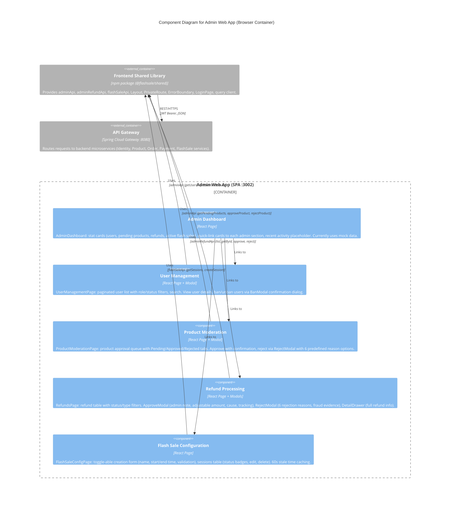

# C4 Component Level: Admin Web App

## Overview

- **Name**: Admin Web App
- **Description**: Admin-facing React Single Page Application for platform administration -- user management, product moderation, refund processing, flash sale session configuration, and analytics dashboard.
- **Type**: Web Application (SPA)
- **Technology**: React 19, Vite 6, TypeScript 5.6, Tailwind CSS 3.4, TanStack React Query 5

## Purpose

The Admin Web App is the platform administration portal for FlashSale staff. It provides tools to manage all aspects of the marketplace: moderating seller-submitted products through an approve/reject workflow, managing user accounts (view, search, filter by role/status, ban/unban), processing refund requests from buyers and sellers (approve with adjustable amounts and tracking, or reject with reason), configuring flash sale time windows, and monitoring platform health through a dashboard.

The app enforces the ADMIN role on all protected routes via the shared `PrivateRoute` component. Login is handled through the shared `LoginPage` with registration disabled (admin accounts are created via backend seeding). All data-fetching pages follow a consistent pattern: `useQuery` for reads, `useMutation` for writes, and `queryClient.invalidateQueries` to refresh data after mutations. The app uses code splitting via `React.lazy()` and `Suspense` for all page components.

The dashboard currently displays static/mock data (all values "0") as a placeholder awaiting real analytics API integration.

## Software Features

- **Admin Dashboard**: Main landing page with four gradient stat cards (total users, pending products, refund requests, active flash sales -- currently mock data). Quick link cards to each admin section (user management, product moderation, refunds, flash sale config). Recent activity placeholder.
- **User Management**: Paginated user list with role filter (ALL/CUSTOMER/SELLER/ADMIN), status filter (ALL/ACTIVE/BANNED/PENDING), and text search. Table columns: avatar, username, email, role badge, status badge, creation date, action buttons (view, ban/unban). Ban modal with confirmation dialog.
- **Product Moderation**: Product review queue with tab-based filtering (Pending/Approved/Rejected). Product cards showing image, name, seller info, price, category, description, and status badge. Approve button with confirmation dialog. Reject button opening a reason modal with 6 predefined rejection reasons (incomplete info, invalid images, invalid price, policy violation, prohibited product). Paginated.
- **Refund Processing**: Refund management table with status filter pills (ALL/PENDING/APPROVED/REJECTED/PROCESSING/COMPLETED) and type filter dropdown (ALL/FULL/PARTIAL). Columns: ID, order ID, type, amount, initiator, reason, status, date, actions. Approve modal with admin note, adjustable amount, cause (buyer/seller), tracking number. Reject modal with reason dropdown (6 options: policy violation, insufficient evidence, duplicate request, buyer abuse, seller fault, other) and fraud evidence checkbox. Detail drawer showing full refund info (IDs, type, status, amount, adjustments, initiator, admin note, reject reason, Stripe refund ID, timestamps).
- **Flash Sale Configuration**: Toggle-able creation form with name, start time, end time fields and client-side validation. Existing sessions table with name, start/end time, product count, status badge (UPCOMING/ACTIVE/ENDED), and actions (edit, delete). 60-second stale time for session caching.

## Code Elements

This component contains the following code-level elements:

- [c4-code-frontend-admin.md](./c4-code-frontend-admin.md) -- Complete admin web app code-level documentation

### Key Pages (6 pages + 1 stub)

| Page | Route | Description |
|------|-------|-------------|
| `AdminDashboard` | `/dashboard` | Stat cards, quick links, recent activity (mock data) |
| `UserManagementPage` | `/users` | Paginated user list with filters, ban/unban, BanModal |
| `ProductModerationPage` | `/product-moderation` | Product approval queue with tabs, RejectModal |
| `RefundsPage` | `/refunds` | Refund table with filters, ApproveModal, RejectModal, DetailDrawer |
| `FlashSaleConfigPage` | `/flash-sale-config` | Flash sale session CRUD with validation |
| `LoginPage` | `/login` | Shared login page (from `@shared/pages`, registration disabled) |

### Key Internal Components (co-located within pages)

| Component | Parent Page | Purpose |
|-----------|-------------|---------|
| `BanModal` | UserManagementPage | Confirm user ban/unban with mutation |
| `RejectModal` | ProductModerationPage | Reject product with 6 predefined reasons |
| `ApproveModal` | RefundsPage | Approve refund with admin note, adjustable amount, tracking |
| `RejectModal` | RefundsPage | Reject refund with 6 reasons and fraud evidence checkbox |
| `DetailDrawer` | RefundsPage | Slide-in drawer with full refund details |

## Interfaces

### Consumed Interfaces (REST API)

All API calls go through the shared library's API modules, which communicate with the API Gateway:

- **Protocol**: REST over HTTPS (HTTP in development)
- **Gateway**: API Gateway at port 8080
- **Authentication**: JWT Bearer token (cookie-based, auto-injected by Axios interceptor)
- **Role Enforcement**: ADMIN role required on all routes via `PrivateRoute`

| API Module | Key Endpoints Used |
|------------|--------------------|
| `adminApi` | `GET /admin/products/pending`, `POST /admin/products/{id}/approve`, `POST /admin/products/{id}/reject`, `GET /users`, `PUT /users/{id}/status` |
| `adminRefundApi` | `GET /admin/refunds`, `GET /admin/refunds/{id}`, `POST /admin/refunds/{id}/approve`, `POST /admin/refunds/{id}/reject` |
| `flashSaleApi` | `GET /flash-sales`, `POST /flash-sales` |

### Browser Routing Interface

| Route Path | Auth Required | Page Component |
|------------|---------------|----------------|
| `/` | No | Redirect to `/dashboard` |
| `/login` | No | `LoginPage` (registration disabled, redirects to `/dashboard`) |
| `/dashboard` | ADMIN | `AdminDashboard` |
| `/users` | ADMIN | `UserManagementPage` |
| `/product-moderation` | ADMIN | `ProductModerationPage` |
| `/refunds` | ADMIN | `RefundsPage` |
| `/flash-sale-config` | ADMIN | `FlashSaleConfigPage` |
| `*` | N/A | Redirect to `/` |

## Dependencies

### Internal Dependencies

- [Frontend Shared Library](./c4-component-frontend-shared.md) -- API clients (adminApi, adminRefundApi, flashSaleApi), UI components (Layout with "FlashSale Admin" branding, PrivateRoute with role="ADMIN", ErrorBoundary), LoginPage (shared, with `showRegisterLink={false}`), query client factory, Axios instance, shared types (`ApiResponse`, `PageResponse`, `AdminUser`, `PendingProduct`, `RefundResponse`, `FlashSaleSession`)

### External Systems

| System | Purpose |
|--------|---------|
| Backend API Gateway (port 8080) | All REST API calls for admin product moderation, user management, refund processing, flash sale configuration |

### npm Dependencies

| Package | Version | Purpose |
|---------|---------|---------|
| `react` | 19.0.0 | UI framework |
| `react-dom` | 19.0.0 | DOM rendering |
| `react-router-dom` | * | Client-side routing |
| `@tanstack/react-query` | * | Server state management (useQuery, useMutation, invalidateQueries) |
| `zustand` | * | Auth store (via PrivateRoute) |
| `axios` | * | HTTP client (via shared API modules) |
| `tailwindcss` | 3.4.1 | Utility-first CSS |
| `vite` | 6.0.0 | Build tool and dev server |

## Component Diagram

The following diagram shows the Admin Web App's internal logical components, their interactions, and external dependencies.

