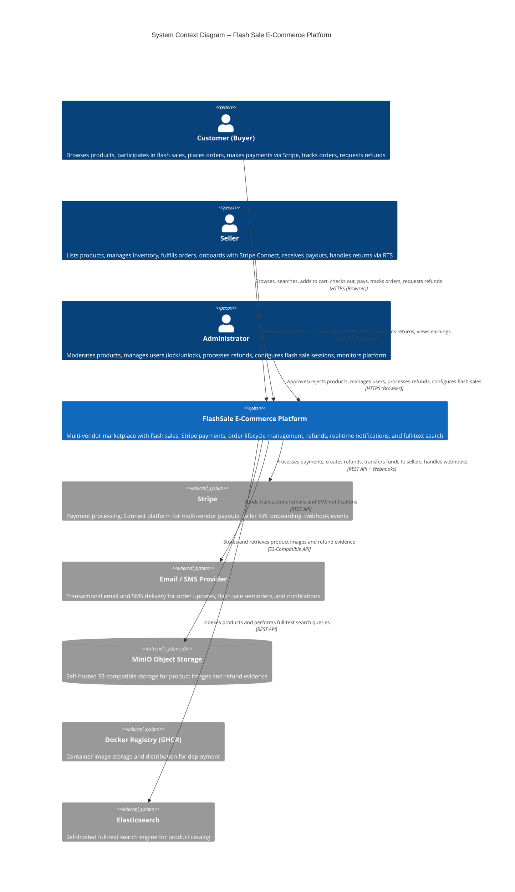

# C4 Context Level: System Context

**Project**: stealing-from-paradise -- Flash Sale E-Commerce Platform
**Version**: v5.5
**Last Updated**: 2026-05-05
**Status**: Production-Ready

---

## System Overview

### Short Description

The FlashSale Platform is a multi-vendor e-commerce marketplace that enables customers to browse and purchase products, participate in time-limited flash sales with high-concurrency anti-oversell protection, and complete payments through Stripe, while sellers list and manage products, receive payouts, and administrators oversee moderation, refunds, and platform operations.

### Long Description

The FlashSale Platform is a production-ready, event-driven microservices e-commerce system designed to support a multi-vendor marketplace at scale. The platform addresses several core business problems:

1. **Multi-Vendor Commerce**: Enables multiple independent sellers to list products, manage inventory, and receive payments on a single marketplace, with a parent-child order model that splits a single customer checkout across multiple sellers while presenting a unified payment experience.

2. **High-Concurrency Flash Sales**: Supports time-limited promotional sales where thousands of buyers compete for limited inventory simultaneously. The system uses atomic Redis Lua scripts to prevent overselling at scale (target: 50,000+ requests per second) while enforcing per-user purchase limits.

3. **Secure Payment Processing**: Integrates with Stripe as the sole payment provider, supporting multi-vendor payment splits via Stripe Connect. Each seller onboards through Stripe Express KYC, and funds are automatically transferred to sellers upon successful delivery.

4. **Order Lifecycle Management**: Tracks orders through an eight-state lifecycle (PENDING through DELIVERED, with exception states for CANCELLED, RETURNED, REFUNDED, and PARTIALLY_REFUNDED). Includes automated order cancellation for unpaid orders and auto-delivery confirmation for abandoned shipments.

5. **Return To Sender (RTS)**: Handles the edge case where shipped goods are returned to the seller (e.g., buyer unreachable). Sellers confirm the return with evidence, triggering automatic refund without admin intervention, inventory restoration, and buyer notification.

6. **Buyer Refund Management**: Supports buyer-initiated refund requests within 7 days of delivery, with admin review, approval/rejection, optional tracking number capture for return shipments, and full audit trail.

7. **Real-Time Communication**: Delivers notifications to users via Server-Sent Events (SSE), email, and SMS for order status changes, flash sale reminders, payment confirmations, and refund updates.

8. **Content Discovery**: Provides full-text product search powered by Elasticsearch, with real-time indexing driven by Kafka events from the product catalog.

The platform follows a microservices architecture with 11 backend services, each owning its specific business domain. Four services (order, payment, flash sale, worker) use the Axon Framework for Command Query Responsibility Segregation (CQRS) and Event Sourcing, while the remaining seven use traditional request-response patterns. All services communicate asynchronously via 47 Kafka topics and synchronously through REST APIs routed by an API Gateway. Three React frontend applications serve customers, sellers, and administrators respectively.

---

## Personas

### Customer (Buyer)

- **Type**: Human User
- **Description**: An individual who browses the marketplace, searches for products, adds items to a shopping cart, and makes purchases. Customers can participate in flash sales for discounted items, pay through Stripe, track their orders, and request refunds when necessary. Each customer maintains a profile with addresses, payment preferences, and notification settings.
- **Goals**:
  - Discover and purchase products across multiple sellers in a single checkout
  - Participate in flash sales to obtain discounted items
  - Pay securely through Stripe without managing multiple seller payments
  - Track order status from placement through delivery
  - Request refunds when orders are unsatisfactory
  - Receive timely notifications about orders, flash sales, and refunds
- **Key Features Used**: Product browsing and search, shopping cart, checkout with Stripe payment, flash sale participation, order tracking, refund requests, profile management, SSE notifications

### Seller

- **Type**: Human User
- **Description**: A business or individual who lists products on the marketplace, manages inventory, and fulfills orders. Sellers must complete Stripe KYC (Know Your Customer) onboarding before they can list products. They manage their product catalog, view and update order statuses, handle returns through the Return To Sender workflow, and receive automated payouts through Stripe Connect upon successful delivery.
- **Goals**:
  - List products with variants, pricing, and images for marketplace visibility
  - Get products approved by administrators and appear in search results
  - Receive and fulfill customer orders with tracking information
  - Receive automated payments via Stripe Connect upon delivery
  - Manage returns through the Return To Sender (RTS) workflow
  - Participate in flash sale events to increase sales volume
- **Key Features Used**: Product management (CRUD, variants, images), inventory management, Stripe onboarding, order fulfillment with tracking, Return To Sender confirmation, seller dashboard and earnings view, flash sale item registration

### Administrator (Admin)

- **Type**: Human User
- **Description**: A platform operator responsible for marketplace governance, content moderation, and operational oversight. Administrators review and approve or reject seller-submitted products, manage user accounts (including locking and unlocking), process buyer refund requests, configure flash sale sessions, and monitor the platform health including retrying failed events from the Dead Letter Queue.
- **Goals**:
  - Maintain marketplace quality by approving or rejecting products with reasons
  - Manage user access by locking or unlocking accounts when policy violations occur
  - Process refund requests fairly, with optional tracking number capture for audit
  - Configure and schedule flash sale sessions for the platform
  - Monitor platform operations, including failed events and inventory reconciliation
- **Key Features Used**: Product moderation (approve/reject), user account management (lock/unlock), refund review and approval/rejection, flash sale session configuration, platform monitoring and failed event retry

---

### Stripe

- **Type**: Programmatic User / External System
- **Description**: Stripe is the external payment processing platform serving two roles. First, it processes customer payments through PaymentIntents, handling card processing, authentication, and fund capture. Second, it provides the Stripe Connect platform for multi-vendor marketplace payments: each seller creates a Stripe Express account through the platform's KYC onboarding flow, and funds are automatically split and transferred to sellers upon order delivery. Stripe also sends webhook events to the platform for payment lifecycle updates (payment success, disputes, account status changes).
- **Integration Mode**: The platform sends API requests to Stripe (PaymentIntent creation, refund creation, transfer creation, onboarding link generation). Stripe sends webhook callbacks to the Payment Service for asynchronous event notifications (payment_intent.succeeded, charge.refunded, account.updated, and 20+ other event types).
- **Key Interactions**:
  - Payment processing: Customer pays on the frontend via Stripe.js; the Payment Service creates PaymentIntents with multi-vendor transfer data
  - Seller onboarding: Payment Service generates Stripe Express onboarding links; Stripe notifies the platform when KYC is complete
  - Fund transfers: Upon order delivery, the Payment Service initiates Stripe transfers to seller accounts
  - Refunds: The Payment Service calls Stripe's refund API for both admin-approved refunds and automatic RTS refunds
  - Webhooks: Stripe sends real-time event notifications to the Payment Service's webhook endpoint

### Email / SMS Provider

- **Type**: Programmatic User / External System
- **Description**: An external notification delivery service (email and SMS gateway) used by the Notification Service to deliver transactional messages to users. This includes order confirmations, shipping updates, flash sale reminders, refund status notifications, and account-related alerts.
- **Integration Mode**: The Notification Service dispatches email and SMS through this provider's API when it receives notification events from Kafka. The specific provider (e.g., SendGrid, Twilio, AWS SES/SNS) is configured through environment variables.
- **Key Interactions**:
  - Sends order confirmation emails when orders are created
  - Sends shipping notification emails/SMS when sellers add tracking
  - Sends flash sale reminder emails/SMS 15 minutes before sessions start
  - Sends refund status notifications to buyers
  - Sends seller payment and account status notifications

---

## System Features

### User Authentication and Authorization

- **Description**: Centralized identity management with JWT-based authentication (RS256 signing). Users register with email verification and log in to receive short-lived access tokens (15 minutes) and long-lived refresh tokens (7 days, self-extending on use). Three roles (BUYER, SELLER, ADMIN) control access to features. Token revocation is immediate via Redis blocklist; account locking invalidates all active sessions instantly. A single user may hold multiple roles simultaneously.
- **Users**: All personas (Customer, Seller, Admin)
- **User Journey**: [Registration and Login](#customer-registration-and-login-journey)

### Product Catalog and Management

- **Description**: Sellers create products with names, descriptions, prices, categories, product variants (SKUs), and images. Products start in PENDING status and must be approved by an admin before appearing in search results. The product catalog supports hierarchical categories, variant-level inventory tracking, and presigned URL image uploads to MinIO object storage. Rejected products can be edited and resubmitted within 90 days; products unedited for 90 days are soft-deleted. The catalog syncs to Elasticsearch for full-text search via Kafka events.
- **Users**: Seller (create/manage), Admin (approve/reject), Customer (browse/search)
- **User Journey**: [Seller Product Lifecycle](#seller-product-lifecycle-journey)

### Flash Sale Engine

- **Description**: Time-limited promotional sales with high-concurrency buy operations. Administrators create flash sale sessions with start and end times. Sellers register approved products with flash sale prices and quantities. Administrators approve or reject flash sale items. When a session starts, inventory is seeded into Redis, and buyers can purchase using atomic Lua scripts that decrement counters and enforce per-user limits without race conditions. Unpaid flash sale orders time out after 10 minutes (versus 30 for regular orders). A reconciliation job runs every 5 minutes to correct any Redis-to-database inventory drift. Reminder notifications are sent 15 minutes before session start.
- **Users**: Admin (session configuration, item approval), Seller (item registration), Customer (purchase)
- **User Journey**: [Flash Sale Purchase Journey](#customer-flash-sale-purchase-journey)

### Shopping Cart and Checkout

- **Description**: Customers add products (regular and flash sale items) to a persistent cart stored in the Product Service. At checkout, the Order Service retrieves cart items, validates stock availability, splits the order by seller into one sub-order per seller and one parent order for the unified payment, locks inventory, and creates a Stripe PaymentIntent. The customer completes payment via Stripe.js on the frontend. The checkout is orchestrated by Axon Sagas (ParentOrderPaymentSaga coordinates the overall payment; OrderProcessingSaga handles per-sub-order lifecycle).
- **Users**: Customer
- **User Journey**: [Customer Checkout Journey](#customer-browse-to-order-journey)

### Order Management and Tracking

- **Description**: Full order lifecycle management from creation through delivery, with eight status states: PENDING, PAID, SHIPPING, DELIVERED (normal flow) and CANCELLED, RETURNED, REFUNDED, PARTIALLY_REFUNDED (exception flows). Sellers update orders with tracking numbers to move them to SHIPPING. Buyers confirm receipt to transition to DELIVERED. Orders in SHIPPING for over 7 days are auto-delivered by a scheduled job. Unpaid orders are auto-cancelled after 30 minutes (10 minutes for flash sale orders). The order model uses a parent-child structure: one parent order groups multiple sub-orders, one per seller, enabling unified checkout and payment while preserving per-seller fulfillment.
- **Users**: Customer (view, confirm receipt, request refund), Seller (update tracking, manage orders), Admin (oversee, process refunds)
- **User Journey**: [Order Lifecycle Journey](#customer-browse-to-order-journey)

### Payment Processing

- **Description**: Stripe-powered payment processing with multi-vendor support. On checkout, a single PaymentIntent is created for the entire parent order amount with transfer_data specifying the split per seller. Stripe processes the payment and sends a webhook to the Payment Service upon success. The Payment Service records the transaction and publishes payment.success to Kafka, which triggers the Order Service to mark orders as PAID. Seller transfers are executed automatically when orders reach DELIVERED status. The Payment Service also handles Stripe webhook events for disputes, account updates, and payout failures, with appropriate notifications to affected parties.
- **Users**: Customer (pay), Seller (receive funds), Admin (oversee)
- **User Journey**: [Stripe Payment and Webhook Integration](#stripe-webhook-integration-journey)

### Refund Management

- **Description**: Two refund workflows exist. The first is the buyer-initiated refund: after delivery, the buyer has 7 days to request a refund with evidence. The request enters PENDING status, and an admin reviews, approves (triggering Stripe refund with optional tracking number for return shipping), or rejects (with reason). The second is the Return To Sender (RTS) workflow: when a shipment is returned to the seller, the seller confirms the return with evidence, which automatically triggers a full refund without admin approval, restores inventory, and notifies both parties. Refunds can be full (entire parent order) or partial (specific items).
- **Users**: Customer (request refund), Seller (RTS confirmation), Admin (approve/reject buyer refunds)
- **User Journey**: [Admin Refund Processing](#admin-refund-processing-journey)

### Real-Time Notifications

- **Description**: The Notification Service consumes domain events from Kafka and delivers real-time notifications to users through three channels: Server-Sent Events (SSE) for in-app browser notifications, email for transactional messages, and SMS for urgent alerts. Notifications cover order status changes, payment confirmations, flash sale reminders, refund updates, and account actions. Notifications are persisted in MongoDB with a 90-day TTL (Time To Live) for automatic expiry.
- **Users**: Customer, Seller (receive notifications)
- **User Journey**: Integrated across all journeys

### Full-Text Product Search

- **Description**: Products approved for the marketplace are indexed in Elasticsearch for fast full-text search. The Search Service consumes product lifecycle events from Kafka (created, updated, deleted, approved, rejected, auto-hidden) and maintains a denormalized read model optimized for search queries. Customers can search by product name, description, category, and other attributes.
- **Users**: Customer (search), Seller (indirectly, through product visibility)
- **User Journey**: [Customer Browse Journey](#customer-browse-to-order-journey)

### Seller Onboarding (Stripe Connect)

- **Description**: Users who wish to become sellers must complete Stripe Express KYC onboarding. The Payment Service generates a Stripe onboarding link (valid for 24 hours), the user completes identity verification on Stripe's hosted form, and Stripe notifies the platform via webhook when KYC is complete. Upon confirmation, the user's account gains the SELLER role, enabling product listing, order fulfillment, and payment receiving. Expired onboarding links are cleaned up daily.
- **Users**: Seller (complete onboarding), Admin (oversee)
- **User Journey**: [Seller Registration and Onboarding](#seller-registration-and-onboarding-journey)

### AI Chat Support

- **Description**: An AI-powered chat support service that provides multi-turn conversational assistance to users. The service integrates with a Large Language Model (LLM) to handle inquiries and can execute tool calls for operations such as order lookups, product queries, and refund information. For high-risk actions (Level 3), the system requires human-in-the-loop confirmation before execution. All tool calls are audited in a partitioned log.
- **Users**: Customer, Seller
- **Status**: Active

---

## User Journeys

### Customer Browse-to-Order Journey

1. **Browse and Search**: The customer opens the Customer App (port 3000), browses product categories, or uses the search bar to find products. The search request goes through the API Gateway (port 8080) to the Search Service, which queries Elasticsearch and returns matching approved products.

2. **View Product Details**: The customer clicks a product to view details, including description, price, available variants, seller information, and images served from MinIO via presigned URLs.

3. **Add to Cart**: The customer selects a variant, specifies quantity, and clicks "Add to Cart." The request goes to the Product Service, which validates the product is approved and in stock, then upserts the cart item in MongoDB.

4. **Checkout**: The customer navigates to the cart, reviews items (potentially from multiple sellers), and clicks "Checkout." The Order Service receives the checkout request, fetches cart item details from the Product Service via Kafka request-reply, validates stock, splits items by seller into sub-orders with one parent order, locks inventory, creates a Stripe PaymentIntent with multi-vendor transfer data, emits a ParentOrderCheckoutCreatedEvent to start the Axon Saga, and returns the parent order with payment URL.

5. **Pay**: The customer completes payment through the Stripe.js payment modal on the frontend. Stripe processes the payment and sends a webhook (`payment_intent.succeeded`) to the Payment Service.

6. **Payment Confirmation**: The Payment Service records the successful transaction, creates pending seller transfer records, and publishes `payment.success` to Kafka. The Order Service consumes this event, the Saga marks all sub-orders as PAID, and the buyer receives a confirmation notification.

7. **Track Order**: The customer views the order in their order history. When the seller adds tracking information, the order moves to SHIPPING and the customer receives a notification with the tracking number.

8. **Confirm Receipt**: Upon receiving the package, the customer clicks "Confirm Receipt" in the app. The order transitions to DELIVERED. If the customer does not confirm within 7 days, a scheduled job auto-confirms the delivery (except for RTS orders).

9. **Rate and Review (Optional)**: After delivery, the customer receives a prompt to rate the product and seller.

### Customer Flash Sale Purchase Journey

1. **Discover Flash Sale**: The customer browses active or upcoming flash sales on the Flash Sale page of the Customer App. Upcoming sessions show countdown timers.

2. **Set Reminder (Optional)**: The customer sets a reminder for an upcoming session. Fifteen minutes before the session starts, the system sends a reminder notification via email/SMS.

3. **Join Active Session**: When the session becomes active (transitioned by JOB-01), inventory is seeded into Redis. The customer views available flash sale items with discounted prices and remaining stock counts.

4. **Purchase Attempt**: The customer clicks "Buy Now" on a flash sale item. The request hits the Flash Sale Service, which executes a Redis Lua script atomically:
   - Checks that stock (Redis counter) is greater than zero
   - Decrements the stock counter
   - Checks that the user has not exceeded the per-user purchase limit
   - If stock is depleted: returns 410 Gone ("Sold Out")
   - If limit exceeded: rolls back the decrement and returns 429 Too Many Requests
   - If successful: creates a flash sale order with a 10-minute payment timeout

5. **Urgent Payment**: The customer is redirected to Stripe checkout. Flash sale orders have a 10-minute payment window (versus 30 minutes for regular orders). If not paid within the window, the order is auto-cancelled by JOB-13.

6. **Post-Purchase**: After successful payment, the order follows the standard order lifecycle. At session end, unsold flash sale inventory is returned to the seller's regular stock pool.

7. **Inventory Reconciliation**: Every 5 minutes, JOB-21 compares Redis counters against the database to detect and correct any inventory drift (e.g., due to service crashes).

### Seller Registration and Onboarding Journey

1. **Register as User**: The seller first registers as a regular user (BUYER role) on the platform through the standard registration flow, verifying their email address.

2. **Request Seller Role**: The user navigates to their profile and clicks "Become a Seller." The Identity Service initiates the seller registration process.

3. **Stripe KYC Onboarding**: The Payment Service generates a Stripe Express onboarding link (valid for 24 hours). The user is redirected to Stripe's hosted onboarding form to complete identity verification (KYC).

4. **KYC Completion**: After the user completes the Stripe KYC form, Stripe sends an `account.updated` webhook with `details_submitted=true` to the Payment Service. The Payment Service updates the seller's Stripe account status to ACTIVE, and the Identity Service adds the SELLER role to the user.

5. **Create Product**: The seller navigates to the Seller App (port 3001) and creates a new product with name, description, price, category, variants (SKUs with individual prices and stock), and product images uploaded via presigned MinIO URLs. The product is created with PENDING status.

6. **Await Approval**: The product appears in the admin moderation queue. The seller can view the pending status in their dashboard.

7. **Approval or Rejection**: An admin reviews the product. If approved, the product becomes APPROVED, is indexed in Elasticsearch, and appears in search results. If rejected, the seller receives a notification with the rejection reason and has 90 days to edit and resubmit.

8. **Receive Order**: When a customer purchases the seller's product, the seller receives a notification. The seller can view the order in their seller dashboard.

9. **Fulfill Order**: The seller prepares the item for shipping and enters the tracking number and carrier information in the Seller App. The order moves to SHIPPING status and the buyer is notified.

10. **Receive Payment**: When the buyer confirms receipt (or auto-delivery triggers), the order reaches DELIVERED. The Payment Service initiates a Stripe transfer to the seller's connected account, and the seller receives a payment notification.

11. **Handle Returns (RTS)**: If a shipment is returned to the seller, the seller clicks "Confirm Return" in the Seller App, uploads evidence images and the return tracking number. The system automatically processes a full refund to the buyer, restores inventory, and notifies both parties.

### Admin Product Moderation Journey

1. **View Moderation Queue**: The admin opens the Admin App (port 3002) and navigates to the Product Moderation page, which lists all products in PENDING status awaiting review.

2. **Review Product**: The admin clicks a product to view its full details: name, description, images, pricing, variants, and seller information.

3. **Approve Product**: The admin approves the product. The Product Service updates the status to APPROVED, indexes the product in Elasticsearch for search visibility, publishes `product.approved` to Kafka, and the seller receives a notification.

4. **Reject Product**: Alternatively, the admin rejects the product with a specific reason. The Product Service updates the status to REJECTED, publishes `product.rejected` to Kafka, and the seller receives a notification with the reason and the 90-day resubmission window.

5. **Monitor Platform**: The admin periodically checks the dashboard for platform metrics, including active orders, pending refunds, flash sale performance, and any failed events in the Dead Letter Queue that require manual retry.

### Admin Refund Processing Journey

1. **View Refund Queue**: The admin navigates to the Refunds page in the Admin App, which lists all refund requests in PENDING status.

2. **Review Refund Request**: The admin clicks a refund request to review the details: the order, the buyer's reason, uploaded evidence images, order amount, seller information, and the buyer's claim.

3. **Approve Refund**: The admin approves the refund, entering an admin note, optionally adjusting the amount, specifying the cause (buyer or seller fault), and if the refund involves a return shipment, entering the tracking number. The Payment Service calls Stripe's refund API, updates the refund status to SUCCESS, stores the tracking number in REFUND_ITEMS for audit, publishes `refund.admin_approved` to Kafka, and the buyer receives a notification with refund details and tracking information if provided.

4. **Reject Refund**: Alternatively, the admin rejects the refund with a reason. The Payment Service updates the refund status to REJECTED, publishes `refund.rejected` to Kafka, and the buyer receives a notification with the rejection reason.

5. **RTS Auto-Refund (No Admin Action)**: For Return To Sender refunds, no admin action is required. When a seller confirms a return with evidence, the system automatically creates and processes the full refund, distinguishing RTS refunds from buyer-initiated refunds in the audit trail.

### Stripe Webhook Integration Journey

1. **Stripe Event Occurs**: A payment event occurs in Stripe (e.g., `payment_intent.succeeded`, `charge.refunded`, `account.updated`, `payout.failed`, `transfer.reversed`).

2. **Webhook Delivery**: Stripe sends an HTTP POST to the Payment Service's webhook endpoint (`/stripe/webhook`) with the event payload and a signature for verification.

3. **Signature Verification**: The Payment Service verifies the webhook signature using the configured Stripe webhook secret to ensure the event originated from Stripe.

4. **Event Processing**: The Payment Service processes the event based on its type:
   - `payment_intent.succeeded`: Records the successful transaction, creates pending seller transfer records, and publishes `payment.success` to Kafka.
   - `payment_intent.payment_failed`: Records the failure and publishes `payment.failed` to Kafka.
   - `charge.refunded`: Records the refund and publishes the appropriate refund event to Kafka.
   - `account.updated`: Updates seller Stripe account status (e.g., KYC completion, account suspension).
   - `payout.failed`: Notifies the affected seller about the payout failure.
   - `transfer.reversed`: Notifies relevant parties and updates records.

5. **Downstream Effects**: The Kafka events published by the Payment Service trigger downstream actions:
   - `payment.success` triggers the Order Service Saga to mark orders as PAID.
   - `payment.failed` triggers order cancellation and inventory restoration.
   - Refund events trigger order status updates and buyer notifications.
   - Account events trigger seller notifications and access changes.

6. **Notification Delivery**: The Notification Service consumes the relevant events and delivers notifications to affected users via SSE, email, and/or SMS.

---

## External Systems and Dependencies

### Stripe

- **Type**: External Payment Platform (SaaS)
- **Description**: Stripe provides the payment processing infrastructure for the platform. It handles credit card processing, bank transfers, and related financial operations. Stripe Connect specifically enables the multi-vendor marketplace model by allowing the platform to create connected accounts for each seller, split payments on checkout, and transfer funds to sellers upon delivery. Stripe also handles dispute management, payout scheduling, and regulatory compliance (PCI DSS).
- **Integration Type**: REST API (outbound) + Webhooks (inbound)
- **Purpose**: Payment processing, seller payouts, refund processing, seller identity verification (KYC)
- **Criticality**: Critical -- the platform cannot process payments without Stripe

### Email / SMS Provider

- **Type**: External Communication Platform (SaaS)
- **Description**: A third-party service provider for delivering transactional emails and SMS messages to users. The platform abstracts the specific provider behind the Notification Service, allowing configuration through environment variables. Typical integrations include SendGrid, Twilio, AWS SES, or AWS SNS.
- **Integration Type**: REST API (outbound from Notification Service)
- **Purpose**: Delivering email and SMS notifications for order updates, flash sale reminders, refund status, and account events
- **Criticality**: Important -- core functionality works without it, but users miss critical notifications

### MinIO

- **Type**: Self-Hosted Object Storage
- **Description**: MinIO is a self-hosted, S3-compatible object storage service used to store product images and refund evidence images. The Product Service generates presigned PUT URLs for sellers to upload product images directly, and presigned GET URLs for the frontend to display images without exposing the storage backend. Similarly, the Order/Payment services use MinIO to store refund evidence images for audit and legal compliance.
- **Integration Type**: S3-Compatible API (presigned URL generation via MinIO SDK)
- **Purpose**: Storing and serving product images, refund evidence images, and other binary assets
- **Criticality**: Important -- product images are essential for marketplace usability, but the platform can partially function without them

### Elasticsearch

- **Type**: Self-Hosted Search Engine
- **Description**: Elasticsearch provides full-text search capabilities for the product catalog. The Search Service consumes Kafka events from the Product Service and maintains a denormalized index of approved products, enabling fast, relevance-ranked search queries by product name, description, category, and other attributes. Products that are rejected, hidden, or deleted are removed from the search index.
- **Integration Type**: REST API (Elasticsearch client)
- **Purpose**: Full-text product search and filtered browsing
- **Criticality**: Important -- search functionality is disabled without Elasticsearch, but the product catalog remains accessible via the Product Service API

### Axon Server

- **Type**: Self-Hosted Event Store and Message Bus
- **Description**: Axon Server is the event store and command/event routing infrastructure for the four CQRS services (order, payment, flash sale, worker). It stores all domain events in an append-only event store, routes commands to the appropriate aggregate instances, and distributes events to projection handlers and saga instances. It is the backbone of the event-sourced architecture used by the core transactional services.
- **Integration Type**: gRPC (Axon Framework client)
- **Purpose**: Event store for CQRS services, command routing, event distribution to projections and sagas
- **Criticality**: Critical for CQRS services -- order and payment processing cannot function without Axon Server

### Apache Kafka

- **Type**: Self-Hosted Message Broker
- **Description**: Kafka serves as the asynchronous event bus connecting all microservices. With 47 topics (35 event topics and 12 request-reply topics), Kafka enables decoupled communication between services for product lifecycle events, order events, payment events, flash sale events, notification triggers, and internal request-reply patterns for cross-service data retrieval (e.g., order service requesting cart items from product service).
- **Integration Type**: Kafka protocol (producers publish, consumers subscribe)
- **Purpose**: Asynchronous event-driven communication between microservices
- **Criticality**: Critical -- cross-service event flows rely on Kafka for eventual consistency

### PostgreSQL

- **Type**: Self-Hosted Relational Database
- **Description**: PostgreSQL is the primary relational database used by five services: identity-service (users, roles, addresses, tokens), order-service (orders, order items, status history, Axon token store), payment-service (transactions, refunds, Stripe accounts), flashsale-service (sessions, items, reminders), and worker-service (outbox events, failed events, ShedLock). Each service has its own logical database or schema zone.
- **Integration Type**: JDBC (via Spring Data JPA and Flyway migrations)
- **Purpose**: Persistent relational data storage
- **Criticality**: Critical -- all transactional data is stored in PostgreSQL

### MongoDB

- **Type**: Self-Hosted Document Database
- **Description**: MongoDB is the document database used by two services: product-service (product catalog, categories, cart items, product images metadata) and notification-service (notification records with 90-day TTL index). It provides schema flexibility for the varied data structures in product and notification domains.
- **Integration Type**: MongoDB Driver (via Spring Data MongoDB)
- **Purpose**: Document storage for product catalog, cart data, and notifications
- **Criticality**: Critical -- product catalog and cart functionality depend on MongoDB

### Redis

- **Type**: Self-Hosted In-Memory Data Store
- **Description**: Redis serves three purposes in the platform: (1) flash sale inventory counters and per-user limits using atomic Lua scripts for high-concurrency buy operations, (2) JWT token blacklist for immediate token revocation upon logout or account lock, stored with TTL matching token expiration, and (3) general caching. The API Gateway checks the Redis blocklist on every authenticated request.
- **Integration Type**: Redis protocol (via Spring Data Redis and Jedis/Lettuce clients)
- **Purpose**: Atomic flash sale counters, JWT blocklist, and general caching
- **Criticality**: Critical for flash sales (atomic inventory without Redis is not possible at scale); Important for authentication (token revocation is delayed without Redis)

### Docker Registry (GHCR)

- **Type**: External Container Image Registry
- **Description**: GitHub Container Registry (GHCR) or an equivalent Docker-compatible registry stores the built container images for all backend services and frontend applications. Docker Compose pulls these images during deployment.
- **Integration Type**: Docker pull (OCI-compatible registry)
- **Purpose**: Storage and distribution of container images for deployment
- **Criticality**: Required for Docker-based deployment; not required for local development

---

## System Context Diagram

---

## Related Documentation

### C4 Architecture Documentation
- [C4 Component Level: System Overview](./c4-component.md) -- Component-level architecture with per-service breakdowns
- [C4 Code Level Documentation](./) -- Per-service code-level documentation (c4-code-*.md files)

### System Documentation
- [Project README](../../README.md) -- Quick start guide and feature overview
- [Documentation Index](../../00_INDEX.md) -- Complete documentation map with role-based reading paths
- [Project Overview](../../overview/01_OVERVIEW.md) -- Full architecture, tech stack, and development guide
- [Architecture Map](../../overview/ARCHITECTURE_MAP.md) -- Single-file context primer with service registry and Kafka topology

### Business Documentation
- [Business Logic & Workflows](../../business/03_BUSINESS.md) -- Detailed business workflows, policies, and 17 cronjobs
- [Business Flows (Mermaid Diagrams)](../../business/07_BUSINESS_FLOWS.md) -- Visual sequence and state diagrams for all major flows
- [Payment Saga Flow](../../business/06_PAYMENT_SAGA_FLOW.md) -- Axon Saga orchestration for payment processing
- [Payment-Order Integration](../../business/08_PAYMENT_ORDER_INTEGRATION.md) -- Order and payment service integration details

### API Documentation
- [API Overview](../../api/README.md) -- Complete API specification summary
- [Identity Service API](../../services/identity-service/02_API_identity_service.md) -- Authentication and user management endpoints
- [Product Service API](../../services/product-service/02_API_product_service.md) -- Product catalog and cart endpoints
- [Order Service API](../../services/order-service/02_API_order_service.md) -- Order lifecycle and checkout endpoints
- [Payment Service API](../../services/payment-service/02_API_payment_service.md) -- Payment, refund, and Stripe endpoints
- [Flash Sale Service API](../../services/flashsale-service/02_API_flash_sale_service.md) -- Flash sale session and purchase endpoints
- [Notification Service API](../../services/notification-service/02_API_notification_service.md) -- SSE notification endpoints
- [Search Service API](../../services/search-service/02_API_search_service.md) -- Product search endpoints
- [Admin API](../../services/identity-service/02_API_identity_service.md) -- Administration endpoints (merged into Identity Service)

### Operations Documentation
- [Cronjobs & Data Retention](../../operations/05_OPERATIONS.md) -- 17 scheduled jobs and data retention policies
- [Running Guide](../../operations/09_RUNNING.md) -- How to build, run, and deploy
- [Environment Variables](../../operations/10_ENVIRONMENT_VARIABLES.md) -- All configuration environment variables

### Data Documentation
- [Database Schema](../../database/database-entities.md) -- Full database schema reference
- [Entity-Relationship Diagram](../../database/ERD_FULL_SYSTEM.md) -- Visual ERD of all database entities
- [Kafka Events Catalog](../../messaging/KAFKA_EVENTS.md) -- Complete catalog of 47 Kafka topics
- [Kafka Request-Reply](../../messaging/11_KAFKA_REQUEST_REPLY.md) -- Kafka request-reply pattern documentation (6 pairs)

---

**Document generated by C4-Context Agent**
**Date**: 2026-05-05
**Based on**: System documentation v5.5, C4 Component documentation, ARCHITECTURE_MAP.md v5.4
