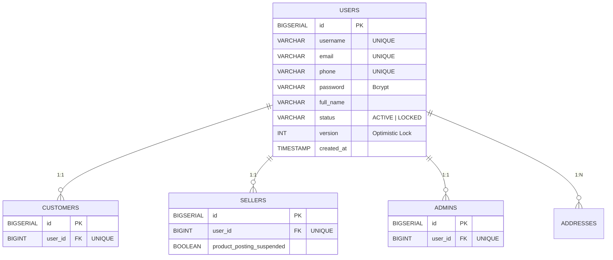
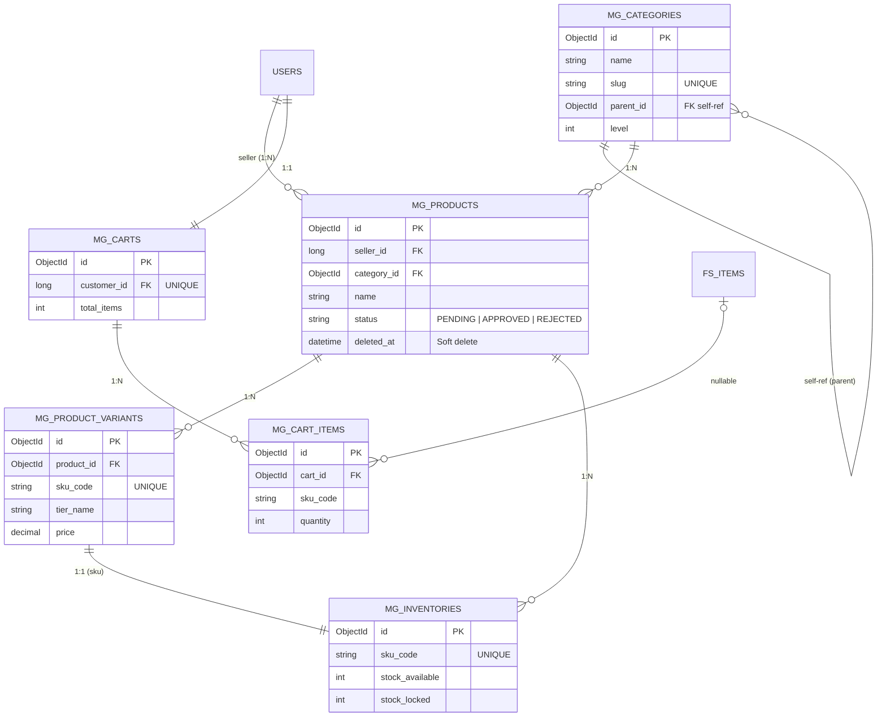
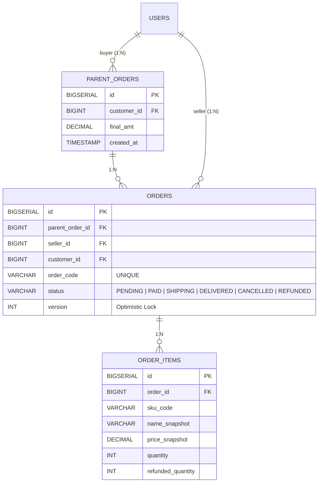
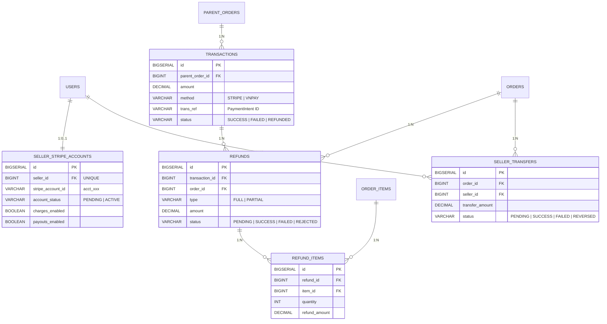
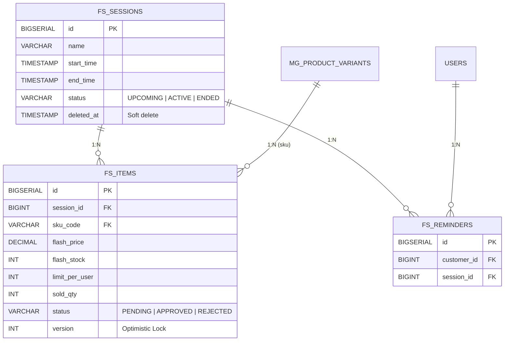
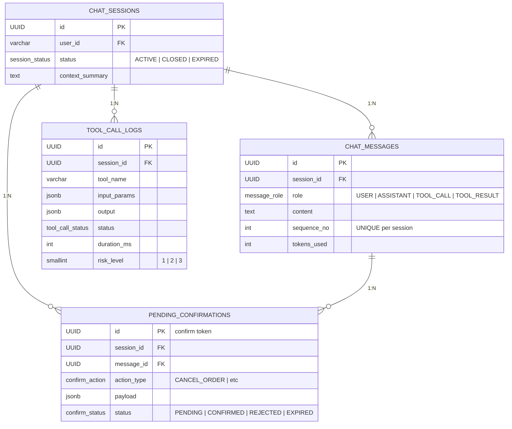
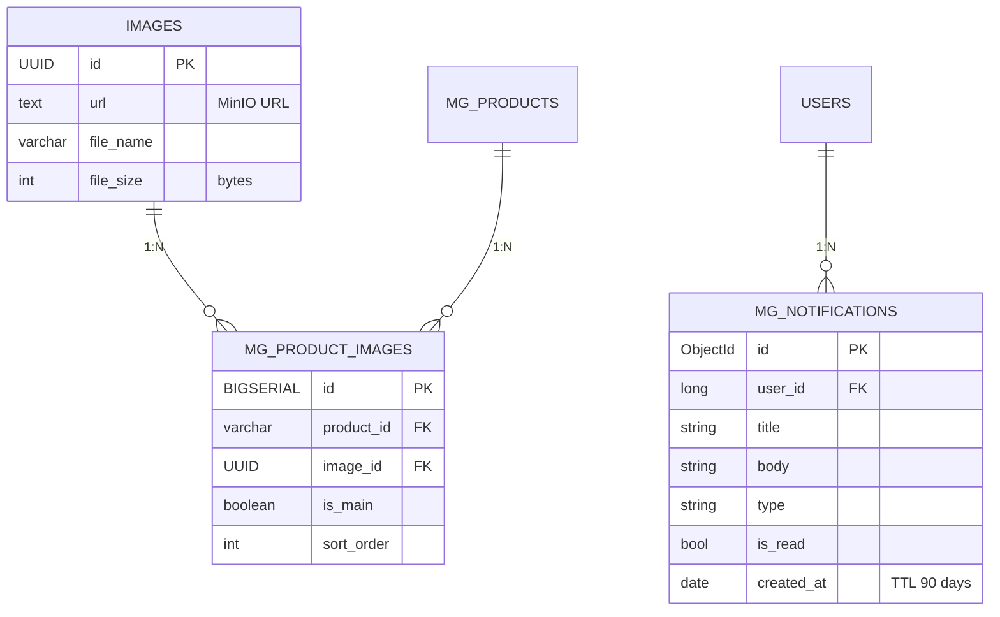
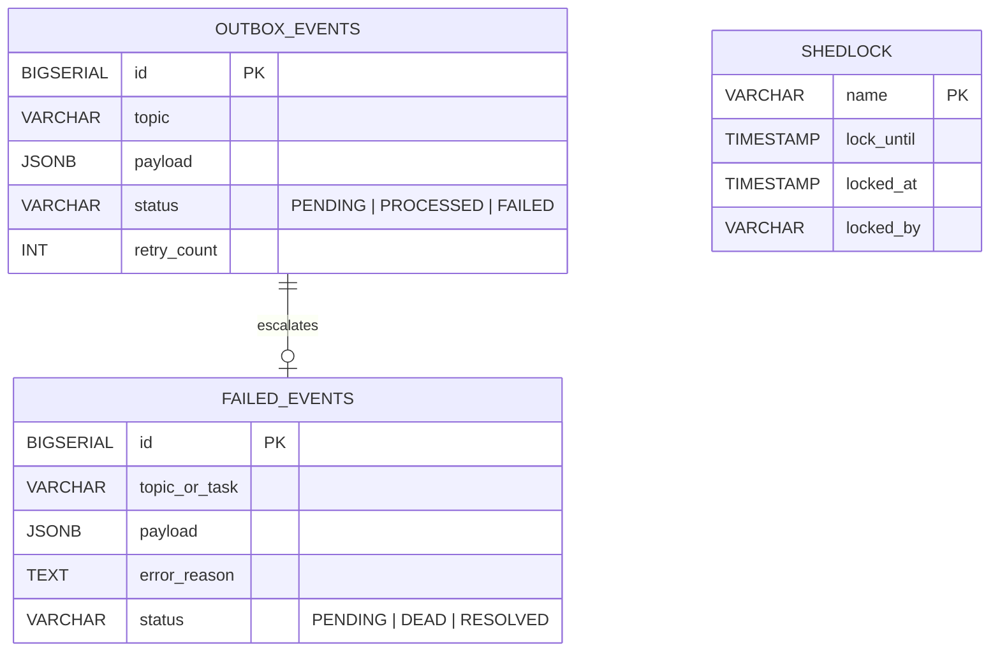
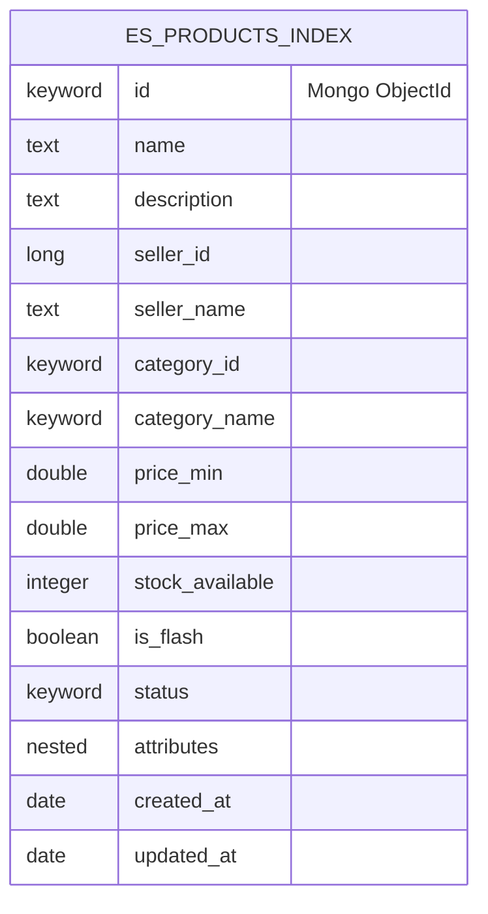
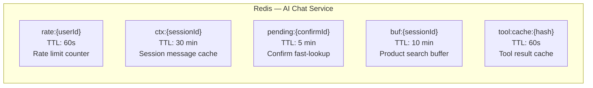

# Entity Relationship Diagram — Compact

> Sơ đồ quan hệ các bảng tổng quát, rút gọn theo từng service domain.  
> `<>` = MongoDB ObjectId, `[]` = Elasticsearch, `{}` = Redis

---

## 1. Identity Domain

---

## 2. Catalog Domain — Product Service

---

## 3. Order Domain — Order Service

---

## 4. Payment Domain — Payment Service

---

## 5. Flash Sale Domain

---

## 6. AI Chat Domain

---

## 7. Supporting Tables

---

## 8. Infrastructure Tables

---

## 9. Search Index

---

## 10. Redis Cache Keys

