# Toàn bộ Hệ thống — ER Diagram

```mermaid
erDiagram
    %% ==================== IDENTITY DOMAIN ====================
    USERS ||--o| CUSTOMERS : "1:1"
    USERS ||--o| SELLERS : "1:1"
    USERS ||--o| ADMINS : "1:1"
    USERS ||--o{ ADDRESSES : "has"
    USERS {
        bigint id PK
        varchar username UK
        varchar email UK
        varchar phone UK
    }

    CUSTOMERS {
        bigint id PK
        bigint user_id FK,UK
    }

    SELLERS {
        bigint id PK
        bigint user_id FK,UK
    }

    ADMINS {
        bigint id PK
        bigint user_id FK,UK
    }

    ADDRESSES {
        bigint id PK
        bigint user_id FK
    }

    %% ==================== CATALOG DOMAIN (MongoDB) ====================
    MG_CATEGORIES ||--o{ MG_CATEGORIES : "self: parent_id"
    MG_CATEGORIES ||--o{ MG_PRODUCTS : "contains"
    MG_CATEGORIES {
        string id PK "Mongo ObjectId"
        string slug UK
        string parent_id FK
    }

    MG_PRODUCTS ||--o{ MG_PRODUCT_VARIANTS : "has"
    MG_PRODUCTS ||--o{ MG_INVENTORIES : "has"
    MG_PRODUCTS {
        string id PK "Mongo ObjectId"
        bigint seller_id FK "SELLERS.id"
        string category_id FK "MG_CATEGORIES.id"
    }

    MG_PRODUCT_VARIANTS {
        string id PK "Mongo ObjectId"
        string product_id FK "MG_PRODUCTS.id"
        uuid image_id FK "IMAGES.id"
        varchar sku_code UK
        varchar tier_name
        decimal price
    }

    MG_INVENTORIES ||--|| MG_PRODUCT_VARIANTS : "1:1 by sku_code"
    MG_INVENTORIES {
        string id PK "Mongo ObjectId"
        varchar sku_code FK,UK "MG_PRODUCT_VARIANTS.sku_code"
        string product_id FK "MG_PRODUCTS.id"
        int stock_total
        int stock_locked
        int stock_available
        int stock_flash_reserved
    }

    %% ==================== MEDIA BRIDGE (PostgreSQL) ====================
    IMAGES {
        uuid id PK
        varchar bucket
        varchar object_key
        varchar content_type
        bigint file_size
        text url
        bigint uploaded_by FK "USERS.id"
        timestamp created_at
    }

    IMAGES ||--o{ MG_PRODUCT_IMAGES : "used in"
    MG_PRODUCT_IMAGES }o--|| MG_PRODUCTS : "belongs"
    MG_PRODUCT_IMAGES }o--|| IMAGES : "references"
    MG_PRODUCT_IMAGES {
        bigint id PK
        string product_id FK "MG_PRODUCTS.id"
        uuid image_id FK "IMAGES.id"
        boolean is_main
        int sort_order
    }

    %% ==================== CART DOMAIN (MongoDB) ====================
    MG_CARTS ||--o{ MG_CART_ITEMS : "contains"
    MG_CARTS {
        string id PK "Mongo ObjectId"
        bigint customer_id FK,UK "CUSTOMERS.id"
        int total_items
    }

    MG_CART_ITEMS {
        string id PK "Mongo ObjectId"
        string cart_id FK "MG_CARTS.id"
        string variant_id FK "MG_PRODUCT_VARIANTS.id"
        varchar sku_code
        bigint fs_item_id FK "FS_ITEMS.id"
        decimal price_snapshot
        boolean is_selected "default: true"
        int quantity
        timestamp added_at
    }

    %% ==================== FLASH SALE DOMAIN ====================
    FS_SESSIONS ||--o{ FS_ITEMS : "contains"
    FS_SESSIONS ||--o{ FS_REMINDERS : "has reminders"
    FS_SESSIONS {
        bigint id PK
        varchar name
        timestamp start_time
        timestamp end_time
        varchar status "UPCOMING | ACTIVE | ENDED"
        timestamp deleted_at "Soft delete"
    }

    FS_ITEMS ||--|| MG_PRODUCT_VARIANTS : "references sku_code"
    FS_ITEMS {
        bigint id PK
        bigint session_id FK "FS_SESSIONS.id"
        varchar sku_code FK "MG_PRODUCT_VARIANTS.sku_code"
        decimal flash_price
        int flash_stock
        int limit_per_user
        int sold_qty
        varchar status "PENDING | APPROVED | REJECTED | CANCELLED"
        int version "Optimistic Lock"
    }

    FS_REMINDERS {
        bigint id PK
        bigint customer_id FK "CUSTOMERS.id"
        bigint session_id FK "FS_SESSIONS.id"
        timestamp created_at
    }

    %% ==================== ORDER DOMAIN ====================
    PARENT_ORDERS ||--o{ ORDERS : "split into"
    PARENT_ORDERS {
        bigint id PK
        bigint customer_id FK "CUSTOMERS.id"
        decimal total_amt
        decimal final_amt
        varchar status "PENDING_PAYMENT | PAID | CANCELLED"
    }

    ORDERS ||--o{ ORDER_ITEMS : "contains"
    ORDERS {
        bigint id PK
        bigint parent_order_id FK "PARENT_ORDERS.id"
        bigint seller_id FK "SELLERS.id"
        varchar order_code UK
        bigint customer_id FK "CUSTOMERS.id"
        decimal total_amt
        decimal final_amt
        varchar status "PENDING | PAID | SHIPPING | DELIVERED | RETURNED | REFUNDED | PARTIALLY_REFUNDED | CANCELLED"
        varchar cancelled_by "BUYER | SELLER | SYSTEM"
        text cancel_reason
        jsonb shipping_address "Snapshot address"
        timestamp shipping_deadline "created_at + 3 days"
        timestamp paid_at
        timestamp shipped_at
        timestamp delivered_at
        timestamp created_at
        timestamp updated_at
    }

    ORDER_ITEMS {
        bigint id PK
        bigint order_id FK "ORDERS.id"
        varchar sku_code
        string variant_id FK "MG_PRODUCT_VARIANTS.id"
        varchar name_snapshot
        varchar image_snapshot
        decimal price_snapshot
        int quantity
        bigint fs_item_id FK "FS_ITEMS.id"
        varchar tracking_number "Mã vận đơn cho món hàng"
        varchar carrier "GHTK, Viettel Post, ..."
        timestamp created_at
    }

    %% ==================== PAYMENT DOMAIN ====================
    SELLER_STRIPE_ACCOUNTS ||--|| SELLERS : "1:1"
    SELLER_STRIPE_ACCOUNTS {
        bigint id PK
        bigint seller_id FK,UK "SELLERS.id"
        varchar stripe_account_id "acct_xxx"
        varchar account_status "PENDING | ACTIVE | RESTRICTED | SUSPENDED"
        boolean charges_enabled
        boolean payouts_enabled
        boolean details_submitted
        text onboarding_url "expires 24h"
        text express_dashboard_url
        timestamp onboarding_url_expires_at
    }

    TRANSACTIONS ||--o{ REFUNDS : "has refunds"
    TRANSACTIONS ||--o{ SELLER_TRANSFERS : "for orders"
    TRANSACTIONS {
        bigint id PK
        bigint parent_order_id FK "PARENT_ORDERS.id"
        decimal amount
        varchar trans_ref "PaymentIntent ID (pi_xxx)"
        varchar stripe_transfer_id "Transfer ID tr_xxx"
        decimal application_fee_amount
        varchar stripe_connect_mode "DESTINATION | TRANSFER | NONE"
        varchar status "SUCCESS | FAILED | REFUNDED | PARTIALLY_REFUNDED"
        jsonb raw_response
        timestamp pay_at
    }

    SELLER_TRANSFERS }o--|| ORDERS : "for order"
    SELLER_TRANSFERS }o--|| SELLERS : "to seller"
    SELLER_TRANSFERS {
        bigint id PK
        bigint order_id FK "ORDERS.id"
        bigint seller_id FK "SELLERS.id"
        bigint transaction_id FK "TRANSACTIONS.id"
        decimal transfer_amount "gross"
        varchar stripe_transfer_id "for Reversal"
        timestamp delivered_at
        timestamp payout_eligible_at "delivered + 7 days"
        decimal platform_commission_amt "5% of transfer_amount"
        timestamp payout_at
        integer payout_retry_count
        varchar status "PENDING | AWAITING_DELIVERY | RETURN_WINDOW | READY_FOR_PAYOUT | PAID_OUT | FAILED | SKIPPED | REFUNDED | REVERSED | PARTIALLY_REVERSED"
    }

    REFUNDS ||--o{ REFUND_ITEMS : "contains"
    REFUNDS }o--|| TRANSACTIONS : "from transaction"
    REFUNDS }o--|| ORDERS : "for order"
    REFUNDS }o--o| ADMINS : "reviewed by"
    REFUNDS {
        bigint id PK
        bigint transaction_id FK "TRANSACTIONS.id"
        bigint order_id FK "ORDERS.id"
        uuid group_ref
        varchar type "FULL | PARTIAL"
        varchar initiated_by "BUYER | SELLER | SYSTEM"
        varchar refund_reason_type "BUYER_REQUEST | RETURN_TO_SENDER | ADMIN_OVERRIDE"
        decimal amount
        varchar reason
        varchar status "PENDING | SUCCESS | FAILED | REJECTED"
        jsonb evidence_images "MinIO URLs"
        varchar reject_reason
        text admin_note
        bigint reviewed_by FK "ADMINS.id"
        timestamp reviewed_at
        varchar refund_ref "re_xxx"
        jsonb raw_response
    }

    REFUND_ITEMS {
        bigint id PK
        bigint refund_id FK "REFUNDS.id"
        bigint item_id FK "ORDER_ITEMS.id"
        int quantity
        decimal refund_amount
        varchar item_reason
        varchar status "PENDING | SUCCESS | FAILED"
        varchar return_tracking_number "Mã vận đơn hoàn"
        varchar carrier "Đơn vị vận chuyển trả hàng"
        timestamp returned_at "Seller xác nhận nhận lại"
    }

    %% ==================== NOTIFICATION DOMAIN (MongoDB) ====================
    USERS ||--o{ MG_NOTIFICATIONS : "has"
    MG_NOTIFICATIONS {
        string id PK "Mongo ObjectId"
        bigint user_id FK "USERS.id"
        varchar title
        text body
        varchar type
        jsonb metadata
        boolean is_read
        timestamp created_at "TTL 90 days"
    }

    %% ==================== AI CHAT DOMAIN ====================
    CHAT_SESSIONS ||--o{ CHAT_MESSAGES : "has"
    CHAT_SESSIONS ||--o{ PENDING_CONFIRMATIONS : "has"
    CHAT_SESSIONS ||--o{ TOOL_CALL_LOGS : "has"
    CHAT_SESSIONS ||--o{ OUTBOX_EVENTS_AI : "has"
    CHAT_SESSIONS {
        uuid id PK
        bigint user_id FK "USERS.id"
        session_status status "ACTIVE | CLOSED | EXPIRED"
        text context_summary
        timestamptz created_at
        timestamptz updated_at
        timestamptz closed_at
    }

    CHAT_MESSAGES ||--o{ PENDING_CONFIRMATIONS : "references"
    CHAT_MESSAGES ||--o{ TOOL_CALL_LOGS : "references"
    CHAT_MESSAGES {
        uuid id PK
        uuid session_id FK "CHAT_SESSIONS.id"
        message_role role "USER | ASSISTANT | TOOL_CALL | TOOL_RESULT"
        text content
        varchar(100) tool_name "TOOL_CALL/TOOL_RESULT only"
        int sequence_no "UNIQUE (session_id, sequence_no)"
        int tokens_used "ASSISTANT only"
    }

    PENDING_CONFIRMATIONS {
        uuid id PK "confirm token"
        uuid session_id FK "CHAT_SESSIONS.id"
        uuid message_id FK "CHAT_MESSAGES.id"
        bigint user_id FK "USERS.id"
        confirm_action action_type "CANCEL_ORDER | UPDATE_PROFILE | DELETE_ACCOUNT | CUSTOM"
        jsonb payload
        confirm_status status "PENDING | CONFIRMED | REJECTED | EXPIRED"
        timestamptz expires_at "now + 5 min"
        timestamptz created_at
        timestamptz resolved_at
    }

    TOOL_CALL_LOGS {
        uuid id PK
        uuid session_id FK "CHAT_SESSIONS.id"
        uuid message_id FK "CHAT_MESSAGES.id"
        bigint user_id FK "USERS.id"
        varchar(100) tool_name
        jsonb input_params
        jsonb output
        tool_call_status status "SUCCESS | FAILED | BLOCKED | TIMEOUT"
        int duration_ms
        smallint risk_level "1 | 2 | 3"
        timestamptz created_at
    }

    OUTBOX_EVENTS_AI {
        uuid id PK "gen_random_uuid()"
        varchar(100) event_type
        jsonb payload
        outbox_status status "PENDING | PROCESSING | DONE | FAILED"
        smallint retry_count "default 0"
        text error_message
        timestamptz created_at
        timestamptz processed_at
    }

    %% ==================== INFRASTRUCTURE ====================
    OUTBOX_EVENTS {
        bigint id PK
        varchar topic
        jsonb payload
        varchar status "PENDING | PROCESSED | FAILED"
        int retry_count
        timestamp processed_at
    }

    FAILED_EVENTS {
        bigint id PK
        varchar topic_or_task
        jsonb payload
        text error_reason
        int retry_count
        varchar status "PENDING | DEAD | RESOLVED | MANUAL_INTERVENTION"
    }

    SHEDLOCK {
        varchar name PK
        timestamp lock_until
        timestamp locked_at
        varchar locked_by
    }

    %% ==================== SEARCH (Elasticsearch) ====================
    ES_PRODUCTS_INDEX {
        string id PK "Mongo ObjectId"
        text name
        text description
        bigint seller_id
        text seller_name
        string category_id
        varchar category_name
        double price_min
        double price_max
        int stock_available
        boolean is_flash
        keyword status
        nested attributes
        keyword[] tags
        date created_at
        date updated_at
    }
```

---

## Chú thích

|| Ký hiệu | Ý nghĩa |
|---------|---------|
| `||--||` | 1:1 |
| `||--o{` | 1:N (bắt buộc) |
| `}o--||` | N:1 (tùy chọn) |
| `}o--o{` | N:N |
| `FK` | Foreign Key |
| `UK` | Unique Key |
| `PK` | Primary Key |

### Domain Ownership

|| Domain | Database | Service |
|--------|----------|---------|
| Identity | PostgreSQL | identity-service |
| Catalog | MongoDB | product-service |
| Media Bridge | PostgreSQL | product-service |
| Cart | MongoDB | product-service |
| Flash Sale | PostgreSQL | flashsale-service |
| Order | PostgreSQL | order-service |
| Payment | PostgreSQL | payment-service |
| Notification | MongoDB | notification-service |
| AI Chat | PostgreSQL | ai-chat-service |
| Infrastructure | PostgreSQL | worker-service |
| Search | Elasticsearch | search-service |

### Cross-Domain References

|| Table | FK đến Domain khác |
|-------|---------------------|
| MG_PRODUCTS.seller_id | → Identity.SELLERS.id |
| MG_PRODUCTS.category_id | → Catalog.MG_CATEGORIES.id |
| MG_CART_ITEMS.fs_item_id | → FlashSale.FS_ITEMS.id |
| FS_ITEMS.sku_code | → Catalog.MG_PRODUCT_VARIANTS.sku_code |
| ORDER_ITEMS.variant_id | → Catalog.MG_PRODUCT_VARIANTS.id |
| ORDER_ITEMS.fs_item_id | → FlashSale.FS_ITEMS.id |
| MG_NOTIFICATIONS.user_id | → Identity.USERS.id |
| IMAGES.uploaded_by | → Identity.USERS.id |
| MG_CART_ITEMS.variant_id | → Catalog.MG_PRODUCT_VARIANTS.id |
| MG_CART_ITEMS.sku_code | → Catalog.MG_PRODUCT_VARIANTS.sku_code |
