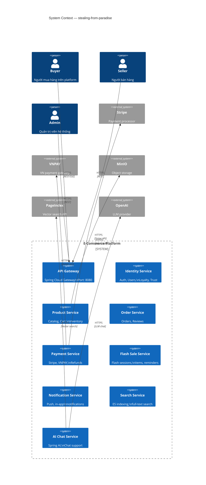
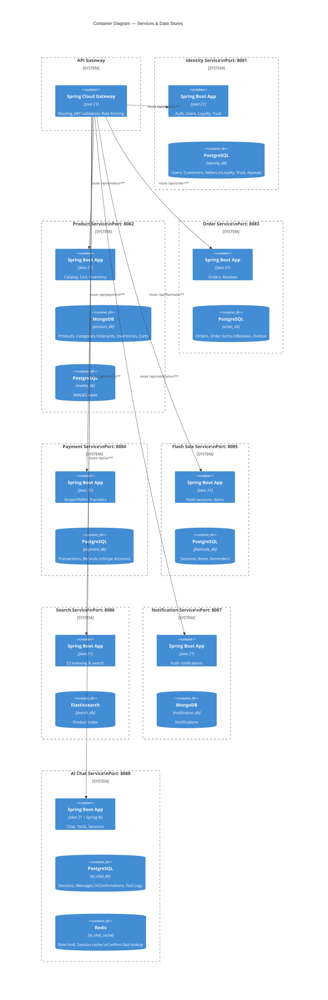
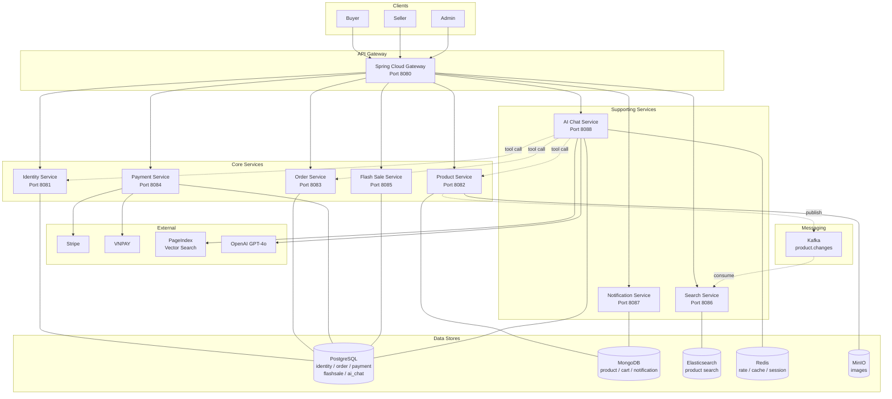
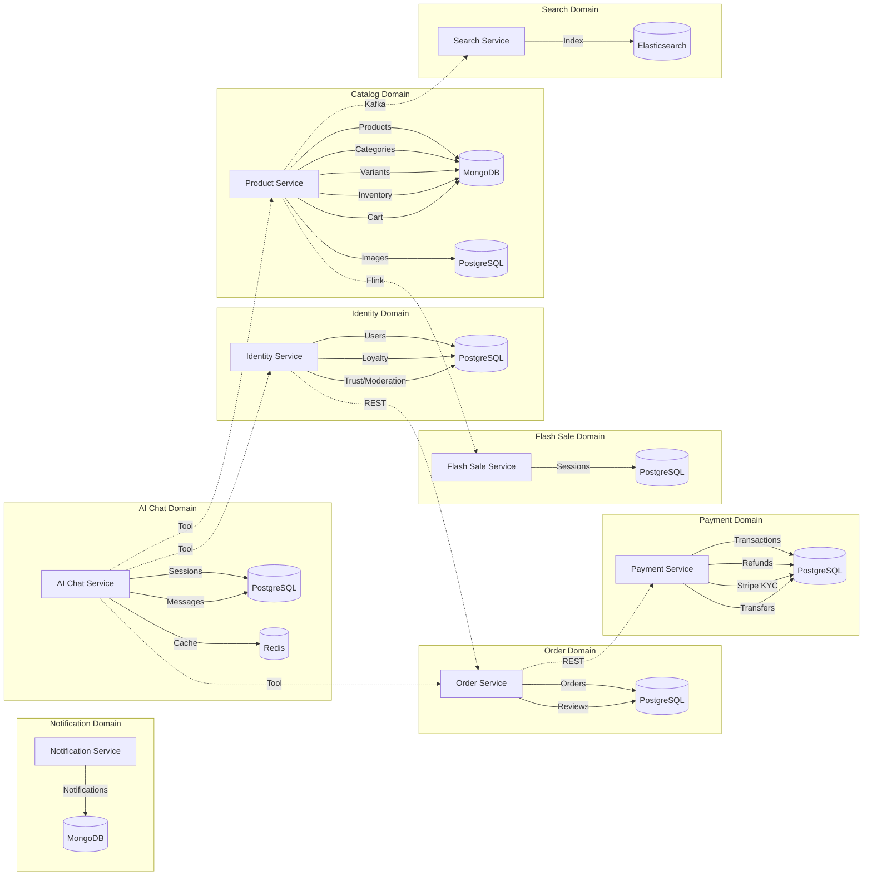

# Service Architecture — C4 Container Diagrams

> Mô tả kiến trúc hệ thống ở mức Container, luồng giao tiếp giữa các service và database.

---

## 1. Tổng quan hệ thống

---

## 2. Microservices & Databases

---

## 3. Communication & Event Flow

---

## 4. Service Responsibilities

