# ERD DIAGRAMS — FULL PER SERVICE & COMPACT

---

## PHẦN I: ERD ĐẦY ĐỦ THEO TỪNG SERVICE

---

### 1. Identity Service (PostgreSQL · port 8081)

Tables: `USERS` · `ROLES` · `CUSTOMERS` · `SELLERS` · `ADMINS` · `ADDRESSES`

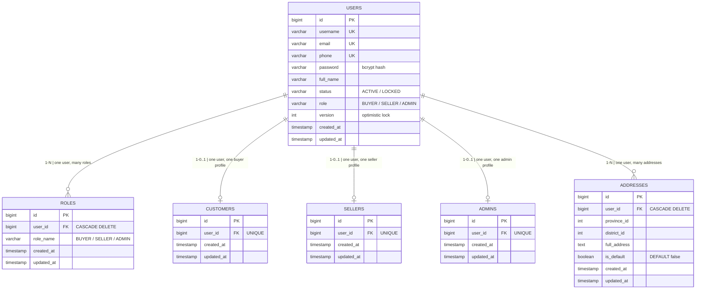

> **Cross-service soft-refs (no hard FK):**
> `CUSTOMERS.id` ← CART.customer_id, PARENT_ORDERS.customer_id
> `SELLERS.id` ← ORDERS.seller_id, SELLER_STRIPE_ACCOUNTS.seller_id, SELLER_TRANSFERS.seller_id

---

### 2. Product Service — Catalog Domain (PostgreSQL · port 8090)

Tables: `CATEGORY` · `PRODUCT` · `PRODUCT_VARIANT` · `PRODUCT_IMAGE` · `STOCK_RESERVATION`

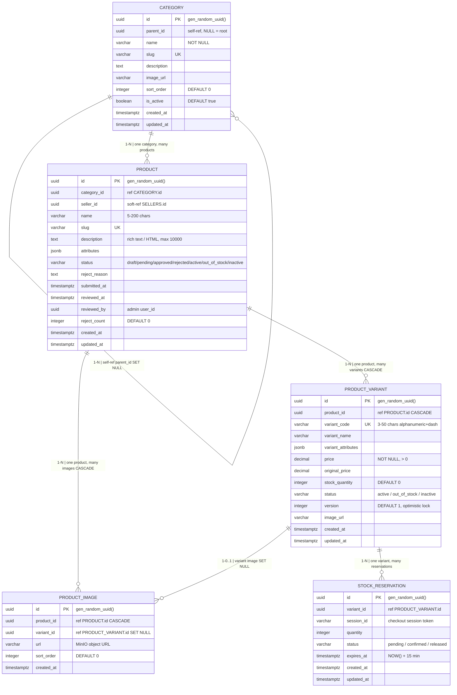

> **Cross-service soft-refs:**
> `PRODUCT_VARIANT.id` ← CART_ITEM.variant_id, ORDER_ITEMS.variant_id
> `STOCK_RESERVATION.session_id` ← PARENT_ORDERS.session_id

---

### 3. Product Service — Cart Domain (PostgreSQL · port 8090)

Tables: `CART` · `CART_ITEM`

> **N-N relationship note:** CART_ITEM is a junction table mediating N-N between CART and PRODUCT_VARIANT.
> A product variant can appear in many carts; a cart contains many variants.
> Constraint `UNIQUE(cart_id, variant_id)` prevents duplicate variant in same cart.

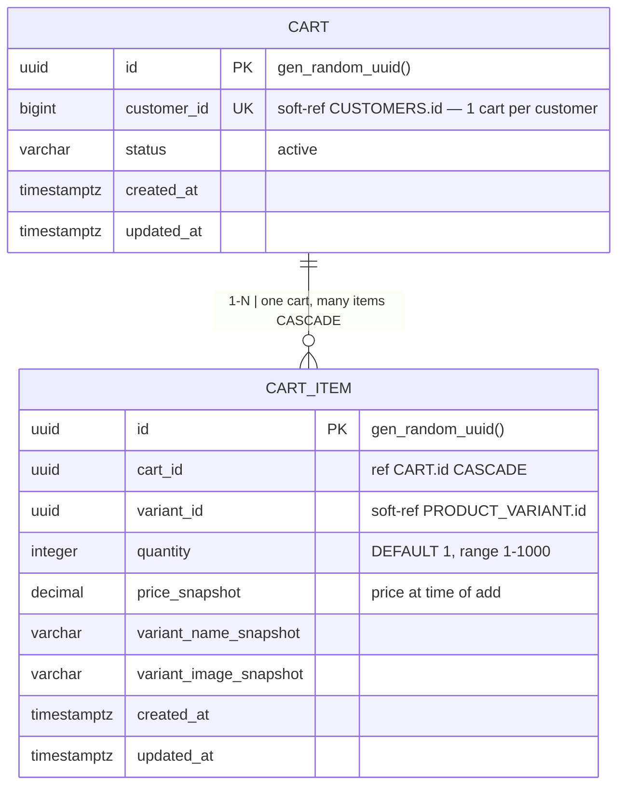

---

### 4. Flash Sale Service (PostgreSQL · port 8085)

Tables: `FS_SESSIONS` · `FS_ITEMS`

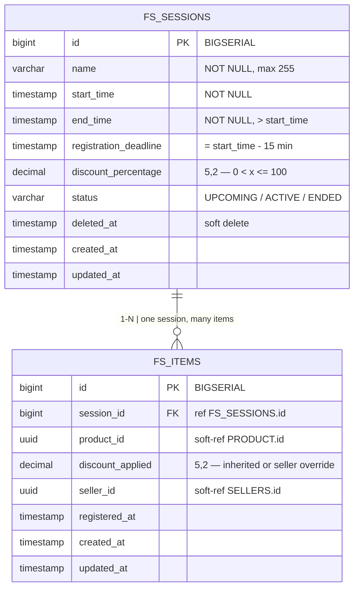

> **Constraint:** UNIQUE(session_id, product_id) on FS_ITEMS prevents duplicate registration.
> **Redis alongside:** `flash_sale:stock:{fs_item_id}` (atomic counter), `flash_sale:triggers` (ZSET).
> **Cross-service:** `FS_ITEMS.id` ← ORDER_ITEMS.fs_item_id (nullable soft-ref).

---

### 5. Order Service (PostgreSQL + Axon · port 8083)

Tables: `PARENT_ORDERS` · `ORDERS` · `ORDER_ITEMS`

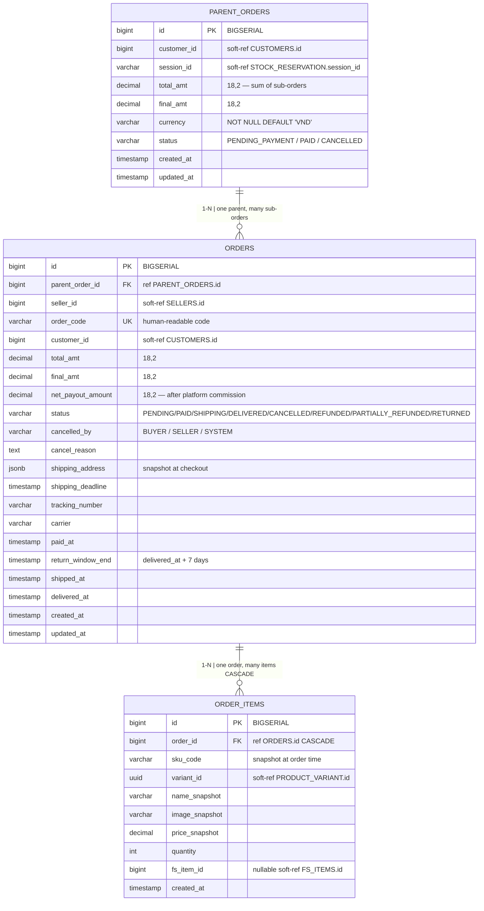

> **Cross-service soft-refs:**
> `ORDERS.id` ← SELLER_TRANSFERS.order_id (payment-service), REFUNDS.order_id (refund-service)
> `PARENT_ORDERS.id` ← TRANSACTIONS.parent_order_id (payment-service)

---

### 6. Payment Service (PostgreSQL + Axon · port 8082)

Tables: `SELLER_STRIPE_ACCOUNTS` · `TRANSACTIONS` · `SELLER_TRANSFERS`

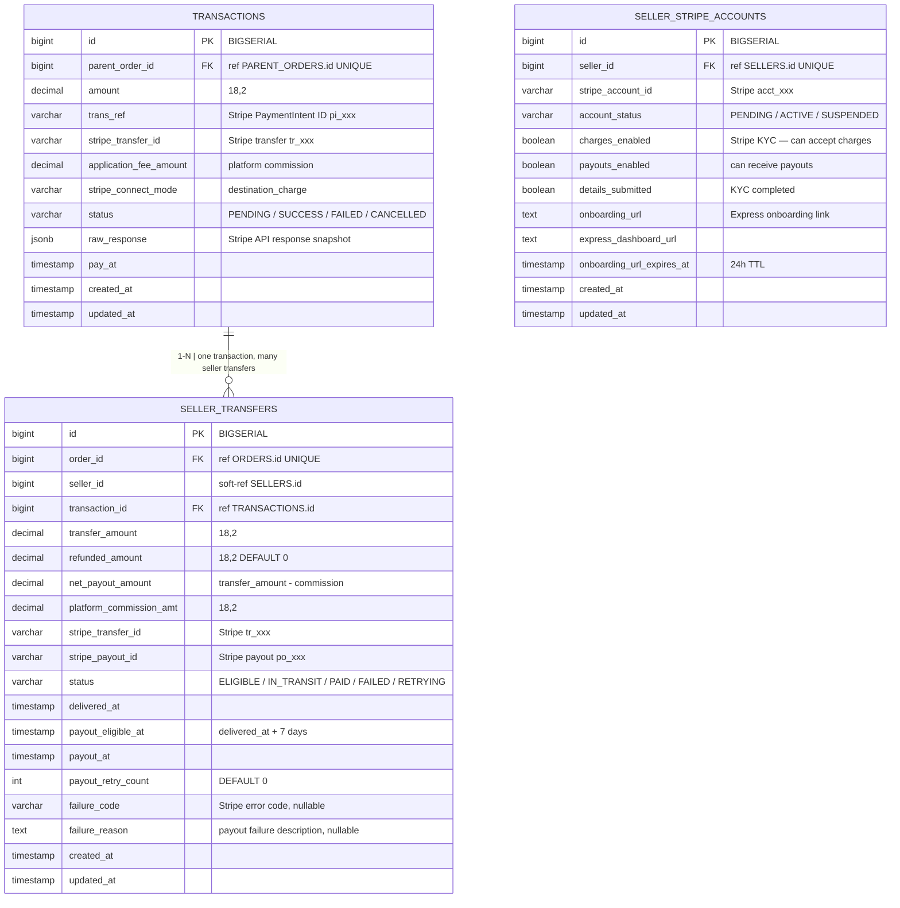

---

### 6.5 Refund Service (PostgreSQL · port 8094)

Tables: `REFUNDS` · `REFUND_ITEMS`

> **N-N relationship note:** REFUND_ITEMS is a junction table mediating N-N between REFUNDS and ORDER_ITEMS.
> A refund can cover multiple order items; an order item may be included in multiple partial refunds.

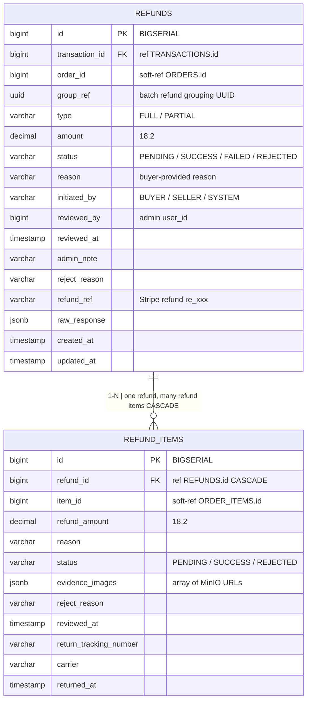

> **Relationship note:** SELLER_STRIPE_ACCOUNTS is 1-0..1 with SELLERS (cross-service soft-ref).
> One seller has zero or one Stripe account; each Stripe account belongs to exactly one seller.

---

### 7. Notification Service (MongoDB · port 8092)

Collection: `MG_NOTIFICATIONS` (TTL index: 90 days)

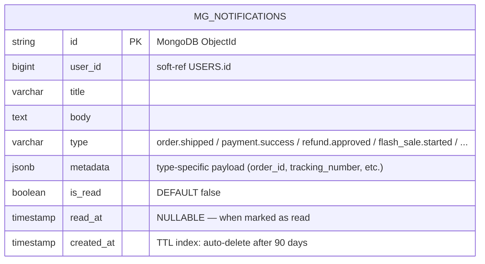

> **Redis Pub/Sub:** Channel `user:{userId}` used for real-time SSE push — messages NOT persisted in Redis.
> **TTL:** `db.notifications.createIndex({ created_at: 1 }, { expireAfterSeconds: 7776000 })`

---

### 8. AI Chat Service (MongoDB · port 8093)

Collections: `CHAT_SESSIONS` · `CHAT_MESSAGES` · `PENDING_CONFIRMATIONS` · `TOOL_CALL_LOGS`

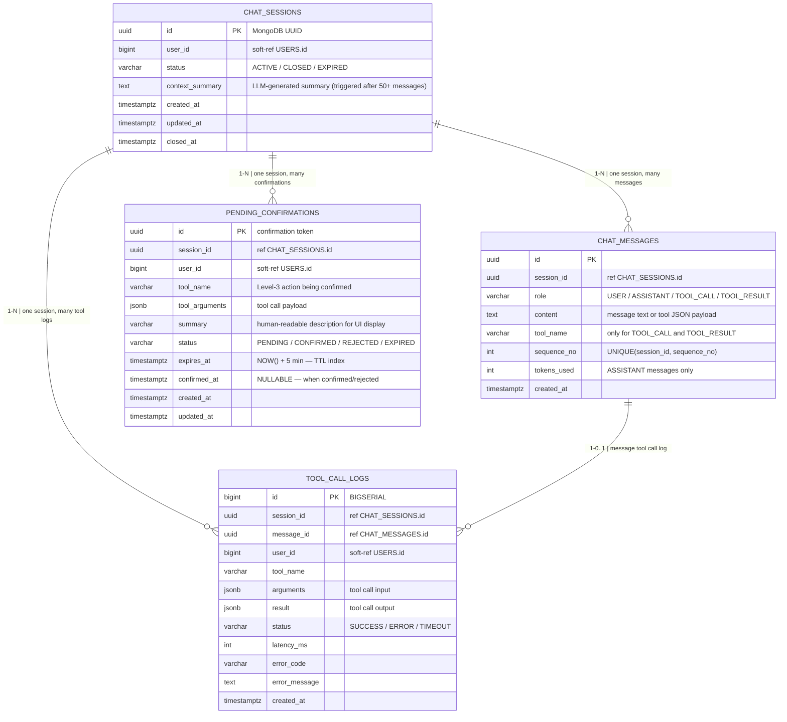

> **TTL on PENDING_CONFIRMATIONS:** `{ expires_at: 1 }, { expireAfterSeconds: 0 }`

---

### 9. Infrastructure Tables (PostgreSQL · shared)

Tables: `SHEDLOCK` · `OUTBOX_EVENTS` · `FAILED_EVENTS`

> OUTBOX_EVENTS và FAILED_EVENTS tạo sẵn trong schema nhưng **chưa active trong MVP**.

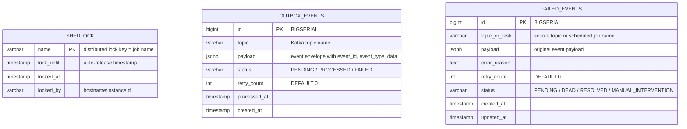

---

## PHẦN II: COMPACT ERD — CHỈ KHÓA CHÍNH & KHÓA NGOẠI

> Mỗi entity chỉ liệt kê: cột `PK` và các cột `FK`. Soft-references (cross-service, không có hard DB constraint) được đánh dấu `"soft-ref"`.

```mermaid
erDiagram

    %% ═══════════════════════════════════════════════
    %% IDENTITY SERVICE
    %% ═══════════════════════════════════════════════
    USERS          ||--o{ ROLES        : "1-N | user_id FK"
    USERS          ||--o| CUSTOMERS    : "1-0..1 | user_id FK UNIQUE"
    USERS          ||--o| SELLERS      : "1-0..1 | user_id FK UNIQUE"
    USERS          ||--o| ADMINS       : "1-0..1 | user_id FK UNIQUE"
    USERS          ||--o{ ADDRESSES    : "1-N | user_id FK"

    USERS     { bigint id PK }
    ROLES     { bigint id PK
                bigint user_id FK }
    CUSTOMERS { bigint id PK
                bigint user_id FK }
    SELLERS   { bigint id PK
                bigint user_id FK }
    ADMINS    { bigint id PK
                bigint user_id FK }
    ADDRESSES { bigint id PK
                bigint user_id FK }

    %% ═══════════════════════════════════════════════
    %% CATALOG DOMAIN
    %% ═══════════════════════════════════════════════
    CATEGORY        ||--o{ CATEGORY          : "1-N | parent_id self-ref"
    CATEGORY        ||--o{ PRODUCT           : "1-N | category_id FK"
    PRODUCT         ||--o{ PRODUCT_VARIANT   : "1-N | product_id FK"
    PRODUCT         ||--o{ PRODUCT_IMAGE     : "1-N | product_id FK"
    PRODUCT_VARIANT ||--o{ PRODUCT_IMAGE     : "1-0..1 | variant_id FK"
    PRODUCT_VARIANT ||--o{ STOCK_RESERVATION : "1-N | variant_id FK"

    CATEGORY          { uuid id PK
                        uuid parent_id FK }
    PRODUCT           { uuid id PK
                        uuid category_id FK
                        uuid seller_id "soft-ref" }
    PRODUCT_VARIANT   { uuid id PK
                        uuid product_id FK }
    PRODUCT_IMAGE     { uuid id PK
                        uuid product_id FK
                        uuid variant_id FK }
    STOCK_RESERVATION { uuid id PK
                        uuid variant_id FK }

    %% ═══════════════════════════════════════════════
    %% CART DOMAIN
    %% ═══════════════════════════════════════════════
    CART ||--o{ CART_ITEM : "1-N | cart_id FK"

    CART      { uuid id PK
                bigint customer_id "soft-ref" }
    CART_ITEM { uuid id PK
                uuid cart_id FK
                uuid variant_id "soft-ref" }

    %% ═══════════════════════════════════════════════
    %% FLASH SALE SERVICE
    %% ═══════════════════════════════════════════════
    FS_SESSIONS ||--o{ FS_ITEMS : "1-N | session_id FK"

    FS_SESSIONS { bigint id PK }
    FS_ITEMS    { bigint id PK
                  bigint session_id FK
                  uuid product_id "soft-ref"
                  uuid seller_id "soft-ref" }

    %% ═══════════════════════════════════════════════
    %% ORDER SERVICE
    %% ═══════════════════════════════════════════════
    PARENT_ORDERS ||--o{ ORDERS      : "1-N | parent_order_id FK"
    ORDERS        ||--o{ ORDER_ITEMS : "1-N | order_id FK"

    PARENT_ORDERS { bigint id PK
                    bigint customer_id "soft-ref"
                    varchar session_id "soft-ref" }
    ORDERS        { bigint id PK
                    bigint parent_order_id FK
                    bigint seller_id "soft-ref"
                    bigint customer_id "soft-ref" }
    ORDER_ITEMS   { bigint id PK
                    bigint order_id FK
                    uuid variant_id "soft-ref"
                    bigint fs_item_id "soft-ref nullable" }

    %% ═══════════════════════════════════════════════
    %% PAYMENT SERVICE
    %% ═══════════════════════════════════════════════
    SELLERS          ||--o| SELLER_STRIPE_ACCOUNTS : "1-0..1 | seller_id FK UNIQUE"
    TRANSACTIONS     ||--o{ SELLER_TRANSFERS       : "1-N | transaction_id FK"
    TRANSACTIONS     ||--o{ REFUNDS                : "1-N | transaction_id FK"
    REFUNDS          ||--o{ REFUND_ITEMS           : "1-N | refund_id FK"

    SELLER_STRIPE_ACCOUNTS { bigint id PK
                              bigint seller_id FK }
    TRANSACTIONS           { bigint id PK
                              bigint parent_order_id FK }
    SELLER_TRANSFERS       { bigint id PK
                              bigint transaction_id FK
                              bigint order_id FK
                              bigint seller_id "soft-ref" }
    REFUNDS                { bigint id PK
                              bigint transaction_id FK
                              bigint order_id "soft-ref" }
    REFUND_ITEMS           { bigint id PK
                              bigint refund_id FK
                              bigint item_id "soft-ref" }

    %% ═══════════════════════════════════════════════
    %% NOTIFICATION SERVICE (MongoDB)
    %% ═══════════════════════════════════════════════
    USERS ||--o{ MG_NOTIFICATIONS : "1-N | user_id soft-ref"

    MG_NOTIFICATIONS { string id PK
                        bigint user_id "soft-ref" }

    %% ═══════════════════════════════════════════════
    %% AI CHAT SERVICE (MongoDB)
    %% ═══════════════════════════════════════════════
    USERS             ||--o{ CHAT_SESSIONS        : "1-N | user_id soft-ref"
    CHAT_SESSIONS     ||--o{ CHAT_MESSAGES         : "1-N | session_id FK"
    CHAT_SESSIONS     ||--o{ PENDING_CONFIRMATIONS : "1-N | session_id FK"
    CHAT_SESSIONS     ||--o{ TOOL_CALL_LOGS        : "1-N | session_id FK"
    CHAT_MESSAGES     ||--o{ TOOL_CALL_LOGS        : "1-0..1 | message_id FK"

    CHAT_SESSIONS         { uuid id PK
                             bigint user_id "soft-ref" }
    CHAT_MESSAGES         { uuid id PK
                             uuid session_id FK }
    PENDING_CONFIRMATIONS { uuid id PK
                             uuid session_id FK
                             bigint user_id "soft-ref" }
    TOOL_CALL_LOGS        { bigint id PK
                             uuid session_id FK
                             uuid message_id FK
                             bigint user_id "soft-ref" }

    %% ═══════════════════════════════════════════════
    %% INFRASTRUCTURE
    %% ═══════════════════════════════════════════════
    SHEDLOCK      { varchar name PK }
    OUTBOX_EVENTS { bigint id PK }
    FAILED_EVENTS { bigint id PK }
```

---

## PHẦN III: CROSS-SERVICE REFERENCE MAP

Soft references không có hard FK constraint — enforced ở application layer và qua Kafka eventual consistency:

| From (Service) | Column | References (Service) | Relationship |
|----------------|--------|----------------------|--------------|
| PRODUCT (product) | seller_id | Identity · SELLERS.id | N-1 |
| PRODUCT (product) | category_id | Catalog · CATEGORY.id | N-1 (same service, hard FK) |
| CART (product) | customer_id | Identity · CUSTOMERS.id | 1-1 |
| CART_ITEM (product) | variant_id | Catalog · PRODUCT_VARIANT.id | N-1 (same service, hard FK) |
| FS_ITEMS (flashsale) | product_id | Catalog · PRODUCT.id | N-1 |
| FS_ITEMS (flashsale) | seller_id | Identity · SELLERS.id | N-1 |
| PARENT_ORDERS (order) | customer_id | Identity · CUSTOMERS.id | N-1 |
| PARENT_ORDERS (order) | session_id | Catalog · STOCK_RESERVATION.session_id | 1-1 |
| ORDERS (order) | seller_id | Identity · SELLERS.id | N-1 |
| ORDERS (order) | customer_id | Identity · CUSTOMERS.id | N-1 |
| ORDER_ITEMS (order) | variant_id | Catalog · PRODUCT_VARIANT.id | N-1 |
| ORDER_ITEMS (order) | fs_item_id | FlashSale · FS_ITEMS.id | N-0..1 (nullable) |
| TRANSACTIONS (payment) | parent_order_id | Order · PARENT_ORDERS.id | 1-1 |
| SELLER_TRANSFERS (payment) | order_id | Order · ORDERS.id | 1-1 |
| SELLER_TRANSFERS (payment) | seller_id | Identity · SELLERS.id | N-1 |
| REFUNDS (refund) | transaction_id | Payment · TRANSACTIONS.id | N-1 |
| REFUNDS (refund) | order_id | Order · ORDERS.id | N-1 |
| REFUND_ITEMS (refund) | item_id | Order · ORDER_ITEMS.id | N-1 |
| MG_NOTIFICATIONS (notif) | user_id | Identity · USERS.id | N-1 |
| CHAT_SESSIONS (ai-chat) | user_id | Identity · USERS.id | N-1 |
| PENDING_CONFIRMATIONS (ai-chat) | user_id | Identity · USERS.id | N-1 |
| TOOL_CALL_LOGS (ai-chat) | user_id | Identity · USERS.id | N-1 |

---

## PHẦN IV: ELASTICSEARCH INDEX — skus

Không có ERD (document store không có schema cố định), nhưng mapping field được liệt kê dưới đây:

```
Index: skus  (SKU-first — 1 document per SKU; collapse by product_id khi search)

Identifier fields:
  sku_id              keyword   PK
  product_id          keyword   group key — field collapse khi search
  seller_id           keyword

Product fields:
  product_name        text      ← Vietnamese analyzer (icu + asciifolding + synonym)
  product_slug        keyword
  product_description text      ← Vietnamese analyzer
  category_id         keyword
  category_path       keyword[]

Variant fields:
  variant_name        keyword
  variant_attributes  object (dynamic mapping)
  sku_code            keyword

Pricing fields:
  price               double
  original_price      double
  has_discount        boolean
  discount_pct        integer
  flash_session_id    keyword   — null if no active flash sale
  flash_price         double    — null if no active flash sale

Availability fields:
  stock_status        keyword   — in_stock / out_of_stock
  product_status      keyword
  sku_status          keyword
  is_active           boolean

Display fields (not indexed):
  thumbnail_url       keyword   (index: false)
  sku_image_url       keyword   (index: false)
  seller_name         text

Timestamp fields:
  product_created_at  date
  sku_updated_at      date
```

---

*Nguồn: `documents/data-models/ERD_FULL_SYSTEM.md` · `documents/database-entities.md`*
