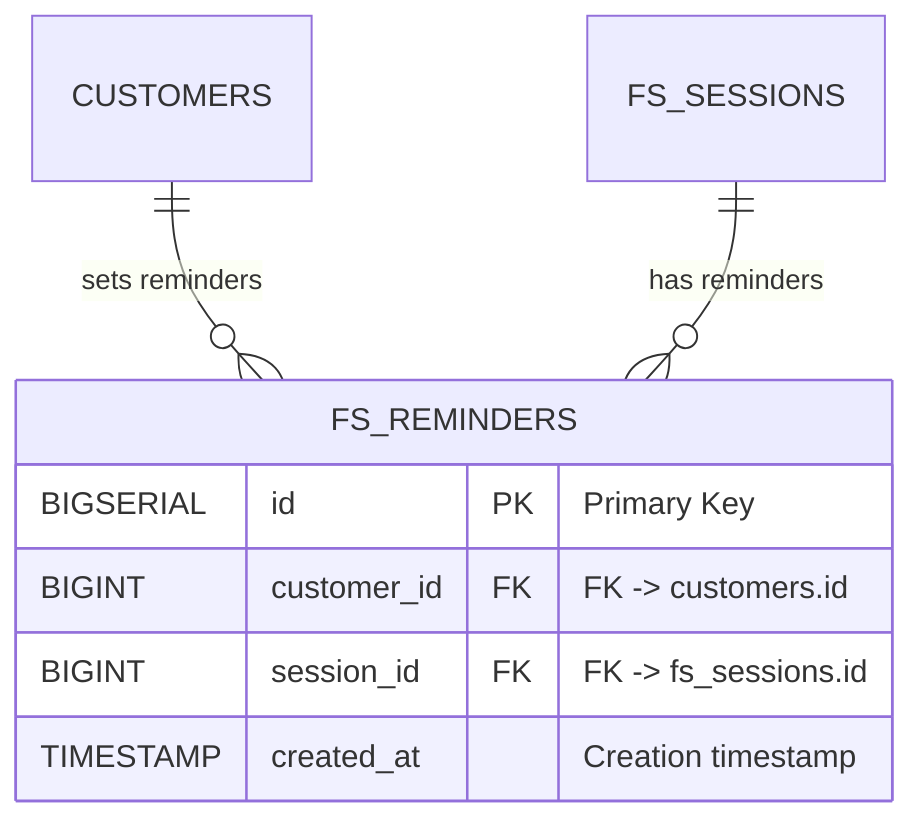

# ENTITY-FLASHSALE-003: FS_REMINDERS

**Stable ID:** `ENTITY-FLASHSALE-003`
**Schema:** `flash_sale`
**Storage:** PostgreSQL
**Service:** flashsale-service (port :8085)

---

## ERD (Entity Relationship Diagram)



---

## Data Dictionary

| # | Column | Type | Nullable | Default | Description |
|---|--------|------|----------|---------|-------------|
| 1 | `id` | BIGSERIAL | NOT NULL | auto | Primary Key, auto-increment |
| 2 | `customer_id` | BIGINT | NOT NULL | -- | FK -> customers.id |
| 3 | `session_id` | BIGINT | NOT NULL | -- | FK -> fs_sessions.id |
| 4 | `created_at` | TIMESTAMP | NOT NULL | NOW() | Record creation timestamp |

---

## Constraints

| Constraint | Type | Expression | Purpose |
|------------|------|-----------|---------|
| `pk_fs_reminders` | PRIMARY KEY | `id` | Row identity |
| `fk_fs_reminders_customer` | FOREIGN KEY | `customer_id REFERENCES customers(id)` | Referential integrity |
| `fk_fs_reminders_session` | FOREIGN KEY | `session_id REFERENCES fs_sessions(id)` | Referential integrity |

---

## Indexes

| Index Name | Columns | Type | Purpose |
|------------|---------|------|---------|
| `pk_fs_reminders` | `id` | PRIMARY KEY (B-tree) | Row identity |

> Note: Application layer enforces "1 reminder per customer per session" (BR-FLASHSALE-006). No unique constraint exists at the DB level for `(customer_id, session_id)` -- this is enforced by application logic before insert.

---

## Business Rule: One Reminder Per Customer Per Session (BR-FLASHSALE-006)

```
IF customer_id + session_id combination already exists
  THEN reject with 409 CONFLICT
ELSE
  INSERT new reminder record
```

---

## Foreign Key References

| From Column | To Table | To Column | On Delete |
|-------------|----------|-----------|-----------|
| `customer_id` | `customers` | `id` | Application-layer soft handling |
| `session_id` | `fs_sessions` | `id` | Application-layer soft handling |

---

## Cross-References

| Reference | Description |
|-----------|-------------|
| BR-FLASHSALE-006 | One reminder per customer per session |
| ENTITY-FLASHSALE-001 | Parent FS_SESSIONS table |
| UC-FLASHSALE-004 | Customer sets reminder |

---

*Generated: 2026-05-09 | Source: database-entities.md section 5*
