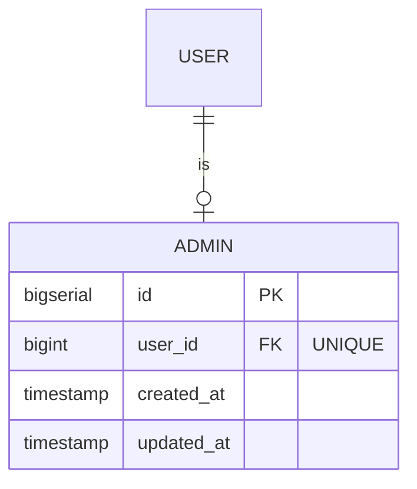

## Entity: Admin
Service: identity-service
Entity ID: ENTITY-IDENTITY-005

### ERD

### Data Dictionary
| Field | Type | Constraints | Business Meaning |
|-------|------|-------------|------------------|
| id | BIGSERIAL | PK, NOT NULL | Unique admin profile identifier |
| user_id | BIGINT | FK -> USERS.id, UNIQUE | 1:1 link to the owning user |
| created_at | TIMESTAMP | NOT NULL | Admin profile creation timestamp |
| updated_at | TIMESTAMP | NOT NULL | Last update timestamp |

### Constraints
| Constraint | Type | Description |
|-----------|------|-------------|
| FK to USERS.id | Foreign Key | Links to base user account |
| UNIQUE(user_id) | Unique | One user can have at most one admin profile |

### Business Rules
- Admin accounts are created via seed data only (no public registration endpoint)
- Admin role grants access to all `/admin/**` endpoints
- Admin actions trigger Kafka events for downstream audit and notification

### Admin Capabilities (from API)
| Action | Endpoint | Kafka Event |
|--------|----------|-------------|
| List users | GET /admin/users | -- |
| Lock account | POST /admin/users/{userId}/lock | account.locked (post-MVP) |
| Unlock account | POST /admin/users/{userId}/unlock | account.unlocked (post-MVP) |
| Suspend seller posting | POST /admin/users/{userId}/suspend-posting | seller.posting_suspended |
| Resume seller posting | POST /admin/users/{userId}/unlock-product-posting | seller.posting_resumed |
| Approve product | POST /admin/products/{productId}/approve | product.approved |
| Reject product | POST /admin/products/{productId}/reject | product.rejected |

### Related Use Cases
| Use Case | Description |
|----------|-------------|
| UC-IDENTITY-005 | Admin Lock/Unlock User |
