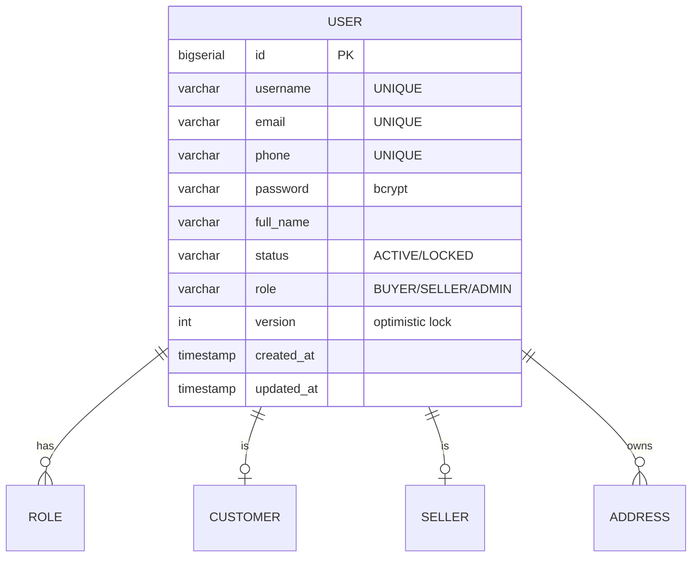

## Entity: User
Service: identity-service
Entity ID: ENTITY-IDENTITY-001

### ERD


### Data Dictionary
| Field | Type | Constraints | Business Meaning |
|-------|------|-------------|------------------|
| id | BIGSERIAL | PK, NOT NULL | Unique user identifier |
| username | VARCHAR | UNIQUE, NOT NULL | Login username, 3-50 chars, a-z 0-9 . _ |
| email | VARCHAR | UNIQUE, NOT NULL | Verified email address |
| phone | VARCHAR | UNIQUE, NOT NULL | VN phone number |
| password | VARCHAR | NOT NULL | Bcrypt-hashed password, min 8 chars |
| full_name | VARCHAR | NOT NULL | Display name, 2-100 chars |
| status | VARCHAR | NOT NULL | ACTIVE or LOCKED |
| role | VARCHAR | NOT NULL | BUYER / SELLER / ADMIN (default BUYER) |
| version | INT | NOT NULL, DEFAULT 0 | Optimistic locking version |
| created_at | TIMESTAMP | NOT NULL | Account creation timestamp |
| updated_at | TIMESTAMP | NOT NULL | Last update timestamp |

### Indexes
| Index | Columns | Purpose |
|-------|---------|---------|
| idx_users_role | role | Filter users by role |

### Referenced By
| Entity | FK Column | Relationship |
|--------|-----------|-------------|
| ROLE (ENTITY-IDENTITY-002) | user_id | One user has many roles |
| CUSTOMER (ENTITY-IDENTITY-003) | user_id | One user has zero-or-one customer profile |
| SELLER (ENTITY-IDENTITY-004) | user_id | One user has zero-or-one seller profile |
| ADDRESS (ENTITY-IDENTITY-006) | user_id | One user has many addresses |

### State Transitions
See [state-user.md](../../state-diagrams/identity-service/state-user.md)

```
[*] --> ACTIVE : register (BR-IDENTITY-001)
ACTIVE --> LOCKED : admin lock (UC-IDENTITY-005, BR-IDENTITY-003)
LOCKED --> ACTIVE : admin unlock (UC-IDENTITY-005)
```

### Related Kafka Events
| Event | Trigger |
|-------|---------|
| account.created | POST /auth/register (UC-IDENTITY-001) |
| account.updated | PUT /users/me (UC-IDENTITY-003) |
| account.locked | POST /admin/users/{userId}/lock (UC-IDENTITY-005) |
| account.unlocked | POST /admin/users/{userId}/unlock (UC-IDENTITY-005) |
