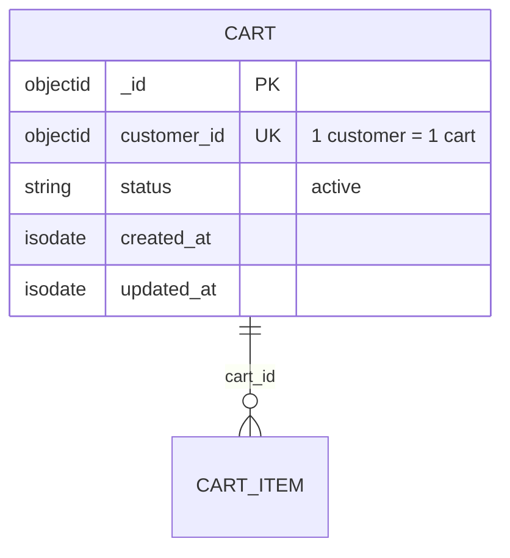

# ENTITY-PRODUCT-006: CART

> **Service**: product-service (Port 8090)
> **Database**: MongoDB
> **Collection**: mg_carts
> **Source**: database-entities.md Section 4, 03_database_tables.md Section 6

---

## ERD

---

## Data Dictionary

| # | Field | Type | Constraints | Meaning |
|---|--------|------|-------------|---------|
| 1 | `_id` | ObjectId | PK, auto-generated | Unique cart identifier |
| 2 | `customer_id` | ObjectId | Unique, NOT NULL, enforced at application layer | Customer ID from Identity Service; exactly 1 active cart per customer |
| 3 | `status` | String | NOT NULL, DEFAULT 'active' | Cart state: currently always `active` |
| 4 | `created_at` | ISODate | Auto-set | Cart creation timestamp |
| 5 | `updated_at` | ISODate | Auto-set | Last modification timestamp |

---

## Indexes

| Index Name | Fields | Type | Purpose |
|------------|---------|------|---------|
| `idx_cart_customer` | `{ customer_id: 1 }` | Unique B-tree | Fast cart lookup by customer; enforces 1-cart-per-customer |

**Note**: The UNIQUE constraint on `customer_id` is enforced by the MongoDB unique index. However, MongoDB's unique index semantics allow nulls -- application-layer validation ensures exactly one active cart per customer.

---

## Business Rules Summary

| Rule | Detail |
|------|--------|
| One cart per customer | Unique index on `customer_id` enforces 1 active cart per customer |
| Cart auto-creation | Cart is lazily created on first `POST /cart/items` |
| Cart cleared on checkout | When `order.checkout_completed` event is consumed, checked-out items are removed |
| Expired flash-sale items | When `flash_sale.session_ended` event arrives, JOB-07 removes expired flash items |

---

## Cross-References

| Ref ID | Type | Description |
|--------|------|-------------|
| FR-PRODUCT-016 | Functional Requirement | Get customer cart |
| UC-PRODUCT-008 | Use Case | View cart (customer) |
| BR-PRODUCT-009 | Business Rule | One cart per customer |
| state-cart.md | State Diagram | active -> converted (on checkout) |
