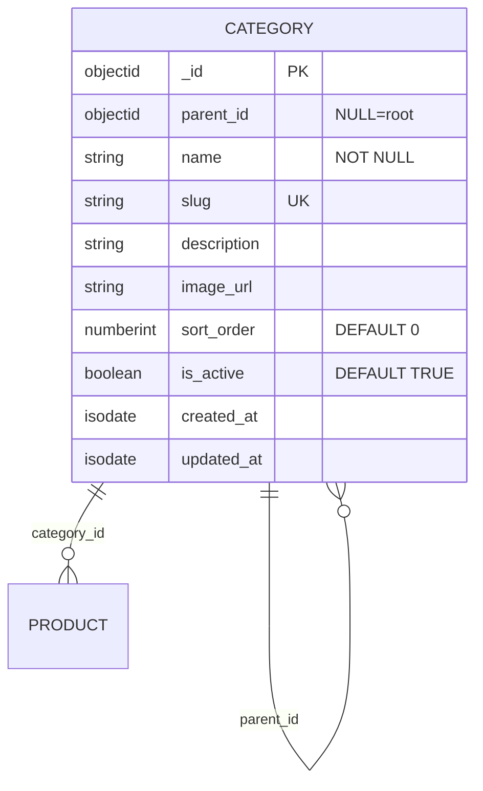

# ENTITY-PRODUCT-001: CATEGORY

> **Service**: product-service (Port 8090)
> **Database**: MongoDB
> **Collection**: mg_categories
> **Source**: database-entities.md Section 3, 03_database_tables.md Section 1

---

## ERD

---

## Data Dictionary

| # | Field | Type | Constraints | Meaning |
|---|--------|------|-------------|---------|
| 1 | `_id` | ObjectId | PK, auto-generated | Unique category identifier |
| 2 | `parent_id` | ObjectId | NULLABLE, application-level reference | Parent category; NULL = root (top-level). No CASCADE; deletion handled in application layer. |
| 3 | `name` | String | NOT NULL | Display name (e.g., "Ao Thun Nam") |
| 4 | `slug` | String | Unique index | URL-friendly identifier for SEO (e.g., "ao-thun-nam") |
| 5 | `description` | String | NULLABLE | Optional category description |
| 6 | `image_url` | String | NULLABLE | Banner/icon URL for category display |
| 7 | `sort_order` | NumberInt | DEFAULT 0 | Display ordering; lower numbers appear first |
| 8 | `is_active` | Boolean | DEFAULT true | FALSE hides category and all its products from storefront |
| 9 | `created_at` | ISODate | Auto-set | Document creation timestamp |
| 10 | `updated_at` | ISODate | Auto-set | Last modification timestamp |

---

## Indexes

| Index Name | Fields | Type | Purpose |
|------------|---------|------|---------|
| `idx_category_parent` | `{ parent_id: 1 }` | B-tree | Fast child-category lookup for tree traversal |
| `idx_category_slug` | `{ slug: 1 }` | Unique B-tree | Slug-based lookup for SEO URLs and duplicate prevention |

---

## Cross-References

| Ref ID | Type | Description |
|--------|------|-------------|
| FR-PRODUCT-001 | Functional Requirement | Browse category tree |
| FR-PRODUCT-002 | Functional Requirement | Admin create category |
| FR-PRODUCT-003 | Functional Requirement | Admin update category |
| UC-PRODUCT-001 | Use Case | Browse catalog |
| UC-PRODUCT-002 | Use Case | Manage categories |
| BR-PRODUCT-001 | Business Rule | Category hierarchy constraints |
| BR-PRODUCT-002 | Business Rule | Leaf-only product assignment |
