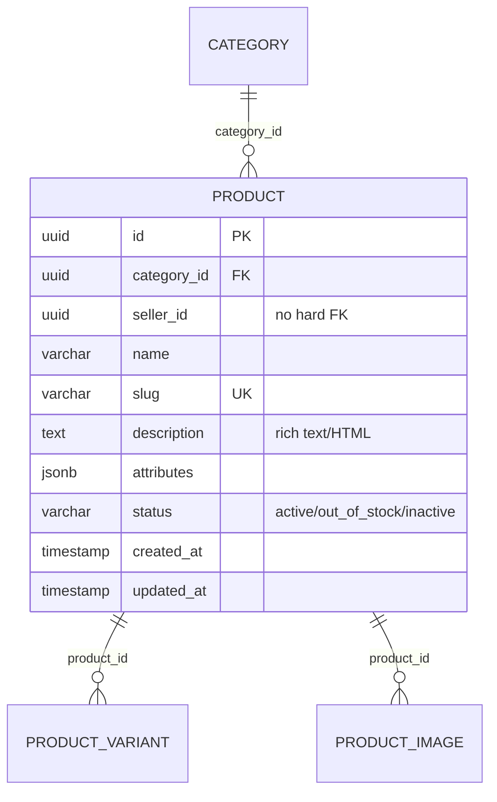

# ENTITY-PRODUCT-002: PRODUCT

> **Service**: product-service (Port 8090)
> **Schema**: catalog
> **Source**: database-entities.md Section 3, 03_database_tables.md Section 2

---

## ERD



---

## Data Dictionary

| # | Column | Type | Constraints | Meaning |
|---|--------|------|-------------|---------|
| 1 | `id` | UUID | PK, DEFAULT gen_random_uuid() | Unique product identifier |
| 2 | `category_id` | UUID | FK REFERENCES category(id), NOT NULL | Owning category (must be a leaf node per BR-PRODUCT-002) |
| 3 | `seller_id` | UUID | NOT NULL, no hard FK | Seller who owns the product (from Identity Service) |
| 4 | `name` | VARCHAR(500) | NOT NULL | Product display name; 5-200 characters validated at API |
| 5 | `slug` | VARCHAR(500) | UNIQUE, NOT NULL | URL-friendly product path for SEO |
| 6 | `description` | TEXT | NULLABLE | Rich text/HTML description rendered in Product Detail "Mo ta" tab |
| 7 | `attributes` | JSONB | NULLABLE | Structured key-value attributes rendered in Product Detail "Chi tiet" tab |
| 8 | `status` | VARCHAR(50) | NOT NULL, DEFAULT 'active' | Product lifecycle state: `active`, `out_of_stock`, `inactive` |
| 9 | `created_at` | TIMESTAMP | DEFAULT NOW() | Row creation timestamp |
| 10 | `updated_at` | TIMESTAMP | DEFAULT NOW() | Last modification timestamp |

### `attributes` JSONB Examples

```json
// Fashion
{"material": "100% Cotton", "origin": "Viet Nam", "style": "Casual", "washing": "Giat may toi da 30 do C", "target": "Nam"}

// Electronics
{"ram": "8GB", "storage": "256GB", "screen_size": "6.7 inch", "battery": "5000mAh", "os": "Android 14"}
```

### `status` Values

| Value | Meaning |
|-------|---------|
| `active` | On sale; at least one variant has stock > 0 and status = active |
| `out_of_stock` | All variants have stock_quantity = 0; still visible on detail page |
| `inactive` | Seller manually hidden; not displayed in listings |

---

## Indexes

| Index Name | Columns | Type | Purpose |
|------------|---------|------|---------|
| `idx_product_category` | `category_id` | B-tree | List products by category |
| `idx_product_seller` | `seller_id` | B-tree | Seller's product dashboard (`GET /sellers/me/products`) |
| `idx_product_status` | `status` | B-tree | Filter active/inactive products for listings |
| `idx_product_slug` | `slug` | B-tree UNIQUE | SEO URL resolution |
| `idx_product_attributes` | `attributes` | GIN | Search/filter by attribute key-values |

---

## Cross-References

| Ref ID | Type | Description |
|--------|------|-------------|
| FR-PRODUCT-004 | Functional Requirement | Seller create product |
| FR-PRODUCT-005 | Functional Requirement | List/search products |
| FR-PRODUCT-006 | Functional Requirement | Product detail view |
| FR-PRODUCT-007 | Functional Requirement | Seller update product |
| FR-PRODUCT-008 | Functional Requirement | Delete product |
| UC-PRODUCT-003 | Use Case | Create product (seller) |
| UC-PRODUCT-001 | Use Case | Browse catalog |
| BR-PRODUCT-003 | Business Rule | Product status transitions |
| BR-PRODUCT-002 | Business Rule | Leaf-only category assignment |
| state-product.md | State Diagram | active -> out_of_stock -> inactive |
