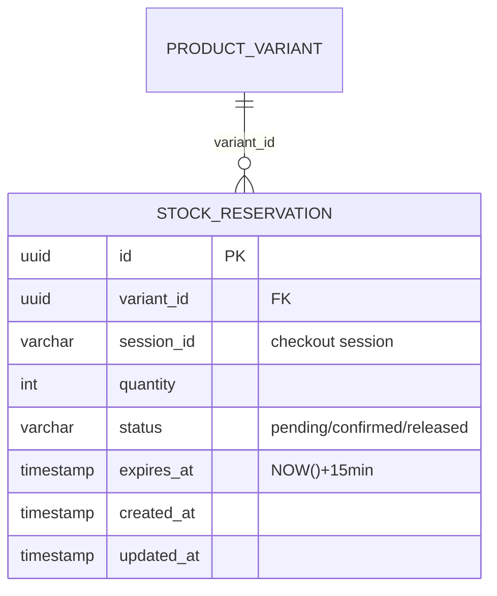

# ENTITY-PRODUCT-005: STOCK_RESERVATION

> **Service**: product-service (Port 8090)
> **Database**: PostgreSQL
> **Table**: stock_reservations
> **Source**: database-entities.md Section 3, 03_database_tables.md Section 5

---

## ERD



---

## Data Dictionary

| # | Field | Type | Constraints | Meaning |
|---|--------|------|-------------|---------|
| 1 | `id` | UUID | PK | Unique reservation identifier |
| 2 | `variant_id` | UUID | NOT NULL, FK → product_variant.id | Reserved variant (SKU) |
| 3 | `session_id` | VARCHAR(100) | NOT NULL | Checkout session ID; links to Order Service's `parent_orders.session_id` |
| 4 | `quantity` | INT | NOT NULL | Number of units reserved |
| 5 | `status` | VARCHAR(50) | NOT NULL, DEFAULT 'pending' | Reservation lifecycle: `pending`, `confirmed`, `released` |
| 6 | `expires_at` | TIMESTAMP | NOT NULL | TTL = NOW() + 15 minutes; background cleanup job auto-removes expired pending reservations |
| 7 | `created_at` | TIMESTAMP | Auto-set | Row creation timestamp |
| 8 | `updated_at` | TIMESTAMP | Auto-set | Last modification timestamp |

---

## Indexes

| Index Name | Fields | Type | Purpose |
|------------|---------|------|---------|
| `idx_reservation_variant` | `(variant_id)` | B-tree | Check active reservations for a given variant |
| `idx_reservation_session` | `(session_id)` | B-tree | Lookup by checkout session |
| `idx_reservation_status` | `(status)` | B-tree | Filter by status (e.g., pending cleanup) |
| `idx_reservation_expires` | `(expires_at)` | B-tree | Supports background cleanup job to find and remove expired pending reservations |
| `idx_reservation_cleanup` | `(status, expires_at)` | B-tree | Cleanup job: find expired `pending` reservations not yet cleaned by TTL |

---

## Reservation Flow

```
1. Customer clicks "Dat hang"
   -> INSERT stock_reservation (status=pending, expires_at=NOW()+15min)
   -> Redis: DECRBY stock:{variant_id} {quantity}
   -> DB: Update product_variant field stock_quantity = stock_quantity - {quantity}
          with optimistic lock check on version field
   -> Update fails? -> Rollback, return "out of stock"

2. Payment succeeds
   -> UPDATE stock_reservation SET status = 'confirmed'
   -> Stock already deducted; no further action

3. Payment fails / timeout
   -> UPDATE stock_reservation SET status = 'released'
   -> Redis: INCR stock:{variant_id} {quantity}
   -> DB: Update product_variant field stock_quantity = stock_quantity + {quantity}

4. Background cleanup job
   -> Cleanup job (runs every 1-5 min) removes expired rows
   -> Same job handles stock restoration for expired pending reservations
```

---

## Cross-References

| Ref ID | Type | Description |
|--------|------|-------------|
| FR-PRODUCT-014 | Functional Requirement | Reserve stock during checkout |
| FR-PRODUCT-015 | Functional Requirement | Release expired reservations |
| UC-PRODUCT-007 | Use Case | Reserve stock (system) |
| BR-PRODUCT-007 | Business Rule | Reservation expiry (15 min TTL) |
| BR-PRODUCT-008 | Business Rule | Optimistic lock for concurrent reservations |
| state-stock-reservation.md | State Diagram | pending -> confirmed / released |
