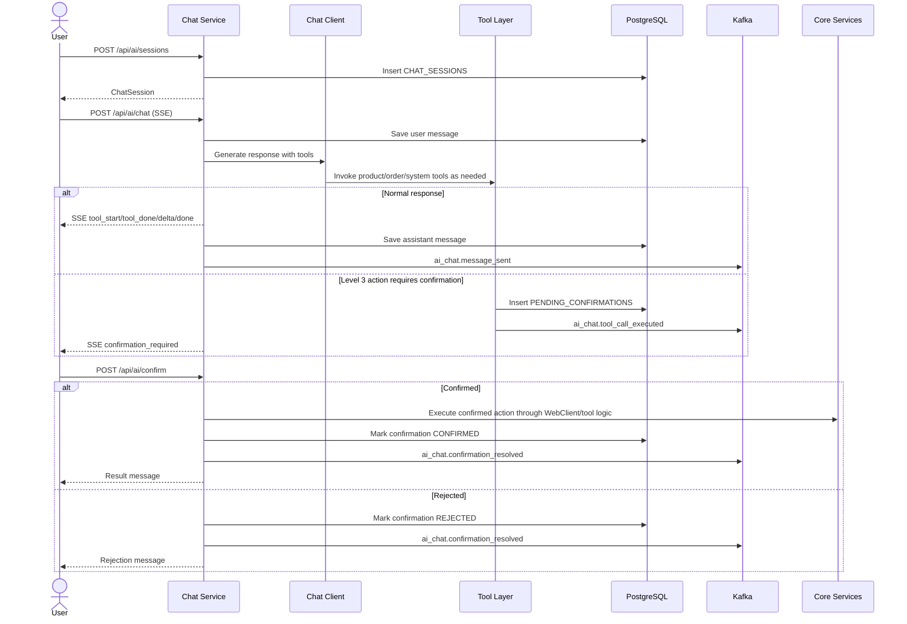

# Business Flow: AI Chat Streaming and Human Confirmation
Scope: `chat-service`

### Use Case Coverage

| Use case | Status against current code | Evidence | Notes |
|----------|-----------------------------|----------|-------|
| UC-AICHAT-001: Start New Chat Session | Implemented | `ChatController.createSession` line 90, `ChatService.createSession` line 252 | Session close and history endpoints also exist. |
| UC-AICHAT-002: Send Message | Implemented | `ChatController.chat` line 35, `ChatService.streamChat` line 77 | Streams tool events, deltas, done, and error events via SSE. |
| UC-AICHAT-003: Confirm or Reject Pending Action | Implemented | `ChatController.confirm` line 134, `ChatService.confirmAction` line 297, `SystemActionTool.performSystemAction` line 42 | Current confirmed action path supports the coded action types in `ChatService.executeConfirmedAction`. |

### Sequence Diagram

### Implementation Gaps

| Gap | Impact |
|-----|--------|
| `RateLimiter` is in-memory and has a TODO for Redis. | Rate limits reset on service restart and are not cluster-safe yet. |
| Confirmed actions depend on the hard-coded action handling in `ChatService.executeConfirmedAction`. | New Level 3 tools must add explicit execution logic before the flow is truly supported. |
