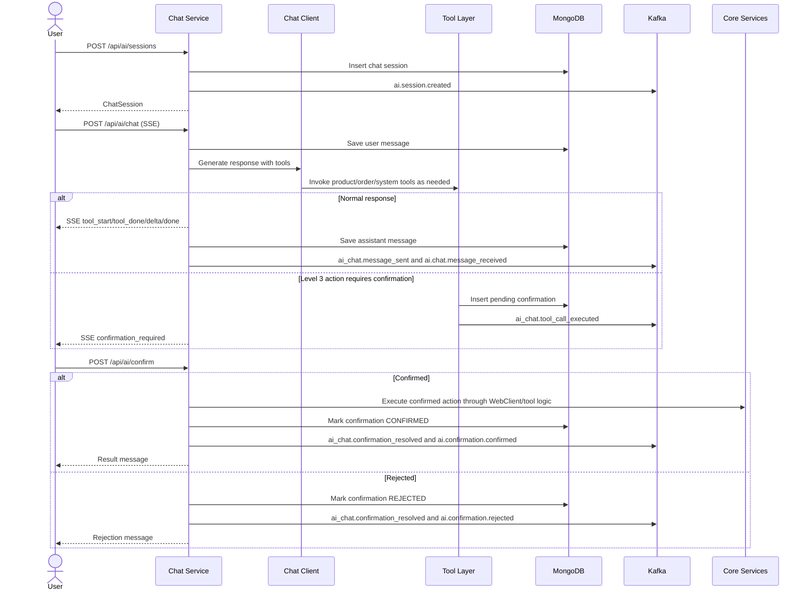

# Business Flow: AI Chat Streaming and Human Confirmation
Scope: `chat-service`

### Use Case Coverage

| Use case | Status against current code | Evidence | Notes |
|----------|-----------------------------|----------|-------|
| UC-AICHAT-001: Start New Chat Session | Implemented | `ChatController.createSession` line 90, `ChatService.createSession` line 260 | Session creation persists the session, publishes `ai.session.created`, and active sessions are listed by `GET /api/ai/sessions`. |
| UC-AICHAT-002: Send Message | Implemented | `ChatController.chat` line 35, `ChatService.streamChat` line 77, `ChatService.publishMessageSent` line 533 | Streams tool events, deltas, done, and error events via SSE. The service publishes both legacy `ai_chat.message_sent` and documented `ai.chat.message_received` events. |
| UC-AICHAT-003: Confirm or Reject Pending Action | Implemented | `ChatController.confirm` line 134, `ChatService.confirmAction` line 297, `SystemActionTool.performSystemAction` line 42 | Pending confirmations are persisted in MongoDB with TTL. Resolution publishes the legacy resolved event plus `ai.confirmation.confirmed` or `ai.confirmation.rejected`. |

### Sequence Diagram

### Implementation Notes

| Concern | Current behavior |
|---------|------------------|
| Pending confirmation storage | MongoDB `pending_confirmations` with TTL is the authoritative store; no Redis `pending:{confirmId}` key is used. |
| Event compatibility | The service keeps legacy `ai_chat.*` topics and also publishes the documented `ai.*` aliases. |
| Rate limiting | `RateLimiter` is in-memory, so limits reset on service restart and are not cluster-wide. |
| Confirmed action execution | New Level 3 tools must add explicit handling in `ChatService.executeConfirmedAction`. |
