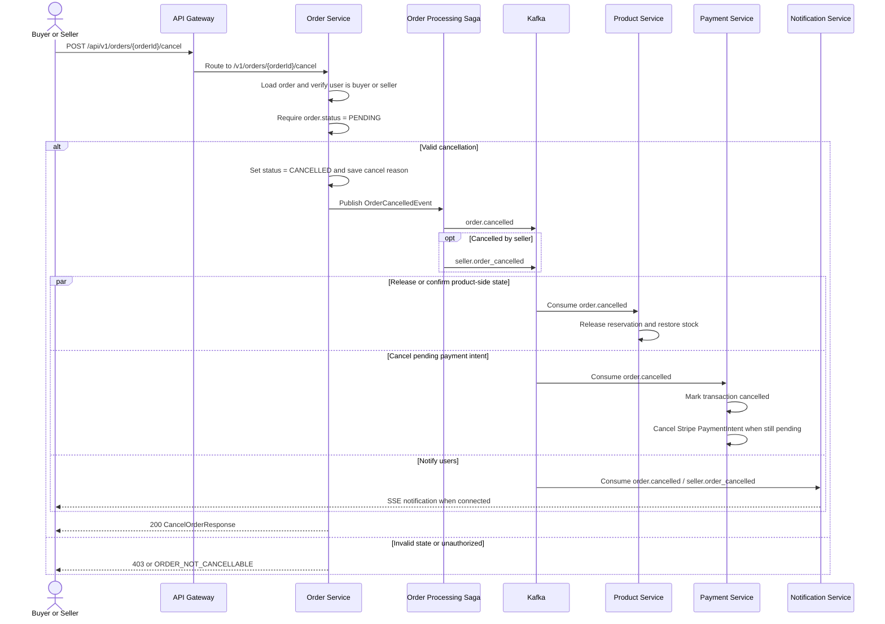

# Business Flow: Order Cancellation
Scope: Cross-service (`order-service`, `product-service`, `payment-service`, `notification-service`)

### Use Case Coverage

| Use case | Status against current code | Evidence | Notes |
|----------|-----------------------------|----------|-------|
| UC-ORDER-003: Cancel Order (Buyer) | Implemented | `OrderController.cancelOrder` line 120, `OrderService.cancelOrder` line 279 | Code allows the customer who owns the order to cancel while status is `PENDING`. |
| UC-ORDER-008: Cancel Order (Seller) | Partial | `OrderService.cancelOrder` line 279 | Code allows the seller who owns the order to cancel, but only when status is `PENDING`. The use case says seller can cancel `PAID` before shipment, which is not implemented. |

### Sequence Diagram

### Implementation Notes

| Concern | Current behavior |
|---------|------------------|
| HTTP contract | `POST /v1/orders/{orderId}/cancel` receives `CancelOrderRequest` and reads `X-User-Role`. |
| State rule | `OrderService.cancelOrder` rejects every status except `PENDING`. |
| Event bridge | `OrderProcessingSaga` publishes `order.cancelled`; seller cancellations also publish `seller.order_cancelled`. |
| Payment side effect | `PaymentService.onOrderCancelled` consumes `order.cancelled` and cancels the Stripe PaymentIntent only when the transaction is still pending. |
| Product side effect | `product-service` consumes order events to release reservations on cancel and payment failure. |

### Gaps To Track

| Gap | Impact |
|-----|--------|
| UC-ORDER-008 documents seller cancellation from `PAID`, but code only accepts `PENDING`. | Seller cannot cancel a paid-but-unshipped order through the current implementation. |
| Existing docs mention `PENDING_PAYMENT`; code uses `PENDING`. | Contract text should use `PENDING` unless the domain model changes. |
