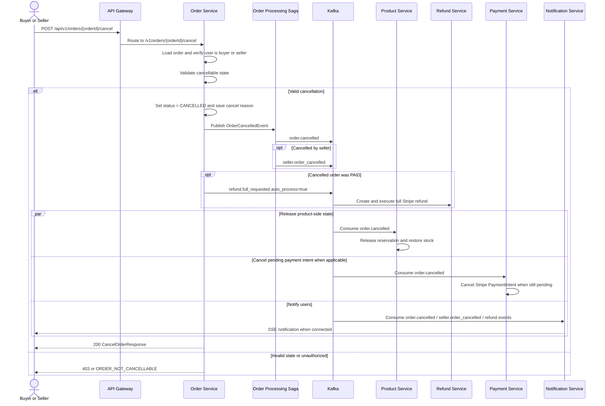

# Business Flow: Order Cancellation
Scope: Cross-service (`order-service`, `product-service`, `refund-service`, `payment-service`, `notification-service`)

### Use Case Coverage

| Use case | Status against current code | Evidence | Notes |
|----------|-----------------------------|----------|-------|
| UC-ORDER-003: Cancel Order (Buyer) | Implemented | `OrderController.cancelOrder` line 120, `OrderService.cancelOrder` line 282 | Buyer can cancel `PENDING` or unshipped `PAID` orders. Paid cancellation starts an automatic full-refund request. |
| UC-ORDER-008: Cancel Order (Seller) | Implemented | `OrderService.cancelOrder` line 282, `OrderService.publishAutoFullRefundRequested` line 353, `OrderProcessingSaga` line 190 | Seller can cancel an unshipped `PAID` order with a reason of at least 10 characters. |

### Sequence Diagram

### Implementation Notes

| Concern | Current behavior |
|---------|------------------|
| HTTP contract | `POST /v1/orders/{orderId}/cancel` receives `CancelOrderRequest` and reads `X-User-Role`. |
| Buyer state rule | Buyer can cancel `PENDING` or `PAID`; `PAID` must not have tracking. |
| Seller state rule | Seller can cancel only `PAID` before shipping and must provide a reason of at least 10 characters. |
| Event bridge | `OrderProcessingSaga` publishes `order.cancelled`; seller cancellations also publish enriched `seller.order_cancelled`. |
| Paid refund side effect | `order-service` publishes `refund.full_requested` with `auto_process=true`; `refund-service` creates and attempts the Stripe refund. |
| Pending payment side effect | `payment-service` still consumes `order.cancelled` for pending PaymentIntent cancellation. |
