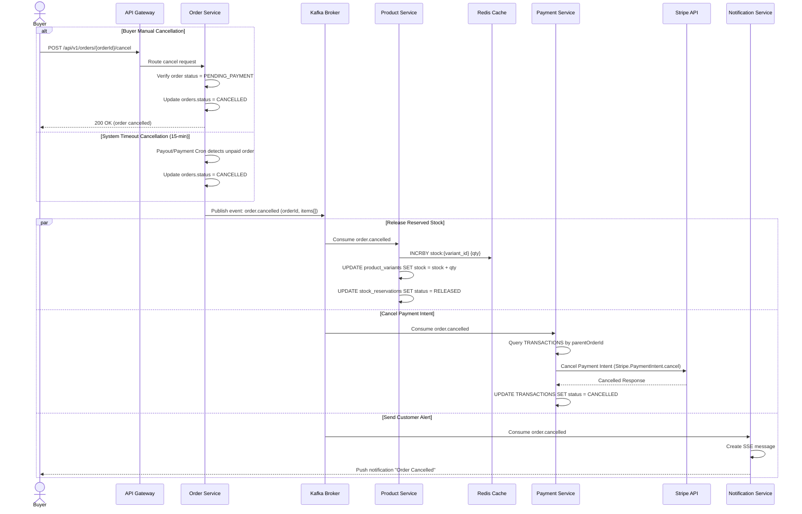

# Business Flow: Order Cancellation
Scope: Cross-Service (order-service · product-service · payment-service · notification-service)

### Description
Documents the process of cancelling an order, either initiated by the Buyer (manual cancel) or triggered by the System (15-minute payment timeout Saga). It covers stock restoration in Redis/DB and Stripe payment intent cancellation.

### Sequence Diagram

### Participant Directory

| Participant | Service Name | Role & Responsibility |
|-------------|--------------|-----------------------|
| **Buyer** | Client Browser | Manually cancels an unpaid order before the 15-minute expiration window. |
| **Order Service** | `order-service` | Tracks order lifecycle, coordinates manual and scheduler cancellations, publishes `order.cancelled`. |
| **Product Service** | `product-service` | Handles stock quantities, tracks stock reservations, listens to order cancellations to release stock. |
| **Redis Cache** | Redis | Maintains the fast, in-memory stock counters for high-concurrency inventory protection. |
| **Payment Service** | `payment-service` | Interacts with Stripe Connect APIs to manage PaymentIntents, records transaction statuses. |
| **Stripe API** | External Service | Processes payment intent cancellations. |
| **Notification Service** | `notification-service` | Listens to Kafka event topics to dispatch SSE notifications to the customer browser. |

### Message & Event Catalog

| Step | Source | Target | Trigger/Payload | Channel | Reference |
|------|--------|--------|-----------------|---------|-----------|
| 1    | Buyer | `order-service` | `POST /orders/{id}/cancel` | HTTP | API-POST-/orders/{id}/cancel |
| 2    | `order-service` | Kafka | Event: `order.cancelled` (orderId, items[]) | Kafka (topic: order.events) | EV-order.cancelled |
| 3    | Kafka | `product-service` | Event: `order.cancelled` | Kafka (topic: order.events) | EV-order.cancelled |
| 4    | Kafka | `payment-service` | Event: `order.cancelled` | Kafka (topic: order.events) | EV-order.cancelled |
| 5    | Kafka | `notification-service` | Event: `order.cancelled` | Kafka (topic: order.events) | EV-order.cancelled |
