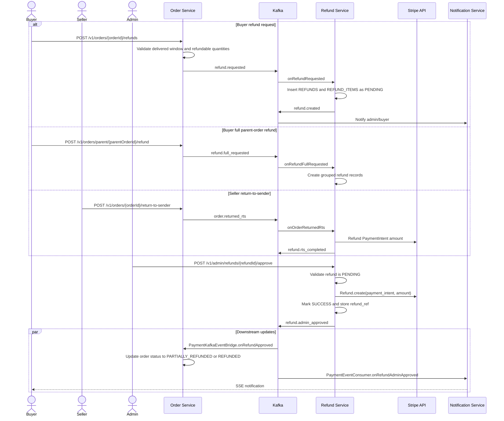

# Business Flow: Refund Processing
Scope: Cross-service (`order-service`, `refund-service`, `payment-service`, `notification-service`)

### Use Case Coverage

| Use case | Status against current code | Evidence | Notes |
|----------|-----------------------------|----------|-------|
| UC-REFUND-001: Create Refund | Implemented via order-service events | `RefundController.createPartialRefund` line 64, `RefundService.onRefundRequested` line 264, `RefundService.onOrderReturnedRts` line 419 | There is no public `POST /refunds` in refund-service; buyer/system creation enters through order-service and Kafka. |
| UC-REFUND-002: Approve Refund | Implemented | `AdminRefundController.approveRefund` line 55, `RefundService.approveRefund` line 153 | Executes Stripe refund and publishes `refund.admin_approved`. |
| UC-REFUND-003: Reject Refund | Implemented | `AdminRefundController.rejectRefund` line 67, `RefundService.rejectRefund` line 223 | Marks refund rejected and publishes `refund.rejected`. |
| UC-ORDER-006: Request Return / RTS | Implemented | `OrderController.returnToSender` line 171, `RefundService.onOrderReturnedRts` line 419 | RTS refund bypasses admin approval and attempts Stripe refund immediately. |

### Sequence Diagram

### Implementation Notes

| Concern | Current behavior |
|---------|------------------|
| Refund creation channel | `refund-service` consumes `refund.requested`, `refund.full_requested`, and `order.returned_rts`; it does not expose a buyer-facing create endpoint. |
| Admin review | `refund-service` owns admin listing, detail, approve, and reject endpoints under `/v1/admin/refunds`. |
| Stripe refund | `RefundService.executeStripeRefund` extracts the PaymentIntent from the stored transaction raw response. |
| Transfer reversal | Transfer reversal logic exists inside `RefundService`; there is no payment-service listener for `refund.admin_approved` in current code. |
| Order status update | `order-service` consumes `refund.admin_approved` and `refund.rts_completed`. |

### Gaps To Track

| Gap | Impact |
|-----|--------|
| Old flow text described a Feign call from order-service to refund-service. Current code uses Kafka. | Architecture docs must describe async creation, not direct HTTP creation. |
| UC-REFUND-001 mentions direct `POST /refunds`; current implementation has no such refund-service controller endpoint. | Client-facing contract should point to order-service refund endpoints. |
