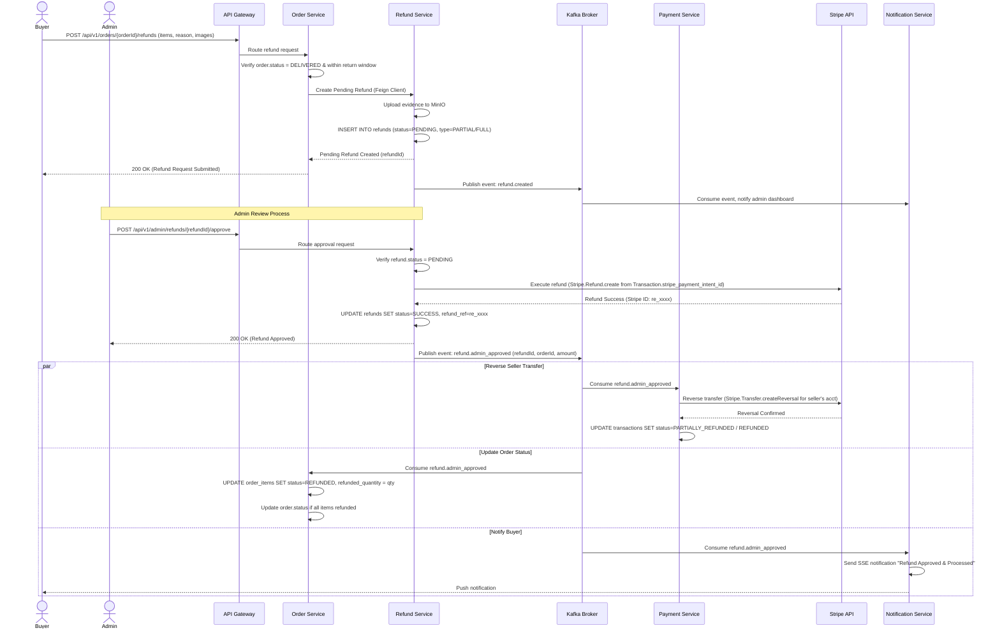

# Business Flow: Refund Processing (Non-RTS)
Scope: Cross-Service (order-service · refund-service · payment-service · notification-service)

### Description
Documents the standard (non-Return-To-Sender) refund lifecycle. This includes the Buyer submitting a refund request with evidence, Admin review and approval gates, calling the Stripe Refund API, and initiating Seller transfer reversals in the Payment Service.

### Sequence Diagram

### Participant Directory

| Participant | Service Name | Role & Responsibility |
|-------------|--------------|-----------------------|
| **Buyer** | Client Browser | Requests refunds for defective or missing items within the return window. |
| **Admin** | Admin Dashboard | Reviews evidence images and details to approve or reject the request. |
| **Order Service** | `order-service` | Handles buyer-facing API endpoints, checks return windows, and tracks item-level refund quantities. |
| **Refund Service** | `refund-service` | Manages refund database records, integrates with MinIO for evidence storage, and executes Stripe refunds. |
| **Payment Service** | `payment-service` | Reverses Seller transfers on Stripe Connect to recoup the platform's paid-out funds. |
| **Stripe API** | External Service | Processes refunds and transfer reversals. |
| **Notification Service** | `notification-service` | Sends notifications to buyers and alert updates to administrators. |

### Message & Event Catalog

| Step | Source | Target | Trigger/Payload | Channel | Reference |
|------|--------|--------|-----------------|---------|-----------|
| 1    | Buyer | `order-service` | `POST /orders/{orderId}/refunds` | HTTP | API-POST-/orders/{orderId}/refunds |
| 2    | `order-service` | `refund-service` | Create Refund Request | Feign (HTTP) | Internal API |
| 3    | `refund-service` | Kafka | Event: `refund.created` | Kafka (topic: refund.events) | EV-refund.created |
| 4    | Admin | `refund-service` | `POST /admin/refunds/{id}/approve` | HTTP | API-POST-/admin/refunds/{id}/approve |
| 5    | `refund-service` | Stripe | Create Refund `re_xxx` | HTTPS API | External Stripe API |
| 6    | `refund-service` | Kafka | Event: `refund.admin_approved` | Kafka (topic: refund.events) | EV-refund.admin_approved |
| 7    | Kafka | `payment-service` | Event: `refund.admin_approved` | Kafka (topic: refund.events) | EV-refund.admin_approved |
| 8    | Kafka | `order-service` | Event: `refund.admin_approved` | Kafka (topic: refund.events) | EV-refund.admin_approved |
| 9    | Kafka | `notification-service` | Event: `refund.admin_approved` | Kafka (topic: refund.events) | EV-refund.admin_approved |
