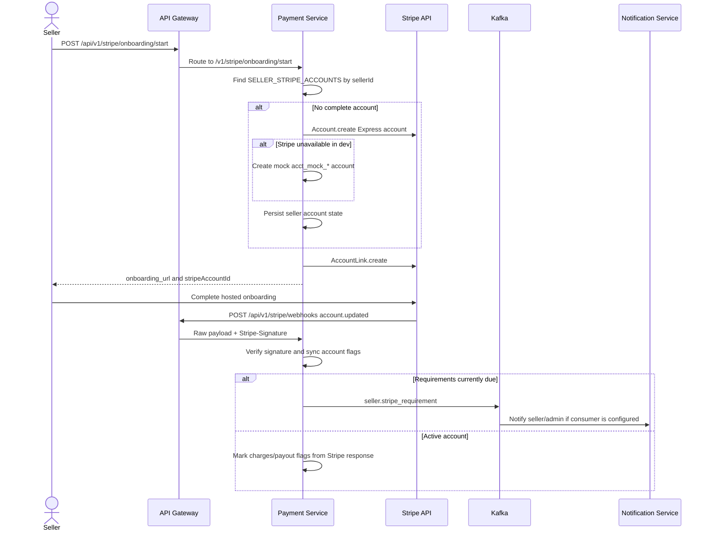

# Business Flow: Stripe Connect Onboarding
Scope: Cross-service (`payment-service`, Stripe, optional notification consumers)

### Use Case Coverage

| Use case | Status against current code | Evidence | Notes |
|----------|-----------------------------|----------|-------|
| UC-PAYMENT-001: Onboard Stripe Account | Implemented | `StripeOnboardingController.startOnboarding` line 31, `StripeOnboardingService.startOnboarding` line 34 | Creates or reuses seller Stripe account, creates an onboarding link, and persists account state. |
| UC-PAYMENT-003: Handle Stripe Webhook | Implemented | `PaymentController.handleStripeWebhook` line 52, `PaymentService.handleWebhook` line 124 | Code endpoint is `/v1/stripe/webhooks`. |

### Sequence Diagram

### Implementation Notes

| Concern | Current behavior |
|---------|------------------|
| Start link | `StripeOnboardingService.startOnboarding` creates the account/link and stores status. |
| Status sync | `StripeOnboardingService.getOnboardingStatus` queries Stripe every time and falls back to DB state on Stripe failure. |
| Refresh link | `POST /v1/stripe/onboarding/refresh-link` is implemented. |
| Webhook account sync | `PaymentService.handleAccountUpdated` updates `SELLER_STRIPE_ACCOUNTS` and can publish `seller.stripe_requirement`. |
| Identity service update | No current identity-service consumer for a `seller.stripe_active` event was found. |

### Architecture Notes

| Concern | Current behavior |
|-----|--------|
| Old flow claimed a `seller.stripe_active` Kafka event updates identity-service. Current grep found no producer/consumer for that topic. | Keep seller payout capability in payment-service unless a real identity integration is added. |
| Docs must use `/v1/stripe/webhooks` for the implemented webhook endpoint. | Prevent frontend or gateway route drift. |
