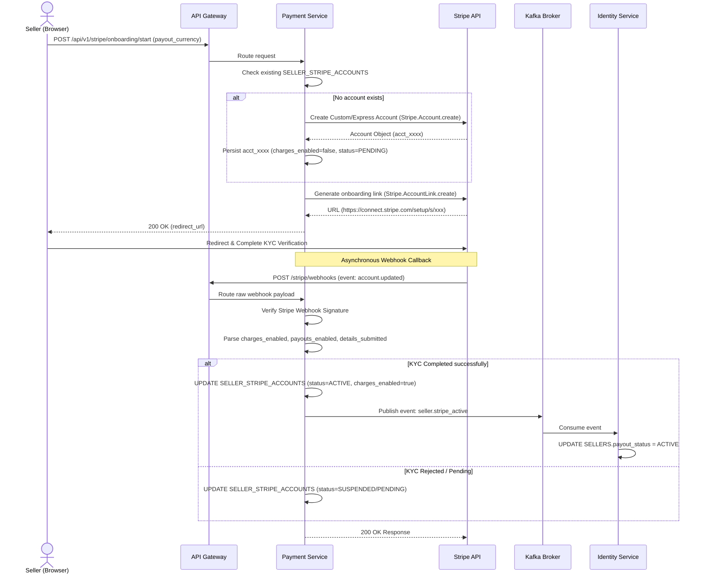

# Business Flow: Stripe Connect Onboarding
Scope: Cross-Service (payment-service · identity-service)

### Description
Documents the end-to-end integration flow of a Seller onboarding onto Stripe Express Connect, completing KYC verification, and the asynchronous webhook lifecycle that activates the seller account.

### Sequence Diagram

### Participant Directory

| Participant | Service Name | Role & Responsibility |
|-------------|--------------|-----------------------|
| **Seller** | Frontend client | Initiates request, inputs KYC details on Stripe's hosted Express form. |
| **API Gateway** | `api-gateway` | Handles routing, rate limiting, and forwards Stripe webhooks to Payment Service. |
| **Payment Service** | `payment-service` | Generates Stripe link, maps Stripe Account records, listens to webhooks, publishes Kafka triggers. |
| **Stripe API** | External Service | Hosts KYC screens, manages merchant onboarding, fires callbacks. |
| **Identity Service** | `identity-service` | Updates internal seller registration status and permissions upon successful Stripe link. |

### Message & Event Catalog

| Step | Source | Target | Trigger/Payload | Channel | Reference |
|------|--------|--------|-----------------|---------|-----------|
| 1    | Seller | `payment-service` | `POST /stripe/onboarding/start` | HTTP | API-POST-/stripe/onboarding/start |
| 2    | `payment-service` | Stripe | Create Account & Link | HTTPS API | External Stripe API |
| 3    | Stripe | `payment-service` | Webhook: `account.updated` | HTTP Webhook | Webhook Endpoint |
| 4    | `payment-service` | Kafka | Event: `seller.stripe_active` | Kafka (topic: seller.stripe) | EV-seller.stripe_active |
| 5    | Kafka | `identity-service` | Event: `seller.stripe_active` | Kafka (topic: seller.stripe) | EV-seller.stripe_active |
