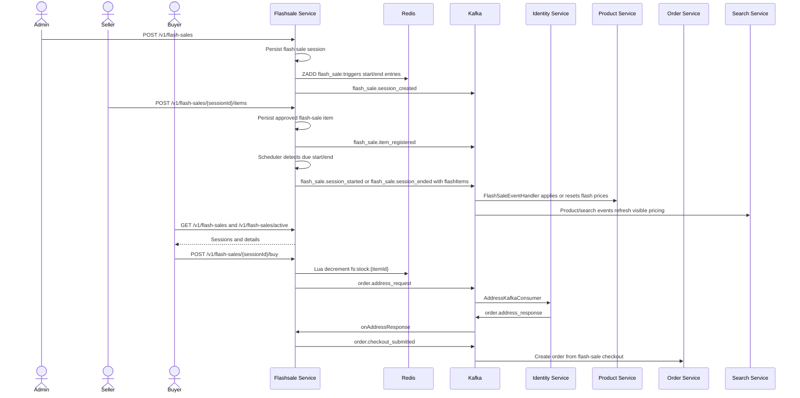

# Business Flow: Flash Sale Session, Item Registration, and Purchase
Scope: `flashsale-service` with identity/order/product/search edges

### Use Case Coverage

| Use case | Status against current code | Evidence | Notes |
|----------|-----------------------------|----------|-------|
| UC-FLASHSALE-001: Admin Create Session | Implemented | `FlashSaleController.createSession` line 46, `FlashSaleService.createSession` line 166 | Session creation persists `UPCOMING`, registers Redis ZSET start/end triggers, and publishes `flash_sale.session_created`. |
| UC-FLASHSALE-002: Seller Register Product | Implemented | `FlashSaleController.createFlashSaleItem` line 81, `FlashSaleService.createFlashSaleItem` line 127 | Items are auto-approved as `APPROVED`, publish `flash_sale.item_registered`, and notification copy matches the auto-approve behavior. |
| UC-FLASHSALE-003: View Sessions | Implemented | `FlashSaleController.getSessions` line 25, `getActiveSessions` line 32, `getSessionDetail` line 39 | List/detail and `GET /v1/flash-sales/active` are implemented. |
| UC-FLASHSALE-006: System End Session | Implemented | `FlashSaleSessionScheduler` line 39, lifecycle payload with `flashItems` line 92 | Scheduler starts/ends sessions and emits payloads that product-service can use for flash price sync by SKU. |

### Sequence Diagram

### Implementation Notes

| Concern | Current behavior |
|---------|------------------|
| Session triggers | Redis ZSET triggers are registered on create; the DB scheduler remains the executable lifecycle worker. |
| Price sync payload | Start/end events include `flashItems` with `sku_code`, `flash_price`, and `flash_stock`; product-service also keeps legacy `flashPriceMap` support. |
| Reminder features | Reminder endpoints exist in code, but reminder-specific use cases are not part of the current active flashsale use-case set. |
